# Hypergraph Engine Benchmarks

## Contents

- **[Pattern Matching Benchmarks](#pattern-matching-benchmarks)**
  - [pattern_matching_2d_sweep_threads_size](#pattern_matching_2d_sweep_threads_size)
  - [pattern_matching_by_graph_size](#pattern_matching_by_graph_size)
  - [pattern_matching_by_pattern_size](#pattern_matching_by_pattern_size)
- **[Event Relationships Benchmarks](#event-relationships-benchmarks)**
  - [causal_edges_overhead](#causal_edges_overhead)
  - [transitive_reduction_overhead](#transitive_reduction_overhead)
- **[Uniqueness Trees Benchmarks](#uniqueness-trees-benchmarks)**
  - [uniqueness_tree_2d_sweep](#uniqueness_tree_2d_sweep)
  - [uniqueness_tree_by_arity](#uniqueness_tree_by_arity)
  - [uniqueness_tree_by_edge_count](#uniqueness_tree_by_edge_count)
  - [uniqueness_tree_by_symmetry](#uniqueness_tree_by_symmetry)
  - [uniqueness_tree_by_vertex_count](#uniqueness_tree_by_vertex_count)
- **[Evolution Benchmarks](#evolution-benchmarks)**
  - [evolution_2d_sweep_threads_steps](#evolution_2d_sweep_threads_steps)
  - [evolution_multi_rule_by_rule_count](#evolution_multi_rule_by_rule_count)
  - [evolution_thread_scaling](#evolution_thread_scaling)
  - [evolution_with_self_loops](#evolution_with_self_loops)
- **[Job System Benchmarks](#job-system-benchmarks)**
  - [job_system_2d_sweep](#job_system_2d_sweep)
  - [job_system_overhead](#job_system_overhead)
  - [job_system_scaling_efficiency](#job_system_scaling_efficiency)
- **[WXF Serialization Benchmarks](#wxf-serialization-benchmarks)**
  - [wxf_deserialize_flat_list](#wxf_deserialize_flat_list)
  - [wxf_deserialize_nested_list](#wxf_deserialize_nested_list)
  - [wxf_roundtrip](#wxf_roundtrip)
  - [wxf_serialize_flat_list](#wxf_serialize_flat_list)
  - [wxf_serialize_nested_list](#wxf_serialize_nested_list)
- **[Canonicalization Benchmarks](#canonicalization-benchmarks)**
  - [canonicalization_2d_sweep](#canonicalization_2d_sweep)
  - [canonicalization_by_edge_count](#canonicalization_by_edge_count)
  - [canonicalization_by_symmetry](#canonicalization_by_symmetry)
- **[State Management Benchmarks](#state-management-benchmarks)**
  - [full_capture_overhead](#full_capture_overhead)
  - [state_storage_by_steps](#state_storage_by_steps)

## System Information

- **CPU**: Intel(R) Core(TM) i9-14900K
- **Cores**: 32
- **Architecture**: x86_64
- **OS**: Linux 5.15.167.4-microsoft-standard-WSL2
- **Memory**: 23 GB
- **Compiler**: GNU 13.3.0
- **Hash Type**: commit
- **Hash**: a315be15f2e7a5cb33886e95bbd3a245dbeffa69
- **Date**: 2025-10-13
- **Timestamp**: 2025-10-13T21:56:11

## Pattern Matching Benchmarks

### pattern_matching_2d_sweep_threads_size

2D parameter sweep of pattern matching across thread count (1-32) and graph size (5-100 edges) for parallel scalability analysis

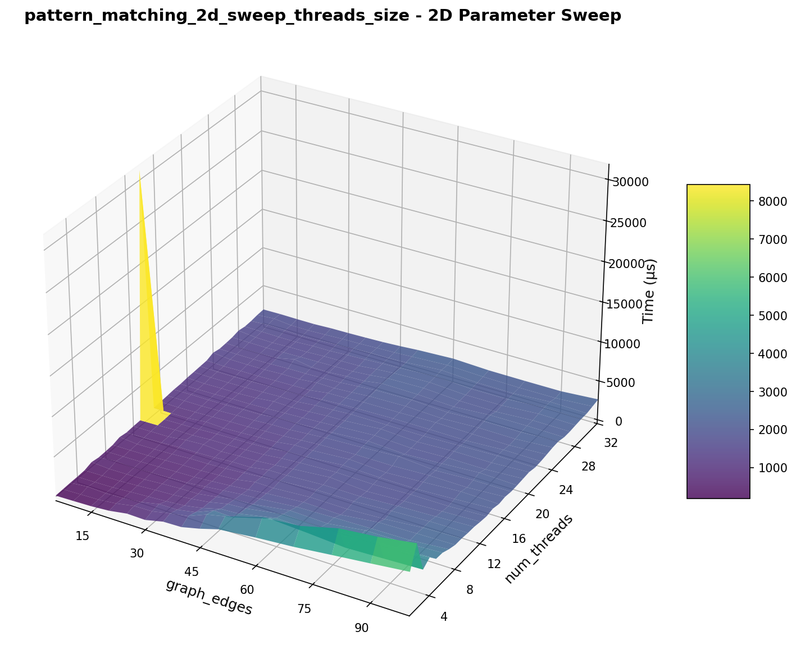

| Parameters | Avg (μs) | Stddev (μs) | CV% | Samples |
|------------|----------|-------------|-----|---------|
| graph_edges=15, num_threads=9 | 586.33 | 109.90 | 18.74 | 50 |
| graph_edges=50, num_threads=17 | 1779.02 | 281.02 | 15.80 | 50 |
| graph_edges=10, num_threads=27 | 1535.14 | 163.34 | 10.64 | 50 |
| graph_edges=5, num_threads=11 | 637.59 | 67.99 | 10.66 | 50 |
| graph_edges=45, num_threads=32 | 2168.39 | 170.77 | 7.88 | 50 |
| graph_edges=10, num_threads=19 | 1081.72 | 114.15 | 10.55 | 50 |
| graph_edges=50, num_threads=32 | 2327.10 | 227.41 | 9.77 | 50 |
| graph_edges=45, num_threads=16 | 1529.23 | 232.40 | 15.20 | 50 |
| graph_edges=30, num_threads=8 | 751.10 | 181.08 | 24.11 | 50 |
| graph_edges=60, num_threads=14 | 1993.03 | 552.59 | 27.73 | 50 |
| graph_edges=20, num_threads=29 | 1534.78 | 166.52 | 10.85 | 50 |
| graph_edges=35, num_threads=19 | 1404.94 | 262.48 | 18.68 | 50 |
| graph_edges=40, num_threads=32 | 2050.99 | 139.43 | 6.80 | 50 |
| graph_edges=35, num_threads=10 | 1011.47 | 194.88 | 19.27 | 50 |
| graph_edges=45, num_threads=20 | 1702.24 | 194.40 | 11.42 | 50 |
| graph_edges=30, num_threads=9 | 798.49 | 180.41 | 22.59 | 50 |
| graph_edges=15, num_threads=21 | 1188.66 | 109.41 | 9.20 | 50 |
| graph_edges=15, num_threads=28 | 1472.70 | 143.72 | 9.76 | 50 |
| graph_edges=100, num_threads=30 | 2290.29 | 161.26 | 7.04 | 50 |
| graph_edges=5, num_threads=7 | 425.03 | 70.67 | 16.63 | 50 |
| graph_edges=35, num_threads=4 | 949.64 | 274.21 | 28.87 | 50 |
| graph_edges=30, num_threads=2 | 1037.97 | 443.01 | 42.68 | 50 |
| graph_edges=35, num_threads=32 | 1982.10 | 149.51 | 7.54 | 50 |
| graph_edges=25, num_threads=22 | 1359.24 | 118.86 | 8.74 | 50 |
| graph_edges=60, num_threads=16 | 1826.22 | 404.04 | 22.12 | 50 |
| graph_edges=15, num_threads=6 | 461.17 | 118.08 | 25.60 | 50 |
| graph_edges=60, num_threads=6 | 2444.82 | 915.09 | 37.43 | 50 |
| graph_edges=25, num_threads=10 | 865.61 | 164.21 | 18.97 | 50 |
| graph_edges=30, num_threads=16 | 1166.26 | 236.53 | 20.28 | 50 |
| graph_edges=90, num_threads=24 | 2053.32 | 223.86 | 10.90 | 50 |
| graph_edges=30, num_threads=30 | 1802.36 | 170.71 | 9.47 | 50 |
| graph_edges=90, num_threads=5 | 3086.20 | 1216.83 | 39.43 | 50 |
| graph_edges=10, num_threads=17 | 1024.97 | 99.30 | 9.69 | 50 |
| graph_edges=70, num_threads=25 | 1936.94 | 160.92 | 8.31 | 50 |
| graph_edges=10, num_threads=25 | 1403.53 | 139.54 | 9.94 | 50 |
| graph_edges=25, num_threads=28 | 1567.92 | 98.93 | 6.31 | 50 |
| graph_edges=45, num_threads=5 | 1831.10 | 556.80 | 30.41 | 50 |
| graph_edges=40, num_threads=21 | 1634.65 | 440.79 | 26.97 | 50 |
| graph_edges=80, num_threads=1 | 3887.11 | 1298.67 | 33.41 | 50 |
| graph_edges=25, num_threads=32 | 1904.33 | 114.02 | 5.99 | 50 |
| graph_edges=35, num_threads=6 | 868.24 | 218.92 | 25.21 | 50 |
| graph_edges=30, num_threads=13 | 1052.98 | 192.00 | 18.23 | 50 |
| graph_edges=90, num_threads=9 | 2373.19 | 657.57 | 27.71 | 50 |
| graph_edges=50, num_threads=31 | 2162.85 | 195.82 | 9.05 | 50 |
| graph_edges=35, num_threads=22 | 1466.55 | 149.07 | 10.16 | 50 |
| graph_edges=45, num_threads=28 | 1970.75 | 177.28 | 9.00 | 50 |
| graph_edges=20, num_threads=25 | 1432.50 | 97.93 | 6.84 | 50 |
| graph_edges=10, num_threads=29 | 1577.62 | 117.47 | 7.45 | 50 |
| graph_edges=70, num_threads=28 | 2008.70 | 182.32 | 9.08 | 50 |
| graph_edges=25, num_threads=5 | 665.00 | 172.41 | 25.93 | 50 |
| graph_edges=70, num_threads=20 | 1855.53 | 287.48 | 15.49 | 50 |
| graph_edges=35, num_threads=7 | 1009.12 | 322.60 | 31.97 | 50 |
| graph_edges=5, num_threads=24 | 1629.60 | 1366.83 | 83.88 | 50 |
| graph_edges=60, num_threads=1 | 3019.87 | 1128.65 | 37.37 | 50 |
| graph_edges=25, num_threads=19 | 1214.48 | 96.81 | 7.97 | 50 |
| graph_edges=10, num_threads=22 | 1214.24 | 97.18 | 8.00 | 50 |
| graph_edges=60, num_threads=27 | 2253.64 | 330.11 | 14.65 | 50 |
| graph_edges=60, num_threads=31 | 2385.04 | 401.73 | 16.84 | 50 |
| graph_edges=80, num_threads=20 | 2051.50 | 341.24 | 16.63 | 50 |
| graph_edges=70, num_threads=4 | 2917.89 | 1431.10 | 49.05 | 50 |
| graph_edges=90, num_threads=17 | 2107.43 | 332.44 | 15.77 | 50 |
| graph_edges=35, num_threads=2 | 1525.25 | 556.49 | 36.49 | 50 |
| graph_edges=100, num_threads=13 | 2140.21 | 400.22 | 18.70 | 50 |
| graph_edges=60, num_threads=17 | 1983.62 | 436.92 | 22.03 | 50 |
| graph_edges=50, num_threads=18 | 1741.46 | 267.27 | 15.35 | 50 |
| graph_edges=70, num_threads=11 | 1774.56 | 500.05 | 28.18 | 50 |
| graph_edges=80, num_threads=14 | 1828.50 | 358.54 | 19.61 | 50 |
| graph_edges=80, num_threads=13 | 1933.00 | 478.50 | 24.75 | 50 |
| graph_edges=30, num_threads=4 | 757.48 | 279.09 | 36.84 | 50 |
| graph_edges=60, num_threads=22 | 1966.63 | 337.33 | 17.15 | 50 |
| graph_edges=80, num_threads=25 | 2169.64 | 319.60 | 14.73 | 50 |
| graph_edges=35, num_threads=21 | 1408.72 | 137.09 | 9.73 | 50 |
| graph_edges=80, num_threads=2 | 6342.08 | 2626.58 | 41.42 | 50 |
| graph_edges=10, num_threads=31 | 1929.98 | 1356.06 | 70.26 | 50 |
| graph_edges=100, num_threads=14 | 2308.17 | 343.48 | 14.88 | 50 |
| graph_edges=10, num_threads=6 | 425.88 | 89.80 | 21.09 | 50 |
| graph_edges=5, num_threads=8 | 458.99 | 68.12 | 14.84 | 50 |
| graph_edges=90, num_threads=23 | 1993.02 | 201.81 | 10.13 | 50 |
| graph_edges=80, num_threads=21 | 2012.81 | 1318.40 | 65.50 | 50 |
| graph_edges=10, num_threads=5 | 330.21 | 55.33 | 16.76 | 50 |
| graph_edges=30, num_threads=21 | 1395.11 | 141.13 | 10.12 | 50 |
| graph_edges=10, num_threads=30 | 1785.03 | 1354.80 | 75.90 | 50 |
| graph_edges=30, num_threads=29 | 1662.60 | 97.05 | 5.84 | 50 |
| graph_edges=90, num_threads=4 | 3684.65 | 1435.62 | 38.96 | 50 |
| graph_edges=100, num_threads=27 | 2171.25 | 209.36 | 9.64 | 50 |
| graph_edges=35, num_threads=11 | 1113.07 | 221.10 | 19.86 | 50 |
| graph_edges=30, num_threads=25 | 1533.44 | 89.83 | 5.86 | 50 |
| graph_edges=5, num_threads=26 | 1490.90 | 138.67 | 9.30 | 50 |
| graph_edges=70, num_threads=24 | 1901.13 | 186.75 | 9.82 | 50 |
| graph_edges=15, num_threads=29 | 1530.12 | 147.30 | 9.63 | 50 |
| graph_edges=35, num_threads=13 | 1132.11 | 175.80 | 15.53 | 50 |
| graph_edges=100, num_threads=21 | 2084.37 | 173.94 | 8.35 | 50 |
| graph_edges=45, num_threads=13 | 1471.68 | 264.48 | 17.97 | 50 |
| graph_edges=90, num_threads=15 | 2209.14 | 435.99 | 19.74 | 50 |
| graph_edges=100, num_threads=16 | 2229.55 | 281.26 | 12.62 | 50 |
| graph_edges=20, num_threads=1 | 428.00 | 167.00 | 39.02 | 50 |
| graph_edges=50, num_threads=26 | 2219.49 | 612.53 | 27.60 | 50 |
| graph_edges=50, num_threads=21 | 1862.50 | 233.93 | 12.56 | 50 |
| graph_edges=20, num_threads=11 | 850.73 | 220.39 | 25.91 | 50 |
| graph_edges=60, num_threads=15 | 1976.67 | 508.17 | 25.71 | 50 |
| graph_edges=70, num_threads=2 | 5142.91 | 2685.52 | 52.22 | 50 |
| graph_edges=20, num_threads=3 | 473.23 | 151.46 | 32.01 | 50 |
| graph_edges=5, num_threads=9 | 519.84 | 74.74 | 14.38 | 50 |
| graph_edges=60, num_threads=7 | 2111.91 | 781.29 | 36.99 | 50 |
| graph_edges=45, num_threads=26 | 1870.74 | 281.23 | 15.03 | 50 |
| graph_edges=45, num_threads=7 | 1498.58 | 380.41 | 25.38 | 50 |
| graph_edges=35, num_threads=28 | 1709.99 | 111.51 | 6.52 | 50 |
| graph_edges=40, num_threads=7 | 1253.47 | 1357.38 | 108.29 | 50 |
| graph_edges=15, num_threads=25 | 1391.10 | 111.99 | 8.05 | 50 |
| graph_edges=10, num_threads=18 | 1103.38 | 121.94 | 11.05 | 50 |
| graph_edges=100, num_threads=22 | 2119.57 | 194.15 | 9.16 | 50 |
| graph_edges=90, num_threads=12 | 2057.53 | 417.85 | 20.31 | 50 |
| graph_edges=10, num_threads=26 | 1430.63 | 145.89 | 10.20 | 50 |
| graph_edges=45, num_threads=12 | 1361.48 | 255.74 | 18.78 | 50 |
| graph_edges=20, num_threads=21 | 1234.97 | 127.86 | 10.35 | 50 |
| graph_edges=60, num_threads=11 | 1790.29 | 477.06 | 26.65 | 50 |
| graph_edges=70, num_threads=19 | 1806.31 | 292.38 | 16.19 | 50 |
| graph_edges=35, num_threads=16 | 1285.53 | 186.64 | 14.52 | 50 |
| graph_edges=40, num_threads=11 | 1136.27 | 288.38 | 25.38 | 50 |
| graph_edges=80, num_threads=22 | 1928.49 | 272.57 | 14.13 | 50 |
| graph_edges=70, num_threads=1 | 3382.09 | 1458.54 | 43.13 | 50 |
| graph_edges=80, num_threads=6 | 2932.33 | 1404.53 | 47.90 | 50 |
| graph_edges=10, num_threads=3 | 455.12 | 1392.19 | 305.90 | 50 |
| graph_edges=100, num_threads=29 | 2302.66 | 153.45 | 6.66 | 50 |
| graph_edges=45, num_threads=27 | 1908.38 | 209.20 | 10.96 | 50 |
| graph_edges=25, num_threads=8 | 693.94 | 147.06 | 21.19 | 50 |
| graph_edges=50, num_threads=8 | 1564.31 | 447.32 | 28.60 | 50 |
| graph_edges=15, num_threads=12 | 760.58 | 98.07 | 12.89 | 50 |
| graph_edges=90, num_threads=22 | 2164.53 | 311.25 | 14.38 | 50 |
| graph_edges=50, num_threads=12 | 1577.36 | 350.61 | 22.23 | 50 |
| graph_edges=15, num_threads=3 | 338.96 | 104.18 | 30.74 | 50 |
| graph_edges=100, num_threads=6 | 3173.15 | 1367.24 | 43.09 | 50 |
| graph_edges=80, num_threads=32 | 2303.00 | 168.84 | 7.33 | 50 |
| graph_edges=35, num_threads=26 | 1648.27 | 131.75 | 7.99 | 50 |
| graph_edges=50, num_threads=28 | 2132.98 | 313.55 | 14.70 | 50 |
| graph_edges=90, num_threads=19 | 1955.57 | 241.64 | 12.36 | 50 |
| graph_edges=5, num_threads=30 | 1653.02 | 102.51 | 6.20 | 50 |
| graph_edges=5, num_threads=5 | 284.21 | 32.74 | 11.52 | 50 |
| graph_edges=90, num_threads=31 | 2156.61 | 139.04 | 6.45 | 50 |
| graph_edges=50, num_threads=11 | 1538.51 | 395.24 | 25.69 | 50 |
| graph_edges=40, num_threads=29 | 1879.09 | 210.41 | 11.20 | 50 |
| graph_edges=10, num_threads=28 | 1529.16 | 160.72 | 10.51 | 50 |
| graph_edges=20, num_threads=28 | 1550.23 | 143.95 | 9.29 | 50 |
| graph_edges=70, num_threads=26 | 1949.90 | 184.19 | 9.45 | 50 |
| graph_edges=100, num_threads=10 | 2430.96 | 430.90 | 17.73 | 50 |
| graph_edges=25, num_threads=20 | 1264.30 | 100.21 | 7.93 | 50 |
| graph_edges=10, num_threads=32 | 1848.68 | 144.84 | 7.84 | 50 |
| graph_edges=20, num_threads=23 | 1281.63 | 132.39 | 10.33 | 50 |
| graph_edges=30, num_threads=12 | 965.67 | 165.74 | 17.16 | 50 |
| graph_edges=50, num_threads=29 | 2092.07 | 247.74 | 11.84 | 50 |
| graph_edges=20, num_threads=2 | 562.29 | 181.37 | 32.25 | 50 |
| graph_edges=50, num_threads=14 | 1601.18 | 319.11 | 19.93 | 50 |
| graph_edges=100, num_threads=24 | 2362.79 | 266.48 | 11.28 | 50 |
| graph_edges=45, num_threads=15 | 1659.06 | 295.17 | 17.79 | 50 |
| graph_edges=20, num_threads=6 | 517.61 | 87.67 | 16.94 | 50 |
| graph_edges=15, num_threads=8 | 537.21 | 136.04 | 25.32 | 50 |
| graph_edges=15, num_threads=26 | 1429.80 | 131.03 | 9.16 | 50 |
| graph_edges=70, num_threads=27 | 1969.36 | 170.65 | 8.67 | 50 |
| graph_edges=60, num_threads=5 | 2761.22 | 1136.27 | 41.15 | 50 |
| graph_edges=20, num_threads=8 | 620.33 | 135.20 | 21.79 | 50 |
| graph_edges=50, num_threads=16 | 1682.01 | 286.63 | 17.04 | 50 |
| graph_edges=80, num_threads=16 | 2023.55 | 414.22 | 20.47 | 50 |
| graph_edges=10, num_threads=11 | 662.25 | 60.90 | 9.20 | 50 |
| graph_edges=80, num_threads=31 | 2144.11 | 141.51 | 6.60 | 50 |
| graph_edges=60, num_threads=13 | 1831.85 | 494.89 | 27.02 | 50 |
| graph_edges=90, num_threads=10 | 2388.02 | 606.02 | 25.38 | 50 |
| graph_edges=35, num_threads=18 | 1511.06 | 353.78 | 23.41 | 50 |
| graph_edges=35, num_threads=15 | 1245.95 | 184.56 | 14.81 | 50 |
| graph_edges=35, num_threads=12 | 1099.59 | 187.82 | 17.08 | 50 |
| graph_edges=10, num_threads=16 | 907.03 | 80.49 | 8.87 | 50 |
| graph_edges=10, num_threads=7 | 651.26 | 1397.07 | 214.52 | 50 |
| graph_edges=30, num_threads=7 | 784.39 | 213.58 | 27.23 | 50 |
| graph_edges=25, num_threads=25 | 1517.69 | 113.09 | 7.45 | 50 |
| graph_edges=25, num_threads=14 | 1010.50 | 192.31 | 19.03 | 50 |
| graph_edges=90, num_threads=32 | 2308.63 | 143.17 | 6.20 | 50 |
| graph_edges=45, num_threads=21 | 1725.80 | 220.30 | 12.76 | 50 |
| graph_edges=5, num_threads=13 | 734.05 | 53.69 | 7.31 | 50 |
| graph_edges=70, num_threads=12 | 1642.07 | 386.05 | 23.51 | 50 |
| graph_edges=5, num_threads=16 | 942.28 | 132.33 | 14.04 | 50 |
| graph_edges=70, num_threads=23 | 2103.22 | 370.72 | 17.63 | 50 |
| graph_edges=100, num_threads=26 | 2183.42 | 180.80 | 8.28 | 50 |
| graph_edges=15, num_threads=30 | 1714.51 | 279.23 | 16.29 | 50 |
| graph_edges=50, num_threads=27 | 2164.17 | 515.61 | 23.83 | 50 |
| graph_edges=25, num_threads=17 | 1202.08 | 173.43 | 14.43 | 50 |
| graph_edges=10, num_threads=15 | 870.58 | 99.91 | 11.48 | 50 |
| graph_edges=5, num_threads=25 | 1443.98 | 85.19 | 5.90 | 50 |
| graph_edges=25, num_threads=29 | 1654.60 | 136.70 | 8.26 | 50 |
| graph_edges=45, num_threads=25 | 1883.72 | 283.97 | 15.08 | 50 |
| graph_edges=30, num_threads=27 | 1654.15 | 141.39 | 8.55 | 50 |
| graph_edges=60, num_threads=12 | 1969.91 | 606.06 | 30.77 | 50 |
| graph_edges=50, num_threads=6 | 1756.12 | 563.12 | 32.07 | 50 |
| graph_edges=15, num_threads=20 | 1150.31 | 162.23 | 14.10 | 50 |
| graph_edges=20, num_threads=4 | 478.21 | 116.72 | 24.41 | 50 |
| graph_edges=100, num_threads=15 | 2102.75 | 256.48 | 12.20 | 50 |
| graph_edges=50, num_threads=10 | 1597.01 | 381.46 | 23.89 | 50 |
| graph_edges=15, num_threads=19 | 1103.49 | 102.15 | 9.26 | 50 |
| graph_edges=20, num_threads=22 | 1269.92 | 105.02 | 8.27 | 50 |
| graph_edges=100, num_threads=7 | 2805.32 | 634.78 | 22.63 | 50 |
| graph_edges=15, num_threads=11 | 735.75 | 85.04 | 11.56 | 50 |
| graph_edges=30, num_threads=23 | 1400.21 | 119.77 | 8.55 | 50 |
| graph_edges=15, num_threads=18 | 1088.95 | 104.23 | 9.57 | 50 |
| graph_edges=80, num_threads=9 | 1966.86 | 600.76 | 30.54 | 50 |
| graph_edges=15, num_threads=2 | 322.12 | 102.96 | 31.96 | 50 |
| graph_edges=70, num_threads=31 | 2214.01 | 176.45 | 7.97 | 50 |
| graph_edges=100, num_threads=20 | 2273.22 | 272.65 | 11.99 | 50 |
| graph_edges=90, num_threads=26 | 2247.06 | 264.83 | 11.79 | 50 |
| graph_edges=25, num_threads=16 | 1117.71 | 129.83 | 11.62 | 50 |
| graph_edges=60, num_threads=8 | 1926.91 | 632.02 | 32.80 | 50 |
| graph_edges=25, num_threads=30 | 1684.81 | 144.87 | 8.60 | 50 |
| graph_edges=25, num_threads=18 | 1219.19 | 136.99 | 11.24 | 50 |
| graph_edges=70, num_threads=7 | 2242.73 | 910.70 | 40.61 | 50 |
| graph_edges=100, num_threads=19 | 2200.96 | 259.04 | 11.77 | 50 |
| graph_edges=5, num_threads=14 | 31180.18 | 212671.70 | 682.07 | 50 |
| graph_edges=60, num_threads=3 | 3786.76 | 1702.51 | 44.96 | 50 |
| graph_edges=60, num_threads=20 | 2100.92 | 421.37 | 20.06 | 50 |
| graph_edges=60, num_threads=28 | 2287.58 | 340.93 | 14.90 | 50 |
| graph_edges=45, num_threads=6 | 1631.52 | 496.49 | 30.43 | 50 |
| graph_edges=25, num_threads=24 | 1518.05 | 128.97 | 8.50 | 50 |
| graph_edges=15, num_threads=14 | 847.18 | 111.97 | 13.22 | 50 |
| graph_edges=15, num_threads=10 | 635.25 | 59.94 | 9.44 | 50 |
| graph_edges=35, num_threads=25 | 1603.64 | 134.96 | 8.42 | 50 |
| graph_edges=5, num_threads=10 | 785.27 | 1392.39 | 177.31 | 50 |
| graph_edges=50, num_threads=20 | 1762.14 | 253.89 | 14.41 | 50 |
| graph_edges=70, num_threads=3 | 3516.29 | 2119.70 | 60.28 | 50 |
| graph_edges=25, num_threads=3 | 694.95 | 290.29 | 41.77 | 50 |
| graph_edges=40, num_threads=26 | 1807.04 | 276.12 | 15.28 | 50 |
| graph_edges=40, num_threads=22 | 1675.93 | 379.65 | 22.65 | 50 |
| graph_edges=45, num_threads=3 | 2572.36 | 887.50 | 34.50 | 50 |
| graph_edges=40, num_threads=20 | 1550.20 | 215.53 | 13.90 | 50 |
| graph_edges=40, num_threads=13 | 1238.97 | 285.02 | 23.00 | 50 |
| graph_edges=70, num_threads=14 | 1853.45 | 462.15 | 24.93 | 50 |
| graph_edges=90, num_threads=30 | 2413.53 | 298.63 | 12.37 | 50 |
| graph_edges=20, num_threads=14 | 902.28 | 104.94 | 11.63 | 50 |
| graph_edges=20, num_threads=10 | 719.68 | 117.09 | 16.27 | 50 |
| graph_edges=15, num_threads=7 | 499.62 | 115.23 | 23.06 | 50 |
| graph_edges=15, num_threads=24 | 1399.30 | 109.96 | 7.86 | 50 |
| graph_edges=70, num_threads=29 | 2063.14 | 215.76 | 10.46 | 50 |
| graph_edges=70, num_threads=30 | 2160.17 | 237.36 | 10.99 | 50 |
| graph_edges=50, num_threads=2 | 3364.90 | 1172.24 | 34.84 | 50 |
| graph_edges=70, num_threads=16 | 1819.58 | 384.95 | 21.16 | 50 |
| graph_edges=15, num_threads=27 | 1506.31 | 112.41 | 7.46 | 50 |
| graph_edges=15, num_threads=15 | 910.81 | 79.93 | 8.78 | 50 |
| graph_edges=5, num_threads=3 | 220.45 | 45.85 | 20.80 | 50 |
| graph_edges=35, num_threads=5 | 1013.02 | 292.89 | 28.91 | 50 |
| graph_edges=60, num_threads=24 | 2092.04 | 253.99 | 12.14 | 50 |
| graph_edges=10, num_threads=4 | 269.55 | 37.69 | 13.98 | 50 |
| graph_edges=50, num_threads=30 | 2109.47 | 175.24 | 8.31 | 50 |
| graph_edges=40, num_threads=3 | 1628.35 | 857.73 | 52.67 | 50 |
| graph_edges=80, num_threads=26 | 2236.47 | 299.98 | 13.41 | 50 |
| graph_edges=80, num_threads=28 | 2015.36 | 172.56 | 8.56 | 50 |
| graph_edges=25, num_threads=31 | 1756.63 | 103.96 | 5.92 | 50 |
| graph_edges=90, num_threads=18 | 2290.93 | 375.94 | 16.41 | 50 |
| graph_edges=50, num_threads=22 | 1868.05 | 202.66 | 10.85 | 50 |
| graph_edges=35, num_threads=14 | 1132.13 | 155.60 | 13.74 | 50 |
| graph_edges=35, num_threads=24 | 1726.64 | 1341.85 | 77.71 | 50 |
| graph_edges=80, num_threads=17 | 1878.18 | 349.27 | 18.60 | 50 |
| graph_edges=100, num_threads=4 | 4214.36 | 1247.92 | 29.61 | 50 |
| graph_edges=5, num_threads=17 | 1006.86 | 87.12 | 8.65 | 50 |
| graph_edges=50, num_threads=25 | 2060.61 | 209.71 | 10.18 | 50 |
| graph_edges=45, num_threads=24 | 1832.37 | 334.49 | 18.25 | 50 |
| graph_edges=100, num_threads=28 | 2244.95 | 178.30 | 7.94 | 50 |
| graph_edges=5, num_threads=22 | 1264.47 | 94.84 | 7.50 | 50 |
| graph_edges=60, num_threads=30 | 2450.37 | 311.05 | 12.69 | 50 |
| graph_edges=70, num_threads=9 | 1740.55 | 576.35 | 33.11 | 50 |
| graph_edges=40, num_threads=18 | 1524.70 | 286.88 | 18.82 | 50 |
| graph_edges=10, num_threads=14 | 797.41 | 77.67 | 9.74 | 50 |
| graph_edges=5, num_threads=23 | 1303.60 | 87.76 | 6.73 | 50 |
| graph_edges=45, num_threads=17 | 1612.73 | 213.43 | 13.23 | 50 |
| graph_edges=100, num_threads=12 | 2249.14 | 376.99 | 16.76 | 50 |
| graph_edges=30, num_threads=19 | 1293.07 | 141.95 | 10.98 | 50 |
| graph_edges=45, num_threads=10 | 1387.93 | 313.95 | 22.62 | 50 |
| graph_edges=50, num_threads=23 | 1961.61 | 234.59 | 11.96 | 50 |
| graph_edges=90, num_threads=25 | 2173.34 | 245.14 | 11.28 | 50 |
| graph_edges=35, num_threads=1 | 1267.38 | 1334.11 | 105.27 | 50 |
| graph_edges=60, num_threads=29 | 2341.42 | 306.33 | 13.08 | 50 |
| graph_edges=70, num_threads=32 | 2328.11 | 219.39 | 9.42 | 50 |
| graph_edges=100, num_threads=9 | 2532.80 | 590.30 | 23.31 | 50 |
| graph_edges=40, num_threads=9 | 1082.39 | 326.19 | 30.14 | 50 |
| graph_edges=60, num_threads=21 | 1869.63 | 308.59 | 16.51 | 50 |
| graph_edges=45, num_threads=2 | 2855.59 | 824.81 | 28.88 | 50 |
| graph_edges=40, num_threads=12 | 1176.62 | 275.36 | 23.40 | 50 |
| graph_edges=25, num_threads=4 | 618.25 | 186.67 | 30.19 | 50 |
| graph_edges=15, num_threads=22 | 1218.29 | 114.44 | 9.39 | 50 |
| graph_edges=10, num_threads=23 | 1233.62 | 86.05 | 6.98 | 50 |
| graph_edges=45, num_threads=8 | 1316.17 | 341.44 | 25.94 | 50 |
| graph_edges=80, num_threads=5 | 2911.38 | 1237.65 | 42.51 | 50 |
| graph_edges=15, num_threads=13 | 890.82 | 116.00 | 13.02 | 50 |
| graph_edges=30, num_threads=28 | 1670.36 | 145.63 | 8.72 | 50 |
| graph_edges=25, num_threads=7 | 685.98 | 190.33 | 27.75 | 50 |
| graph_edges=80, num_threads=27 | 1938.42 | 152.06 | 7.84 | 50 |
| graph_edges=90, num_threads=29 | 2395.00 | 254.17 | 10.61 | 50 |
| graph_edges=50, num_threads=15 | 1668.44 | 300.48 | 18.01 | 50 |
| graph_edges=5, num_threads=20 | 1181.09 | 106.09 | 8.98 | 50 |
| graph_edges=70, num_threads=5 | 2636.89 | 1294.57 | 49.09 | 50 |
| graph_edges=60, num_threads=23 | 1995.22 | 317.63 | 15.92 | 50 |
| graph_edges=5, num_threads=31 | 1773.26 | 104.04 | 5.87 | 50 |
| graph_edges=45, num_threads=31 | 2041.47 | 127.90 | 6.26 | 50 |
| graph_edges=20, num_threads=26 | 1524.35 | 136.38 | 8.95 | 50 |
| graph_edges=20, num_threads=7 | 611.34 | 147.79 | 24.17 | 50 |
| graph_edges=10, num_threads=2 | 248.32 | 58.70 | 23.64 | 50 |
| graph_edges=15, num_threads=31 | 1692.67 | 154.85 | 9.15 | 50 |
| graph_edges=60, num_threads=10 | 1918.35 | 574.78 | 29.96 | 50 |
| graph_edges=45, num_threads=29 | 1996.31 | 184.87 | 9.26 | 50 |
| graph_edges=40, num_threads=5 | 1334.19 | 601.23 | 45.06 | 50 |
| graph_edges=25, num_threads=13 | 1030.28 | 232.88 | 22.60 | 50 |
| graph_edges=45, num_threads=9 | 1498.46 | 385.27 | 25.71 | 50 |
| graph_edges=20, num_threads=17 | 1105.83 | 109.49 | 9.90 | 50 |
| graph_edges=15, num_threads=5 | 370.89 | 85.15 | 22.96 | 50 |
| graph_edges=90, num_threads=28 | 2325.40 | 290.35 | 12.49 | 50 |
| graph_edges=25, num_threads=6 | 687.47 | 181.63 | 26.42 | 50 |
| graph_edges=25, num_threads=23 | 1353.84 | 102.65 | 7.58 | 50 |
| graph_edges=80, num_threads=23 | 2024.75 | 293.56 | 14.50 | 50 |
| graph_edges=45, num_threads=4 | 1982.54 | 632.66 | 31.91 | 50 |
| graph_edges=10, num_threads=8 | 499.43 | 81.76 | 16.37 | 50 |
| graph_edges=35, num_threads=23 | 1459.17 | 129.84 | 8.90 | 50 |
| graph_edges=40, num_threads=2 | 1924.02 | 910.98 | 47.35 | 50 |
| graph_edges=25, num_threads=15 | 1038.21 | 158.25 | 15.24 | 50 |
| graph_edges=50, num_threads=4 | 2134.69 | 735.44 | 34.45 | 50 |
| graph_edges=15, num_threads=32 | 1817.72 | 220.72 | 12.14 | 50 |
| graph_edges=30, num_threads=26 | 1654.25 | 104.71 | 6.33 | 50 |
| graph_edges=20, num_threads=15 | 1142.17 | 1376.48 | 120.51 | 50 |
| graph_edges=90, num_threads=13 | 1932.81 | 330.26 | 17.09 | 50 |
| graph_edges=80, num_threads=7 | 2348.69 | 824.44 | 35.10 | 50 |
| graph_edges=30, num_threads=20 | 1499.57 | 1354.94 | 90.36 | 50 |
| graph_edges=10, num_threads=12 | 722.94 | 107.03 | 14.81 | 50 |
| graph_edges=10, num_threads=9 | 542.74 | 76.39 | 14.07 | 50 |
| graph_edges=5, num_threads=1 | 138.20 | 29.47 | 21.32 | 50 |
| graph_edges=25, num_threads=21 | 1310.43 | 123.03 | 9.39 | 50 |
| graph_edges=20, num_threads=12 | 1019.38 | 306.07 | 30.02 | 50 |
| graph_edges=30, num_threads=18 | 1260.04 | 131.44 | 10.43 | 50 |
| graph_edges=100, num_threads=5 | 3226.57 | 838.10 | 25.98 | 50 |
| graph_edges=90, num_threads=6 | 2943.35 | 956.61 | 32.50 | 50 |
| graph_edges=30, num_threads=24 | 1508.95 | 154.43 | 10.23 | 50 |
| graph_edges=90, num_threads=16 | 1958.51 | 299.07 | 15.27 | 50 |
| graph_edges=30, num_threads=32 | 1931.06 | 139.72 | 7.24 | 50 |
| graph_edges=50, num_threads=5 | 1998.76 | 653.18 | 32.68 | 50 |
| graph_edges=80, num_threads=24 | 2100.11 | 279.35 | 13.30 | 50 |
| graph_edges=40, num_threads=8 | 1101.80 | 367.29 | 33.34 | 50 |
| graph_edges=70, num_threads=21 | 1859.81 | 288.11 | 15.49 | 50 |
| graph_edges=90, num_threads=8 | 2455.17 | 720.33 | 29.34 | 50 |
| graph_edges=30, num_threads=14 | 1066.74 | 153.73 | 14.41 | 50 |
| graph_edges=70, num_threads=8 | 1817.86 | 633.80 | 34.87 | 50 |
| graph_edges=40, num_threads=31 | 1980.52 | 153.80 | 7.77 | 50 |
| graph_edges=5, num_threads=6 | 578.93 | 1404.65 | 242.63 | 50 |
| graph_edges=45, num_threads=14 | 1552.12 | 313.26 | 20.18 | 50 |
| graph_edges=70, num_threads=13 | 1754.44 | 403.65 | 23.01 | 50 |
| graph_edges=80, num_threads=30 | 2122.04 | 337.91 | 15.92 | 50 |
| graph_edges=40, num_threads=10 | 1182.56 | 338.78 | 28.65 | 50 |
| graph_edges=80, num_threads=12 | 1872.37 | 422.13 | 22.55 | 50 |
| graph_edges=35, num_threads=27 | 1690.20 | 136.27 | 8.06 | 50 |
| graph_edges=40, num_threads=14 | 1251.70 | 260.89 | 20.84 | 50 |
| graph_edges=5, num_threads=21 | 1214.36 | 94.18 | 7.76 | 50 |
| graph_edges=15, num_threads=16 | 971.07 | 99.34 | 10.23 | 50 |
| graph_edges=35, num_threads=29 | 1784.12 | 176.76 | 9.91 | 50 |
| graph_edges=20, num_threads=31 | 1677.67 | 141.45 | 8.43 | 50 |
| graph_edges=50, num_threads=1 | 2545.27 | 1384.44 | 54.39 | 50 |
| graph_edges=40, num_threads=27 | 1738.71 | 199.29 | 11.46 | 50 |
| graph_edges=45, num_threads=1 | 1873.32 | 539.14 | 28.78 | 50 |
| graph_edges=80, num_threads=18 | 2011.93 | 365.44 | 18.16 | 50 |
| graph_edges=5, num_threads=4 | 230.82 | 34.59 | 14.98 | 50 |
| graph_edges=100, num_threads=2 | 7529.50 | 2555.12 | 33.93 | 50 |
| graph_edges=100, num_threads=32 | 2632.51 | 207.43 | 7.88 | 50 |
| graph_edges=90, num_threads=7 | 2410.96 | 767.76 | 31.84 | 50 |
| graph_edges=80, num_threads=8 | 2357.12 | 765.46 | 32.47 | 50 |
| graph_edges=100, num_threads=25 | 2404.88 | 232.90 | 9.68 | 50 |
| graph_edges=30, num_threads=5 | 783.40 | 241.55 | 30.83 | 50 |
| graph_edges=90, num_threads=14 | 2045.89 | 350.50 | 17.13 | 50 |
| graph_edges=40, num_threads=25 | 1700.18 | 242.10 | 14.24 | 50 |
| graph_edges=80, num_threads=11 | 2033.08 | 538.24 | 26.47 | 50 |
| graph_edges=70, num_threads=6 | 2299.04 | 972.65 | 42.31 | 50 |
| graph_edges=100, num_threads=3 | 3537.83 | 1277.17 | 36.10 | 50 |
| graph_edges=70, num_threads=17 | 2245.65 | 643.14 | 28.64 | 50 |
| graph_edges=35, num_threads=9 | 928.62 | 224.75 | 24.20 | 50 |
| graph_edges=5, num_threads=15 | 869.25 | 66.29 | 7.63 | 50 |
| graph_edges=35, num_threads=31 | 1885.72 | 121.37 | 6.44 | 50 |
| graph_edges=40, num_threads=16 | 1377.31 | 229.18 | 16.64 | 50 |
| graph_edges=25, num_threads=26 | 2017.54 | 670.39 | 33.23 | 50 |
| graph_edges=30, num_threads=6 | 816.45 | 242.86 | 29.75 | 50 |
| graph_edges=100, num_threads=8 | 2546.53 | 570.07 | 22.39 | 50 |
| graph_edges=5, num_threads=12 | 705.42 | 66.04 | 9.36 | 50 |
| graph_edges=40, num_threads=4 | 1363.57 | 644.72 | 47.28 | 50 |
| graph_edges=35, num_threads=20 | 1444.88 | 205.63 | 14.23 | 50 |
| graph_edges=80, num_threads=10 | 2208.36 | 678.77 | 30.74 | 50 |
| graph_edges=100, num_threads=18 | 2133.49 | 264.12 | 12.38 | 50 |
| graph_edges=20, num_threads=16 | 1051.16 | 132.46 | 12.60 | 50 |
| graph_edges=70, num_threads=10 | 1935.84 | 614.03 | 31.72 | 50 |
| graph_edges=90, num_threads=20 | 2037.51 | 274.82 | 13.49 | 50 |
| graph_edges=45, num_threads=18 | 1671.62 | 232.70 | 13.92 | 50 |
| graph_edges=30, num_threads=1 | 746.18 | 315.93 | 42.34 | 50 |
| graph_edges=10, num_threads=21 | 1182.38 | 99.70 | 8.43 | 50 |
| graph_edges=30, num_threads=11 | 961.73 | 178.06 | 18.51 | 50 |
| graph_edges=40, num_threads=6 | 1223.88 | 600.07 | 49.03 | 50 |
| graph_edges=15, num_threads=1 | 259.90 | 88.73 | 34.14 | 50 |
| graph_edges=35, num_threads=8 | 923.75 | 217.78 | 23.58 | 50 |
| graph_edges=25, num_threads=12 | 1152.73 | 410.83 | 35.64 | 50 |
| graph_edges=80, num_threads=3 | 3187.52 | 1493.05 | 46.84 | 50 |
| graph_edges=45, num_threads=22 | 1789.68 | 255.09 | 14.25 | 50 |
| graph_edges=80, num_threads=19 | 1970.79 | 375.38 | 19.05 | 50 |
| graph_edges=40, num_threads=19 | 1506.22 | 249.42 | 16.56 | 50 |
| graph_edges=100, num_threads=17 | 2104.08 | 225.15 | 10.70 | 50 |
| graph_edges=10, num_threads=10 | 588.48 | 55.34 | 9.40 | 50 |
| graph_edges=35, num_threads=17 | 1390.17 | 174.93 | 12.58 | 50 |
| graph_edges=100, num_threads=23 | 2232.75 | 207.03 | 9.27 | 50 |
| graph_edges=5, num_threads=2 | 181.33 | 33.37 | 18.40 | 50 |
| graph_edges=15, num_threads=17 | 1026.81 | 77.84 | 7.58 | 50 |
| graph_edges=60, num_threads=4 | 3061.89 | 1288.81 | 42.09 | 50 |
| graph_edges=15, num_threads=23 | 1274.58 | 145.15 | 11.39 | 50 |
| graph_edges=50, num_threads=3 | 2484.83 | 934.15 | 37.59 | 50 |
| graph_edges=20, num_threads=9 | 671.86 | 119.67 | 17.81 | 50 |
| graph_edges=50, num_threads=13 | 1628.33 | 349.89 | 21.49 | 50 |
| graph_edges=20, num_threads=30 | 1592.92 | 168.12 | 10.55 | 50 |
| graph_edges=80, num_threads=15 | 1953.51 | 408.66 | 20.92 | 50 |
| graph_edges=40, num_threads=30 | 2012.51 | 325.14 | 16.16 | 50 |
| graph_edges=90, num_threads=2 | 6812.02 | 2832.08 | 41.57 | 50 |
| graph_edges=30, num_threads=22 | 1385.42 | 123.31 | 8.90 | 50 |
| graph_edges=10, num_threads=24 | 1414.26 | 175.08 | 12.38 | 50 |
| graph_edges=20, num_threads=24 | 1409.45 | 99.81 | 7.08 | 50 |
| graph_edges=60, num_threads=25 | 2169.81 | 284.39 | 13.11 | 50 |
| graph_edges=70, num_threads=18 | 1784.55 | 285.94 | 16.02 | 50 |
| graph_edges=45, num_threads=19 | 1618.86 | 208.85 | 12.90 | 50 |
| graph_edges=40, num_threads=1 | 1330.75 | 604.23 | 45.41 | 50 |
| graph_edges=60, num_threads=18 | 2038.22 | 423.56 | 20.78 | 50 |
| graph_edges=30, num_threads=17 | 1240.25 | 182.58 | 14.72 | 50 |
| graph_edges=90, num_threads=21 | 2148.34 | 356.65 | 16.60 | 50 |
| graph_edges=60, num_threads=19 | 2022.67 | 413.86 | 20.46 | 50 |
| graph_edges=90, num_threads=27 | 2213.37 | 237.05 | 10.71 | 50 |
| graph_edges=25, num_threads=1 | 799.52 | 1359.02 | 169.98 | 50 |
| graph_edges=20, num_threads=20 | 1157.21 | 75.02 | 6.48 | 50 |
| graph_edges=15, num_threads=4 | 326.50 | 75.54 | 23.14 | 50 |
| graph_edges=90, num_threads=1 | 4373.83 | 1539.20 | 35.19 | 50 |
| graph_edges=30, num_threads=3 | 1183.47 | 1358.25 | 114.77 | 50 |
| graph_edges=40, num_threads=17 | 1428.77 | 253.88 | 17.77 | 50 |
| graph_edges=50, num_threads=19 | 1759.38 | 237.63 | 13.51 | 50 |
| graph_edges=35, num_threads=30 | 1932.96 | 313.24 | 16.20 | 50 |
| graph_edges=5, num_threads=28 | 1763.44 | 1364.15 | 77.36 | 50 |
| graph_edges=70, num_threads=15 | 1711.91 | 337.12 | 19.69 | 50 |
| graph_edges=60, num_threads=2 | 4706.30 | 1932.16 | 41.05 | 50 |
| graph_edges=20, num_threads=18 | 1124.39 | 85.07 | 7.57 | 50 |
| graph_edges=60, num_threads=9 | 1775.29 | 541.72 | 30.51 | 50 |
| graph_edges=50, num_threads=9 | 1470.54 | 386.39 | 26.28 | 50 |
| graph_edges=40, num_threads=15 | 1345.30 | 269.63 | 20.04 | 50 |
| graph_edges=5, num_threads=19 | 1093.72 | 69.89 | 6.39 | 50 |
| graph_edges=5, num_threads=18 | 1083.05 | 96.79 | 8.94 | 50 |
| graph_edges=45, num_threads=30 | 2026.69 | 176.18 | 8.69 | 50 |
| graph_edges=45, num_threads=11 | 1506.85 | 293.47 | 19.48 | 50 |
| graph_edges=25, num_threads=9 | 766.34 | 155.00 | 20.23 | 50 |
| graph_edges=60, num_threads=26 | 2153.72 | 300.40 | 13.95 | 50 |
| graph_edges=25, num_threads=27 | 1619.23 | 123.73 | 7.64 | 50 |
| graph_edges=30, num_threads=10 | 900.99 | 185.21 | 20.56 | 50 |
| graph_edges=100, num_threads=31 | 2457.03 | 200.86 | 8.18 | 50 |
| graph_edges=50, num_threads=7 | 1649.24 | 468.15 | 28.39 | 50 |
| graph_edges=35, num_threads=3 | 1199.79 | 444.24 | 37.03 | 50 |
| graph_edges=50, num_threads=24 | 1995.35 | 208.59 | 10.45 | 50 |
| graph_edges=30, num_threads=31 | 1850.41 | 177.85 | 9.61 | 50 |
| graph_edges=5, num_threads=27 | 1566.61 | 99.15 | 6.33 | 50 |
| graph_edges=25, num_threads=11 | 874.55 | 144.11 | 16.48 | 50 |
| graph_edges=40, num_threads=23 | 1783.13 | 430.73 | 24.16 | 50 |
| graph_edges=100, num_threads=1 | 4882.27 | 1006.81 | 20.62 | 50 |
| graph_edges=90, num_threads=11 | 2198.52 | 507.22 | 23.07 | 50 |
| graph_edges=5, num_threads=29 | 1611.78 | 142.74 | 8.86 | 50 |
| graph_edges=20, num_threads=5 | 506.19 | 130.25 | 25.73 | 50 |
| graph_edges=10, num_threads=20 | 1101.74 | 119.28 | 10.83 | 50 |
| graph_edges=80, num_threads=4 | 3636.33 | 1480.84 | 40.72 | 50 |
| graph_edges=20, num_threads=19 | 1188.87 | 120.47 | 10.13 | 50 |
| graph_edges=20, num_threads=13 | 897.84 | 99.96 | 11.13 | 50 |
| graph_edges=90, num_threads=3 | 3354.08 | 1458.35 | 43.48 | 50 |
| graph_edges=40, num_threads=28 | 1757.80 | 124.85 | 7.10 | 50 |
| graph_edges=5, num_threads=32 | 1821.45 | 105.72 | 5.80 | 50 |
| graph_edges=100, num_threads=11 | 2399.68 | 452.53 | 18.86 | 50 |
| graph_edges=80, num_threads=29 | 2083.52 | 161.69 | 7.76 | 50 |
| graph_edges=60, num_threads=32 | 2526.68 | 385.66 | 15.26 | 50 |
| graph_edges=10, num_threads=1 | 192.30 | 49.74 | 25.86 | 50 |
| graph_edges=30, num_threads=15 | 1134.01 | 169.91 | 14.98 | 50 |
| graph_edges=20, num_threads=32 | 1812.05 | 154.03 | 8.50 | 50 |
| graph_edges=40, num_threads=24 | 1696.09 | 292.83 | 17.27 | 50 |
| graph_edges=25, num_threads=2 | 988.81 | 1356.32 | 137.17 | 50 |
| graph_edges=10, num_threads=13 | 781.72 | 93.67 | 11.98 | 50 |
| graph_edges=20, num_threads=27 | 1565.03 | 141.54 | 9.04 | 50 |
| graph_edges=45, num_threads=23 | 1835.47 | 417.49 | 22.75 | 50 |
| graph_edges=70, num_threads=22 | 1963.71 | 356.89 | 18.17 | 50 |

### pattern_matching_by_graph_size

Evaluates pattern matching scalability as target graph size increases from 5 to 15 edges

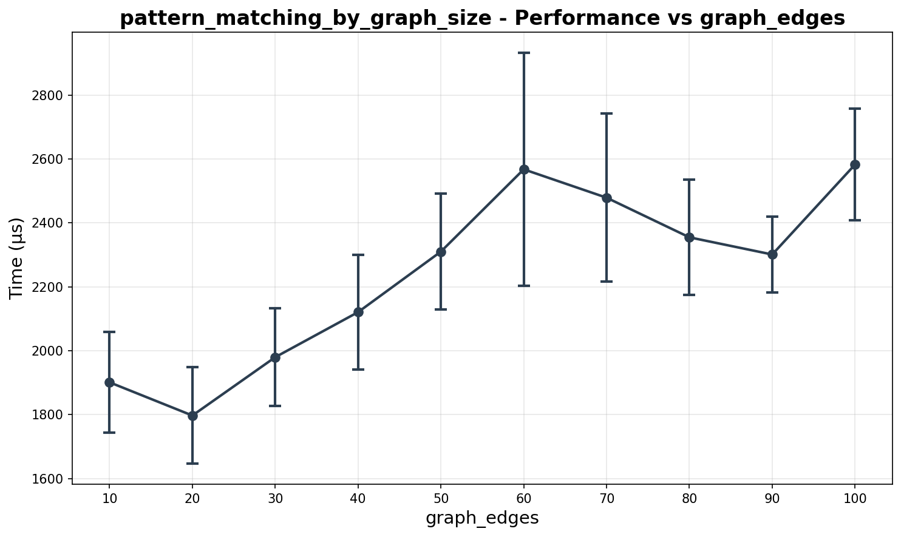

| Parameters | Avg (μs) | Stddev (μs) | CV% | Samples |
|------------|----------|-------------|-----|---------|
| graph_edges=20 | 1797.32 | 150.82 | 8.39 | 50 |
| graph_edges=80 | 2354.94 | 180.19 | 7.65 | 50 |
| graph_edges=30 | 1979.85 | 152.97 | 7.73 | 50 |
| graph_edges=100 | 2582.80 | 174.58 | 6.76 | 50 |
| graph_edges=60 | 2567.71 | 364.03 | 14.18 | 50 |
| graph_edges=90 | 2301.19 | 119.10 | 5.18 | 50 |
| graph_edges=50 | 2310.25 | 181.70 | 7.87 | 50 |
| graph_edges=10 | 1901.22 | 157.14 | 8.27 | 50 |
| graph_edges=40 | 2120.81 | 180.11 | 8.49 | 50 |
| graph_edges=70 | 2478.96 | 262.73 | 10.60 | 50 |

### pattern_matching_by_pattern_size

2D parameter sweep: pattern matching time vs pattern complexity (1-5 edges) and graph size (5-15 edges)

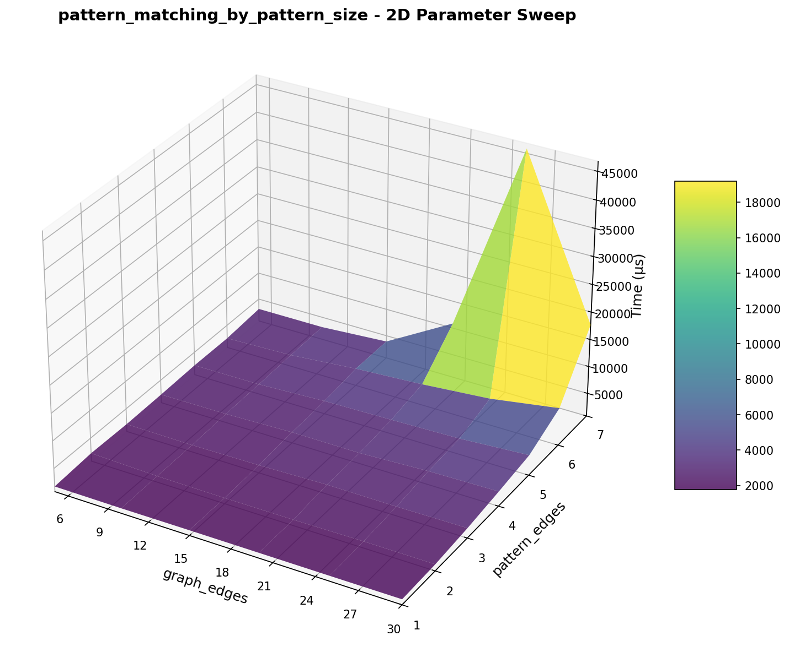

| Parameters | Avg (μs) | Stddev (μs) | CV% | Samples |
|------------|----------|-------------|-----|---------|
| graph_edges=20, pattern_edges=4 | 2703.72 | 725.06 | 26.82 | 50 |
| graph_edges=15, pattern_edges=4 | 2728.76 | 632.91 | 23.19 | 50 |
| graph_edges=30, pattern_edges=1 | 1743.79 | 132.67 | 7.61 | 50 |
| graph_edges=25, pattern_edges=1 | 1726.90 | 127.31 | 7.37 | 50 |
| graph_edges=5, pattern_edges=6 | 2528.03 | 107.99 | 4.27 | 50 |
| graph_edges=30, pattern_edges=3 | 2561.15 | 1336.79 | 52.19 | 50 |
| graph_edges=10, pattern_edges=5 | 2596.74 | 374.93 | 14.44 | 50 |
| graph_edges=5, pattern_edges=1 | 1718.29 | 117.29 | 6.83 | 50 |
| graph_edges=30, pattern_edges=2 | 1946.90 | 130.77 | 6.72 | 50 |
| graph_edges=20, pattern_edges=2 | 1831.82 | 159.19 | 8.69 | 50 |
| graph_edges=5, pattern_edges=5 | 2541.22 | 145.74 | 5.74 | 50 |
| graph_edges=25, pattern_edges=2 | 1970.35 | 196.14 | 9.95 | 50 |
| graph_edges=10, pattern_edges=6 | 2884.85 | 291.08 | 10.09 | 50 |
| graph_edges=10, pattern_edges=1 | 1679.21 | 110.84 | 6.60 | 50 |
| graph_edges=5, pattern_edges=4 | 2295.24 | 116.28 | 5.07 | 50 |
| graph_edges=30, pattern_edges=5 | 4461.00 | 2829.66 | 63.43 | 50 |
| graph_edges=20, pattern_edges=1 | 1724.90 | 139.42 | 8.08 | 50 |
| graph_edges=15, pattern_edges=1 | 1719.08 | 127.21 | 7.40 | 50 |
| graph_edges=25, pattern_edges=7 | 45833.89 | 232244.28 | 506.71 | 50 |
| graph_edges=25, pattern_edges=5 | 3679.06 | 1678.09 | 45.61 | 50 |
| graph_edges=20, pattern_edges=7 | 10862.18 | 24163.49 | 222.46 | 50 |
| graph_edges=5, pattern_edges=7 | 3091.98 | 890.42 | 28.80 | 50 |
| graph_edges=15, pattern_edges=3 | 2171.48 | 243.65 | 11.22 | 50 |
| graph_edges=20, pattern_edges=5 | 3377.86 | 1796.60 | 53.19 | 50 |
| graph_edges=30, pattern_edges=7 | 17649.23 | 28337.98 | 160.56 | 50 |
| graph_edges=10, pattern_edges=7 | 3105.12 | 979.72 | 31.55 | 50 |
| graph_edges=30, pattern_edges=6 | 7624.23 | 12573.14 | 164.91 | 50 |
| graph_edges=25, pattern_edges=3 | 2445.93 | 337.31 | 13.79 | 50 |
| graph_edges=10, pattern_edges=3 | 2033.97 | 221.93 | 10.91 | 50 |
| graph_edges=20, pattern_edges=3 | 2491.40 | 409.80 | 16.45 | 50 |
| graph_edges=25, pattern_edges=6 | 5655.41 | 3680.79 | 65.08 | 50 |
| graph_edges=10, pattern_edges=2 | 1882.81 | 190.61 | 10.12 | 50 |
| graph_edges=15, pattern_edges=2 | 1803.58 | 166.10 | 9.21 | 50 |
| graph_edges=25, pattern_edges=4 | 3242.71 | 1829.94 | 56.43 | 50 |
| graph_edges=20, pattern_edges=6 | 4646.63 | 3364.27 | 72.40 | 50 |
| graph_edges=15, pattern_edges=6 | 3933.52 | 3156.05 | 80.23 | 50 |
| graph_edges=15, pattern_edges=7 | 3896.54 | 2010.75 | 51.60 | 50 |
| graph_edges=15, pattern_edges=5 | 3149.20 | 1505.56 | 47.81 | 50 |
| graph_edges=5, pattern_edges=3 | 2130.16 | 113.94 | 5.35 | 50 |
| graph_edges=10, pattern_edges=4 | 2374.75 | 510.31 | 21.49 | 50 |
| graph_edges=30, pattern_edges=4 | 3440.89 | 2503.44 | 72.76 | 50 |
| graph_edges=5, pattern_edges=2 | 2225.26 | 461.55 | 20.74 | 50 |

## Event Relationships Benchmarks

### causal_edges_overhead

Measures the overhead of computing causal edges during evolution (1-3 steps)

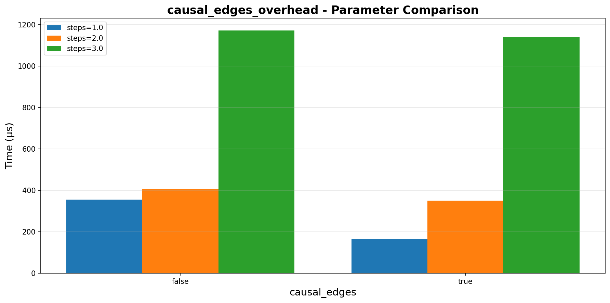

| Parameters | Avg (μs) | Stddev (μs) | CV% | Samples |
|------------|----------|-------------|-----|---------|
| causal_edges=false, steps=1 | 356.00 | 227.74 | 63.97 | 3 |
| causal_edges=true, steps=3 | 1138.06 | 29.13 | 2.56 | 3 |
| causal_edges=true, steps=2 | 349.99 | 11.16 | 3.19 | 3 |
| causal_edges=true, steps=1 | 164.16 | 1.18 | 0.72 | 3 |
| causal_edges=false, steps=3 | 1171.17 | 51.54 | 4.40 | 3 |
| causal_edges=false, steps=2 | 406.69 | 11.95 | 2.94 | 3 |

### transitive_reduction_overhead

Isolates transitive reduction overhead by comparing evolution with it enabled vs disabled

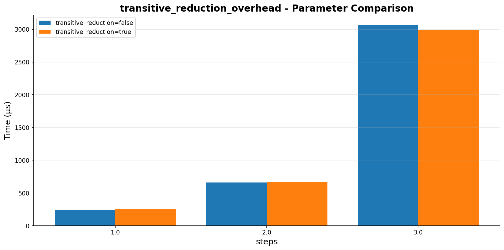

| Parameters | Avg (μs) | Stddev (μs) | CV% | Samples |
|------------|----------|-------------|-----|---------|
| steps=1, transitive_reduction=false | 243.39 | 2.05 | 0.84 | 3 |
| steps=3, transitive_reduction=true | 2988.72 | 40.86 | 1.37 | 3 |
| steps=2, transitive_reduction=true | 669.52 | 40.11 | 5.99 | 3 |
| steps=1, transitive_reduction=true | 254.74 | 13.28 | 5.21 | 3 |
| steps=3, transitive_reduction=false | 3065.27 | 53.55 | 1.75 | 3 |
| steps=2, transitive_reduction=false | 661.03 | 3.35 | 0.51 | 3 |

## Uniqueness Trees Benchmarks

### uniqueness_tree_2d_sweep

2D parameter sweep: edges vs symmetry_groups for surface plots

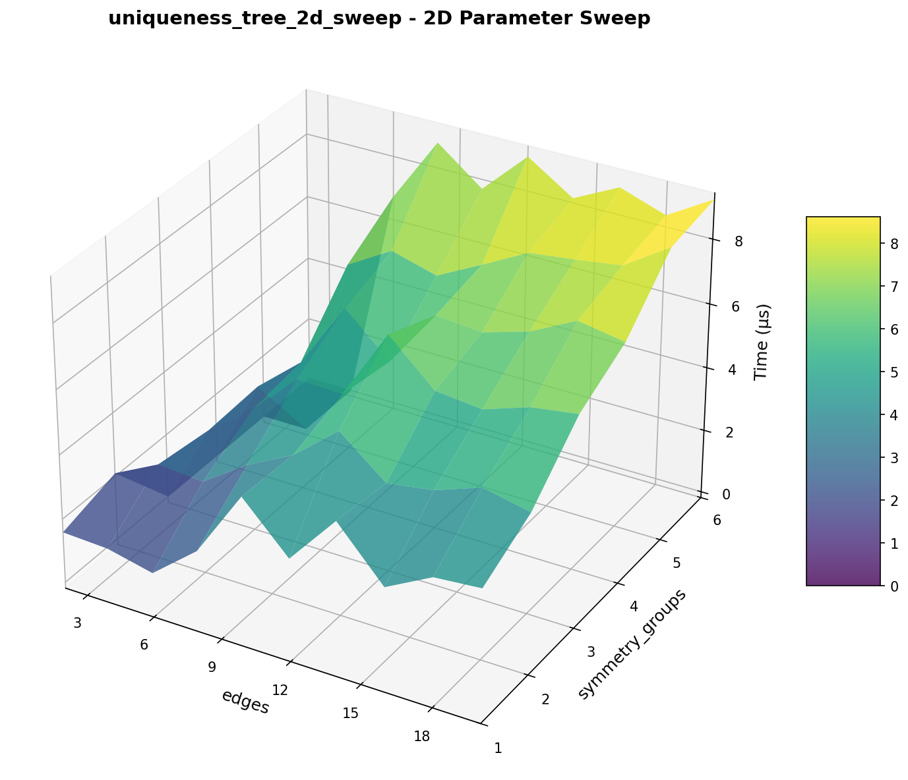

| Parameters | Avg (μs) | Stddev (μs) | CV% | Samples |
|------------|----------|-------------|-----|---------|
| edges=20, symmetry_groups=6 | 9.21 | 1.81 | 19.62 | 50 |
| edges=2, symmetry_groups=2 | 2.10 | 2.72 | 129.55 | 50 |
| edges=12, symmetry_groups=4 | 6.53 | 1.27 | 19.41 | 50 |
| edges=8, symmetry_groups=6 | 8.79 | 10.91 | 124.18 | 50 |
| edges=12, symmetry_groups=6 | 9.06 | 11.89 | 131.15 | 50 |
| edges=6, symmetry_groups=4 | 3.86 | 1.82 | 47.14 | 50 |
| edges=6, symmetry_groups=5 | 5.73 | 2.02 | 35.33 | 50 |
| edges=4, symmetry_groups=1 | 1.52 | 0.55 | 36.19 | 50 |
| edges=20, symmetry_groups=2 | 4.80 | 1.45 | 30.21 | 50 |
| edges=12, symmetry_groups=3 | 7.17 | 4.08 | 56.86 | 50 |
| edges=8, symmetry_groups=1 | 2.34 | 0.99 | 42.11 | 50 |
| edges=20, symmetry_groups=1 | 3.93 | 3.73 | 94.96 | 50 |
| edges=12, symmetry_groups=1 | 3.01 | 0.26 | 8.64 | 50 |
| edges=16, symmetry_groups=3 | 5.72 | 1.35 | 23.61 | 50 |
| edges=6, symmetry_groups=2 | 2.69 | 1.27 | 47.13 | 50 |
| edges=16, symmetry_groups=6 | 8.84 | 0.23 | 2.64 | 50 |
| edges=14, symmetry_groups=3 | 5.87 | 3.07 | 52.22 | 50 |
| edges=10, symmetry_groups=3 | 4.94 | 1.55 | 31.38 | 50 |
| edges=14, symmetry_groups=5 | 7.62 | 3.20 | 41.90 | 50 |
| edges=14, symmetry_groups=1 | 4.60 | 11.13 | 242.05 | 50 |
| edges=8, symmetry_groups=5 | 6.55 | 1.57 | 24.04 | 50 |
| edges=6, symmetry_groups=3 | 3.64 | 0.98 | 26.94 | 50 |
| edges=10, symmetry_groups=1 | 4.45 | 11.63 | 261.20 | 50 |
| edges=14, symmetry_groups=4 | 6.40 | 0.44 | 6.83 | 50 |
| edges=8, symmetry_groups=4 | 5.95 | 1.59 | 26.70 | 50 |
| edges=10, symmetry_groups=4 | 4.70 | 1.67 | 35.58 | 50 |
| edges=18, symmetry_groups=4 | 7.54 | 1.15 | 15.21 | 50 |
| edges=2, symmetry_groups=1 | 1.59 | 1.13 | 71.27 | 50 |
| edges=18, symmetry_groups=1 | 3.81 | 0.54 | 14.24 | 50 |
| edges=20, symmetry_groups=5 | 8.93 | 12.43 | 139.16 | 50 |
| edges=20, symmetry_groups=3 | 6.41 | 0.32 | 4.94 | 50 |
| edges=14, symmetry_groups=2 | 4.38 | 2.63 | 60.10 | 50 |
| edges=10, symmetry_groups=2 | 4.37 | 1.82 | 41.64 | 50 |
| edges=18, symmetry_groups=6 | 8.35 | 1.89 | 22.68 | 50 |
| edges=16, symmetry_groups=2 | 4.60 | 0.91 | 19.86 | 50 |
| edges=8, symmetry_groups=3 | 4.99 | 1.75 | 34.98 | 50 |
| edges=12, symmetry_groups=5 | 6.88 | 0.86 | 12.43 | 50 |
| edges=10, symmetry_groups=5 | 6.16 | 0.22 | 3.55 | 50 |
| edges=12, symmetry_groups=2 | 5.53 | 6.87 | 124.12 | 50 |
| edges=18, symmetry_groups=3 | 6.20 | 0.21 | 3.33 | 50 |
| edges=18, symmetry_groups=5 | 8.00 | 0.90 | 11.28 | 50 |
| edges=4, symmetry_groups=2 | 2.80 | 1.08 | 38.39 | 50 |
| edges=20, symmetry_groups=4 | 7.29 | 2.08 | 28.45 | 50 |
| edges=16, symmetry_groups=5 | 7.80 | 1.23 | 15.76 | 50 |
| edges=6, symmetry_groups=6 | 6.73 | 2.12 | 31.48 | 50 |
| edges=4, symmetry_groups=4 | 2.68 | 0.66 | 24.57 | 50 |
| edges=4, symmetry_groups=3 | 2.58 | 1.24 | 48.27 | 50 |
| edges=6, symmetry_groups=1 | 1.20 | 0.86 | 71.45 | 50 |
| edges=18, symmetry_groups=2 | 5.11 | 0.43 | 8.40 | 50 |
| edges=16, symmetry_groups=1 | 3.05 | 1.61 | 52.73 | 50 |
| edges=16, symmetry_groups=4 | 6.82 | 0.20 | 2.94 | 50 |
| edges=8, symmetry_groups=2 | 3.65 | 0.83 | 22.61 | 50 |
| edges=10, symmetry_groups=6 | 7.71 | 4.62 | 59.95 | 50 |
| edges=14, symmetry_groups=6 | 8.14 | 0.27 | 3.27 | 50 |

### uniqueness_tree_by_arity

Tests impact of hyperedge arity on performance

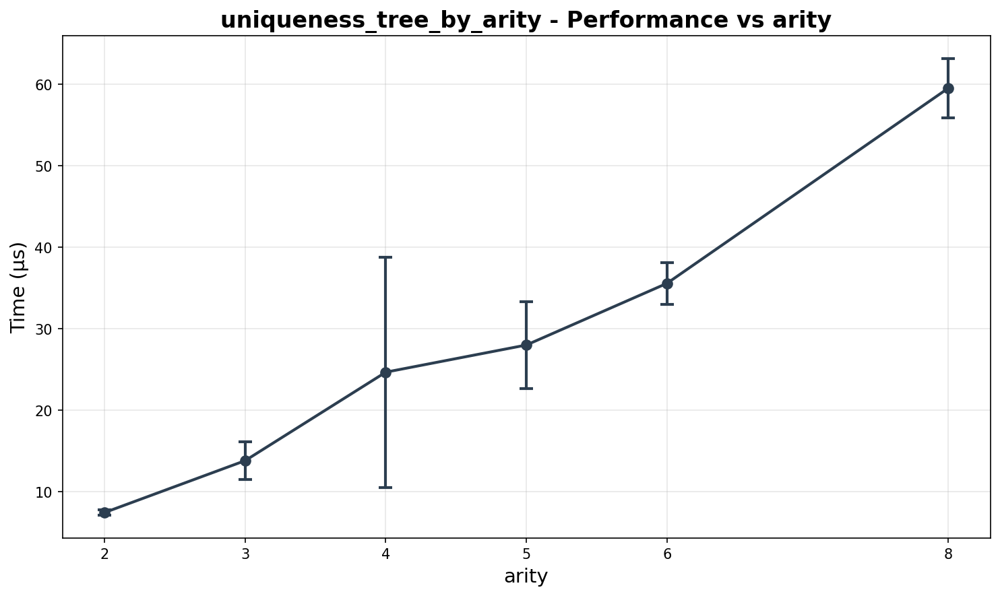

| Parameters | Avg (μs) | Stddev (μs) | CV% | Samples |
|------------|----------|-------------|-----|---------|
| arity=8 | 59.53 | 3.65 | 6.13 | 50 |
| arity=5 | 28.00 | 5.33 | 19.04 | 50 |
| arity=2 | 7.43 | 0.34 | 4.55 | 50 |
| arity=3 | 13.80 | 2.32 | 16.82 | 50 |
| arity=4 | 24.67 | 14.13 | 57.29 | 50 |
| arity=6 | 35.57 | 2.58 | 7.26 | 50 |

### uniqueness_tree_by_edge_count

Measures uniqueness tree performance as graph size increases

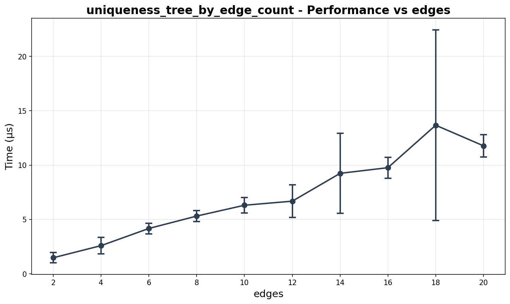

| Parameters | Avg (μs) | Stddev (μs) | CV% | Samples |
|------------|----------|-------------|-----|---------|
| edges=8 | 5.31 | 0.51 | 9.56 | 50 |
| edges=6 | 4.17 | 0.49 | 11.69 | 50 |
| edges=18 | 13.67 | 8.77 | 64.15 | 50 |
| edges=16 | 9.76 | 0.96 | 9.85 | 50 |
| edges=10 | 6.31 | 0.71 | 11.25 | 50 |
| edges=20 | 11.77 | 1.04 | 8.79 | 50 |
| edges=12 | 6.68 | 1.50 | 22.40 | 50 |
| edges=14 | 9.24 | 3.69 | 39.91 | 50 |
| edges=2 | 1.48 | 0.47 | 31.65 | 50 |
| edges=4 | 2.59 | 0.75 | 28.80 | 50 |

### uniqueness_tree_by_symmetry

Shows how graph symmetry affects uniqueness tree time

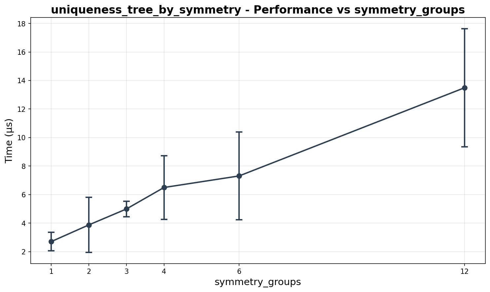

| Parameters | Avg (μs) | Stddev (μs) | CV% | Samples |
|------------|----------|-------------|-----|---------|
| symmetry_groups=4 | 6.50 | 2.24 | 34.42 | 50 |
| symmetry_groups=12 | 13.49 | 4.14 | 30.71 | 50 |
| symmetry_groups=1 | 2.70 | 0.65 | 23.94 | 50 |
| symmetry_groups=6 | 7.31 | 3.07 | 42.03 | 50 |
| symmetry_groups=2 | 3.87 | 1.93 | 49.85 | 50 |
| symmetry_groups=3 | 4.99 | 0.54 | 10.90 | 50 |

### uniqueness_tree_by_vertex_count

Measures performance as vertex count increases

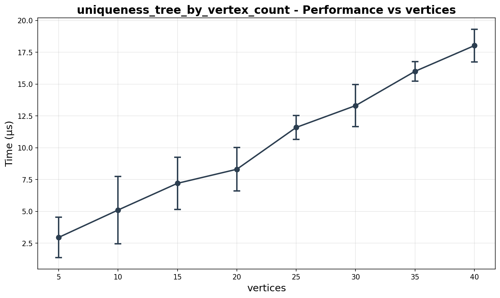

| Parameters | Avg (μs) | Stddev (μs) | CV% | Samples |
|------------|----------|-------------|-----|---------|
| vertices=35 | 16.00 | 0.76 | 4.75 | 50 |
| vertices=10 | 5.11 | 2.64 | 51.74 | 50 |
| vertices=20 | 8.31 | 1.71 | 20.54 | 50 |
| vertices=15 | 7.21 | 2.06 | 28.55 | 50 |
| vertices=30 | 13.31 | 1.65 | 12.36 | 50 |
| vertices=25 | 11.60 | 0.93 | 8.02 | 50 |
| vertices=5 | 2.96 | 1.59 | 53.69 | 50 |
| vertices=40 | 18.02 | 1.28 | 7.12 | 50 |

## Evolution Benchmarks

### evolution_2d_sweep_threads_steps

2D sweep: evolution with rule {{1,2},{2,3}} -> {{3,2},{2,1},{1,4}} on init {{1,1},{1,1}} across thread count and steps

| Parameters | Avg (μs) | Stddev (μs) | CV% | Samples |
|------------|----------|-------------|-----|---------|
| num_threads=22, steps=3 | 2740.53 | 97.21 | 3.55 | 3 |
| num_threads=23, steps=2 | 1677.29 | 122.24 | 7.29 | 3 |
| num_threads=28, steps=3 | 2791.11 | 108.48 | 3.89 | 3 |
| num_threads=20, steps=1 | 1224.19 | 107.68 | 8.80 | 3 |
| num_threads=22, steps=2 | 5010.06 | 4830.96 | 96.43 | 3 |
| num_threads=2, steps=3 | 1226.74 | 20.03 | 1.63 | 3 |
| num_threads=10, steps=1 | 753.00 | 170.37 | 22.63 | 3 |
| num_threads=25, steps=1 | 1544.91 | 79.83 | 5.17 | 3 |
| num_threads=27, steps=2 | 1801.63 | 114.58 | 6.36 | 3 |
| num_threads=19, steps=1 | 1303.98 | 126.83 | 9.73 | 3 |
| num_threads=4, steps=2 | 639.95 | 30.17 | 4.71 | 3 |
| num_threads=29, steps=2 | 1948.24 | 201.15 | 10.32 | 3 |
| num_threads=24, steps=3 | 2543.33 | 21.03 | 0.83 | 3 |
| num_threads=9, steps=4 | 9144.37 | 224.76 | 2.46 | 3 |
| num_threads=29, steps=3 | 2897.93 | 135.14 | 4.66 | 3 |
| num_threads=25, steps=3 | 2787.99 | 201.47 | 7.23 | 3 |
| num_threads=5, steps=2 | 761.08 | 44.39 | 5.83 | 3 |
| num_threads=1, steps=2 | 477.35 | 42.02 | 8.80 | 3 |
| num_threads=31, steps=2 | 2134.45 | 42.12 | 1.97 | 3 |
| num_threads=3, steps=3 | 1205.72 | 348.74 | 28.92 | 3 |
| num_threads=15, steps=2 | 1161.71 | 32.55 | 2.80 | 3 |
| num_threads=30, steps=2 | 2062.83 | 125.62 | 6.09 | 3 |
| num_threads=32, steps=3 | 3168.97 | 237.33 | 7.49 | 3 |
| num_threads=17, steps=2 | 1333.65 | 65.65 | 4.92 | 3 |
| num_threads=3, steps=1 | 410.42 | 229.81 | 56.00 | 3 |
| num_threads=18, steps=3 | 2347.56 | 173.88 | 7.41 | 3 |
| num_threads=12, steps=4 | 9321.37 | 358.35 | 3.84 | 3 |
| num_threads=27, steps=1 | 1721.97 | 138.95 | 8.07 | 3 |
| num_threads=31, steps=3 | 2954.45 | 99.74 | 3.38 | 3 |
| num_threads=13, steps=3 | 2108.55 | 57.58 | 2.73 | 3 |
| num_threads=22, steps=4 | 10270.38 | 1066.31 | 10.38 | 3 |
| num_threads=26, steps=3 | 2664.93 | 3.64 | 0.14 | 3 |
| num_threads=19, steps=4 | 9813.81 | 50.18 | 0.51 | 3 |
| num_threads=12, steps=2 | 1007.09 | 51.09 | 5.07 | 3 |
| num_threads=10, steps=2 | 967.71 | 24.45 | 2.53 | 3 |
| num_threads=11, steps=1 | 730.85 | 44.75 | 6.12 | 3 |
| num_threads=16, steps=1 | 1030.17 | 139.06 | 13.50 | 3 |
| num_threads=5, steps=3 | 1612.03 | 44.78 | 2.78 | 3 |
| num_threads=1, steps=1 | 200.05 | 10.88 | 5.44 | 3 |
| num_threads=16, steps=4 | 9505.20 | 479.40 | 5.04 | 3 |
| num_threads=24, steps=1 | 1641.83 | 250.10 | 15.23 | 3 |
| num_threads=21, steps=3 | 2434.00 | 28.53 | 1.17 | 3 |
| num_threads=14, steps=2 | 1182.03 | 105.57 | 8.93 | 3 |
| num_threads=23, steps=4 | 9459.37 | 315.20 | 3.33 | 3 |
| num_threads=9, steps=2 | 942.14 | 50.97 | 5.41 | 3 |
| num_threads=18, steps=2 | 1265.92 | 33.44 | 2.64 | 3 |
| num_threads=30, steps=3 | 3020.25 | 171.42 | 5.68 | 3 |
| num_threads=17, steps=3 | 2248.79 | 83.10 | 3.70 | 3 |
| num_threads=14, steps=1 | 920.64 | 75.54 | 8.20 | 3 |
| num_threads=22, steps=1 | 1399.91 | 96.77 | 6.91 | 3 |
| num_threads=32, steps=2 | 2199.51 | 179.00 | 8.14 | 3 |
| num_threads=28, steps=2 | 1970.79 | 142.82 | 7.25 | 3 |
| num_threads=16, steps=2 | 1361.52 | 131.60 | 9.67 | 3 |
| num_threads=12, steps=3 | 1994.19 | 101.66 | 5.10 | 3 |
| num_threads=8, steps=1 | 497.09 | 52.89 | 10.64 | 3 |
| num_threads=10, steps=4 | 9345.54 | 76.53 | 0.82 | 3 |
| num_threads=14, steps=3 | 2111.46 | 80.74 | 3.82 | 3 |
| num_threads=30, steps=4 | 9967.99 | 198.02 | 1.99 | 3 |
| num_threads=15, steps=3 | 2037.81 | 129.98 | 6.38 | 3 |
| num_threads=8, steps=4 | 9315.41 | 140.72 | 1.51 | 3 |
| num_threads=18, steps=4 | 10157.78 | 633.00 | 6.23 | 3 |
| num_threads=7, steps=1 | 455.84 | 50.84 | 11.15 | 3 |
| num_threads=5, steps=4 | 9793.31 | 392.75 | 4.01 | 3 |
| num_threads=1, steps=4 | 27577.47 | 124.80 | 0.45 | 3 |
| num_threads=7, steps=2 | 765.94 | 15.52 | 2.03 | 3 |
| num_threads=14, steps=4 | 10017.46 | 649.64 | 6.49 | 3 |
| num_threads=26, steps=4 | 11090.23 | 118.44 | 1.07 | 3 |
| num_threads=32, steps=4 | 11782.20 | 194.08 | 1.65 | 3 |
| num_threads=28, steps=1 | 1716.60 | 123.56 | 7.20 | 3 |
| num_threads=23, steps=3 | 2441.74 | 36.44 | 1.49 | 3 |
| num_threads=19, steps=2 | 1508.12 | 30.42 | 2.02 | 3 |
| num_threads=13, steps=2 | 1087.73 | 67.51 | 6.21 | 3 |
| num_threads=29, steps=1 | 1734.03 | 59.00 | 3.40 | 3 |
| num_threads=26, steps=2 | 1962.04 | 181.30 | 9.24 | 3 |
| num_threads=28, steps=4 | 9996.54 | 125.73 | 1.26 | 3 |
| num_threads=29, steps=4 | 10398.04 | 127.61 | 1.23 | 3 |
| num_threads=9, steps=1 | 605.58 | 9.09 | 1.50 | 3 |
| num_threads=10, steps=3 | 1905.54 | 57.79 | 3.03 | 3 |
| num_threads=4, steps=1 | 292.61 | 32.59 | 11.14 | 3 |
| num_threads=6, steps=1 | 482.26 | 151.07 | 31.33 | 3 |
| num_threads=7, steps=3 | 1725.68 | 114.85 | 6.66 | 3 |
| num_threads=4, steps=4 | 10155.41 | 249.69 | 2.46 | 3 |
| num_threads=3, steps=2 | 551.73 | 138.11 | 25.03 | 3 |
| num_threads=2, steps=2 | 366.72 | 33.17 | 9.05 | 3 |
| num_threads=5, steps=1 | 366.32 | 19.29 | 5.27 | 3 |
| num_threads=9, steps=3 | 2050.46 | 267.02 | 13.02 | 3 |
| num_threads=21, steps=4 | 9673.68 | 407.96 | 4.22 | 3 |
| num_threads=3, steps=4 | 12035.80 | 408.77 | 3.40 | 3 |
| num_threads=13, steps=1 | 818.05 | 67.56 | 8.26 | 3 |
| num_threads=11, steps=4 | 9245.68 | 90.30 | 0.98 | 3 |
| num_threads=2, steps=4 | 14901.64 | 429.30 | 2.88 | 3 |
| num_threads=15, steps=4 | 9161.13 | 197.89 | 2.16 | 3 |
| num_threads=8, steps=2 | 900.99 | 103.42 | 11.48 | 3 |
| num_threads=25, steps=2 | 1801.24 | 174.48 | 9.69 | 3 |
| num_threads=20, steps=2 | 1520.81 | 42.65 | 2.80 | 3 |
| num_threads=20, steps=4 | 10536.06 | 653.65 | 6.20 | 3 |
| num_threads=21, steps=1 | 1271.07 | 120.28 | 9.46 | 3 |
| num_threads=20, steps=3 | 2396.21 | 176.93 | 7.38 | 3 |
| num_threads=6, steps=3 | 1654.18 | 24.98 | 1.51 | 3 |
| num_threads=8, steps=3 | 1748.88 | 53.56 | 3.06 | 3 |
| num_threads=4, steps=3 | 1602.18 | 26.88 | 1.68 | 3 |
| num_threads=7, steps=4 | 9170.14 | 353.97 | 3.86 | 3 |
| num_threads=26, steps=1 | 1776.98 | 82.75 | 4.66 | 3 |
| num_threads=12, steps=1 | 839.37 | 66.01 | 7.86 | 3 |
| num_threads=18, steps=1 | 1211.66 | 106.91 | 8.82 | 3 |
| num_threads=23, steps=1 | 1357.90 | 66.02 | 4.86 | 3 |
| num_threads=19, steps=3 | 2729.45 | 188.96 | 6.92 | 3 |
| num_threads=6, steps=4 | 9483.72 | 348.87 | 3.68 | 3 |
| num_threads=24, steps=2 | 1746.63 | 40.78 | 2.33 | 3 |
| num_threads=27, steps=4 | 10092.16 | 261.34 | 2.59 | 3 |
| num_threads=25, steps=4 | 10385.47 | 32.99 | 0.32 | 3 |
| num_threads=13, steps=4 | 9616.14 | 432.62 | 4.50 | 3 |
| num_threads=17, steps=1 | 1184.41 | 165.69 | 13.99 | 3 |
| num_threads=11, steps=3 | 1993.11 | 98.98 | 4.97 | 3 |
| num_threads=6, steps=2 | 839.07 | 141.00 | 16.80 | 3 |
| num_threads=2, steps=1 | 284.26 | 51.66 | 18.17 | 3 |
| num_threads=11, steps=2 | 1210.69 | 133.74 | 11.05 | 3 |
| num_threads=31, steps=1 | 1858.21 | 96.40 | 5.19 | 3 |
| num_threads=32, steps=1 | 1949.60 | 81.90 | 4.20 | 3 |
| num_threads=31, steps=4 | 11260.74 | 268.47 | 2.38 | 3 |
| num_threads=1, steps=3 | 2243.98 | 113.34 | 5.05 | 3 |
| num_threads=30, steps=1 | 1819.74 | 69.39 | 3.81 | 3 |
| num_threads=16, steps=3 | 2118.23 | 35.22 | 1.66 | 3 |
| num_threads=21, steps=2 | 1686.01 | 226.91 | 13.46 | 3 |
| num_threads=15, steps=1 | 925.31 | 45.70 | 4.94 | 3 |
| num_threads=24, steps=4 | 9367.43 | 242.36 | 2.59 | 3 |
| num_threads=17, steps=4 | 9367.57 | 116.74 | 1.25 | 3 |
| num_threads=27, steps=3 | 2670.09 | 103.59 | 3.88 | 3 |

### evolution_multi_rule_by_rule_count

Tests evolution performance with increasing rule complexity (1-3 rules with mixed arities)

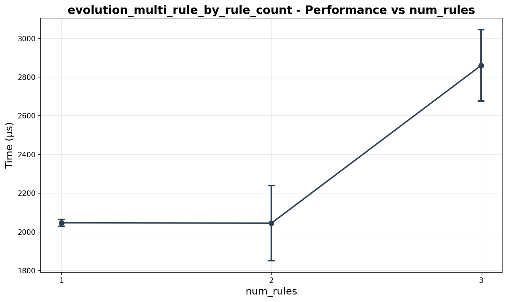

| Parameters | Avg (μs) | Stddev (μs) | CV% | Samples |
|------------|----------|-------------|-----|---------|
| num_rules=3 | 2860.75 | 183.95 | 6.43 | 3 |
| num_rules=2 | 2045.23 | 194.48 | 9.51 | 3 |
| num_rules=1 | 2047.39 | 17.33 | 0.85 | 3 |

### evolution_thread_scaling

Evaluates parallel speedup from 1 thread up to full hardware concurrency (3-step evolution)

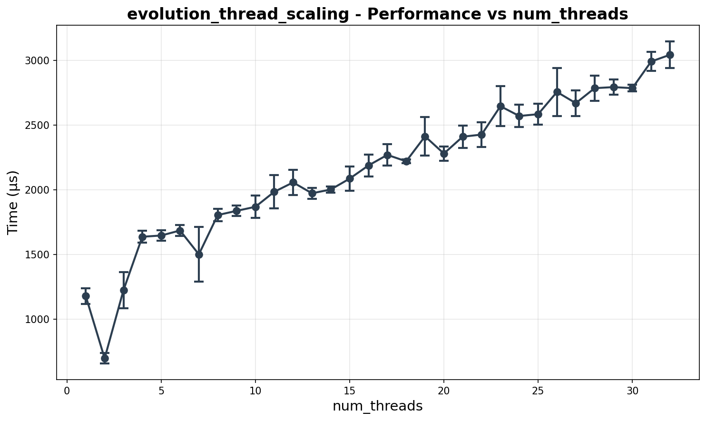

| Parameters | Avg (μs) | Stddev (μs) | CV% | Samples |
|------------|----------|-------------|-----|---------|
| num_threads=32 | 3042.93 | 101.95 | 3.35 | 3 |
| num_threads=1 | 1179.67 | 60.01 | 5.09 | 3 |
| num_threads=25 | 2584.02 | 81.48 | 3.15 | 3 |
| num_threads=24 | 2570.23 | 86.71 | 3.37 | 3 |
| num_threads=28 | 2785.09 | 96.42 | 3.46 | 3 |
| num_threads=13 | 1973.53 | 41.91 | 2.12 | 3 |
| num_threads=7 | 1501.99 | 211.70 | 14.09 | 3 |
| num_threads=16 | 2188.36 | 85.28 | 3.90 | 3 |
| num_threads=12 | 2057.39 | 98.17 | 4.77 | 3 |
| num_threads=30 | 2785.22 | 24.91 | 0.89 | 3 |
| num_threads=14 | 2002.75 | 23.82 | 1.19 | 3 |
| num_threads=9 | 1837.87 | 39.75 | 2.16 | 3 |
| num_threads=21 | 2410.38 | 87.51 | 3.63 | 3 |
| num_threads=8 | 1805.39 | 46.54 | 2.58 | 3 |
| num_threads=5 | 1647.50 | 39.16 | 2.38 | 3 |
| num_threads=18 | 2220.34 | 14.42 | 0.65 | 3 |
| num_threads=20 | 2280.22 | 55.38 | 2.43 | 3 |
| num_threads=19 | 2413.08 | 148.22 | 6.14 | 3 |
| num_threads=2 | 699.09 | 40.07 | 5.73 | 3 |
| num_threads=6 | 1686.30 | 41.42 | 2.46 | 3 |
| num_threads=23 | 2645.74 | 153.46 | 5.80 | 3 |
| num_threads=4 | 1637.97 | 46.09 | 2.81 | 3 |
| num_threads=26 | 2755.71 | 186.00 | 6.75 | 3 |
| num_threads=29 | 2793.14 | 59.88 | 2.14 | 3 |
| num_threads=22 | 2426.68 | 96.03 | 3.96 | 3 |
| num_threads=17 | 2269.94 | 82.09 | 3.62 | 3 |
| num_threads=15 | 2086.67 | 92.57 | 4.44 | 3 |
| num_threads=31 | 2990.97 | 73.23 | 2.45 | 3 |
| num_threads=11 | 1984.88 | 127.67 | 6.43 | 3 |
| num_threads=3 | 1225.48 | 140.61 | 11.47 | 3 |
| num_threads=27 | 2669.12 | 98.58 | 3.69 | 3 |
| num_threads=10 | 1869.15 | 85.64 | 4.58 | 3 |

### evolution_with_self_loops

Tests evolution performance on hypergraphs containing self-loop edges

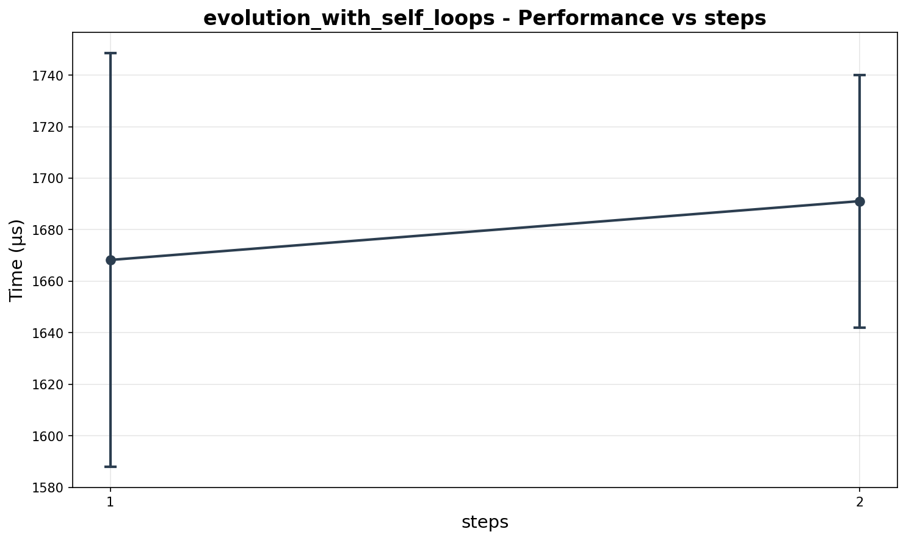

| Parameters | Avg (μs) | Stddev (μs) | CV% | Samples |
|------------|----------|-------------|-----|---------|
| steps=1 | 1668.24 | 80.32 | 4.81 | 3 |
| steps=2 | 1691.08 | 49.04 | 2.90 | 3 |

## Job System Benchmarks

### job_system_2d_sweep

2D parameter sweep of job system across thread count and batch size for parallel scalability analysis

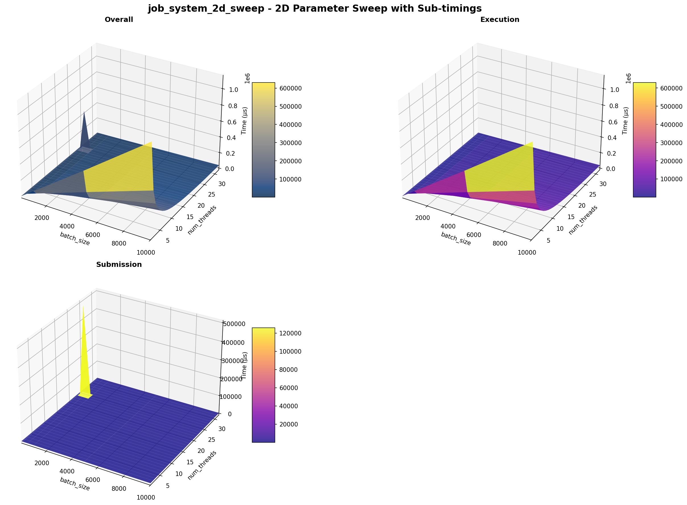

| Parameters | Overall (μs) | Stddev (μs) | CV% | Samples | Execution (μs) | Submission (μs) |
|------------|--------------|-------------|-----|---------|-----------------|-----------------|
| batch_size=10, num_threads=18 | 234.59 | 47.44 | 20.22 | 3 | 125.11 | 107.83 |
| batch_size=5000, num_threads=18 | 30928.59 | 39.31 | 0.13 | 3 | 30521.23 | 405.23 |
| batch_size=100, num_threads=25 | 642.06 | 14.16 | 2.21 | 3 | 413.86 | 227.21 |
| batch_size=100, num_threads=9 | 1360.28 | 35.02 | 2.57 | 3 | 1291.74 | 67.50 |
| batch_size=10, num_threads=29 | 203.20 | 5.68 | 2.79 | 3 | 133.64 | 68.85 |
| batch_size=1000, num_threads=18 | 6290.27 | 25.24 | 0.40 | 3 | 6095.64 | 193.18 |
| batch_size=1000, num_threads=14 | 8017.21 | 12.47 | 0.16 | 3 | 7862.81 | 152.91 |
| batch_size=500, num_threads=13 | 4439.30 | 63.56 | 1.43 | 3 | 4321.24 | 116.69 |
| batch_size=10, num_threads=16 | 191.32 | 10.75 | 5.62 | 3 | 122.40 | 67.83 |
| batch_size=1000, num_threads=20 | 5726.14 | 19.35 | 0.34 | 3 | 5515.12 | 209.45 |
| batch_size=5000, num_threads=11 | 50806.85 | 120.19 | 0.24 | 3 | 50486.00 | 318.89 |
| batch_size=10000, num_threads=15 | 73915.76 | 96.12 | 0.13 | 3 | 73325.80 | 588.00 |
| batch_size=1000, num_threads=12 | 9605.49 | 83.70 | 0.87 | 3 | 9448.24 | 155.26 |
| batch_size=100, num_threads=23 | 694.56 | 39.45 | 5.68 | 3 | 495.84 | 197.60 |
| batch_size=1000, num_threads=25 | 4667.71 | 55.24 | 1.18 | 3 | 4364.17 | 302.15 |
| batch_size=500, num_threads=15 | 3882.93 | 12.97 | 0.33 | 3 | 3747.60 | 133.80 |
| batch_size=1000, num_threads=22 | 5266.50 | 51.67 | 0.98 | 3 | 5028.68 | 236.21 |
| batch_size=100, num_threads=15 | 873.25 | 18.27 | 2.09 | 3 | 766.86 | 105.38 |
| batch_size=5000, num_threads=10 | 55622.72 | 156.71 | 0.28 | 3 | 55315.42 | 305.47 |
| batch_size=1000, num_threads=8 | 14025.70 | 81.41 | 0.58 | 3 | 13912.47 | 111.41 |
| batch_size=10, num_threads=20 | 194.39 | 11.33 | 5.83 | 3 | 127.23 | 66.23 |
| batch_size=500, num_threads=10 | 5709.98 | 75.18 | 1.32 | 3 | 5611.64 | 96.61 |
| batch_size=10000, num_threads=11 | 101617.58 | 675.50 | 0.66 | 3 | 101032.74 | 582.84 |
| batch_size=10000, num_threads=22 | 50803.60 | 48.37 | 0.10 | 3 | 50082.78 | 718.72 |
| batch_size=10, num_threads=17 | 185.83 | 5.67 | 3.05 | 3 | 117.13 | 67.58 |
| batch_size=500, num_threads=21 | 2808.78 | 7.80 | 0.28 | 3 | 2615.99 | 191.37 |
| batch_size=1000, num_threads=28 | 4284.29 | 12.29 | 0.29 | 3 | 3943.91 | 339.05 |
| batch_size=50, num_threads=23 | 398.19 | 11.14 | 2.80 | 3 | 210.49 | 186.72 |
| batch_size=500, num_threads=29 | 2222.08 | 45.98 | 2.07 | 3 | 1837.83 | 382.73 |
| batch_size=10000, num_threads=30 | 38792.64 | 115.71 | 0.30 | 3 | 37917.38 | 872.91 |
| batch_size=100, num_threads=13 | 968.72 | 12.01 | 1.24 | 3 | 871.98 | 95.62 |
| batch_size=1000, num_threads=13 | 8654.70 | 63.97 | 0.74 | 3 | 8503.71 | 149.27 |
| batch_size=5000, num_threads=19 | 29569.51 | 91.01 | 0.31 | 3 | 29144.66 | 422.44 |
| batch_size=10000, num_threads=4 | 276731.45 | 2820.07 | 1.02 | 3 | 276269.64 | 459.59 |
| batch_size=10, num_threads=24 | 205.90 | 25.75 | 12.51 | 3 | 139.63 | 65.30 |
| batch_size=100, num_threads=6 | 1954.58 | 44.24 | 2.26 | 3 | 1902.78 | 50.57 |
| batch_size=50, num_threads=27 | 390.71 | 1.70 | 0.43 | 3 | 179.50 | 210.27 |
| batch_size=500, num_threads=23 | 2582.48 | 25.90 | 1.00 | 3 | 2358.27 | 223.13 |
| batch_size=10000, num_threads=28 | 41399.98 | 460.04 | 1.11 | 3 | 40526.55 | 871.16 |
| batch_size=1000, num_threads=23 | 5003.99 | 21.38 | 0.43 | 3 | 4688.17 | 314.25 |
| batch_size=10000, num_threads=3 | 362547.10 | 228.51 | 0.06 | 3 | 362103.88 | 441.15 |
| batch_size=50, num_threads=4 | 1420.20 | 16.89 | 1.19 | 3 | 1390.09 | 29.12 |
| batch_size=1000, num_threads=6 | 18686.22 | 110.67 | 0.59 | 3 | 18592.33 | 91.95 |
| batch_size=10, num_threads=21 | 195.46 | 11.41 | 5.84 | 3 | 126.64 | 67.63 |
| batch_size=50, num_threads=7 | 907.50 | 4.63 | 0.51 | 3 | 856.95 | 49.59 |
| batch_size=1000, num_threads=9 | 12396.52 | 23.37 | 0.19 | 3 | 12280.63 | 114.00 |
| batch_size=5000, num_threads=31 | 18959.36 | 32.25 | 0.17 | 3 | 18345.20 | 611.82 |
| batch_size=10000, num_threads=27 | 42494.62 | 124.24 | 0.29 | 3 | 41697.10 | 795.61 |
| batch_size=50, num_threads=8 | 784.60 | 14.63 | 1.86 | 3 | 728.62 | 55.18 |
| batch_size=5000, num_threads=32 | 18406.91 | 80.21 | 0.44 | 3 | 17705.71 | 699.07 |
| batch_size=10, num_threads=14 | 192.02 | 6.15 | 3.20 | 3 | 123.50 | 67.58 |
| batch_size=50, num_threads=2 | 2867.66 | 7.09 | 0.25 | 3 | 2847.96 | 18.60 |
| batch_size=500, num_threads=25 | 2442.71 | 57.81 | 2.37 | 3 | 2185.39 | 255.78 |
| batch_size=10000, num_threads=12 | 93776.46 | 154.96 | 0.17 | 3 | 93151.39 | 623.01 |
| batch_size=10, num_threads=1 | 1181.52 | 50.08 | 4.24 | 3 | 1172.67 | 7.94 |
| batch_size=500, num_threads=2 | 27727.86 | 57.60 | 0.21 | 3 | 27685.12 | 40.42 |
| batch_size=500, num_threads=32 | 2244.48 | 189.64 | 8.45 | 3 | 1723.56 | 519.51 |
| batch_size=10, num_threads=8 | 256.63 | 1.31 | 0.51 | 3 | 200.94 | 54.69 |
| batch_size=50, num_threads=15 | 507.97 | 23.72 | 4.67 | 3 | 404.75 | 102.28 |
| batch_size=500, num_threads=17 | 3503.62 | 113.50 | 3.24 | 3 | 3355.54 | 146.43 |
| batch_size=1000, num_threads=3 | 36539.73 | 38.68 | 0.11 | 3 | 36467.39 | 70.37 |
| batch_size=10000, num_threads=16 | 69339.44 | 168.03 | 0.24 | 3 | 68711.79 | 625.62 |
| batch_size=100, num_threads=20 | 720.43 | 18.57 | 2.58 | 3 | 545.36 | 174.05 |
| batch_size=1000, num_threads=31 | 3934.53 | 28.33 | 0.72 | 3 | 3553.00 | 380.35 |
| batch_size=10, num_threads=11 | 192.40 | 4.06 | 2.11 | 3 | 124.82 | 66.65 |
| batch_size=50, num_threads=32 | 442.97 | 8.13 | 1.84 | 3 | 187.92 | 253.91 |
| batch_size=500, num_threads=22 | 2693.33 | 14.65 | 0.54 | 3 | 2494.57 | 197.54 |
| batch_size=10, num_threads=9 | 253.04 | 5.49 | 2.17 | 3 | 193.33 | 58.76 |
| batch_size=10000, num_threads=29 | 39813.00 | 177.41 | 0.45 | 3 | 38917.75 | 893.02 |
| batch_size=5000, num_threads=27 | 21200.29 | 231.20 | 1.09 | 3 | 20551.33 | 646.86 |
| batch_size=5000, num_threads=30 | 19454.63 | 105.27 | 0.54 | 3 | 18876.01 | 576.39 |
| batch_size=5000, num_threads=23 | 24379.55 | 39.41 | 0.16 | 3 | 23938.72 | 438.83 |
| batch_size=1000, num_threads=30 | 4095.45 | 28.26 | 0.69 | 3 | 3726.25 | 367.70 |
| batch_size=1000, num_threads=1 | 112268.96 | 308.63 | 0.27 | 3 | 112199.74 | 66.53 |
| batch_size=50, num_threads=26 | 410.25 | 5.49 | 1.34 | 3 | 184.54 | 224.89 |
| batch_size=10000, num_threads=19 | 58515.69 | 197.81 | 0.34 | 3 | 57921.99 | 591.71 |
| batch_size=50, num_threads=21 | 408.75 | 13.40 | 3.28 | 3 | 242.06 | 165.72 |
| batch_size=1000, num_threads=5 | 22446.88 | 97.12 | 0.43 | 3 | 22351.27 | 93.53 |
| batch_size=5000, num_threads=6 | 92919.59 | 269.33 | 0.29 | 3 | 92647.55 | 269.94 |
| batch_size=100, num_threads=22 | 665.52 | 5.31 | 0.80 | 3 | 476.22 | 188.26 |
| batch_size=5000, num_threads=15 | 36940.38 | 78.69 | 0.21 | 3 | 36584.90 | 353.47 |
| batch_size=10, num_threads=25 | 230.93 | 36.90 | 15.98 | 3 | 123.03 | 106.36 |
| batch_size=100, num_threads=14 | 933.87 | 14.97 | 1.60 | 3 | 833.34 | 99.61 |
| batch_size=500, num_threads=8 | 7113.52 | 53.67 | 0.75 | 3 | 7031.24 | 80.65 |
| batch_size=100, num_threads=11 | 1140.65 | 10.47 | 0.92 | 3 | 1060.19 | 79.34 |
| batch_size=1000, num_threads=2 | 55279.62 | 553.01 | 1.00 | 3 | 55212.30 | 65.21 |
| batch_size=50, num_threads=9 | 705.01 | 4.21 | 0.60 | 3 | 641.62 | 62.66 |
| batch_size=10000, num_threads=31 | 37596.12 | 378.13 | 1.01 | 3 | 36690.88 | 903.27 |
| batch_size=500, num_threads=16 | 3591.94 | 37.44 | 1.04 | 3 | 3456.93 | 133.79 |
| batch_size=10000, num_threads=14 | 79414.74 | 283.36 | 0.36 | 3 | 78807.19 | 605.46 |
| batch_size=1000, num_threads=10 | 11208.89 | 39.66 | 0.35 | 3 | 11068.69 | 138.35 |
| batch_size=100, num_threads=5 | 2338.12 | 9.53 | 0.41 | 3 | 2297.93 | 38.97 |
| batch_size=500, num_threads=18 | 3262.38 | 70.50 | 2.16 | 3 | 3039.36 | 221.67 |
| batch_size=10000, num_threads=6 | 185648.50 | 337.94 | 0.18 | 3 | 185167.23 | 479.29 |
| batch_size=5000, num_threads=22 | 25464.07 | 117.00 | 0.46 | 3 | 25006.10 | 456.01 |
| batch_size=10000, num_threads=13 | 85746.26 | 186.94 | 0.22 | 3 | 85157.10 | 587.11 |
| batch_size=50, num_threads=12 | 615.12 | 16.24 | 2.64 | 3 | 528.52 | 85.55 |
| batch_size=1000, num_threads=16 | 7020.61 | 28.84 | 0.41 | 3 | 6856.28 | 162.87 |
| batch_size=5000, num_threads=12 | 46979.28 | 114.68 | 0.24 | 3 | 46629.73 | 347.52 |
| batch_size=10000, num_threads=20 | 56176.97 | 197.03 | 0.35 | 3 | 55527.37 | 647.51 |
| batch_size=100, num_threads=29 | 609.38 | 15.53 | 2.55 | 3 | 336.38 | 271.89 |
| batch_size=5000, num_threads=3 | 181307.69 | 287.45 | 0.16 | 3 | 181068.72 | 237.08 |
| batch_size=10000, num_threads=24 | 46823.69 | 182.38 | 0.39 | 3 | 45917.71 | 903.79 |
| batch_size=10, num_threads=27 | 189.95 | 0.65 | 0.34 | 3 | 121.37 | 67.42 |
| batch_size=10, num_threads=3 | 437.14 | 8.86 | 2.03 | 3 | 416.71 | 19.52 |
| batch_size=10000, num_threads=17 | 65489.64 | 239.52 | 0.37 | 3 | 64835.36 | 651.92 |
| batch_size=1000, num_threads=29 | 4155.18 | 32.18 | 0.77 | 3 | 3830.35 | 323.47 |
| batch_size=500, num_threads=19 | 3065.48 | 14.86 | 0.48 | 3 | 2871.21 | 192.72 |
| batch_size=10000, num_threads=7 | 159652.52 | 347.49 | 0.22 | 3 | 159140.69 | 509.71 |
| batch_size=10, num_threads=15 | 225.86 | 30.97 | 13.71 | 3 | 158.84 | 66.16 |
| batch_size=100, num_threads=4 | 2777.36 | 15.80 | 0.57 | 3 | 2744.06 | 32.12 |
| batch_size=50, num_threads=31 | 439.55 | 40.79 | 9.28 | 3 | 205.60 | 233.01 |
| batch_size=1000, num_threads=11 | 10154.90 | 41.11 | 0.40 | 3 | 10019.98 | 133.31 |
| batch_size=100, num_threads=32 | 636.03 | 15.57 | 2.45 | 3 | 273.50 | 361.23 |
| batch_size=5000, num_threads=7 | 79613.23 | 61.43 | 0.08 | 3 | 79331.05 | 280.25 |
| batch_size=10, num_threads=6 | 262.17 | 7.44 | 2.84 | 3 | 220.19 | 41.02 |
| batch_size=100, num_threads=24 | 648.66 | 2.31 | 0.36 | 3 | 447.26 | 200.38 |
| batch_size=5000, num_threads=5 | 111845.06 | 762.08 | 0.68 | 3 | 111581.17 | 261.78 |
| batch_size=50, num_threads=19 | 419.93 | 24.47 | 5.83 | 3 | 286.21 | 132.92 |
| batch_size=10, num_threads=13 | 185.39 | 4.39 | 2.37 | 3 | 119.03 | 65.24 |
| batch_size=50, num_threads=22 | 401.08 | 6.23 | 1.55 | 3 | 221.43 | 178.80 |
| batch_size=50, num_threads=24 | 403.52 | 11.49 | 2.85 | 3 | 193.04 | 209.53 |
| batch_size=50, num_threads=10 | 643.34 | 10.06 | 1.56 | 3 | 574.52 | 68.01 |
| batch_size=500, num_threads=7 | 8064.20 | 49.28 | 0.61 | 3 | 7986.09 | 76.54 |
| batch_size=100, num_threads=30 | 675.49 | 60.95 | 9.02 | 3 | 325.75 | 348.24 |
| batch_size=10, num_threads=4 | 351.40 | 6.18 | 1.76 | 3 | 318.90 | 31.61 |
| batch_size=10, num_threads=22 | 195.53 | 6.64 | 3.40 | 3 | 125.62 | 68.71 |
| batch_size=10, num_threads=26 | 194.44 | 12.89 | 6.63 | 3 | 125.07 | 68.23 |
| batch_size=1000, num_threads=7 | 16074.35 | 172.30 | 1.07 | 3 | 15970.16 | 102.31 |
| batch_size=100, num_threads=26 | 627.17 | 7.66 | 1.22 | 3 | 375.13 | 251.05 |
| batch_size=10, num_threads=19 | 189.24 | 10.05 | 5.31 | 3 | 120.74 | 67.29 |
| batch_size=10000, num_threads=26 | 43495.51 | 135.25 | 0.31 | 3 | 42616.77 | 876.64 |
| batch_size=10, num_threads=2 | 576.46 | 20.04 | 3.48 | 3 | 560.61 | 14.74 |
| batch_size=10000, num_threads=23 | 48474.63 | 29.68 | 0.06 | 3 | 47662.61 | 809.86 |
| batch_size=1000, num_threads=17 | 6648.05 | 31.26 | 0.47 | 3 | 6452.25 | 194.43 |
| batch_size=100, num_threads=19 | 696.99 | 4.56 | 0.65 | 3 | 550.00 | 146.20 |
| batch_size=1000, num_threads=15 | 7513.91 | 48.07 | 0.64 | 3 | 7337.73 | 174.53 |
| batch_size=5000, num_threads=24 | 23497.44 | 142.78 | 0.61 | 3 | 22986.93 | 508.40 |
| batch_size=5000, num_threads=1 | 562036.70 | 4819.26 | 0.86 | 3 | 561814.61 | 219.53 |
| batch_size=5000, num_threads=9 | 61902.01 | 97.60 | 0.16 | 3 | 61570.45 | 329.67 |
| batch_size=500, num_threads=28 | 2303.06 | 19.73 | 0.86 | 3 | 1982.13 | 319.39 |
| batch_size=10000, num_threads=8 | 139403.42 | 135.51 | 0.10 | 3 | 138892.82 | 508.57 |
| batch_size=500, num_threads=9 | 6303.81 | 59.77 | 0.95 | 3 | 6209.80 | 92.65 |
| batch_size=5000, num_threads=26 | 21821.57 | 219.27 | 1.00 | 3 | 21268.80 | 550.80 |
| batch_size=10, num_threads=28 | 212.47 | 36.56 | 17.21 | 3 | 140.71 | 70.48 |
| batch_size=50, num_threads=6 | 1025.31 | 6.25 | 0.61 | 3 | 980.40 | 43.88 |
| batch_size=10000, num_threads=2 | 546521.61 | 2415.70 | 0.44 | 3 | 546061.61 | 457.64 |
| batch_size=500, num_threads=4 | 13713.84 | 125.66 | 0.92 | 3 | 13657.10 | 54.92 |
| batch_size=10000, num_threads=21 | 53075.89 | 211.34 | 0.40 | 3 | 52423.49 | 650.20 |
| batch_size=5000, num_threads=17 | 32720.64 | 4.30 | 0.01 | 3 | 32303.13 | 415.16 |
| batch_size=500, num_threads=11 | 5139.87 | 13.85 | 0.27 | 3 | 5034.71 | 103.84 |
| batch_size=1000, num_threads=26 | 4492.48 | 36.04 | 0.80 | 3 | 4191.13 | 299.86 |
| batch_size=100, num_threads=12 | 1119.49 | 25.90 | 2.31 | 3 | 1029.44 | 88.91 |
| batch_size=10, num_threads=30 | 196.26 | 7.49 | 3.82 | 3 | 126.24 | 68.80 |
| batch_size=50, num_threads=30 | 445.90 | 10.65 | 2.39 | 3 | 207.44 | 237.61 |
| batch_size=50, num_threads=17 | 457.55 | 2.77 | 0.61 | 3 | 336.37 | 120.23 |
| batch_size=500, num_threads=20 | 2921.34 | 34.25 | 1.17 | 3 | 2741.91 | 178.33 |
| batch_size=10, num_threads=32 | 232.09 | 38.58 | 16.62 | 3 | 161.78 | 69.16 |
| batch_size=10, num_threads=7 | 252.89 | 9.06 | 3.58 | 3 | 204.69 | 47.15 |
| batch_size=100, num_threads=17 | 769.35 | 19.12 | 2.49 | 3 | 650.52 | 117.78 |
| batch_size=1000, num_threads=27 | 4357.18 | 6.30 | 0.14 | 3 | 4056.12 | 299.55 |
| batch_size=500, num_threads=31 | 2133.12 | 61.33 | 2.88 | 3 | 1737.57 | 394.21 |
| batch_size=100, num_threads=16 | 813.03 | 8.10 | 1.00 | 3 | 700.23 | 111.87 |
| batch_size=500, num_threads=30 | 2123.91 | 27.31 | 1.29 | 3 | 1816.12 | 306.63 |
| batch_size=10000, num_threads=25 | 44708.03 | 45.86 | 0.10 | 3 | 43931.96 | 774.03 |
| batch_size=100, num_threads=28 | 597.46 | 17.00 | 2.84 | 3 | 338.44 | 258.04 |
| batch_size=500, num_threads=12 | 5009.61 | 73.70 | 1.47 | 3 | 4753.95 | 253.48 |
| batch_size=10000, num_threads=18 | 61747.61 | 57.99 | 0.09 | 3 | 61058.65 | 686.71 |
| batch_size=1000, num_threads=21 | 5488.70 | 97.44 | 1.78 | 3 | 5222.53 | 264.48 |
| batch_size=1000, num_threads=24 | 4853.43 | 65.48 | 1.35 | 3 | 4601.29 | 250.59 |
| batch_size=5000, num_threads=16 | 34958.29 | 49.07 | 0.14 | 3 | 34529.43 | 426.47 |
| batch_size=100, num_threads=2 | 5608.20 | 25.50 | 0.45 | 3 | 5581.28 | 25.45 |
| batch_size=1000, num_threads=32 | 3930.62 | 64.35 | 1.64 | 3 | 3509.51 | 419.65 |
| batch_size=5000, num_threads=29 | 20029.63 | 67.32 | 0.34 | 3 | 19473.60 | 554.00 |
| batch_size=10, num_threads=5 | 270.42 | 4.52 | 1.67 | 3 | 236.88 | 32.68 |
| batch_size=500, num_threads=6 | 9358.09 | 17.21 | 0.18 | 3 | 9285.58 | 71.09 |
| batch_size=50, num_threads=5 | 1171.83 | 3.64 | 0.31 | 3 | 1135.58 | 35.30 |
| batch_size=50, num_threads=16 | 468.61 | 8.98 | 1.92 | 3 | 353.86 | 113.69 |
| batch_size=1000, num_threads=4 | 27501.54 | 19.79 | 0.07 | 3 | 27412.59 | 86.95 |
| batch_size=10000, num_threads=32 | 36674.26 | 138.91 | 0.38 | 3 | 35701.73 | 970.23 |
| batch_size=500, num_threads=14 | 4058.80 | 32.66 | 0.80 | 3 | 3934.70 | 122.88 |
| batch_size=500, num_threads=1 | 56197.10 | 517.33 | 0.92 | 3 | 56158.10 | 36.68 |
| batch_size=5000, num_threads=20 | 28227.07 | 183.10 | 0.65 | 3 | 27783.43 | 441.29 |
| batch_size=5000, num_threads=4 | 136620.30 | 163.67 | 0.12 | 3 | 136353.38 | 265.01 |
| batch_size=5000, num_threads=2 | 274834.59 | 1301.20 | 0.47 | 3 | 274591.04 | 241.58 |
| batch_size=500, num_threads=26 | 2364.57 | 16.44 | 0.70 | 3 | 2077.94 | 285.46 |
| batch_size=50, num_threads=1 | 5740.40 | 50.18 | 0.87 | 3 | 5729.48 | 9.29 |
| batch_size=500, num_threads=27 | 2290.73 | 17.14 | 0.75 | 3 | 2013.83 | 275.55 |
| batch_size=5000, num_threads=28 | 20744.78 | 121.44 | 0.59 | 3 | 20125.15 | 617.83 |
| batch_size=100, num_threads=8 | 1501.56 | 11.70 | 0.78 | 3 | 1440.89 | 59.54 |
| batch_size=10, num_threads=23 | 210.19 | 31.70 | 15.08 | 3 | 140.58 | 68.41 |
| batch_size=500, num_threads=24 | 505522.51 | 711433.23 | 140.73 | 3 | 2275.10 | 503246.14 |
| batch_size=10, num_threads=12 | 244.39 | 30.78 | 12.59 | 3 | 138.71 | 104.37 |
| batch_size=50, num_threads=25 | 393.37 | 11.10 | 2.82 | 3 | 179.24 | 213.22 |
| batch_size=50, num_threads=3 | 1870.91 | 3.56 | 0.19 | 3 | 1847.49 | 22.37 |
| batch_size=100, num_threads=18 | 735.72 | 11.04 | 1.50 | 3 | 609.75 | 124.97 |
| batch_size=50, num_threads=29 | 430.81 | 11.24 | 2.61 | 3 | 194.33 | 235.56 |
| batch_size=500, num_threads=5 | 11329.91 | 38.61 | 0.34 | 3 | 11252.54 | 75.31 |
| batch_size=50, num_threads=18 | 429.13 | 15.48 | 3.61 | 3 | 305.84 | 122.38 |
| batch_size=5000, num_threads=25 | 22589.58 | 95.56 | 0.42 | 3 | 22074.28 | 513.14 |
| batch_size=50, num_threads=14 | 510.98 | 13.42 | 2.63 | 3 | 414.88 | 95.34 |
| batch_size=10000, num_threads=10 | 111288.46 | 145.37 | 0.13 | 3 | 110715.80 | 570.59 |
| batch_size=50, num_threads=11 | 611.74 | 2.01 | 0.33 | 3 | 534.79 | 76.10 |
| batch_size=5000, num_threads=13 | 43075.05 | 130.58 | 0.30 | 3 | 42695.26 | 377.71 |
| batch_size=50, num_threads=28 | 406.12 | 15.10 | 3.72 | 3 | 174.77 | 230.36 |
| batch_size=10, num_threads=10 | 203.24 | 12.39 | 6.10 | 3 | 133.94 | 68.24 |
| batch_size=100, num_threads=21 | 681.35 | 7.14 | 1.05 | 3 | 510.14 | 170.07 |
| batch_size=5000, num_threads=21 | 26673.11 | 77.83 | 0.29 | 3 | 26237.76 | 432.97 |
| batch_size=10000, num_threads=9 | 123834.66 | 207.64 | 0.17 | 3 | 123316.31 | 516.23 |
| batch_size=100, num_threads=3 | 3703.21 | 5.53 | 0.15 | 3 | 3674.28 | 27.83 |
| batch_size=10000, num_threads=1 | 1139101.70 | 3888.75 | 0.34 | 3 | 1138680.88 | 418.17 |
| batch_size=50, num_threads=13 | 531.00 | 4.95 | 0.93 | 3 | 439.46 | 90.56 |
| batch_size=5000, num_threads=14 | 39641.99 | 23.16 | 0.06 | 3 | 39278.42 | 361.60 |
| batch_size=5000, num_threads=8 | 69623.93 | 130.81 | 0.19 | 3 | 69331.04 | 291.08 |
| batch_size=100, num_threads=7 | 1653.93 | 21.61 | 1.31 | 3 | 1600.14 | 52.79 |
| batch_size=100, num_threads=10 | 1199.99 | 2.47 | 0.21 | 3 | 1120.43 | 78.49 |
| batch_size=100, num_threads=31 | 598.86 | 17.40 | 2.90 | 3 | 296.78 | 301.03 |
| batch_size=500, num_threads=3 | 18175.14 | 42.54 | 0.23 | 3 | 18125.38 | 47.76 |
| batch_size=10000, num_threads=5 | 222516.48 | 135.19 | 0.06 | 3 | 222037.90 | 476.48 |
| batch_size=100, num_threads=1 | 11225.05 | 22.36 | 0.20 | 3 | 11205.88 | 17.24 |
| batch_size=50, num_threads=20 | 428.53 | 7.35 | 1.71 | 3 | 270.95 | 156.84 |
| batch_size=100, num_threads=27 | 597.97 | 9.71 | 1.62 | 3 | 349.01 | 247.96 |
| batch_size=10, num_threads=31 | 203.04 | 11.00 | 5.42 | 3 | 128.72 | 73.09 |
| batch_size=1000, num_threads=19 | 5992.60 | 50.77 | 0.85 | 3 | 5815.19 | 176.00 |

### job_system_overhead

Measures job system overhead with minimal workload across varying batch sizes

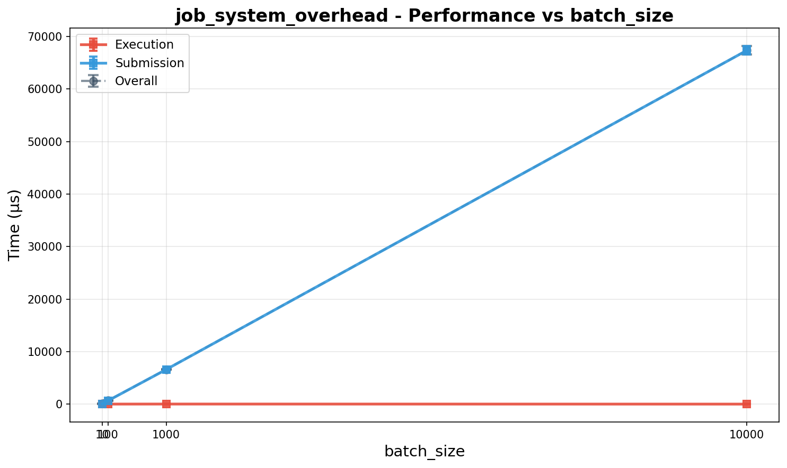

| Parameters | Overall (μs) | Stddev (μs) | CV% | Samples | Execution (μs) | Submission (μs) |
|------------|--------------|-------------|-----|---------|-----------------|-----------------|
| batch_size=1000 | 6617.29 | 55.86 | 0.84 | 5 | 18.76 | 6597.01 |
| batch_size=10 | 81.65 | 7.95 | 9.74 | 5 | 11.11 | 69.81 |
| batch_size=10000 | 67355.50 | 791.04 | 1.17 | 5 | 7.10 | 67346.51 |
| batch_size=100 | 679.40 | 11.15 | 1.64 | 5 | 11.37 | 667.19 |

### job_system_scaling_efficiency

Evaluates parallel efficiency with fixed total work across different thread counts

| Parameters | Overall (μs) | Stddev (μs) | CV% | Samples | Execution (μs) | Submission (μs) |
|------------|--------------|-------------|-----|---------|-----------------|-----------------|
| num_threads=7 | 158160.52 | 257.20 | 0.16 | 3 | 157657.79 | 500.64 |
| num_threads=12 | 92215.81 | 219.32 | 0.24 | 3 | 91670.11 | 543.88 |
| num_threads=31 | 42575.39 | 1006.69 | 2.36 | 3 | 41357.43 | 1215.94 |
| num_threads=8 | 138451.59 | 87.32 | 0.06 | 3 | 137925.35 | 522.26 |
| num_threads=17 | 64895.30 | 249.29 | 0.38 | 3 | 64261.96 | 631.20 |
| num_threads=5 | 222238.76 | 422.77 | 0.19 | 3 | 221758.63 | 477.93 |
| num_threads=18 | 61353.29 | 243.80 | 0.40 | 3 | 60729.35 | 621.77 |
| num_threads=15 | 73426.20 | 190.34 | 0.26 | 3 | 72816.12 | 607.90 |
| num_threads=29 | 38659.07 | 78.60 | 0.20 | 3 | 37789.27 | 867.69 |
| num_threads=3 | 373306.91 | 1085.10 | 0.29 | 3 | 372849.07 | 455.71 |
| num_threads=10 | 110576.75 | 216.86 | 0.20 | 3 | 110008.14 | 566.37 |
| num_threads=28 | 40231.91 | 370.89 | 0.92 | 3 | 39316.85 | 913.03 |
| num_threads=23 | 48423.57 | 56.17 | 0.12 | 3 | 47637.46 | 784.14 |
| num_threads=6 | 184549.70 | 54.65 | 0.03 | 3 | 183989.75 | 557.65 |
| num_threads=24 | 46371.34 | 97.46 | 0.21 | 3 | 45603.33 | 765.97 |
| num_threads=4 | 278380.36 | 967.61 | 0.35 | 3 | 277875.26 | 503.06 |
| num_threads=16 | 68948.14 | 303.75 | 0.44 | 3 | 68290.03 | 655.89 |
| num_threads=21 | 52658.85 | 293.88 | 0.56 | 3 | 51940.48 | 716.28 |
| num_threads=26 | 42776.03 | 99.55 | 0.23 | 3 | 41995.82 | 778.09 |
| num_threads=30 | 37582.55 | 119.31 | 0.32 | 3 | 36666.88 | 913.57 |
| num_threads=9 | 123120.70 | 332.57 | 0.27 | 3 | 122555.97 | 562.56 |
| num_threads=13 | 84823.12 | 95.34 | 0.11 | 3 | 84245.76 | 575.37 |
| num_threads=20 | 55110.72 | 28.34 | 0.05 | 3 | 54461.72 | 647.00 |
| num_threads=19 | 58048.25 | 103.19 | 0.18 | 3 | 57404.02 | 642.27 |
| num_threads=32 | 37113.30 | 1788.07 | 4.82 | 3 | 36073.87 | 1037.43 |
| num_threads=11 | 100529.58 | 301.28 | 0.30 | 3 | 99972.20 | 555.19 |
| num_threads=22 | 50466.71 | 129.14 | 0.26 | 3 | 49767.31 | 697.29 |
| num_threads=1 | 1161074.12 | 5452.23 | 0.47 | 3 | 1160613.29 | 458.26 |
| num_threads=2 | 567822.42 | 7194.44 | 1.27 | 3 | 567317.52 | 502.32 |
| num_threads=14 | 78812.33 | 148.00 | 0.19 | 3 | 78240.99 | 569.41 |
| num_threads=27 | 41307.82 | 135.59 | 0.33 | 3 | 40421.99 | 883.45 |
| num_threads=25 | 44494.56 | 150.66 | 0.34 | 3 | 43725.72 | 766.82 |

## WXF Serialization Benchmarks

### wxf_deserialize_flat_list

Measures WXF deserialization time for flat integer lists of varying sizes

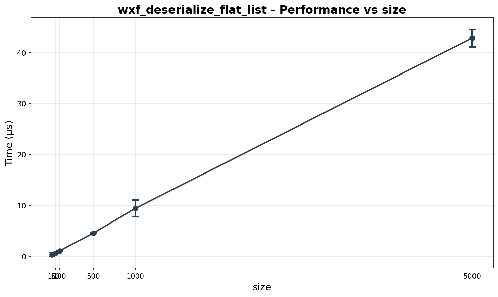

| Parameters | Avg (μs) | Stddev (μs) | CV% | Samples |
|------------|----------|-------------|-----|---------|
| size=100 | 1.07 | 0.09 | 8.14 | 10 |
| size=50 | 0.58 | 0.07 | 12.22 | 10 |
| size=10 | 0.31 | 0.38 | 125.06 | 10 |
| size=1000 | 9.43 | 1.66 | 17.61 | 10 |
| size=5000 | 42.89 | 1.75 | 4.08 | 10 |
| size=500 | 4.57 | 0.04 | 0.90 | 10 |

### wxf_deserialize_nested_list

Measures WXF deserialization time for nested lists (outer_size x inner_size)

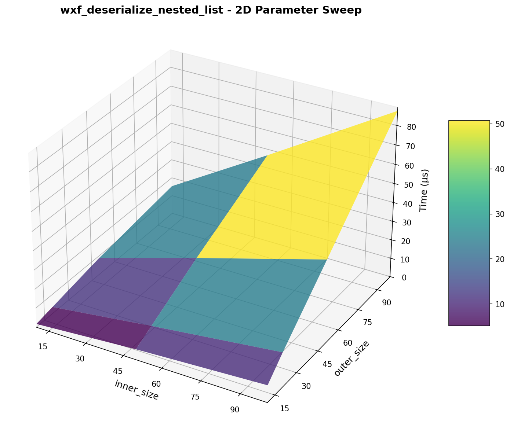

| Parameters | Avg (μs) | Stddev (μs) | CV% | Samples |
|------------|----------|-------------|-----|---------|
| inner_size=10, outer_size=10 | 1.61 | 0.26 | 15.89 | 10 |
| inner_size=50, outer_size=50 | 24.74 | 1.81 | 7.33 | 10 |
| inner_size=10, outer_size=100 | 15.33 | 0.36 | 2.34 | 10 |
| inner_size=100, outer_size=100 | 87.39 | 3.58 | 4.09 | 10 |
| inner_size=100, outer_size=10 | 8.80 | 0.50 | 5.68 | 10 |
| inner_size=50, outer_size=10 | 5.37 | 0.20 | 3.69 | 10 |
| inner_size=50, outer_size=100 | 46.83 | 1.69 | 3.61 | 10 |
| inner_size=10, outer_size=20 | 3.42 | 0.33 | 9.69 | 10 |
| inner_size=10, outer_size=50 | 8.84 | 1.77 | 19.97 | 10 |
| inner_size=50, outer_size=20 | 10.21 | 0.39 | 3.82 | 10 |
| inner_size=100, outer_size=20 | 18.06 | 0.13 | 0.75 | 10 |
| inner_size=100, outer_size=50 | 43.86 | 0.92 | 2.10 | 10 |

### wxf_roundtrip

Measures WXF round-trip (serialize + deserialize) time for various data sizes

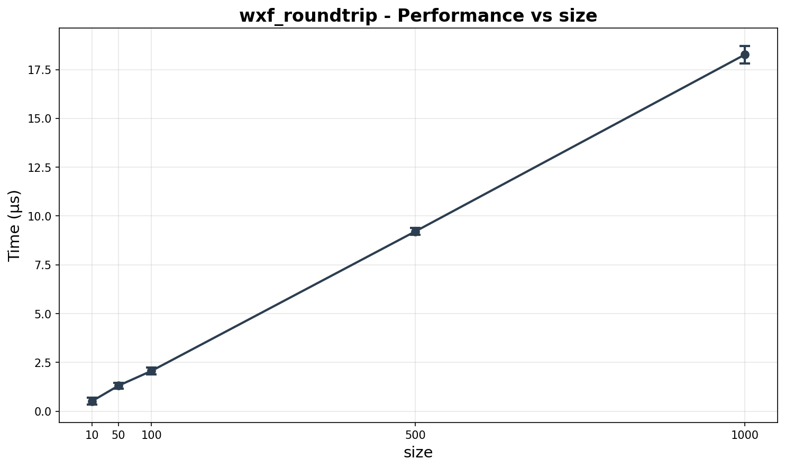

| Parameters | Avg (μs) | Stddev (μs) | CV% | Samples |
|------------|----------|-------------|-----|---------|
| size=10 | 0.52 | 0.18 | 34.64 | 10 |
| size=500 | 9.21 | 0.17 | 1.88 | 10 |
| size=1000 | 18.26 | 0.44 | 2.43 | 10 |
| size=100 | 2.06 | 0.19 | 9.12 | 10 |
| size=50 | 1.31 | 0.15 | 11.31 | 10 |

### wxf_serialize_flat_list

Measures WXF serialization time for flat integer lists of varying sizes

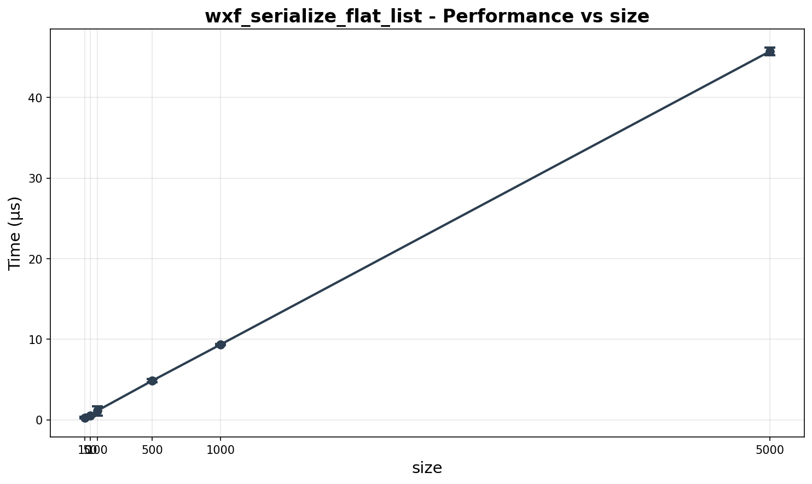

| Parameters | Avg (μs) | Stddev (μs) | CV% | Samples |
|------------|----------|-------------|-----|---------|
| size=5000 | 45.72 | 0.48 | 1.04 | 10 |
| size=10 | 0.29 | 0.11 | 37.29 | 10 |
| size=100 | 1.14 | 0.57 | 50.23 | 10 |
| size=50 | 0.57 | 0.10 | 16.85 | 10 |
| size=500 | 4.86 | 0.22 | 4.47 | 10 |
| size=1000 | 9.37 | 0.07 | 0.75 | 10 |

### wxf_serialize_nested_list

Measures WXF serialization time for nested lists (outer_size x inner_size)

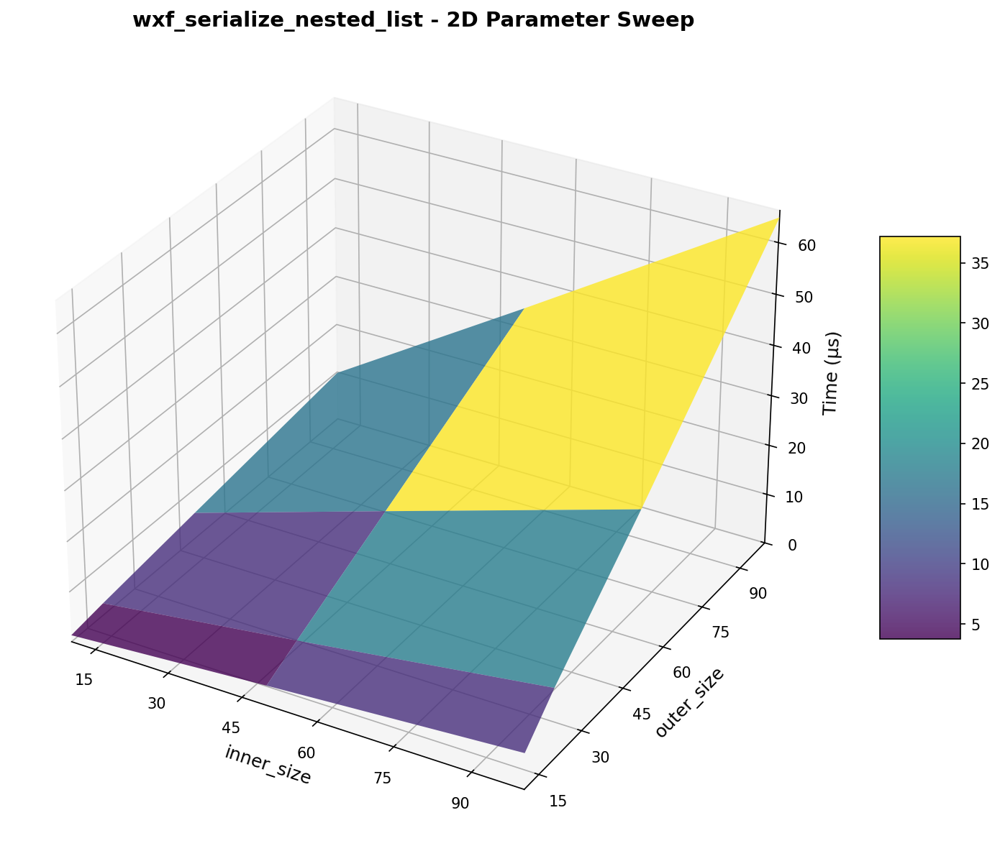

| Parameters | Avg (μs) | Stddev (μs) | CV% | Samples |
|------------|----------|-------------|-----|---------|
| inner_size=50, outer_size=10 | 3.94 | 0.15 | 3.89 | 10 |
| inner_size=100, outer_size=20 | 14.06 | 1.72 | 12.20 | 10 |
| inner_size=10, outer_size=20 | 2.38 | 0.15 | 6.49 | 10 |
| inner_size=10, outer_size=100 | 9.80 | 0.07 | 0.76 | 10 |
| inner_size=10, outer_size=50 | 5.19 | 0.08 | 1.45 | 10 |
| inner_size=50, outer_size=50 | 17.38 | 0.02 | 0.12 | 10 |
| inner_size=50, outer_size=20 | 7.40 | 0.18 | 2.43 | 10 |
| inner_size=100, outer_size=10 | 7.09 | 0.06 | 0.80 | 10 |
| inner_size=100, outer_size=50 | 32.52 | 0.04 | 0.12 | 10 |
| inner_size=100, outer_size=100 | 64.83 | 2.08 | 3.21 | 10 |
| inner_size=50, outer_size=100 | 34.01 | 0.05 | 0.15 | 10 |
| inner_size=10, outer_size=10 | 1.31 | 0.13 | 10.13 | 10 |

## Canonicalization Benchmarks

### canonicalization_2d_sweep

2D parameter sweep: edges vs symmetry_groups for surface plots

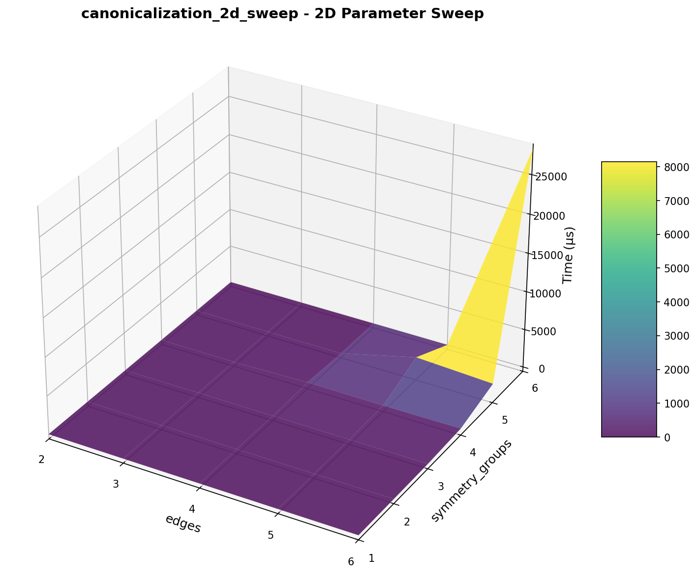

| Parameters | Avg (μs) | Stddev (μs) | CV% | Samples |
|------------|----------|-------------|-----|---------|
| edges=5, symmetry_groups=3 | 31.66 | 3.20 | 10.09 | 10 |
| edges=5, symmetry_groups=1 | 3.37 | 0.83 | 24.62 | 10 |
| edges=4, symmetry_groups=1 | 3.10 | 0.73 | 23.54 | 10 |
| edges=2, symmetry_groups=1 | 21.92 | 61.12 | 278.86 | 10 |
| edges=3, symmetry_groups=1 | 2.35 | 1.01 | 43.08 | 10 |
| edges=4, symmetry_groups=4 | 250.92 | 11.50 | 4.58 | 10 |
| edges=5, symmetry_groups=4 | 220.17 | 13.29 | 6.03 | 10 |
| edges=6, symmetry_groups=3 | 50.65 | 7.73 | 15.26 | 10 |
| edges=6, symmetry_groups=4 | 283.52 | 13.57 | 4.78 | 10 |
| edges=4, symmetry_groups=3 | 33.45 | 2.49 | 7.45 | 10 |
| edges=3, symmetry_groups=2 | 8.48 | 1.19 | 14.07 | 10 |
| edges=6, symmetry_groups=6 | 28235.63 | 624.42 | 2.21 | 10 |
| edges=3, symmetry_groups=3 | 37.13 | 3.26 | 8.79 | 10 |
| edges=4, symmetry_groups=2 | 12.20 | 0.32 | 2.66 | 10 |
| edges=2, symmetry_groups=2 | 8.28 | 2.21 | 26.74 | 10 |
| edges=5, symmetry_groups=2 | 11.40 | 0.76 | 6.68 | 10 |
| edges=6, symmetry_groups=1 | 4.01 | 2.12 | 52.86 | 10 |
| edges=6, symmetry_groups=2 | 14.88 | 9.54 | 64.14 | 10 |
| edges=6, symmetry_groups=5 | 1925.42 | 21.64 | 1.12 | 10 |
| edges=5, symmetry_groups=5 | 2439.43 | 26.46 | 1.08 | 10 |

### canonicalization_by_edge_count

Measures canonicalization performance as graph size increases

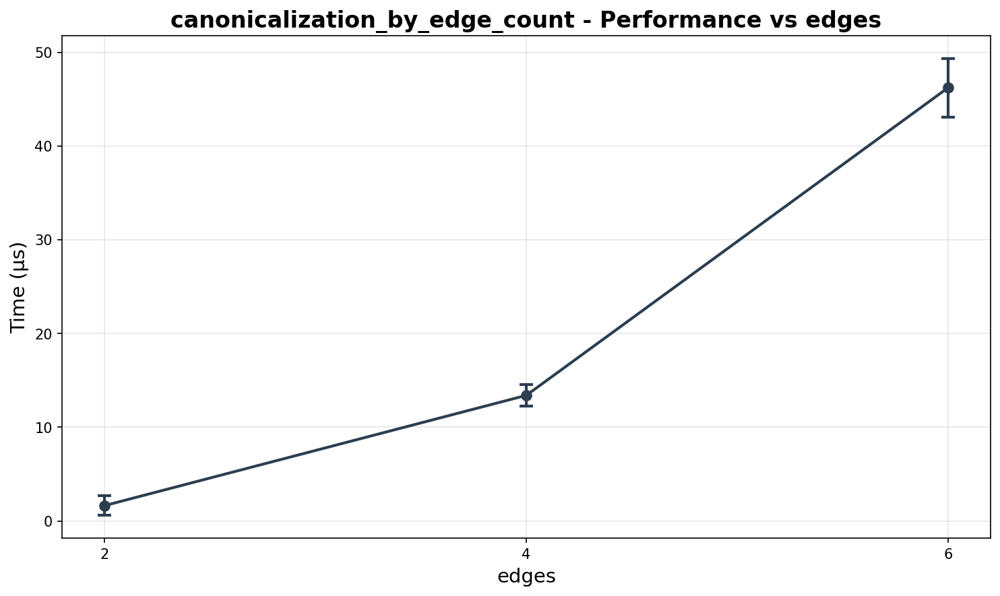

| Parameters | Avg (μs) | Stddev (μs) | CV% | Samples |
|------------|----------|-------------|-----|---------|
| edges=2 | 1.63 | 1.03 | 63.20 | 10 |
| edges=4 | 13.40 | 1.17 | 8.75 | 10 |
| edges=6 | 46.21 | 3.11 | 6.74 | 10 |

### canonicalization_by_symmetry

Shows how graph symmetry affects canonicalization time

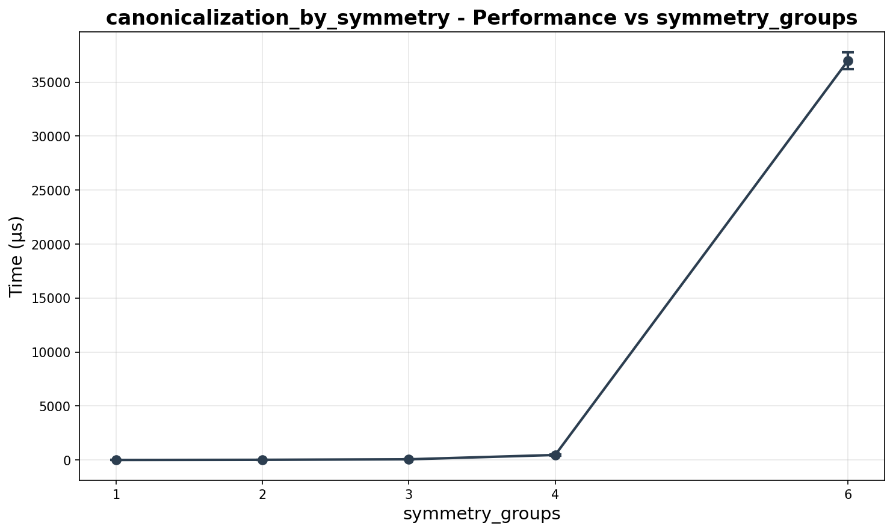

| Parameters | Avg (μs) | Stddev (μs) | CV% | Samples |
|------------|----------|-------------|-----|---------|
| symmetry_groups=3 | 68.22 | 5.35 | 7.85 | 10 |
| symmetry_groups=2 | 21.80 | 0.52 | 2.37 | 10 |
| symmetry_groups=6 | 36998.09 | 774.10 | 2.09 | 10 |
| symmetry_groups=1 | 6.18 | 0.15 | 2.40 | 10 |
| symmetry_groups=4 | 469.36 | 57.72 | 12.30 | 10 |

## State Management Benchmarks

### full_capture_overhead

Compares evolution performance with and without full state capture enabled

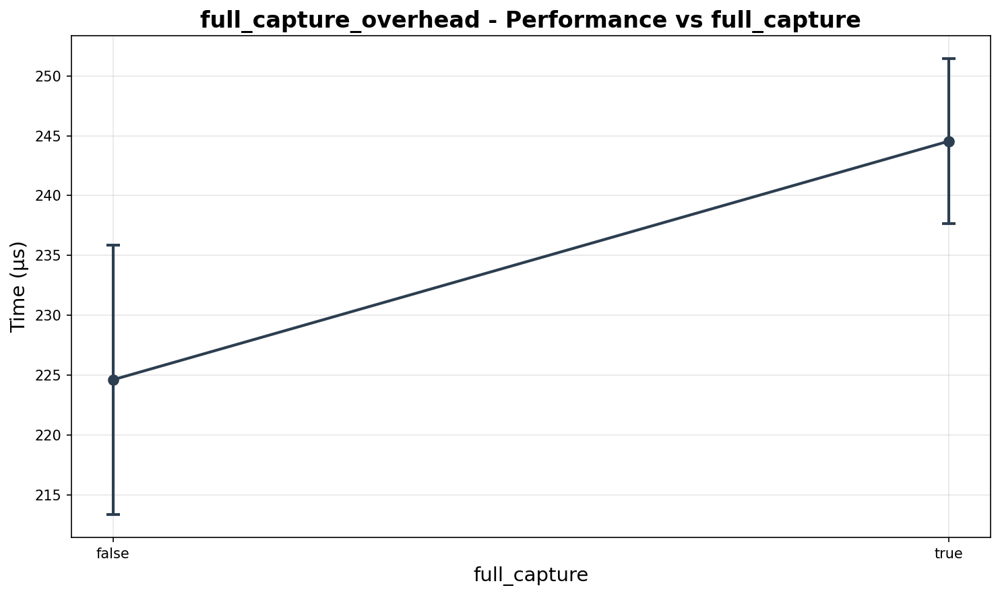

| Parameters | Avg (μs) | Stddev (μs) | CV% | Samples |
|------------|----------|-------------|-----|---------|
| full_capture=true | 244.54 | 6.88 | 2.81 | 3 |
| full_capture=false | 224.62 | 11.27 | 5.02 | 3 |

### state_storage_by_steps

Measures state storage and retrieval overhead as evolution progresses from 1 to 3 steps

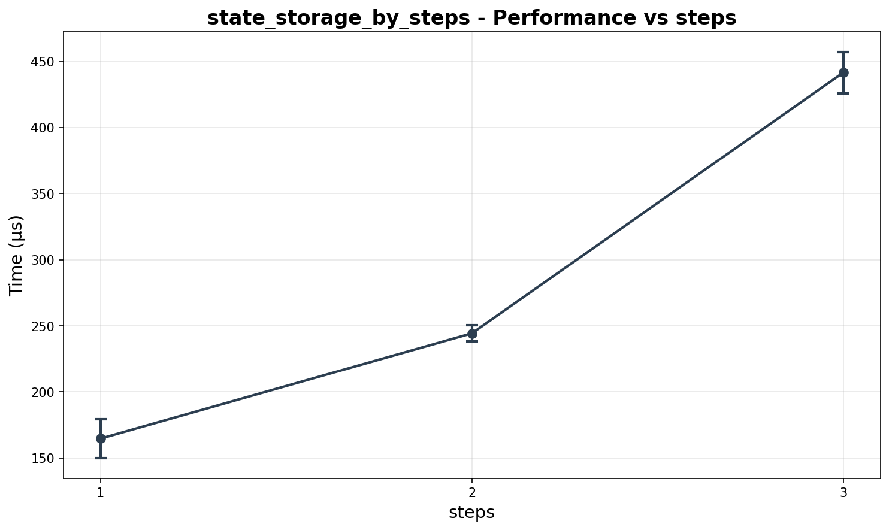

| Parameters | Avg (μs) | Stddev (μs) | CV% | Samples |
|------------|----------|-------------|-----|---------|
| steps=3 | 441.57 | 15.54 | 3.52 | 3 |
| steps=2 | 244.33 | 6.27 | 2.57 | 3 |
| steps=1 | 164.70 | 14.83 | 9.01 | 3 |
