# Hypergraph Engine Benchmarks

## Contents

- **[Pattern Matching Benchmarks](#pattern-matching-benchmarks)**
  - [pattern_matching_2d_sweep_threads_size](#pattern_matching_2d_sweep_threads_size)
  - [pattern_matching_by_graph_size](#pattern_matching_by_graph_size)
  - [pattern_matching_by_pattern_size](#pattern_matching_by_pattern_size)
- **[Event Relationships Benchmarks](#event-relationships-benchmarks)**
  - [causal_edges_overhead](#causal_edges_overhead)
  - [transitive_reduction_overhead](#transitive_reduction_overhead)
- **[Uniqueness Trees Benchmarks](#uniqueness-trees-benchmarks)**
  - [uniqueness_tree_2d_sweep](#uniqueness_tree_2d_sweep)
  - [uniqueness_tree_by_arity](#uniqueness_tree_by_arity)
  - [uniqueness_tree_by_edge_count](#uniqueness_tree_by_edge_count)
  - [uniqueness_tree_by_edge_count_arity3](#uniqueness_tree_by_edge_count_arity3)
  - [uniqueness_tree_by_symmetry](#uniqueness_tree_by_symmetry)
  - [uniqueness_tree_by_vertex_count](#uniqueness_tree_by_vertex_count)
- **[Evolution Benchmarks](#evolution-benchmarks)**
  - [evolution_2d_sweep_threads_steps](#evolution_2d_sweep_threads_steps)
  - [evolution_multi_rule_by_rule_count](#evolution_multi_rule_by_rule_count)
  - [evolution_thread_scaling](#evolution_thread_scaling)
  - [evolution_with_self_loops](#evolution_with_self_loops)
- **[Job System Benchmarks](#job-system-benchmarks)**
  - [job_system_2d_sweep](#job_system_2d_sweep)
  - [job_system_overhead](#job_system_overhead)
  - [job_system_scaling_efficiency](#job_system_scaling_efficiency)
- **[Canonicalization Benchmarks](#canonicalization-benchmarks)**
  - [canonicalization_2d_sweep](#canonicalization_2d_sweep)
  - [canonicalization_by_edge_count](#canonicalization_by_edge_count)
  - [canonicalization_by_edge_count_arity3](#canonicalization_by_edge_count_arity3)
  - [canonicalization_by_symmetry](#canonicalization_by_symmetry)
- **[WXF Serialization Benchmarks](#wxf-serialization-benchmarks)**
  - [wxf_deserialize_flat_list](#wxf_deserialize_flat_list)
  - [wxf_deserialize_nested_list](#wxf_deserialize_nested_list)
  - [wxf_roundtrip](#wxf_roundtrip)
  - [wxf_serialize_flat_list](#wxf_serialize_flat_list)
  - [wxf_serialize_nested_list](#wxf_serialize_nested_list)
- **[State Management Benchmarks](#state-management-benchmarks)**
  - [full_capture_overhead](#full_capture_overhead)
  - [state_storage_by_steps](#state_storage_by_steps)
- **[Other Benchmarks](#other-benchmarks)**
  - [comparative_2d_edges_steps](#comparative_2d_edges_steps)
  - [comparative_2d_edges_steps_speedup](#comparative_2d_edges_steps_speedup)
  - [comparative_config1](#comparative_config1)
  - [comparative_config1_speedup](#comparative_config1_speedup)
  - [comparative_config2](#comparative_config2)
  - [comparative_config2_speedup](#comparative_config2_speedup)
  - [comparative_config3](#comparative_config3)
  - [comparative_config3_speedup](#comparative_config3_speedup)

## System Information

- **CPU**: Intel(R) Core(TM) i9-14900K
- **Cores**: 32
- **Architecture**: x86_64
- **OS**: Linux 5.15.167.4-microsoft-standard-WSL2
- **Memory**: 23 GB
- **Compiler**: GNU 13.3.0
- **Hash Type**: commit
- **Hash**: b6c7372ea3355015e3ab9cb39a71a5629f21a958
- **Date**: 2025-10-30 01:01:23
- **Timestamp**: 2025-11-01T03:21:27

## Pattern Matching Benchmarks

### pattern_matching_2d_sweep_threads_size

2D parameter sweep of pattern matching across thread count (1-32) and graph size (5-100 edges) for parallel scalability analysis

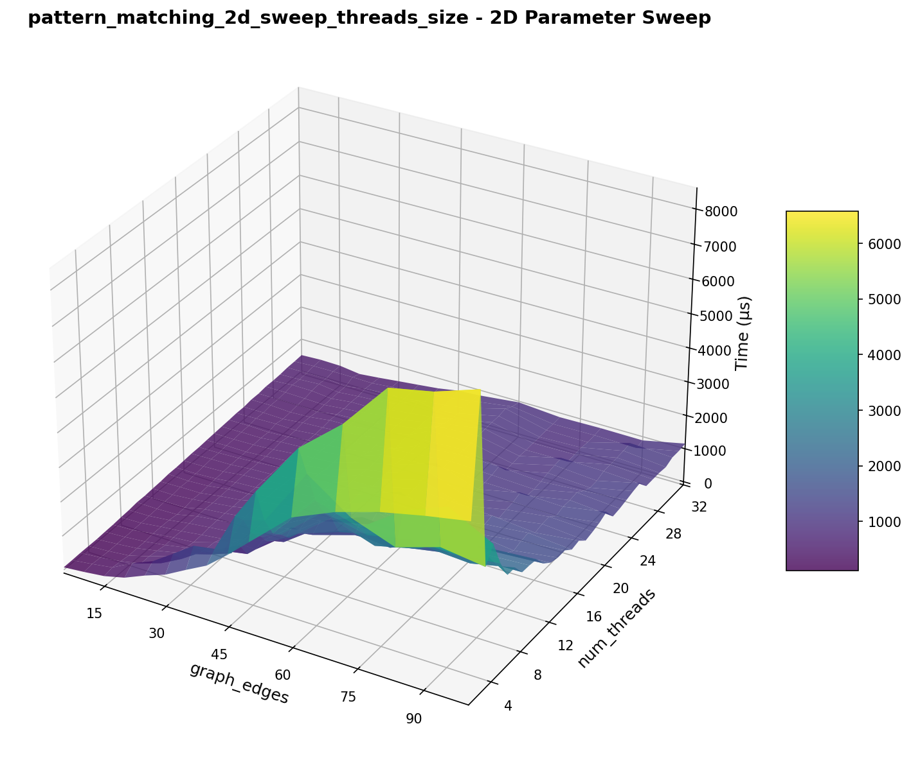

| Parameters | Median (μs) | MAD (μs) | CI Width% | Samples |
|------------|-------------|----------|-----------|---------|
| graph_edges=5, num_threads=1 | 75.56 | 16.72 | 9.99 | 63 |
| graph_edges=5, num_threads=2 | 82.74 | 9.84 | 9.83 | 20 |
| graph_edges=5, num_threads=3 | 85.77 | 22.18 | 9.99 | 117 |
| graph_edges=5, num_threads=4 | 87.42 | 21.17 | 9.94 | 109 |
| graph_edges=5, num_threads=5 | 88.05 | 18.90 | 9.94 | 77 |
| graph_edges=5, num_threads=6 | 103.68 | 22.66 | 9.86 | 66 |
| graph_edges=5, num_threads=7 | 117.64 | 20.72 | 9.88 | 61 |
| graph_edges=5, num_threads=8 | 142.65 | 6.70 | 9.94 | 13 |
| graph_edges=5, num_threads=9 | 159.63 | 10.16 | 9.54 | 16 |
| graph_edges=5, num_threads=10 | 188.66 | 1.70 | 6.05 | 4 |
| graph_edges=5, num_threads=11 | 189.63 | 1.40 | 9.58 | 5 |
| graph_edges=5, num_threads=12 | 207.73 | 7.17 | 8.38 | 6 |
| graph_edges=5, num_threads=13 | 213.55 | 7.20 | 9.99 | 8 |
| graph_edges=5, num_threads=14 | 249.41 | 5.92 | 8.32 | 5 |
| graph_edges=5, num_threads=15 | 251.99 | 8.60 | 8.92 | 4 |
| graph_edges=5, num_threads=16 | 265.26 | 2.33 | 8.78 | 4 |
| graph_edges=5, num_threads=17 | 285.21 | 7.17 | 8.83 | 4 |
| graph_edges=5, num_threads=18 | 289.26 | 19.73 | 9.36 | 6 |
| graph_edges=5, num_threads=19 | 310.18 | 0.14 | 0.76 | 2 |
| graph_edges=5, num_threads=20 | 325.41 | 15.53 | 9.87 | 9 |
| graph_edges=5, num_threads=21 | 344.64 | 7.99 | 8.44 | 4 |
| graph_edges=5, num_threads=22 | 352.98 | 11.49 | 8.94 | 8 |
| graph_edges=5, num_threads=23 | 365.79 | 15.06 | 9.81 | 18 |
| graph_edges=5, num_threads=24 | 374.80 | 1.29 | 5.61 | 4 |
| graph_edges=5, num_threads=25 | 407.03 | 13.30 | 9.63 | 14 |
| graph_edges=5, num_threads=26 | 409.44 | 22.68 | 9.32 | 5 |
| graph_edges=5, num_threads=27 | 434.51 | 21.81 | 9.90 | 8 |
| graph_edges=5, num_threads=28 | 440.80 | 11.10 | 8.53 | 5 |
| graph_edges=5, num_threads=29 | 453.68 | 16.06 | 9.05 | 4 |
| graph_edges=5, num_threads=30 | 477.73 | 9.02 | 9.42 | 3 |
| graph_edges=5, num_threads=31 | 482.91 | 6.61 | 8.36 | 3 |
| graph_edges=5, num_threads=32 | 501.01 | 2.89 | 9.89 | 2 |
| graph_edges=10, num_threads=1 | 135.39 | 47.15 | 9.99 | 135 |
| graph_edges=10, num_threads=2 | 165.64 | 64.83 | 10.87 | 150 |
| graph_edges=10, num_threads=3 | 141.57 | 53.28 | 10.72 | 150 |
| graph_edges=10, num_threads=4 | 130.15 | 38.52 | 9.99 | 95 |
| graph_edges=10, num_threads=5 | 129.99 | 38.28 | 12.31 | 150 |
| graph_edges=10, num_threads=6 | 140.98 | 35.42 | 9.95 | 92 |
| graph_edges=10, num_threads=7 | 146.53 | 27.58 | 9.95 | 75 |
| graph_edges=10, num_threads=8 | 155.25 | 20.08 | 10.00 | 66 |
| graph_edges=10, num_threads=9 | 164.90 | 23.56 | 9.62 | 84 |
| graph_edges=10, num_threads=10 | 182.76 | 22.07 | 9.43 | 60 |
| graph_edges=10, num_threads=11 | 207.97 | 35.42 | 9.96 | 89 |
| graph_edges=10, num_threads=12 | 217.64 | 28.13 | 9.99 | 73 |
| graph_edges=10, num_threads=13 | 236.94 | 6.98 | 8.34 | 18 |
| graph_edges=10, num_threads=14 | 245.67 | 22.10 | 9.91 | 89 |
| graph_edges=10, num_threads=15 | 256.99 | 0.35 | 6.79 | 4 |
| graph_edges=10, num_threads=16 | 281.37 | 14.66 | 9.85 | 19 |
| graph_edges=10, num_threads=17 | 302.97 | 19.25 | 8.82 | 11 |
| graph_edges=10, num_threads=18 | 292.46 | 11.13 | 9.79 | 8 |
| graph_edges=10, num_threads=19 | 325.58 | 11.61 | 5.69 | 18 |
| graph_edges=10, num_threads=20 | 327.39 | 8.24 | 9.57 | 5 |
| graph_edges=10, num_threads=21 | 352.25 | 2.11 | 4.92 | 4 |
| graph_edges=10, num_threads=22 | 357.84 | 0.49 | 5.94 | 4 |
| graph_edges=10, num_threads=23 | 381.94 | 10.92 | 7.05 | 21 |
| graph_edges=10, num_threads=24 | 373.77 | 22.31 | 9.32 | 7 |
| graph_edges=10, num_threads=25 | 419.37 | 8.29 | 7.45 | 5 |
| graph_edges=10, num_threads=26 | 424.73 | 21.70 | 7.57 | 19 |
| graph_edges=10, num_threads=27 | 439.18 | 29.57 | 9.87 | 16 |
| graph_edges=10, num_threads=28 | 481.96 | 0.54 | 4.17 | 4 |
| graph_edges=10, num_threads=29 | 469.62 | 4.37 | 4.90 | 4 |
| graph_edges=10, num_threads=30 | 475.99 | 19.75 | 9.91 | 23 |
| graph_edges=10, num_threads=31 | 505.53 | 40.78 | 8.90 | 8 |
| graph_edges=10, num_threads=32 | 518.20 | 11.44 | 9.44 | 5 |
| graph_edges=15, num_threads=1 | 212.13 | 97.61 | 13.24 | 150 |
| graph_edges=15, num_threads=2 | 277.36 | 128.70 | 12.47 | 150 |
| graph_edges=15, num_threads=3 | 235.49 | 122.28 | 13.94 | 150 |
| graph_edges=15, num_threads=4 | 193.99 | 71.50 | 10.87 | 150 |
| graph_edges=15, num_threads=5 | 199.20 | 68.15 | 11.58 | 150 |
| graph_edges=15, num_threads=6 | 188.82 | 59.88 | 11.12 | 150 |
| graph_edges=15, num_threads=7 | 213.40 | 91.42 | 12.87 | 150 |
| graph_edges=15, num_threads=8 | 199.45 | 59.63 | 13.26 | 150 |
| graph_edges=15, num_threads=9 | 207.64 | 64.41 | 11.16 | 150 |
| graph_edges=15, num_threads=10 | 203.93 | 4.22 | 9.89 | 6 |
| graph_edges=15, num_threads=11 | 210.37 | 0.45 | 3.69 | 2 |
| graph_edges=15, num_threads=12 | 240.28 | 53.09 | 9.98 | 93 |
| graph_edges=15, num_threads=13 | 251.95 | 3.81 | 8.95 | 6 |
| graph_edges=15, num_threads=14 | 258.70 | 41.64 | 9.92 | 59 |
| graph_edges=15, num_threads=15 | 284.04 | 25.59 | 9.82 | 28 |
| graph_edges=15, num_threads=16 | 293.07 | 21.86 | 9.79 | 32 |
| graph_edges=15, num_threads=17 | 318.13 | 0.15 | 0.80 | 2 |
| graph_edges=15, num_threads=18 | 321.19 | 13.52 | 7.20 | 27 |
| graph_edges=15, num_threads=19 | 321.41 | 20.89 | 9.51 | 22 |
| graph_edges=15, num_threads=20 | 345.66 | 12.51 | 7.94 | 6 |
| graph_edges=15, num_threads=21 | 356.09 | 2.03 | 6.66 | 3 |
| graph_edges=15, num_threads=22 | 358.07 | 50.64 | 10.00 | 86 |
| graph_edges=15, num_threads=23 | 401.84 | 6.43 | 6.77 | 9 |
| graph_edges=15, num_threads=24 | 391.49 | 60.11 | 9.96 | 78 |
| graph_edges=15, num_threads=25 | 409.41 | 58.90 | 9.94 | 82 |
| graph_edges=15, num_threads=26 | 419.78 | 2.57 | 6.35 | 4 |
| graph_edges=15, num_threads=27 | 428.57 | 0.07 | 0.27 | 2 |
| graph_edges=15, num_threads=28 | 476.24 | 1.88 | 3.95 | 4 |
| graph_edges=15, num_threads=29 | 502.73 | 2.41 | 2.11 | 4 |
| graph_edges=15, num_threads=30 | 485.77 | 0.40 | 1.39 | 2 |
| graph_edges=15, num_threads=31 | 513.54 | 36.44 | 8.69 | 27 |
| graph_edges=15, num_threads=32 | 508.19 | 29.42 | 9.65 | 12 |
| graph_edges=20, num_threads=1 | 384.77 | 101.82 | 13.63 | 150 |
| graph_edges=20, num_threads=2 | 565.98 | 22.26 | 9.85 | 14 |
| graph_edges=20, num_threads=3 | 378.92 | 105.18 | 13.65 | 150 |
| graph_edges=20, num_threads=4 | 379.22 | 97.09 | 13.91 | 150 |
| graph_edges=20, num_threads=5 | 324.67 | 117.78 | 12.60 | 150 |
| graph_edges=20, num_threads=6 | 275.69 | 100.99 | 12.16 | 150 |
| graph_edges=20, num_threads=7 | 272.59 | 143.98 | 13.52 | 150 |
| graph_edges=20, num_threads=8 | 275.88 | 116.41 | 11.97 | 150 |
| graph_edges=20, num_threads=9 | 308.84 | 144.16 | 11.59 | 150 |
| graph_edges=20, num_threads=10 | 302.25 | 139.28 | 11.89 | 150 |
| graph_edges=20, num_threads=11 | 328.83 | 115.60 | 11.13 | 150 |
| graph_edges=20, num_threads=12 | 328.84 | 84.87 | 9.98 | 134 |
| graph_edges=20, num_threads=13 | 348.96 | 84.61 | 9.95 | 91 |
| graph_edges=20, num_threads=14 | 350.83 | 73.17 | 9.97 | 74 |
| graph_edges=20, num_threads=15 | 355.14 | 69.64 | 9.89 | 48 |
| graph_edges=20, num_threads=16 | 379.30 | 0.26 | 4.10 | 3 |
| graph_edges=20, num_threads=17 | 370.99 | 72.48 | 9.92 | 53 |
| graph_edges=20, num_threads=18 | 366.48 | 65.17 | 9.87 | 50 |
| graph_edges=20, num_threads=19 | 361.01 | 30.02 | 9.96 | 14 |
| graph_edges=20, num_threads=20 | 377.46 | 6.71 | 8.91 | 8 |
| graph_edges=20, num_threads=21 | 416.06 | 7.05 | 6.41 | 3 |
| graph_edges=20, num_threads=22 | 383.64 | 66.11 | 9.98 | 70 |
| graph_edges=20, num_threads=23 | 399.92 | 29.03 | 9.90 | 11 |
| graph_edges=20, num_threads=24 | 417.92 | 55.81 | 9.95 | 64 |
| graph_edges=20, num_threads=25 | 414.85 | 56.56 | 9.98 | 47 |
| graph_edges=20, num_threads=26 | 393.64 | 57.74 | 9.90 | 50 |
| graph_edges=20, num_threads=27 | 429.88 | 78.35 | 9.98 | 78 |
| graph_edges=20, num_threads=28 | 417.22 | 79.09 | 9.99 | 62 |
| graph_edges=20, num_threads=29 | 440.99 | 77.35 | 9.95 | 55 |
| graph_edges=20, num_threads=30 | 423.40 | 122.21 | 9.94 | 86 |
| graph_edges=20, num_threads=31 | 522.17 | 0.53 | 5.60 | 5 |
| graph_edges=20, num_threads=32 | 423.15 | 127.21 | 9.96 | 81 |
| graph_edges=25, num_threads=1 | 583.49 | 48.95 | 9.36 | 73 |
| graph_edges=25, num_threads=2 | 837.81 | 105.04 | 9.77 | 53 |
| graph_edges=25, num_threads=3 | 616.24 | 190.55 | 14.86 | 150 |
| graph_edges=25, num_threads=4 | 573.44 | 15.09 | 8.82 | 3 |
| graph_edges=25, num_threads=5 | 489.10 | 172.51 | 13.44 | 150 |
| graph_edges=25, num_threads=6 | 417.77 | 127.48 | 13.57 | 150 |
| graph_edges=25, num_threads=7 | 354.60 | 125.86 | 12.32 | 150 |
| graph_edges=25, num_threads=8 | 373.76 | 138.34 | 12.24 | 150 |
| graph_edges=25, num_threads=9 | 425.93 | 157.08 | 11.72 | 150 |
| graph_edges=25, num_threads=10 | 426.95 | 159.07 | 11.45 | 150 |
| graph_edges=25, num_threads=11 | 430.49 | 166.83 | 11.20 | 150 |
| graph_edges=25, num_threads=12 | 438.43 | 139.62 | 10.71 | 150 |
| graph_edges=25, num_threads=13 | 362.78 | 119.79 | 13.35 | 150 |
| graph_edges=25, num_threads=14 | 390.04 | 109.94 | 10.19 | 150 |
| graph_edges=25, num_threads=15 | 401.93 | 73.29 | 9.99 | 71 |
| graph_edges=25, num_threads=16 | 409.72 | 84.86 | 9.93 | 70 |
| graph_edges=25, num_threads=17 | 407.32 | 86.52 | 9.96 | 42 |
| graph_edges=25, num_threads=18 | 413.52 | 58.80 | 9.84 | 41 |
| graph_edges=25, num_threads=19 | 412.09 | 72.12 | 9.95 | 36 |
| graph_edges=25, num_threads=20 | 431.74 | 55.46 | 9.94 | 41 |
| graph_edges=25, num_threads=21 | 450.44 | 53.82 | 9.90 | 26 |
| graph_edges=25, num_threads=22 | 455.55 | 63.78 | 9.78 | 24 |
| graph_edges=25, num_threads=23 | 420.13 | 58.97 | 9.95 | 51 |
| graph_edges=25, num_threads=24 | 446.41 | 35.43 | 8.69 | 37 |
| graph_edges=25, num_threads=25 | 497.93 | 54.05 | 9.75 | 11 |
| graph_edges=25, num_threads=26 | 472.00 | 23.54 | 9.61 | 17 |
| graph_edges=25, num_threads=27 | 463.37 | 42.38 | 9.98 | 33 |
| graph_edges=25, num_threads=28 | 472.37 | 42.08 | 9.91 | 32 |
| graph_edges=25, num_threads=29 | 480.79 | 49.70 | 9.91 | 30 |
| graph_edges=25, num_threads=30 | 524.07 | 76.87 | 9.69 | 30 |
| graph_edges=25, num_threads=31 | 500.96 | 84.02 | 9.94 | 48 |
| graph_edges=25, num_threads=32 | 491.83 | 69.71 | 9.98 | 58 |
| graph_edges=30, num_threads=1 | 813.97 | 73.63 | 9.96 | 38 |
| graph_edges=30, num_threads=2 | 1276.61 | 152.66 | 9.81 | 34 |
| graph_edges=30, num_threads=3 | 989.71 | 280.52 | 15.67 | 150 |
| graph_edges=30, num_threads=4 | 818.50 | 11.95 | 7.94 | 6 |
| graph_edges=30, num_threads=5 | 672.99 | 213.73 | 14.21 | 150 |
| graph_edges=30, num_threads=6 | 587.72 | 171.73 | 13.86 | 150 |
| graph_edges=30, num_threads=7 | 550.95 | 0.88 | 2.74 | 2 |
| graph_edges=30, num_threads=8 | 439.61 | 172.98 | 12.84 | 150 |
| graph_edges=30, num_threads=9 | 478.28 | 35.44 | 9.47 | 7 |
| graph_edges=30, num_threads=10 | 475.32 | 195.88 | 12.48 | 150 |
| graph_edges=30, num_threads=11 | 522.59 | 145.74 | 10.61 | 150 |
| graph_edges=30, num_threads=12 | 535.06 | 31.08 | 9.92 | 6 |
| graph_edges=30, num_threads=13 | 555.48 | 36.40 | 9.57 | 6 |
| graph_edges=30, num_threads=14 | 536.72 | 149.78 | 10.08 | 150 |
| graph_edges=30, num_threads=15 | 522.93 | 12.30 | 7.73 | 5 |
| graph_edges=30, num_threads=16 | 457.71 | 102.97 | 9.93 | 106 |
| graph_edges=30, num_threads=17 | 470.13 | 25.96 | 9.50 | 8 |
| graph_edges=30, num_threads=18 | 458.79 | 84.19 | 9.88 | 59 |
| graph_edges=30, num_threads=19 | 460.93 | 72.54 | 9.84 | 49 |
| graph_edges=30, num_threads=20 | 491.47 | 5.15 | 4.25 | 5 |
| graph_edges=30, num_threads=21 | 508.95 | 3.68 | 5.71 | 4 |
| graph_edges=30, num_threads=22 | 484.10 | 80.94 | 9.84 | 40 |
| graph_edges=30, num_threads=23 | 466.79 | 8.72 | 7.12 | 3 |
| graph_edges=30, num_threads=24 | 508.34 | 65.94 | 9.91 | 38 |
| graph_edges=30, num_threads=25 | 510.79 | 71.21 | 9.81 | 31 |
| graph_edges=30, num_threads=26 | 495.97 | 39.57 | 9.95 | 29 |
| graph_edges=30, num_threads=27 | 517.15 | 58.77 | 9.98 | 32 |
| graph_edges=30, num_threads=28 | 484.07 | 31.18 | 9.78 | 12 |
| graph_edges=30, num_threads=29 | 506.55 | 64.60 | 9.96 | 36 |
| graph_edges=30, num_threads=30 | 547.91 | 65.57 | 9.78 | 24 |
| graph_edges=30, num_threads=31 | 560.40 | 62.89 | 10.00 | 33 |
| graph_edges=30, num_threads=32 | 550.11 | 56.94 | 9.72 | 33 |
| graph_edges=35, num_threads=1 | 1133.38 | 83.25 | 9.70 | 43 |
| graph_edges=35, num_threads=2 | 1709.77 | 227.17 | 9.93 | 42 |
| graph_edges=35, num_threads=3 | 1247.88 | 167.32 | 9.95 | 50 |
| graph_edges=35, num_threads=4 | 961.39 | 140.58 | 9.97 | 97 |
| graph_edges=35, num_threads=5 | 895.39 | 119.29 | 9.70 | 57 |
| graph_edges=35, num_threads=6 | 661.38 | 106.29 | 9.95 | 81 |
| graph_edges=35, num_threads=7 | 741.16 | 168.23 | 11.13 | 150 |
| graph_edges=35, num_threads=8 | 609.04 | 175.10 | 11.82 | 150 |
| graph_edges=35, num_threads=9 | 525.37 | 196.69 | 11.88 | 150 |
| graph_edges=35, num_threads=10 | 602.99 | 193.16 | 11.14 | 150 |
| graph_edges=35, num_threads=11 | 650.95 | 201.58 | 11.74 | 150 |
| graph_edges=35, num_threads=12 | 640.10 | 106.78 | 9.99 | 82 |
| graph_edges=35, num_threads=13 | 663.77 | 104.81 | 9.86 | 95 |
| graph_edges=35, num_threads=14 | 635.44 | 100.96 | 9.80 | 86 |
| graph_edges=35, num_threads=15 | 596.29 | 9.42 | 6.59 | 6 |
| graph_edges=35, num_threads=16 | 643.32 | 89.68 | 8.23 | 40 |
| graph_edges=35, num_threads=17 | 605.64 | 8.56 | 6.11 | 6 |
| graph_edges=35, num_threads=18 | 547.72 | 132.75 | 11.60 | 150 |
| graph_edges=35, num_threads=19 | 525.77 | 97.43 | 9.94 | 83 |
| graph_edges=35, num_threads=20 | 530.19 | 99.54 | 9.98 | 72 |
| graph_edges=35, num_threads=21 | 557.76 | 96.96 | 9.99 | 68 |
| graph_edges=35, num_threads=22 | 545.20 | 92.76 | 9.94 | 58 |
| graph_edges=35, num_threads=23 | 546.30 | 116.15 | 9.86 | 56 |
| graph_edges=35, num_threads=24 | 566.25 | 106.04 | 9.86 | 58 |
| graph_edges=35, num_threads=25 | 543.14 | 95.00 | 9.84 | 45 |
| graph_edges=35, num_threads=26 | 565.38 | 78.94 | 9.89 | 31 |
| graph_edges=35, num_threads=27 | 631.52 | 114.14 | 9.82 | 50 |
| graph_edges=35, num_threads=28 | 598.86 | 93.54 | 9.75 | 37 |
| graph_edges=35, num_threads=29 | 592.62 | 79.27 | 9.77 | 31 |
| graph_edges=35, num_threads=30 | 570.04 | 74.50 | 9.88 | 31 |
| graph_edges=35, num_threads=31 | 596.50 | 64.80 | 9.84 | 24 |
| graph_edges=35, num_threads=32 | 614.89 | 90.60 | 9.91 | 36 |
| graph_edges=40, num_threads=1 | 1495.48 | 16.62 | 3.36 | 9 |
| graph_edges=40, num_threads=2 | 2157.08 | 509.65 | 15.92 | 150 |
| graph_edges=40, num_threads=3 | 1670.06 | 554.74 | 17.62 | 150 |
| graph_edges=40, num_threads=4 | 1378.97 | 424.37 | 16.84 | 150 |
| graph_edges=40, num_threads=5 | 1259.74 | 4.26 | 9.06 | 5 |
| graph_edges=40, num_threads=6 | 856.55 | 297.04 | 15.61 | 150 |
| graph_edges=40, num_threads=7 | 745.80 | 230.44 | 14.49 | 150 |
| graph_edges=40, num_threads=8 | 851.80 | 304.83 | 15.66 | 150 |
| graph_edges=40, num_threads=9 | 694.68 | 301.40 | 13.96 | 150 |
| graph_edges=40, num_threads=10 | 794.46 | 306.71 | 14.34 | 150 |
| graph_edges=40, num_threads=11 | 728.85 | 289.31 | 13.94 | 150 |
| graph_edges=40, num_threads=12 | 764.24 | 209.99 | 13.47 | 150 |
| graph_edges=40, num_threads=13 | 791.53 | 237.06 | 12.95 | 150 |
| graph_edges=40, num_threads=14 | 703.03 | 244.99 | 13.36 | 150 |
| graph_edges=40, num_threads=15 | 706.26 | 199.16 | 11.35 | 150 |
| graph_edges=40, num_threads=16 | 714.02 | 209.33 | 11.66 | 150 |
| graph_edges=40, num_threads=17 | 729.72 | 134.52 | 9.96 | 134 |
| graph_edges=40, num_threads=18 | 706.77 | 194.87 | 10.14 | 150 |
| graph_edges=40, num_threads=19 | 722.51 | 148.08 | 9.97 | 129 |
| graph_edges=40, num_threads=20 | 758.03 | 184.49 | 9.99 | 148 |
| graph_edges=40, num_threads=21 | 651.37 | 261.52 | 14.26 | 150 |
| graph_edges=40, num_threads=22 | 619.82 | 150.64 | 9.99 | 141 |
| graph_edges=40, num_threads=23 | 623.11 | 148.86 | 9.99 | 125 |
| graph_edges=40, num_threads=24 | 650.37 | 136.68 | 9.99 | 81 |
| graph_edges=40, num_threads=25 | 670.17 | 132.82 | 9.96 | 63 |
| graph_edges=40, num_threads=26 | 696.63 | 2.84 | 10.00 | 5 |
| graph_edges=40, num_threads=27 | 651.86 | 118.73 | 9.72 | 42 |
| graph_edges=40, num_threads=28 | 673.93 | 115.53 | 9.90 | 49 |
| graph_edges=40, num_threads=29 | 872.19 | 11.09 | 6.45 | 3 |
| graph_edges=40, num_threads=30 | 647.51 | 109.39 | 9.92 | 48 |
| graph_edges=40, num_threads=31 | 676.79 | 97.61 | 9.89 | 32 |
| graph_edges=40, num_threads=32 | 667.10 | 109.19 | 9.98 | 45 |
| graph_edges=45, num_threads=1 | 2000.91 | 77.66 | 9.91 | 5 |
| graph_edges=45, num_threads=2 | 2860.33 | 408.70 | 9.76 | 23 |
| graph_edges=45, num_threads=3 | 2378.72 | 324.47 | 9.93 | 97 |
| graph_edges=45, num_threads=4 | 1902.90 | 336.82 | 9.95 | 61 |
| graph_edges=45, num_threads=5 | 1593.09 | 237.41 | 9.97 | 91 |
| graph_edges=45, num_threads=6 | 1260.36 | 200.35 | 9.92 | 90 |
| graph_edges=45, num_threads=7 | 1151.75 | 273.10 | 9.98 | 132 |
| graph_edges=45, num_threads=8 | 930.29 | 250.65 | 11.79 | 150 |
| graph_edges=45, num_threads=9 | 1113.99 | 220.74 | 9.96 | 91 |
| graph_edges=45, num_threads=10 | 932.58 | 280.94 | 12.31 | 150 |
| graph_edges=45, num_threads=11 | 1026.62 | 247.30 | 9.87 | 115 |
| graph_edges=45, num_threads=12 | 932.71 | 151.80 | 9.99 | 46 |
| graph_edges=45, num_threads=13 | 1023.77 | 53.56 | 9.41 | 20 |
| graph_edges=45, num_threads=14 | 1010.42 | 113.35 | 9.97 | 39 |
| graph_edges=45, num_threads=15 | 948.79 | 55.51 | 9.83 | 22 |
| graph_edges=45, num_threads=16 | 910.25 | 142.30 | 9.86 | 44 |
| graph_edges=45, num_threads=17 | 929.46 | 147.54 | 9.81 | 49 |
| graph_edges=45, num_threads=18 | 924.71 | 109.68 | 9.94 | 23 |
| graph_edges=45, num_threads=19 | 901.80 | 142.64 | 9.89 | 42 |
| graph_edges=45, num_threads=20 | 856.30 | 106.36 | 9.97 | 23 |
| graph_edges=45, num_threads=21 | 960.00 | 31.17 | 9.95 | 10 |
| graph_edges=45, num_threads=22 | 928.50 | 131.97 | 9.96 | 34 |
| graph_edges=45, num_threads=23 | 758.56 | 101.27 | 9.90 | 46 |
| graph_edges=45, num_threads=24 | 809.69 | 12.86 | 7.44 | 4 |
| graph_edges=45, num_threads=25 | 780.09 | 52.89 | 9.55 | 12 |
| graph_edges=45, num_threads=26 | 785.99 | 99.86 | 9.31 | 50 |
| graph_edges=45, num_threads=27 | 783.34 | 90.67 | 9.68 | 30 |
| graph_edges=45, num_threads=28 | 748.68 | 109.71 | 9.77 | 46 |
| graph_edges=45, num_threads=29 | 753.86 | 37.95 | 9.79 | 6 |
| graph_edges=45, num_threads=30 | 731.52 | 99.30 | 9.87 | 23 |
| graph_edges=45, num_threads=31 | 747.82 | 113.31 | 9.92 | 37 |
| graph_edges=45, num_threads=32 | 814.17 | 66.36 | 9.55 | 20 |
| graph_edges=50, num_threads=1 | 2524.76 | 118.03 | 8.55 | 24 |
| graph_edges=50, num_threads=2 | 3862.02 | 544.84 | 9.84 | 37 |
| graph_edges=50, num_threads=3 | 2682.62 | 350.38 | 9.99 | 86 |
| graph_edges=50, num_threads=4 | 2203.66 | 319.59 | 9.93 | 43 |
| graph_edges=50, num_threads=5 | 1942.31 | 228.00 | 9.85 | 60 |
| graph_edges=50, num_threads=6 | 1643.91 | 305.83 | 9.91 | 78 |
| graph_edges=50, num_threads=7 | 1520.57 | 318.33 | 9.99 | 112 |
| graph_edges=50, num_threads=8 | 1332.64 | 284.64 | 9.75 | 93 |
| graph_edges=50, num_threads=9 | 1126.01 | 244.71 | 9.99 | 123 |
| graph_edges=50, num_threads=10 | 1283.66 | 275.83 | 9.69 | 112 |
| graph_edges=50, num_threads=11 | 1155.84 | 211.93 | 9.94 | 103 |
| graph_edges=50, num_threads=12 | 1159.14 | 284.81 | 9.96 | 112 |
| graph_edges=50, num_threads=13 | 1062.89 | 182.07 | 9.98 | 91 |
| graph_edges=50, num_threads=14 | 1086.66 | 141.70 | 9.92 | 44 |
| graph_edges=50, num_threads=15 | 1073.89 | 161.95 | 9.83 | 59 |
| graph_edges=50, num_threads=16 | 1119.82 | 129.85 | 9.35 | 47 |
| graph_edges=50, num_threads=17 | 978.45 | 170.49 | 9.95 | 99 |
| graph_edges=50, num_threads=18 | 982.51 | 181.27 | 9.91 | 77 |
| graph_edges=50, num_threads=19 | 954.56 | 152.04 | 9.94 | 75 |
| graph_edges=50, num_threads=20 | 999.68 | 159.88 | 9.75 | 46 |
| graph_edges=50, num_threads=21 | 991.53 | 180.12 | 9.99 | 53 |
| graph_edges=50, num_threads=22 | 987.54 | 118.92 | 9.76 | 36 |
| graph_edges=50, num_threads=23 | 1012.75 | 119.32 | 9.18 | 45 |
| graph_edges=50, num_threads=24 | 1001.54 | 117.78 | 9.89 | 36 |
| graph_edges=50, num_threads=25 | 1096.34 | 122.83 | 8.68 | 38 |
| graph_edges=50, num_threads=26 | 872.77 | 295.34 | 14.39 | 150 |
| graph_edges=50, num_threads=27 | 878.45 | 171.54 | 9.98 | 143 |
| graph_edges=50, num_threads=28 | 851.92 | 134.93 | 9.97 | 100 |
| graph_edges=50, num_threads=29 | 831.05 | 113.53 | 9.94 | 54 |
| graph_edges=50, num_threads=30 | 829.95 | 119.30 | 9.96 | 37 |
| graph_edges=50, num_threads=31 | 834.52 | 125.30 | 9.83 | 41 |
| graph_edges=50, num_threads=32 | 841.66 | 145.86 | 9.90 | 41 |
| graph_edges=60, num_threads=1 | 3577.65 | 422.27 | 9.96 | 67 |
| graph_edges=60, num_threads=2 | 5484.53 | 769.24 | 9.85 | 53 |
| graph_edges=60, num_threads=3 | 4483.82 | 985.65 | 9.86 | 139 |
| graph_edges=60, num_threads=4 | 3451.90 | 475.13 | 9.89 | 64 |
| graph_edges=60, num_threads=5 | 3011.41 | 599.48 | 9.92 | 116 |
| graph_edges=60, num_threads=6 | 2658.96 | 485.88 | 9.64 | 118 |
| graph_edges=60, num_threads=7 | 2061.95 | 469.61 | 9.93 | 135 |
| graph_edges=60, num_threads=8 | 1798.49 | 386.37 | 9.91 | 129 |
| graph_edges=60, num_threads=9 | 1582.08 | 529.74 | 13.25 | 150 |
| graph_edges=60, num_threads=10 | 1757.30 | 273.63 | 9.95 | 93 |
| graph_edges=60, num_threads=11 | 1492.81 | 467.27 | 12.55 | 150 |
| graph_edges=60, num_threads=12 | 1589.99 | 341.10 | 9.97 | 135 |
| graph_edges=60, num_threads=13 | 1394.98 | 393.53 | 12.22 | 150 |
| graph_edges=60, num_threads=14 | 1427.90 | 306.34 | 9.58 | 129 |
| graph_edges=60, num_threads=15 | 1542.40 | 324.86 | 9.33 | 145 |
| graph_edges=60, num_threads=16 | 1256.64 | 178.51 | 9.80 | 70 |
| graph_edges=60, num_threads=17 | 1277.60 | 273.51 | 9.94 | 96 |
| graph_edges=60, num_threads=18 | 1361.18 | 192.02 | 10.00 | 81 |
| graph_edges=60, num_threads=19 | 1404.21 | 175.95 | 10.00 | 48 |
| graph_edges=60, num_threads=20 | 1466.12 | 202.97 | 9.67 | 69 |
| graph_edges=60, num_threads=21 | 1122.98 | 183.13 | 9.73 | 64 |
| graph_edges=60, num_threads=22 | 1094.50 | 104.40 | 9.06 | 47 |
| graph_edges=60, num_threads=23 | 1093.73 | 132.84 | 9.28 | 48 |
| graph_edges=60, num_threads=24 | 1095.43 | 202.91 | 9.73 | 117 |
| graph_edges=60, num_threads=25 | 1134.25 | 230.88 | 9.99 | 117 |
| graph_edges=60, num_threads=26 | 1177.73 | 211.63 | 9.93 | 115 |
| graph_edges=60, num_threads=27 | 1181.47 | 255.82 | 9.92 | 118 |
| graph_edges=60, num_threads=28 | 1177.51 | 251.50 | 9.91 | 101 |
| graph_edges=60, num_threads=29 | 1167.75 | 250.40 | 9.99 | 115 |
| graph_edges=60, num_threads=30 | 1207.70 | 273.23 | 9.99 | 114 |
| graph_edges=60, num_threads=31 | 1049.69 | 201.71 | 9.96 | 109 |
| graph_edges=60, num_threads=32 | 1010.54 | 189.54 | 9.87 | 63 |
| graph_edges=70, num_threads=1 | 4168.09 | 156.73 | 8.89 | 5 |
| graph_edges=70, num_threads=2 | 6743.22 | 1032.21 | 8.65 | 146 |
| graph_edges=70, num_threads=3 | 3287.43 | 1402.98 | 16.62 | 150 |
| graph_edges=70, num_threads=4 | 3337.29 | 1266.57 | 13.81 | 150 |
| graph_edges=70, num_threads=5 | 2650.28 | 1063.00 | 14.80 | 150 |
| graph_edges=70, num_threads=6 | 2258.64 | 814.09 | 13.51 | 150 |
| graph_edges=70, num_threads=7 | 2273.97 | 491.26 | 9.90 | 113 |
| graph_edges=70, num_threads=8 | 1697.43 | 504.29 | 11.40 | 150 |
| graph_edges=70, num_threads=9 | 1572.44 | 426.77 | 10.62 | 150 |
| graph_edges=70, num_threads=10 | 1757.19 | 430.84 | 9.81 | 145 |
| graph_edges=70, num_threads=11 | 1484.40 | 331.85 | 9.95 | 134 |
| graph_edges=70, num_threads=12 | 1089.38 | 1.19 | 1.88 | 2 |
| graph_edges=70, num_threads=13 | 1306.00 | 227.21 | 9.78 | 84 |
| graph_edges=70, num_threads=14 | 1407.26 | 294.74 | 9.88 | 127 |
| graph_edges=70, num_threads=15 | 1090.06 | 191.29 | 9.97 | 100 |
| graph_edges=70, num_threads=16 | 1064.32 | 67.88 | 9.32 | 8 |
| graph_edges=70, num_threads=17 | 1205.33 | 240.30 | 9.90 | 110 |
| graph_edges=70, num_threads=18 | 938.94 | 95.93 | 9.54 | 21 |
| graph_edges=70, num_threads=19 | 939.52 | 23.07 | 8.17 | 6 |
| graph_edges=70, num_threads=20 | 1007.66 | 199.39 | 9.65 | 93 |
| graph_edges=70, num_threads=21 | 1035.71 | 217.77 | 9.95 | 113 |
| graph_edges=70, num_threads=22 | 1053.90 | 251.26 | 9.86 | 133 |
| graph_edges=70, num_threads=23 | 1100.73 | 227.95 | 9.99 | 139 |
| graph_edges=70, num_threads=24 | 812.65 | 78.50 | 9.27 | 13 |
| graph_edges=70, num_threads=25 | 799.92 | 52.05 | 8.94 | 17 |
| graph_edges=70, num_threads=26 | 857.97 | 57.33 | 9.19 | 11 |
| graph_edges=70, num_threads=27 | 829.79 | 51.41 | 8.85 | 7 |
| graph_edges=70, num_threads=28 | 854.28 | 2.25 | 7.51 | 7 |
| graph_edges=70, num_threads=29 | 824.50 | 68.44 | 9.63 | 20 |
| graph_edges=70, num_threads=30 | 843.04 | 97.55 | 9.96 | 39 |
| graph_edges=70, num_threads=31 | 848.66 | 39.07 | 9.96 | 9 |
| graph_edges=70, num_threads=32 | 863.18 | 109.31 | 9.69 | 41 |
| graph_edges=80, num_threads=1 | 4555.56 | 125.60 | 6.35 | 12 |
| graph_edges=80, num_threads=2 | 7730.90 | 385.28 | 9.39 | 15 |
| graph_edges=80, num_threads=3 | 3150.72 | 120.84 | 4.67 | 13 |
| graph_edges=80, num_threads=4 | 4190.37 | 622.11 | 9.24 | 94 |
| graph_edges=80, num_threads=5 | 2671.22 | 323.62 | 9.85 | 119 |
| graph_edges=80, num_threads=6 | 2582.59 | 840.54 | 11.95 | 150 |
| graph_edges=80, num_threads=7 | 2218.06 | 284.06 | 9.91 | 94 |
| graph_edges=80, num_threads=8 | 2283.56 | 429.13 | 9.44 | 95 |
| graph_edges=80, num_threads=9 | 1756.30 | 102.68 | 9.73 | 15 |
| graph_edges=80, num_threads=10 | 1877.19 | 371.58 | 9.92 | 77 |
| graph_edges=80, num_threads=11 | 1666.21 | 214.45 | 9.87 | 68 |
| graph_edges=80, num_threads=12 | 1431.26 | 223.18 | 9.96 | 47 |
| graph_edges=80, num_threads=13 | 1554.19 | 109.76 | 8.54 | 14 |
| graph_edges=80, num_threads=14 | 1302.46 | 196.00 | 9.97 | 38 |
| graph_edges=80, num_threads=15 | 1370.80 | 179.33 | 9.90 | 59 |
| graph_edges=80, num_threads=16 | 1355.17 | 175.53 | 9.85 | 70 |
| graph_edges=80, num_threads=17 | 1107.50 | 163.44 | 9.97 | 55 |
| graph_edges=80, num_threads=18 | 1155.96 | 159.57 | 9.31 | 68 |
| graph_edges=80, num_threads=19 | 1237.62 | 162.46 | 9.98 | 51 |
| graph_edges=80, num_threads=20 | 1245.51 | 182.67 | 9.72 | 68 |
| graph_edges=80, num_threads=21 | 997.18 | 63.65 | 9.95 | 10 |
| graph_edges=80, num_threads=22 | 1030.82 | 68.93 | 9.39 | 15 |
| graph_edges=80, num_threads=23 | 1054.68 | 37.04 | 9.98 | 14 |
| graph_edges=80, num_threads=24 | 1074.02 | 131.47 | 9.85 | 45 |
| graph_edges=80, num_threads=25 | 1141.58 | 196.19 | 9.79 | 37 |
| graph_edges=80, num_threads=26 | 1167.98 | 158.32 | 9.73 | 37 |
| graph_edges=80, num_threads=27 | 831.11 | 59.85 | 9.82 | 17 |
| graph_edges=80, num_threads=28 | 874.89 | 50.45 | 9.60 | 11 |
| graph_edges=80, num_threads=29 | 878.41 | 35.16 | 5.88 | 13 |
| graph_edges=80, num_threads=30 | 834.69 | 37.07 | 8.56 | 13 |
| graph_edges=80, num_threads=31 | 859.65 | 60.46 | 9.57 | 14 |
| graph_edges=80, num_threads=32 | 880.15 | 35.64 | 9.61 | 9 |
| graph_edges=90, num_threads=1 | 4828.47 | 261.93 | 8.95 | 5 |
| graph_edges=90, num_threads=2 | 7987.28 | 246.51 | 9.33 | 4 |
| graph_edges=90, num_threads=3 | 3402.16 | 158.82 | 9.33 | 29 |
| graph_edges=90, num_threads=4 | 4517.06 | 425.34 | 9.79 | 24 |
| graph_edges=90, num_threads=5 | 2810.54 | 225.24 | 9.72 | 57 |
| graph_edges=90, num_threads=6 | 3293.36 | 126.02 | 9.67 | 10 |
| graph_edges=90, num_threads=7 | 2199.58 | 305.20 | 9.99 | 92 |
| graph_edges=90, num_threads=8 | 2207.39 | 543.22 | 9.98 | 114 |
| graph_edges=90, num_threads=9 | 2024.28 | 321.64 | 9.98 | 68 |
| graph_edges=90, num_threads=10 | 2065.22 | 45.95 | 6.83 | 5 |
| graph_edges=90, num_threads=11 | 1717.22 | 273.07 | 9.55 | 72 |
| graph_edges=90, num_threads=12 | 1543.70 | 264.92 | 9.92 | 68 |
| graph_edges=90, num_threads=13 | 1401.88 | 176.56 | 9.95 | 51 |
| graph_edges=90, num_threads=14 | 1480.40 | 230.88 | 9.99 | 63 |
| graph_edges=90, num_threads=15 | 1486.19 | 229.33 | 9.81 | 58 |
| graph_edges=90, num_threads=16 | 1308.65 | 49.52 | 9.83 | 4 |
| graph_edges=90, num_threads=17 | 1325.40 | 190.29 | 9.83 | 51 |
| graph_edges=90, num_threads=18 | 1335.78 | 170.20 | 9.85 | 51 |
| graph_edges=90, num_threads=19 | 1179.24 | 63.29 | 10.00 | 8 |
| graph_edges=90, num_threads=20 | 1279.99 | 57.20 | 8.46 | 6 |
| graph_edges=90, num_threads=21 | 1246.93 | 171.32 | 9.88 | 44 |
| graph_edges=90, num_threads=22 | 1281.54 | 9.83 | 4.54 | 5 |
| graph_edges=90, num_threads=23 | 1138.03 | 17.02 | 6.73 | 4 |
| graph_edges=90, num_threads=24 | 1053.32 | 43.38 | 9.73 | 7 |
| graph_edges=90, num_threads=25 | 1009.92 | 126.65 | 9.78 | 37 |
| graph_edges=90, num_threads=26 | 1127.41 | 74.36 | 8.88 | 13 |
| graph_edges=90, num_threads=27 | 1083.98 | 178.06 | 9.94 | 53 |
| graph_edges=90, num_threads=28 | 1121.37 | 158.58 | 9.87 | 44 |
| graph_edges=90, num_threads=29 | 1111.08 | 146.97 | 9.73 | 43 |
| graph_edges=90, num_threads=30 | 1183.31 | 59.42 | 7.00 | 13 |
| graph_edges=90, num_threads=31 | 855.32 | 2.43 | 1.58 | 5 |
| graph_edges=90, num_threads=32 | 886.03 | 47.93 | 9.91 | 11 |
| graph_edges=100, num_threads=1 | 5099.99 | 39.54 | 8.03 | 3 |
| graph_edges=100, num_threads=2 | 8335.88 | 740.10 | 9.81 | 17 |
| graph_edges=100, num_threads=3 | 3384.22 | 59.35 | 8.20 | 3 |
| graph_edges=100, num_threads=4 | 4478.84 | 871.24 | 11.50 | 150 |
| graph_edges=100, num_threads=5 | 2983.95 | 223.89 | 9.85 | 20 |
| graph_edges=100, num_threads=6 | 2604.72 | 906.53 | 11.12 | 150 |
| graph_edges=100, num_threads=7 | 2475.89 | 150.45 | 8.88 | 8 |
| graph_edges=100, num_threads=8 | 2124.36 | 518.97 | 9.76 | 97 |
| graph_edges=100, num_threads=9 | 2066.34 | 277.45 | 9.99 | 61 |
| graph_edges=100, num_threads=10 | 2133.77 | 187.54 | 9.86 | 27 |
| graph_edges=100, num_threads=11 | 1824.40 | 343.38 | 9.88 | 74 |
| graph_edges=100, num_threads=12 | 1646.05 | 7.97 | 8.29 | 2 |
| graph_edges=100, num_threads=13 | 1568.59 | 127.15 | 9.59 | 22 |
| graph_edges=100, num_threads=14 | 1593.86 | 44.56 | 9.01 | 5 |
| graph_edges=100, num_threads=15 | 1420.14 | 155.22 | 9.30 | 17 |
| graph_edges=100, num_threads=16 | 1416.39 | 114.90 | 9.54 | 21 |
| graph_edges=100, num_threads=17 | 1282.97 | 179.67 | 9.87 | 24 |
| graph_edges=100, num_threads=18 | 1323.94 | 152.89 | 9.86 | 24 |
| graph_edges=100, num_threads=19 | 1354.09 | 143.68 | 9.52 | 13 |
| graph_edges=100, num_threads=20 | 1499.81 | 188.79 | 9.95 | 28 |
| graph_edges=100, num_threads=21 | 1103.68 | 51.96 | 9.65 | 18 |
| graph_edges=100, num_threads=22 | 1205.77 | 120.60 | 9.69 | 15 |
| graph_edges=100, num_threads=23 | 1244.80 | 115.18 | 9.99 | 20 |
| graph_edges=100, num_threads=24 | 1292.05 | 111.95 | 9.95 | 23 |
| graph_edges=100, num_threads=25 | 1344.96 | 9.90 | 3.49 | 5 |
| graph_edges=100, num_threads=26 | 1070.54 | 101.67 | 9.93 | 19 |
| graph_edges=100, num_threads=27 | 1054.96 | 28.60 | 9.44 | 5 |
| graph_edges=100, num_threads=28 | 1016.82 | 51.02 | 9.78 | 12 |
| graph_edges=100, num_threads=29 | 1022.33 | 7.02 | 9.43 | 3 |
| graph_edges=100, num_threads=30 | 1145.78 | 32.30 | 7.74 | 7 |
| graph_edges=100, num_threads=31 | 1095.41 | 99.14 | 9.67 | 20 |
| graph_edges=100, num_threads=32 | 1157.06 | 120.67 | 9.42 | 21 |

### pattern_matching_by_graph_size

Evaluates pattern matching scalability as target graph size increases from 5 to 15 edges

| Parameters | Median (μs) | MAD (μs) | CI Width% | Samples |
|------------|-------------|----------|-----------|---------|
| graph_edges=10 | 520.27 | 35.65 | 9.57 | 22 |
| graph_edges=20 | 495.95 | 89.19 | 9.99 | 61 |
| graph_edges=30 | 555.73 | 66.54 | 9.97 | 52 |
| graph_edges=40 | 712.51 | 128.38 | 9.96 | 40 |
| graph_edges=50 | 807.13 | 114.20 | 9.96 | 48 |
| graph_edges=60 | 1043.53 | 148.02 | 9.94 | 61 |
| graph_edges=70 | 914.57 | 127.67 | 9.91 | 47 |
| graph_edges=80 | 842.51 | 11.92 | 9.81 | 4 |
| graph_edges=90 | 898.64 | 62.55 | 9.42 | 9 |
| graph_edges=100 | 1121.19 | 74.46 | 6.71 | 15 |

### pattern_matching_by_pattern_size

2D parameter sweep: pattern matching time vs pattern complexity (1-5 edges) and graph size (5-15 edges)

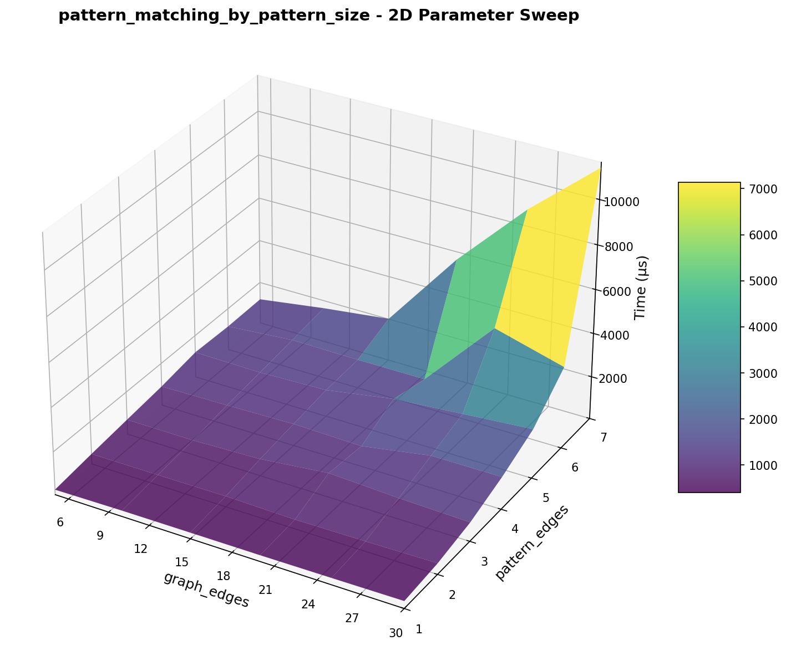

| Parameters | Median (μs) | MAD (μs) | CI Width% | Samples |
|------------|-------------|----------|-----------|---------|
| graph_edges=5, pattern_edges=1 | 275.10 | 10.04 | 8.34 | 5 |
| graph_edges=5, pattern_edges=2 | 510.54 | 6.22 | 5.00 | 4 |
| graph_edges=5, pattern_edges=3 | 721.16 | 16.13 | 8.12 | 3 |
| graph_edges=5, pattern_edges=4 | 926.36 | 14.26 | 6.51 | 3 |
| graph_edges=5, pattern_edges=5 | 1225.74 | 6.72 | 8.40 | 3 |
| graph_edges=5, pattern_edges=6 | 1157.36 | 0.93 | 1.91 | 4 |
| graph_edges=5, pattern_edges=7 | 1187.36 | 9.79 | 3.37 | 5 |
| graph_edges=10, pattern_edges=1 | 305.47 | 15.24 | 9.91 | 13 |
| graph_edges=10, pattern_edges=2 | 511.86 | 32.95 | 8.27 | 7 |
| graph_edges=10, pattern_edges=3 | 716.04 | 17.32 | 9.38 | 5 |
| graph_edges=10, pattern_edges=4 | 984.13 | 6.60 | 8.76 | 3 |
| graph_edges=10, pattern_edges=5 | 1172.15 | 28.37 | 9.89 | 3 |
| graph_edges=10, pattern_edges=6 | 1399.20 | 35.80 | 8.64 | 6 |
| graph_edges=10, pattern_edges=7 | 1632.66 | 59.54 | 9.78 | 5 |
| graph_edges=15, pattern_edges=1 | 319.52 | 11.45 | 7.65 | 16 |
| graph_edges=15, pattern_edges=2 | 530.15 | 1.17 | 3.99 | 3 |
| graph_edges=15, pattern_edges=3 | 761.74 | 63.20 | 9.76 | 66 |
| graph_edges=15, pattern_edges=4 | 985.21 | 59.15 | 9.13 | 93 |
| graph_edges=15, pattern_edges=5 | 1189.45 | 67.12 | 9.54 | 108 |
| graph_edges=15, pattern_edges=6 | 1380.38 | 24.99 | 8.32 | 15 |
| graph_edges=15, pattern_edges=7 | 1602.96 | 212.77 | 15.44 | 150 |
| graph_edges=20, pattern_edges=1 | 324.83 | 17.98 | 9.46 | 7 |
| graph_edges=20, pattern_edges=2 | 465.21 | 113.92 | 9.98 | 93 |
| graph_edges=20, pattern_edges=3 | 939.91 | 361.41 | 13.63 | 150 |
| graph_edges=20, pattern_edges=4 | 975.13 | 27.09 | 8.56 | 9 |
| graph_edges=20, pattern_edges=5 | 1251.05 | 399.76 | 20.81 | 150 |
| graph_edges=20, pattern_edges=6 | 1375.32 | 12.74 | 4.19 | 5 |
| graph_edges=20, pattern_edges=7 | 3097.05 | 2290.81 | 35.50 | 150 |
| graph_edges=25, pattern_edges=1 | 349.50 | 7.36 | 8.87 | 5 |
| graph_edges=25, pattern_edges=2 | 494.91 | 84.76 | 9.99 | 33 |
| graph_edges=25, pattern_edges=3 | 859.08 | 244.71 | 11.42 | 150 |
| graph_edges=25, pattern_edges=4 | 1168.69 | 413.98 | 17.02 | 150 |
| graph_edges=25, pattern_edges=5 | 1398.70 | 613.00 | 21.43 | 150 |
| graph_edges=25, pattern_edges=6 | 2672.26 | 2109.43 | 32.18 | 150 |
| graph_edges=25, pattern_edges=7 | 6258.02 | 5631.37 | 30.78 | 150 |
| graph_edges=30, pattern_edges=1 | 379.17 | 22.64 | 9.74 | 6 |
| graph_edges=30, pattern_edges=2 | 535.75 | 48.12 | 9.85 | 16 |
| graph_edges=30, pattern_edges=3 | 838.80 | 145.96 | 9.94 | 110 |
| graph_edges=30, pattern_edges=4 | 1115.63 | 394.95 | 18.10 | 150 |
| graph_edges=30, pattern_edges=5 | 1655.82 | 880.04 | 23.60 | 150 |
| graph_edges=30, pattern_edges=6 | 2635.74 | 1988.03 | 28.10 | 150 |
| graph_edges=30, pattern_edges=7 | 5654.93 | 5786.53 | 36.49 | 150 |

## Event Relationships Benchmarks

### causal_edges_overhead

Measures the overhead of computing causal edges during evolution (1-3 steps)

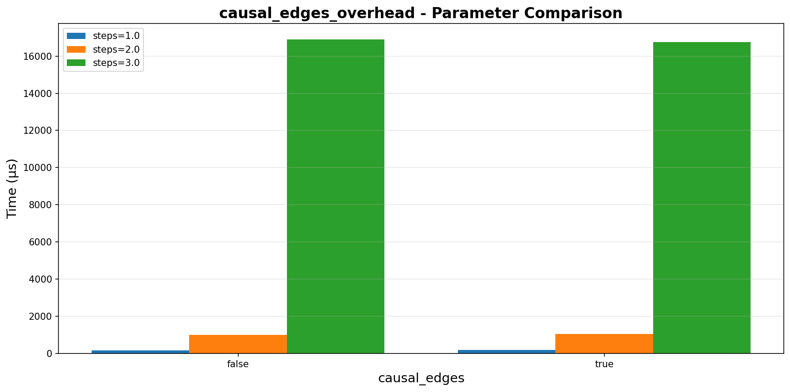

| Parameters | Median (μs) | MAD (μs) | CI Width% | Samples |
|------------|-------------|----------|-----------|---------|
| causal_edges=false, steps=1 | 162.64 | 16.71 | 9.80 | 18 |
| causal_edges=true, steps=1 | 183.19 | 26.60 | 9.70 | 26 |
| causal_edges=true, steps=2 | 1034.20 | 40.85 | 8.83 | 8 |
| causal_edges=false, steps=2 | 1007.07 | 3.98 | 6.78 | 2 |
| causal_edges=true, steps=3 | 16651.55 | 55.21 | 6.33 | 3 |
| causal_edges=false, steps=3 | 16896.94 | 123.03 | 2.44 | 3 |

### transitive_reduction_overhead

Isolates transitive reduction overhead by comparing evolution with it enabled vs disabled

| Parameters | Median (μs) | MAD (μs) | CI Width% | Samples |
|------------|-------------|----------|-----------|---------|
| steps=1, transitive_reduction=false | 471.73 | 18.28 | 8.31 | 13 |
| steps=1, transitive_reduction=true | 469.07 | 13.68 | 8.47 | 5 |
| steps=2, transitive_reduction=true | 6954.93 | 41.11 | 3.03 | 3 |
| steps=2, transitive_reduction=false | 6812.81 | 86.61 | 6.66 | 4 |
| steps=3, transitive_reduction=true | 189202.57 | 1011.87 | 9.17 | 2 |
| steps=3, transitive_reduction=false | 187828.35 | 691.34 | 3.57 | 3 |

## Uniqueness Trees Benchmarks

### uniqueness_tree_2d_sweep

2D parameter sweep: edges vs symmetry_groups for surface plots

| Parameters | Median (μs) | MAD (μs) | CI Width% | Samples |
|------------|-------------|----------|-----------|---------|
| edges=2, symmetry_groups=1 | 1.30 | 0.01 | 9.23 | 29 |
| edges=2, symmetry_groups=2 | 2.12 | 0.04 | 5.13 | 9 |
| edges=4, symmetry_groups=1 | 1.57 | 0.02 | 2.56 | 9 |
| edges=4, symmetry_groups=2 | 2.26 | 0.00 | 6.38 | 5 |
| edges=4, symmetry_groups=3 | 3.08 | 0.04 | 9.99 | 8 |
| edges=4, symmetry_groups=4 | 4.04 | 0.05 | 6.85 | 4 |
| edges=6, symmetry_groups=1 | 1.73 | 0.02 | 5.47 | 6 |
| edges=6, symmetry_groups=2 | 2.34 | 0.02 | 3.19 | 5 |
| edges=6, symmetry_groups=3 | 3.15 | 0.03 | 4.31 | 4 |
| edges=6, symmetry_groups=4 | 3.92 | 0.05 | 5.90 | 12 |
| edges=6, symmetry_groups=5 | 4.75 | 0.15 | 8.32 | 7 |
| edges=6, symmetry_groups=6 | 5.61 | 0.11 | 8.32 | 6 |
| edges=8, symmetry_groups=1 | 1.85 | 0.03 | 5.10 | 27 |
| edges=8, symmetry_groups=2 | 2.52 | 0.01 | 4.11 | 5 |
| edges=8, symmetry_groups=3 | 3.50 | 0.03 | 3.49 | 4 |
| edges=8, symmetry_groups=4 | 4.01 | 0.04 | 3.10 | 4 |
| edges=8, symmetry_groups=5 | 4.92 | 0.12 | 9.29 | 4 |
| edges=8, symmetry_groups=6 | 5.90 | 0.31 | 9.31 | 7 |
| edges=10, symmetry_groups=1 | 2.07 | 0.01 | 3.04 | 5 |
| edges=10, symmetry_groups=2 | 2.86 | 0.03 | 9.15 | 6 |
| edges=10, symmetry_groups=3 | 3.60 | 0.08 | 7.93 | 6 |
| edges=10, symmetry_groups=4 | 4.20 | 0.08 | 9.44 | 5 |
| edges=10, symmetry_groups=5 | 4.87 | 0.09 | 8.84 | 5 |
| edges=10, symmetry_groups=6 | 6.21 | 0.25 | 7.80 | 7 |
| edges=12, symmetry_groups=1 | 2.21 | 0.02 | 1.11 | 13 |
| edges=12, symmetry_groups=2 | 2.91 | 0.06 | 8.13 | 5 |
| edges=12, symmetry_groups=3 | 3.57 | 0.00 | 7.29 | 4 |
| edges=12, symmetry_groups=4 | 4.24 | 0.10 | 9.76 | 5 |
| edges=12, symmetry_groups=5 | 5.08 | 0.12 | 9.27 | 6 |
| edges=12, symmetry_groups=6 | 4.02 | 0.12 | 9.82 | 8 |
| edges=14, symmetry_groups=1 | 1.28 | 0.04 | 9.72 | 11 |
| edges=14, symmetry_groups=2 | 2.83 | 0.16 | 9.93 | 83 |
| edges=14, symmetry_groups=3 | 3.67 | 0.10 | 8.62 | 6 |
| edges=14, symmetry_groups=4 | 4.46 | 0.03 | 6.18 | 4 |
| edges=14, symmetry_groups=5 | 5.04 | 0.12 | 7.62 | 5 |
| edges=14, symmetry_groups=6 | 6.49 | 0.21 | 9.92 | 6 |
| edges=16, symmetry_groups=1 | 2.51 | 0.01 | 1.33 | 9 |
| edges=16, symmetry_groups=2 | 3.13 | 0.05 | 5.59 | 6 |
| edges=16, symmetry_groups=3 | 4.05 | 0.03 | 3.72 | 7 |
| edges=16, symmetry_groups=4 | 4.53 | 0.08 | 9.05 | 5 |
| edges=16, symmetry_groups=5 | 5.40 | 0.00 | 1.38 | 5 |
| edges=16, symmetry_groups=6 | 6.36 | 0.20 | 7.57 | 7 |
| edges=18, symmetry_groups=1 | 2.60 | 0.01 | 5.15 | 5 |
| edges=18, symmetry_groups=2 | 3.50 | 0.10 | 9.02 | 5 |
| edges=18, symmetry_groups=3 | 4.11 | 0.05 | 6.25 | 5 |
| edges=18, symmetry_groups=4 | 4.98 | 0.01 | 2.67 | 4 |
| edges=18, symmetry_groups=5 | 5.42 | 0.22 | 9.95 | 50 |
| edges=18, symmetry_groups=6 | 6.44 | 0.15 | 9.47 | 6 |
| edges=20, symmetry_groups=1 | 2.82 | 0.05 | 9.11 | 11 |
| edges=20, symmetry_groups=2 | 3.66 | 0.10 | 9.76 | 7 |
| edges=20, symmetry_groups=3 | 4.31 | 0.06 | 6.95 | 4 |
| edges=20, symmetry_groups=4 | 5.06 | 0.05 | 5.11 | 12 |
| edges=20, symmetry_groups=5 | 5.47 | 0.10 | 7.57 | 5 |
| edges=20, symmetry_groups=6 | 6.43 | 0.13 | 6.32 | 9 |

### uniqueness_tree_by_arity

Tests impact of hyperedge arity on performance

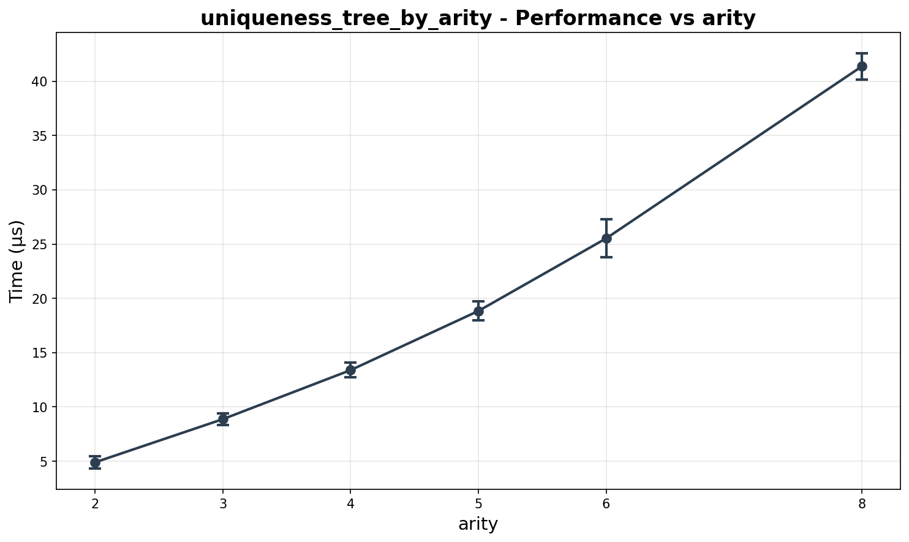

| Parameters | Median (μs) | MAD (μs) | CI Width% | Samples |
|------------|-------------|----------|-----------|---------|
| arity=2 | 5.04 | 0.16 | 9.26 | 32 |
| arity=3 | 8.74 | 0.29 | 9.03 | 13 |
| arity=4 | 13.19 | 0.20 | 8.64 | 9 |
| arity=5 | 18.82 | 0.71 | 8.49 | 7 |
| arity=6 | 24.81 | 1.84 | 9.72 | 10 |
| arity=8 | 41.01 | 0.75 | 9.33 | 5 |

### uniqueness_tree_by_edge_count

Measures uniqueness tree performance as graph size increases (arity=2)

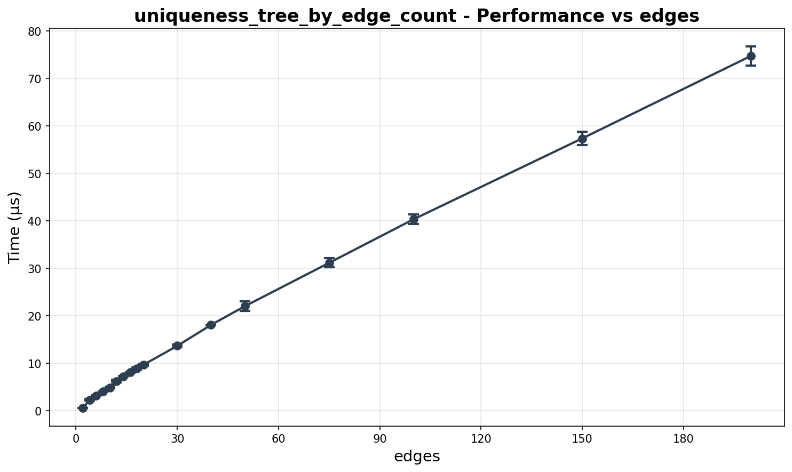

| Parameters | Median (μs) | MAD (μs) | CI Width% | Samples |
|------------|-------------|----------|-----------|---------|
| edges=2 | 0.58 | 0.00 | 6.37 | 16 |
| edges=4 | 2.33 | 0.04 | 5.11 | 34 |
| edges=6 | 3.19 | 0.07 | 9.80 | 5 |
| edges=8 | 4.01 | 0.06 | 5.78 | 4 |
| edges=10 | 4.83 | 0.26 | 9.22 | 6 |
| edges=12 | 6.13 | 0.13 | 7.90 | 7 |
| edges=14 | 7.24 | 0.01 | 2.71 | 4 |
| edges=16 | 8.02 | 0.04 | 5.11 | 4 |
| edges=18 | 8.81 | 0.31 | 6.93 | 6 |
| edges=20 | 9.68 | 0.23 | 6.82 | 5 |
| edges=30 | 13.68 | 0.26 | 5.53 | 5 |
| edges=40 | 18.08 | 0.10 | 2.05 | 4 |
| edges=50 | 22.50 | 0.37 | 8.59 | 6 |
| edges=75 | 30.98 | 1.20 | 7.62 | 5 |
| edges=100 | 40.26 | 0.98 | 7.73 | 5 |
| edges=150 | 57.61 | 0.72 | 4.33 | 9 |
| edges=200 | 74.89 | 2.15 | 8.56 | 4 |

### uniqueness_tree_by_edge_count_arity3

Measures uniqueness tree performance as graph size increases (arity=3, higher complexity)

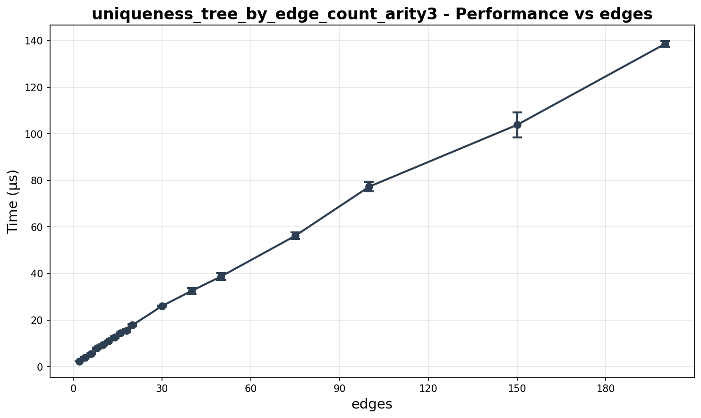

| Parameters | Median (μs) | MAD (μs) | CI Width% | Samples |
|------------|-------------|----------|-----------|---------|
| edges=2 | 2.29 | 0.08 | 6.53 | 8 |
| edges=4 | 3.95 | 0.12 | 9.91 | 5 |
| edges=6 | 5.45 | 0.19 | 9.36 | 5 |
| edges=8 | 7.77 | 0.31 | 8.41 | 7 |
| edges=10 | 9.32 | 0.13 | 7.29 | 5 |
| edges=12 | 10.90 | 0.09 | 4.98 | 4 |
| edges=14 | 12.40 | 0.40 | 8.93 | 6 |
| edges=16 | 14.27 | 0.12 | 8.16 | 4 |
| edges=18 | 15.35 | 0.20 | 9.73 | 6 |
| edges=20 | 17.82 | 0.65 | 7.04 | 6 |
| edges=30 | 25.92 | 0.04 | 3.79 | 4 |
| edges=40 | 32.48 | 1.26 | 7.20 | 7 |
| edges=50 | 38.93 | 0.83 | 3.35 | 29 |
| edges=75 | 55.80 | 0.88 | 7.93 | 5 |
| edges=100 | 76.94 | 1.14 | 4.26 | 10 |
| edges=150 | 102.19 | 3.01 | 8.77 | 8 |
| edges=200 | 139.00 | 0.77 | 4.48 | 4 |

### uniqueness_tree_by_symmetry

Shows how graph symmetry affects uniqueness tree time

| Parameters | Median (μs) | MAD (μs) | CI Width% | Samples |
|------------|-------------|----------|-----------|---------|
| symmetry_groups=1 | 2.13 | 0.04 | 8.07 | 5 |
| symmetry_groups=2 | 2.94 | 0.06 | 4.51 | 8 |
| symmetry_groups=3 | 3.67 | 0.09 | 9.55 | 4 |
| symmetry_groups=4 | 4.37 | 0.09 | 7.68 | 5 |
| symmetry_groups=6 | 5.95 | 0.03 | 6.86 | 5 |
| symmetry_groups=12 | 10.20 | 0.03 | 6.80 | 5 |

### uniqueness_tree_by_vertex_count

Measures performance as vertex count increases

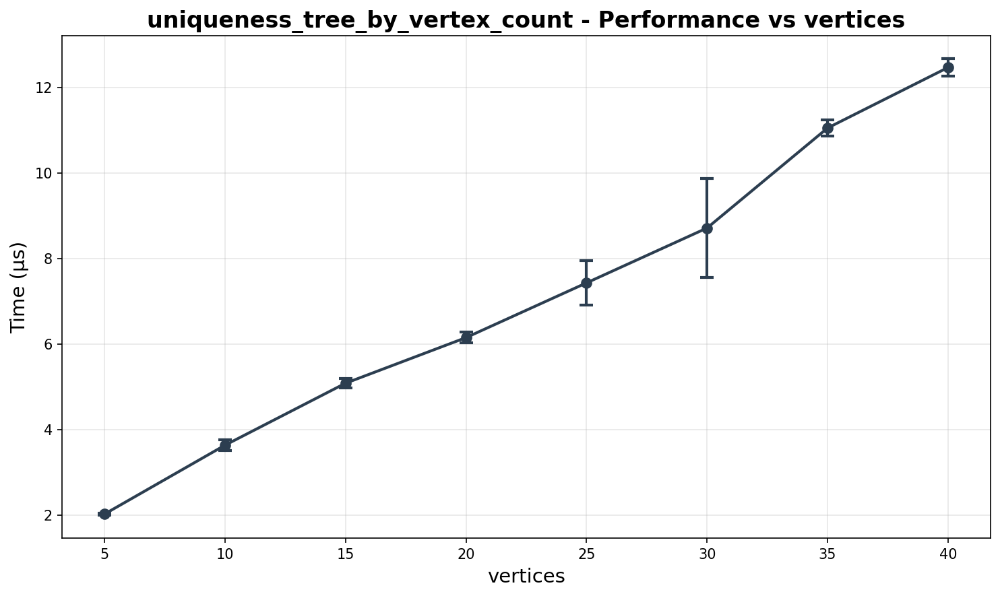

| Parameters | Median (μs) | MAD (μs) | CI Width% | Samples |
|------------|-------------|----------|-----------|---------|
| vertices=5 | 2.02 | 0.01 | 3.40 | 8 |
| vertices=10 | 3.58 | 0.08 | 8.36 | 6 |
| vertices=15 | 5.05 | 0.07 | 7.23 | 5 |
| vertices=20 | 6.15 | 0.16 | 6.52 | 5 |
| vertices=25 | 7.56 | 0.14 | 8.05 | 15 |
| vertices=30 | 9.30 | 0.51 | 9.70 | 32 |
| vertices=35 | 11.03 | 0.06 | 3.13 | 8 |
| vertices=40 | 12.46 | 0.29 | 8.31 | 4 |

## Evolution Benchmarks

### evolution_2d_sweep_threads_steps

2D sweep: evolution with rule {{1,2},{2,3}} -> {{3,2},{2,1},{1,4}} on init {{1,1},{1,1}} across thread count and steps

| Parameters | Median (μs) | MAD (μs) | CI Width% | Samples |
|------------|-------------|----------|-----------|---------|
| num_threads=1, steps=1 | 146.55 | 12.40 | 9.92 | 23 |
| num_threads=1, steps=2 | 568.33 | 9.36 | 5.77 | 3 |
| num_threads=1, steps=3 | 5797.51 | 256.70 | 7.73 | 5 |
| num_threads=1, steps=4 | 206938.79 | 123.28 | 1.02 | 2 |
| num_threads=2, steps=1 | 141.43 | 21.30 | 9.81 | 41 |
| num_threads=2, steps=2 | 377.87 | 39.17 | 9.85 | 29 |
| num_threads=2, steps=3 | 3072.88 | 159.61 | 9.39 | 5 |
| num_threads=2, steps=4 | 108982.33 | 255.45 | 7.95 | 3 |
| num_threads=3, steps=1 | 142.22 | 16.13 | 9.89 | 30 |
| num_threads=3, steps=2 | 585.34 | 31.38 | 9.14 | 20 |
| num_threads=3, steps=3 | 2110.88 | 108.23 | 9.06 | 6 |
| num_threads=3, steps=4 | 72296.44 | 1025.74 | 9.82 | 3 |
| num_threads=4, steps=1 | 137.47 | 21.95 | 9.98 | 60 |
| num_threads=4, steps=2 | 598.60 | 61.92 | 9.84 | 16 |
| num_threads=4, steps=3 | 2409.10 | 31.78 | 4.51 | 4 |
| num_threads=4, steps=4 | 56473.38 | 687.96 | 7.04 | 3 |
| num_threads=5, steps=1 | 138.23 | 8.86 | 9.64 | 25 |
| num_threads=5, steps=2 | 559.42 | 21.96 | 4.67 | 9 |
| num_threads=5, steps=3 | 2171.00 | 2.87 | 1.51 | 5 |
| num_threads=5, steps=4 | 47411.94 | 787.77 | 7.88 | 5 |
| num_threads=6, steps=1 | 130.07 | 2.16 | 8.86 | 7 |
| num_threads=6, steps=2 | 579.69 | 42.93 | 9.87 | 14 |
| num_threads=6, steps=3 | 2128.45 | 124.28 | 8.90 | 13 |
| num_threads=6, steps=4 | 42425.35 | 88.14 | 1.20 | 5 |
| num_threads=7, steps=1 | 149.04 | 2.97 | 4.99 | 9 |
| num_threads=7, steps=2 | 561.67 | 30.58 | 9.05 | 12 |
| num_threads=7, steps=3 | 2145.06 | 74.95 | 6.76 | 6 |
| num_threads=7, steps=4 | 37723.69 | 907.26 | 6.95 | 6 |
| num_threads=8, steps=1 | 147.89 | 7.55 | 9.23 | 7 |
| num_threads=8, steps=2 | 596.02 | 26.35 | 9.42 | 15 |
| num_threads=8, steps=3 | 1913.70 | 23.76 | 4.25 | 3 |
| num_threads=8, steps=4 | 34180.73 | 411.92 | 5.40 | 3 |
| num_threads=9, steps=1 | 188.16 | 1.20 | 8.95 | 4 |
| num_threads=9, steps=2 | 577.36 | 2.73 | 8.09 | 2 |
| num_threads=9, steps=3 | 1899.80 | 37.32 | 5.35 | 5 |
| num_threads=9, steps=4 | 32320.06 | 451.73 | 9.71 | 3 |
| num_threads=10, steps=1 | 196.35 | 2.17 | 9.13 | 6 |
| num_threads=10, steps=2 | 571.87 | 27.58 | 6.08 | 13 |
| num_threads=10, steps=3 | 1841.06 | 104.10 | 9.53 | 8 |
| num_threads=10, steps=4 | 29521.22 | 536.31 | 7.18 | 3 |
| num_threads=11, steps=1 | 215.34 | 6.48 | 6.12 | 7 |
| num_threads=11, steps=2 | 579.15 | 33.54 | 8.05 | 6 |
| num_threads=11, steps=3 | 1797.59 | 47.56 | 9.71 | 5 |
| num_threads=11, steps=4 | 28295.54 | 103.40 | 6.26 | 2 |
| num_threads=12, steps=1 | 227.70 | 10.28 | 7.44 | 7 |
| num_threads=12, steps=2 | 574.42 | 14.38 | 5.35 | 13 |
| num_threads=12, steps=3 | 1798.68 | 1.14 | 1.09 | 2 |
| num_threads=12, steps=4 | 27521.21 | 208.13 | 6.48 | 3 |
| num_threads=13, steps=1 | 260.63 | 17.58 | 9.62 | 9 |
| num_threads=13, steps=2 | 611.46 | 3.09 | 8.68 | 2 |
| num_threads=13, steps=3 | 1835.15 | 28.26 | 7.67 | 3 |
| num_threads=13, steps=4 | 26449.19 | 485.59 | 6.23 | 4 |
| num_threads=14, steps=1 | 282.24 | 17.59 | 9.81 | 8 |
| num_threads=14, steps=2 | 618.98 | 20.46 | 7.24 | 6 |
| num_threads=14, steps=3 | 1845.85 | 7.68 | 7.13 | 2 |
| num_threads=14, steps=4 | 25242.88 | 13.87 | 0.94 | 2 |
| num_threads=15, steps=1 | 293.25 | 19.55 | 9.90 | 20 |
| num_threads=15, steps=2 | 617.30 | 27.47 | 8.44 | 17 |
| num_threads=15, steps=3 | 1773.49 | 52.71 | 8.51 | 6 |
| num_threads=15, steps=4 | 24427.34 | 496.66 | 8.77 | 3 |
| num_threads=16, steps=1 | 311.41 | 12.16 | 9.99 | 6 |
| num_threads=16, steps=2 | 627.24 | 26.98 | 8.96 | 6 |
| num_threads=16, steps=3 | 1756.92 | 47.91 | 9.28 | 4 |
| num_threads=16, steps=4 | 23571.72 | 96.85 | 5.05 | 3 |
| num_threads=17, steps=1 | 318.59 | 3.82 | 3.25 | 5 |
| num_threads=17, steps=2 | 684.58 | 83.69 | 9.96 | 29 |
| num_threads=17, steps=3 | 1766.34 | 2.91 | 4.45 | 5 |
| num_threads=17, steps=4 | 22690.47 | 357.27 | 6.71 | 3 |
| num_threads=18, steps=1 | 331.77 | 0.73 | 3.76 | 2 |
| num_threads=18, steps=2 | 653.05 | 12.07 | 7.45 | 3 |
| num_threads=18, steps=3 | 1796.76 | 28.08 | 6.46 | 4 |
| num_threads=18, steps=4 | 21741.55 | 8.43 | 0.66 | 2 |
| num_threads=19, steps=1 | 357.55 | 2.71 | 4.07 | 11 |
| num_threads=19, steps=2 | 688.01 | 22.51 | 9.21 | 9 |
| num_threads=19, steps=3 | 1801.79 | 42.23 | 8.07 | 6 |
| num_threads=19, steps=4 | 21318.29 | 431.94 | 7.37 | 4 |
| num_threads=20, steps=1 | 377.96 | 15.43 | 8.00 | 6 |
| num_threads=20, steps=2 | 656.77 | 2.11 | 7.13 | 5 |
| num_threads=20, steps=3 | 1815.56 | 28.19 | 7.67 | 3 |
| num_threads=20, steps=4 | 20847.84 | 117.26 | 2.88 | 4 |
| num_threads=21, steps=1 | 406.44 | 8.47 | 9.36 | 5 |
| num_threads=21, steps=2 | 753.89 | 1.24 | 4.55 | 3 |
| num_threads=21, steps=3 | 1857.70 | 47.66 | 8.36 | 4 |
| num_threads=21, steps=4 | 19920.88 | 29.52 | 2.54 | 2 |
| num_threads=22, steps=1 | 428.85 | 23.36 | 9.69 | 13 |
| num_threads=22, steps=2 | 712.26 | 22.79 | 9.98 | 7 |
| num_threads=22, steps=3 | 1785.69 | 42.15 | 7.66 | 5 |
| num_threads=22, steps=4 | 20253.71 | 1035.31 | 9.96 | 5 |
| num_threads=23, steps=1 | 416.01 | 5.95 | 8.11 | 3 |
| num_threads=23, steps=2 | 732.56 | 120.45 | 9.90 | 61 |
| num_threads=23, steps=3 | 1737.88 | 39.62 | 7.08 | 5 |
| num_threads=23, steps=4 | 20207.19 | 540.57 | 8.33 | 5 |
| num_threads=24, steps=1 | 441.20 | 23.09 | 9.38 | 7 |
| num_threads=24, steps=2 | 709.74 | 113.74 | 9.92 | 57 |
| num_threads=24, steps=3 | 1753.87 | 31.30 | 6.87 | 6 |
| num_threads=24, steps=4 | 19794.43 | 455.16 | 7.38 | 4 |
| num_threads=25, steps=1 | 447.31 | 10.31 | 8.76 | 4 |
| num_threads=25, steps=2 | 681.48 | 85.15 | 9.95 | 56 |
| num_threads=25, steps=3 | 1769.21 | 108.54 | 9.58 | 14 |
| num_threads=25, steps=4 | 19315.46 | 2.99 | 0.27 | 2 |
| num_threads=26, steps=1 | 452.55 | 28.59 | 6.44 | 13 |
| num_threads=26, steps=2 | 764.03 | 161.69 | 9.90 | 81 |
| num_threads=26, steps=3 | 1878.00 | 154.67 | 9.53 | 13 |
| num_threads=26, steps=4 | 18410.76 | 457.72 | 8.63 | 3 |
| num_threads=27, steps=1 | 460.37 | 12.09 | 8.60 | 7 |
| num_threads=27, steps=2 | 674.39 | 87.02 | 9.90 | 58 |
| num_threads=27, steps=3 | 1873.14 | 4.11 | 4.37 | 5 |
| num_threads=27, steps=4 | 18181.79 | 143.99 | 6.44 | 5 |
| num_threads=28, steps=1 | 479.58 | 2.47 | 8.82 | 2 |
| num_threads=28, steps=2 | 788.17 | 201.21 | 9.96 | 67 |
| num_threads=28, steps=3 | 1720.62 | 31.57 | 9.33 | 5 |
| num_threads=28, steps=4 | 18069.98 | 140.93 | 8.15 | 8 |
| num_threads=29, steps=1 | 495.73 | 12.17 | 8.33 | 5 |
| num_threads=29, steps=2 | 860.30 | 244.56 | 9.99 | 92 |
| num_threads=29, steps=3 | 1761.31 | 14.04 | 3.80 | 4 |
| num_threads=29, steps=4 | 17804.71 | 1098.69 | 9.59 | 7 |
| num_threads=30, steps=1 | 548.99 | 36.79 | 9.49 | 6 |
| num_threads=30, steps=2 | 878.01 | 214.36 | 9.99 | 66 |
| num_threads=30, steps=3 | 1690.37 | 3.07 | 3.12 | 2 |
| num_threads=30, steps=4 | 18194.87 | 144.54 | 5.94 | 5 |
| num_threads=31, steps=1 | 519.59 | 10.91 | 7.77 | 4 |
| num_threads=31, steps=2 | 772.81 | 182.62 | 9.95 | 81 |
| num_threads=31, steps=3 | 1740.04 | 15.34 | 8.57 | 4 |
| num_threads=31, steps=4 | 17504.21 | 344.17 | 6.16 | 5 |
| num_threads=32, steps=1 | 530.98 | 11.45 | 7.56 | 15 |
| num_threads=32, steps=2 | 674.51 | 22.62 | 9.53 | 6 |
| num_threads=32, steps=3 | 1837.90 | 35.84 | 6.73 | 5 |
| num_threads=32, steps=4 | 18454.03 | 146.59 | 4.30 | 6 |

### evolution_multi_rule_by_rule_count

Tests evolution performance with increasing rule complexity (1-3 rules with mixed arities)

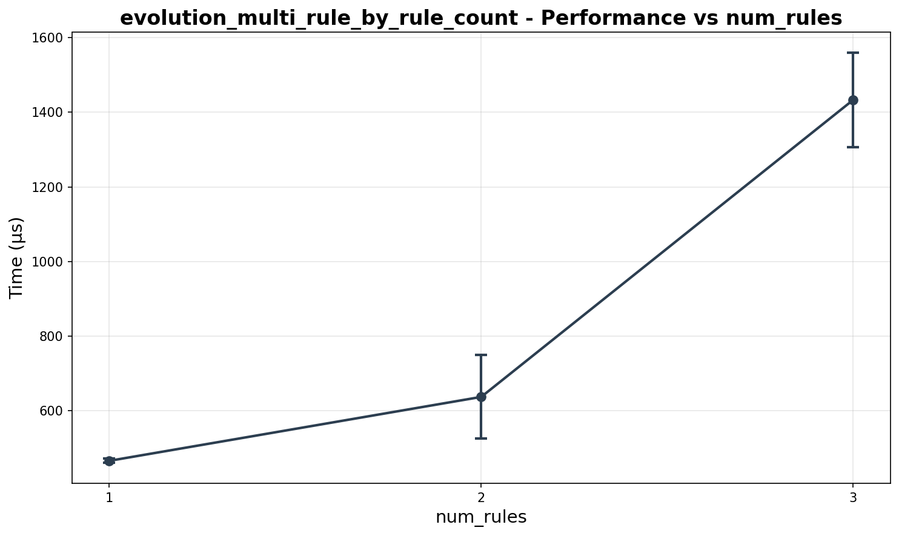

| Parameters | Median (μs) | MAD (μs) | CI Width% | Samples |
|------------|-------------|----------|-----------|---------|
| num_rules=1 | 463.35 | 3.92 | 5.85 | 5 |
| num_rules=2 | 600.00 | 113.39 | 9.95 | 50 |
| num_rules=3 | 1356.75 | 68.24 | 9.84 | 14 |

### evolution_thread_scaling

Evaluates parallel speedup from 1 thread up to full hardware concurrency (3-step evolution)

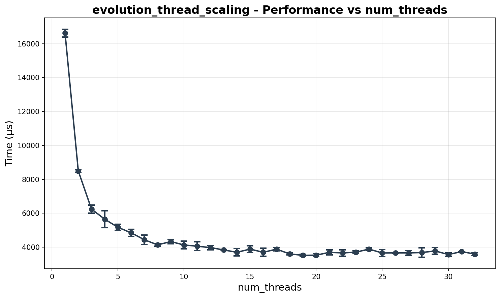

| Parameters | Median (μs) | MAD (μs) | CI Width% | Samples |
|------------|-------------|----------|-----------|---------|
| num_threads=1 | 16698.76 | 140.12 | 6.59 | 3 |
| num_threads=2 | 8467.24 | 37.46 | 4.64 | 3 |
| num_threads=3 | 6240.46 | 177.00 | 6.52 | 9 |
| num_threads=4 | 5705.34 | 302.34 | 9.99 | 14 |
| num_threads=5 | 5150.27 | 261.00 | 8.83 | 5 |
| num_threads=6 | 4833.59 | 282.69 | 8.23 | 6 |
| num_threads=7 | 4375.31 | 204.44 | 9.23 | 10 |
| num_threads=8 | 4110.60 | 29.45 | 8.14 | 3 |
| num_threads=9 | 4354.09 | 129.23 | 9.69 | 4 |
| num_threads=10 | 4145.89 | 263.99 | 9.83 | 6 |
| num_threads=11 | 4132.76 | 388.42 | 9.75 | 9 |
| num_threads=12 | 3957.93 | 124.65 | 9.92 | 4 |
| num_threads=13 | 3839.68 | 1.55 | 0.69 | 2 |
| num_threads=14 | 3722.39 | 323.98 | 9.59 | 8 |
| num_threads=15 | 3804.23 | 105.79 | 9.16 | 6 |
| num_threads=16 | 3747.72 | 259.82 | 9.16 | 10 |
| num_threads=17 | 3870.60 | 87.98 | 7.96 | 5 |
| num_threads=18 | 3623.54 | 40.94 | 8.21 | 3 |
| num_threads=19 | 3521.17 | 84.31 | 8.24 | 3 |
| num_threads=20 | 3584.14 | 21.61 | 6.02 | 6 |
| num_threads=21 | 3645.31 | 110.75 | 7.59 | 6 |
| num_threads=22 | 3691.59 | 180.87 | 9.45 | 6 |
| num_threads=23 | 3673.87 | 37.95 | 7.52 | 5 |
| num_threads=24 | 3866.12 | 42.81 | 8.47 | 4 |
| num_threads=25 | 3630.47 | 250.62 | 8.88 | 8 |
| num_threads=26 | 3665.50 | 14.51 | 6.78 | 2 |
| num_threads=27 | 3691.35 | 116.28 | 9.02 | 5 |
| num_threads=28 | 3594.32 | 246.93 | 9.69 | 11 |
| num_threads=29 | 3779.49 | 210.78 | 9.86 | 6 |
| num_threads=30 | 3569.92 | 92.27 | 7.07 | 6 |
| num_threads=31 | 3741.64 | 9.15 | 4.19 | 2 |
| num_threads=32 | 3566.43 | 36.95 | 7.92 | 4 |

### evolution_with_self_loops

Tests evolution performance on hypergraphs containing self-loop edges

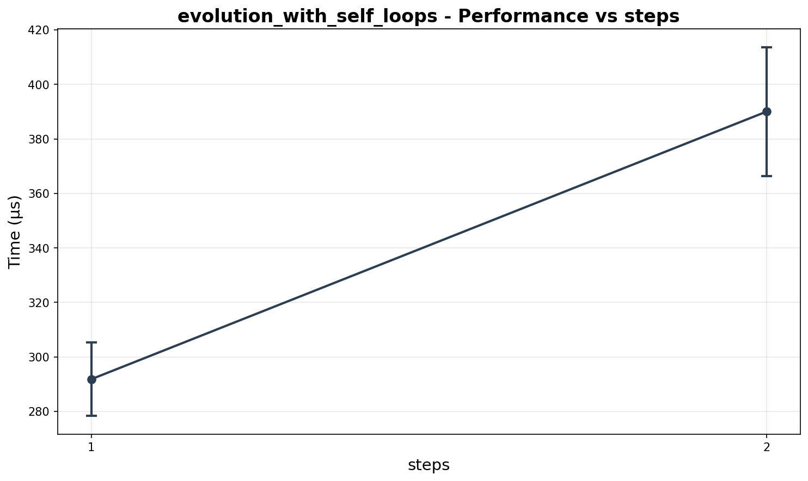

| Parameters | Median (μs) | MAD (μs) | CI Width% | Samples |
|------------|-------------|----------|-----------|---------|
| steps=1 | 290.28 | 8.51 | 6.60 | 12 |
| steps=2 | 380.07 | 10.64 | 9.69 | 8 |

## Job System Benchmarks

### job_system_2d_sweep

2D parameter sweep of job system across thread count and batch size for parallel scalability analysis

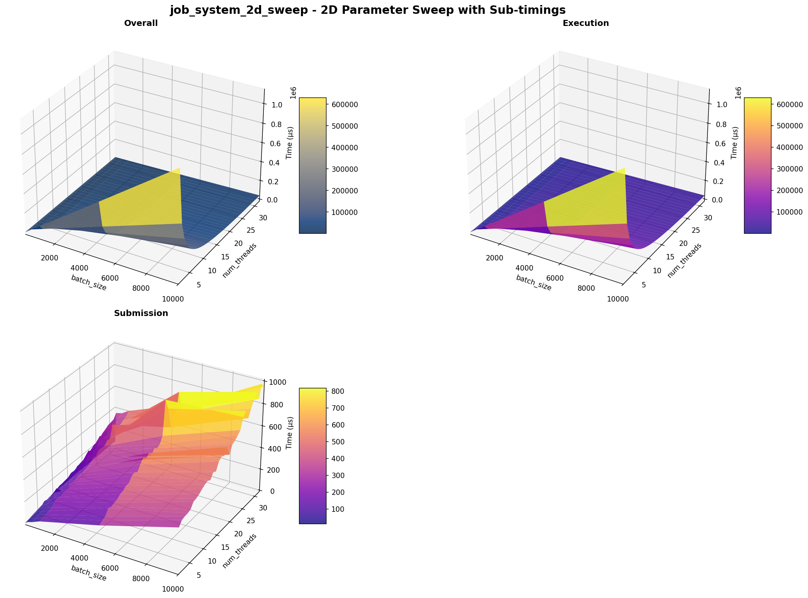

| Parameters | Median (μs) | MAD (μs) | CI Width% | Samples | Execution (μs) | Submission (μs) |
|------------|-------------|----------|-----------|---------|-----------------|-----------------|
| batch_size=10, num_threads=1 | 1213.51 | 47.40 | 9.99 | 5 | 1191.42 | 8.59 |
| batch_size=10, num_threads=2 | 594.89 | 7.74 | 5.31 | 5 | 579.89 | 13.42 |
| batch_size=10, num_threads=3 | 477.89 | 10.08 | 6.19 | 4 | 456.75 | 20.78 |
| batch_size=10, num_threads=4 | 354.62 | 16.89 | 8.04 | 6 | 328.65 | 28.08 |
| batch_size=10, num_threads=5 | 277.84 | 1.19 | 7.37 | 2 | 242.26 | 34.54 |
| batch_size=10, num_threads=6 | 267.82 | 0.17 | 4.97 | 5 | 224.49 | 41.31 |
| batch_size=10, num_threads=7 | 263.44 | 0.51 | 6.59 | 3 | 216.62 | 47.59 |
| batch_size=10, num_threads=8 | 249.46 | 3.26 | 6.64 | 4 | 196.15 | 53.88 |
| batch_size=10, num_threads=9 | 244.99 | 5.66 | 7.88 | 4 | 184.62 | 60.13 |
| batch_size=10, num_threads=10 | 189.15 | 1.70 | 8.68 | 6 | 121.73 | 66.29 |
| batch_size=10, num_threads=11 | 187.75 | 2.28 | 5.88 | 5 | 123.12 | 67.01 |
| batch_size=10, num_threads=12 | 194.62 | 2.15 | 3.70 | 5 | 126.27 | 67.36 |
| batch_size=10, num_threads=13 | 186.68 | 0.60 | 8.97 | 5 | 123.05 | 67.33 |
| batch_size=10, num_threads=14 | 193.33 | 6.69 | 6.71 | 6 | 125.29 | 66.59 |
| batch_size=10, num_threads=15 | 195.28 | 9.06 | 9.51 | 6 | 125.74 | 67.40 |
| batch_size=10, num_threads=16 | 196.10 | 8.04 | 7.53 | 6 | 126.43 | 68.77 |
| batch_size=10, num_threads=17 | 188.34 | 0.54 | 1.31 | 5 | 119.78 | 68.08 |
| batch_size=10, num_threads=18 | 194.47 | 0.82 | 7.19 | 2 | 122.29 | 70.70 |
| batch_size=10, num_threads=19 | 195.91 | 0.30 | 2.59 | 2 | 124.15 | 70.56 |
| batch_size=10, num_threads=20 | 189.89 | 3.90 | 8.06 | 5 | 122.16 | 68.90 |
| batch_size=10, num_threads=21 | 194.57 | 3.24 | 6.52 | 4 | 123.77 | 70.45 |
| batch_size=10, num_threads=22 | 192.88 | 2.26 | 6.31 | 5 | 126.93 | 67.42 |
| batch_size=10, num_threads=23 | 196.48 | 8.75 | 7.42 | 6 | 126.83 | 67.40 |
| batch_size=10, num_threads=24 | 197.33 | 0.56 | 4.84 | 2 | 127.81 | 68.63 |
| batch_size=10, num_threads=25 | 189.27 | 5.24 | 9.83 | 6 | 125.57 | 67.62 |
| batch_size=10, num_threads=26 | 196.50 | 1.80 | 9.84 | 5 | 129.62 | 67.51 |
| batch_size=10, num_threads=27 | 194.28 | 6.17 | 8.53 | 6 | 123.78 | 69.20 |
| batch_size=10, num_threads=28 | 198.10 | 8.14 | 9.51 | 9 | 124.64 | 71.41 |
| batch_size=10, num_threads=29 | 203.16 | 13.29 | 8.90 | 7 | 132.85 | 69.91 |
| batch_size=10, num_threads=30 | 198.83 | 4.56 | 4.93 | 12 | 128.73 | 70.77 |
| batch_size=10, num_threads=31 | 196.16 | 6.86 | 9.27 | 5 | 128.08 | 69.88 |
| batch_size=10, num_threads=32 | 206.50 | 8.72 | 9.89 | 14 | 140.57 | 69.78 |
| batch_size=50, num_threads=1 | 5823.25 | 38.06 | 8.11 | 3 | 5851.41 | 11.12 |
| batch_size=50, num_threads=2 | 2841.47 | 22.00 | 6.43 | 3 | 2837.17 | 16.42 |
| batch_size=50, num_threads=3 | 2040.25 | 113.40 | 8.16 | 6 | 2019.62 | 23.80 |
| batch_size=50, num_threads=4 | 1533.45 | 15.37 | 9.33 | 3 | 1491.18 | 30.34 |
| batch_size=50, num_threads=5 | 1218.08 | 37.27 | 9.04 | 8 | 1200.41 | 37.17 |
| batch_size=50, num_threads=6 | 1030.39 | 19.48 | 6.36 | 3 | 985.57 | 43.96 |
| batch_size=50, num_threads=7 | 911.92 | 3.16 | 2.65 | 3 | 847.85 | 64.63 |
| batch_size=50, num_threads=8 | 813.64 | 6.41 | 9.71 | 3 | 747.40 | 58.57 |
| batch_size=50, num_threads=9 | 709.01 | 13.52 | 8.79 | 3 | 642.47 | 63.52 |
| batch_size=50, num_threads=10 | 638.99 | 5.90 | 9.30 | 3 | 570.27 | 72.54 |
| batch_size=50, num_threads=11 | 626.78 | 15.82 | 8.49 | 6 | 560.21 | 78.67 |
| batch_size=50, num_threads=12 | 593.56 | 6.14 | 9.81 | 3 | 496.05 | 91.72 |
| batch_size=50, num_threads=13 | 546.00 | 10.52 | 8.86 | 3 | 450.62 | 92.87 |
| batch_size=50, num_threads=14 | 508.10 | 22.51 | 8.75 | 6 | 407.56 | 98.24 |
| batch_size=50, num_threads=15 | 494.18 | 10.19 | 7.66 | 3 | 390.42 | 102.39 |
| batch_size=50, num_threads=16 | 486.53 | 1.35 | 4.77 | 2 | 363.70 | 121.77 |
| batch_size=50, num_threads=17 | 449.23 | 22.26 | 8.62 | 6 | 333.96 | 118.36 |
| batch_size=50, num_threads=18 | 456.56 | 8.23 | 8.36 | 4 | 324.14 | 128.52 |
| batch_size=50, num_threads=19 | 422.64 | 15.28 | 8.83 | 6 | 286.92 | 141.69 |
| batch_size=50, num_threads=20 | 411.90 | 18.85 | 9.49 | 6 | 266.45 | 146.99 |
| batch_size=50, num_threads=21 | 417.04 | 11.93 | 8.28 | 6 | 255.03 | 154.00 |
| batch_size=50, num_threads=22 | 412.24 | 13.05 | 9.69 | 5 | 224.71 | 181.28 |
| batch_size=50, num_threads=23 | 412.31 | 0.46 | 1.90 | 2 | 227.36 | 184.06 |
| batch_size=50, num_threads=24 | 409.91 | 5.18 | 9.85 | 3 | 203.85 | 207.69 |
| batch_size=50, num_threads=25 | 416.09 | 21.69 | 9.61 | 11 | 192.90 | 213.05 |
| batch_size=50, num_threads=26 | 401.24 | 0.23 | 0.96 | 2 | 173.83 | 226.07 |
| batch_size=50, num_threads=27 | 413.83 | 13.62 | 8.68 | 8 | 181.43 | 232.25 |
| batch_size=50, num_threads=28 | 434.00 | 9.01 | 8.66 | 4 | 191.54 | 242.54 |
| batch_size=50, num_threads=29 | 437.81 | 8.23 | 5.40 | 7 | 202.56 | 251.37 |
| batch_size=50, num_threads=30 | 436.73 | 12.93 | 8.62 | 5 | 200.49 | 242.36 |
| batch_size=50, num_threads=31 | 433.78 | 10.30 | 8.09 | 5 | 190.42 | 248.75 |
| batch_size=50, num_threads=32 | 436.79 | 14.42 | 8.66 | 4 | 176.80 | 258.67 |
| batch_size=100, num_threads=1 | 11672.88 | 4.58 | 0.67 | 2 | 11652.88 | 16.87 |
| batch_size=100, num_threads=2 | 5764.17 | 11.40 | 3.39 | 2 | 5738.56 | 22.91 |
| batch_size=100, num_threads=3 | 3946.32 | 11.29 | 8.82 | 3 | 3876.88 | 31.01 |
| batch_size=100, num_threads=4 | 2961.25 | 56.67 | 7.63 | 3 | 2920.59 | 34.58 |
| batch_size=100, num_threads=5 | 2363.49 | 50.75 | 6.14 | 4 | 2311.75 | 45.92 |
| batch_size=100, num_threads=6 | 2024.55 | 29.02 | 5.67 | 3 | 1970.39 | 49.73 |
| batch_size=100, num_threads=7 | 1726.65 | 20.24 | 3.98 | 3 | 1665.28 | 59.99 |
| batch_size=100, num_threads=8 | 1525.77 | 28.82 | 7.60 | 3 | 1468.15 | 59.07 |
| batch_size=100, num_threads=9 | 1403.78 | 32.74 | 7.36 | 4 | 1330.71 | 66.90 |
| batch_size=100, num_threads=10 | 1238.90 | 21.41 | 6.40 | 3 | 1163.75 | 75.01 |
| batch_size=100, num_threads=11 | 1178.35 | 57.34 | 9.53 | 6 | 1080.21 | 83.01 |
| batch_size=100, num_threads=12 | 1072.04 | 20.86 | 7.84 | 3 | 984.09 | 88.43 |
| batch_size=100, num_threads=13 | 964.25 | 16.71 | 8.07 | 3 | 870.30 | 95.65 |
| batch_size=100, num_threads=14 | 939.20 | 7.03 | 4.27 | 3 | 838.84 | 101.23 |
| batch_size=100, num_threads=15 | 862.89 | 14.86 | 5.16 | 5 | 746.30 | 109.71 |
| batch_size=100, num_threads=16 | 844.68 | 0.24 | 0.49 | 2 | 727.82 | 115.67 |
| batch_size=100, num_threads=17 | 791.00 | 0.50 | 3.75 | 3 | 670.63 | 122.60 |
| batch_size=100, num_threads=18 | 773.52 | 21.55 | 7.66 | 5 | 629.14 | 146.35 |
| batch_size=100, num_threads=19 | 721.09 | 3.21 | 6.49 | 3 | 581.98 | 142.24 |
| batch_size=100, num_threads=20 | 714.35 | 2.66 | 4.07 | 4 | 551.15 | 155.90 |
| batch_size=100, num_threads=21 | 678.45 | 6.54 | 3.11 | 5 | 494.49 | 176.97 |
| batch_size=100, num_threads=22 | 688.40 | 15.13 | 8.06 | 6 | 485.36 | 185.72 |
| batch_size=100, num_threads=23 | 681.23 | 16.47 | 9.54 | 5 | 494.18 | 196.70 |
| batch_size=100, num_threads=24 | 647.05 | 5.80 | 7.42 | 4 | 452.15 | 199.29 |
| batch_size=100, num_threads=25 | 660.57 | 14.10 | 7.43 | 5 | 428.77 | 232.50 |
| batch_size=100, num_threads=26 | 624.17 | 5.51 | 6.25 | 3 | 389.36 | 235.93 |
| batch_size=100, num_threads=27 | 630.55 | 17.46 | 9.48 | 4 | 377.44 | 261.21 |
| batch_size=100, num_threads=28 | 635.43 | 1.56 | 7.72 | 3 | 364.53 | 274.76 |
| batch_size=100, num_threads=29 | 644.64 | 28.90 | 9.81 | 11 | 352.28 | 293.34 |
| batch_size=100, num_threads=30 | 647.81 | 13.34 | 7.81 | 4 | 351.17 | 298.88 |
| batch_size=100, num_threads=31 | 660.54 | 16.45 | 8.61 | 4 | 356.58 | 305.52 |
| batch_size=100, num_threads=32 | 626.53 | 35.18 | 9.70 | 8 | 285.45 | 347.55 |
| batch_size=500, num_threads=1 | 56956.09 | 268.92 | 8.09 | 2 | 56919.14 | 34.26 |
| batch_size=500, num_threads=2 | 28302.54 | 26.85 | 4.21 | 3 | 28129.11 | 42.43 |
| batch_size=500, num_threads=3 | 19264.52 | 9.63 | 0.86 | 2 | 19206.36 | 55.56 |
| batch_size=500, num_threads=4 | 14356.80 | 117.41 | 6.53 | 3 | 14359.89 | 61.90 |
| batch_size=500, num_threads=5 | 11417.33 | 119.80 | 6.17 | 3 | 11379.34 | 73.86 |
| batch_size=500, num_threads=6 | 9593.88 | 2.46 | 0.44 | 2 | 9507.10 | 84.44 |
| batch_size=500, num_threads=7 | 8308.57 | 45.46 | 3.11 | 3 | 8207.78 | 111.48 |
| batch_size=500, num_threads=8 | 7181.65 | 8.93 | 2.13 | 2 | 7083.58 | 95.82 |
| batch_size=500, num_threads=9 | 6498.54 | 30.09 | 7.94 | 2 | 6338.86 | 157.22 |
| batch_size=500, num_threads=10 | 5755.35 | 24.75 | 7.37 | 2 | 5648.57 | 104.74 |
| batch_size=500, num_threads=11 | 5361.88 | 84.42 | 7.76 | 3 | 5236.87 | 139.67 |
| batch_size=500, num_threads=12 | 4871.87 | 40.45 | 6.47 | 3 | 4766.42 | 125.16 |
| batch_size=500, num_threads=13 | 4490.03 | 6.60 | 4.69 | 3 | 4383.29 | 127.09 |
| batch_size=500, num_threads=14 | 4175.48 | 75.24 | 8.53 | 3 | 4057.38 | 129.28 |
| batch_size=500, num_threads=15 | 3938.35 | 60.58 | 5.84 | 3 | 3792.95 | 146.90 |
| batch_size=500, num_threads=16 | 3717.24 | 13.76 | 6.35 | 2 | 3565.58 | 149.17 |
| batch_size=500, num_threads=17 | 3515.76 | 8.27 | 4.03 | 2 | 3354.88 | 158.22 |
| batch_size=500, num_threads=18 | 3337.47 | 6.93 | 3.56 | 2 | 3166.21 | 168.56 |
| batch_size=500, num_threads=19 | 3148.59 | 54.18 | 8.58 | 3 | 2981.56 | 176.72 |
| batch_size=500, num_threads=20 | 3141.49 | 19.47 | 6.66 | 3 | 2892.97 | 263.65 |
| batch_size=500, num_threads=21 | 2916.22 | 18.96 | 4.57 | 3 | 2708.00 | 197.88 |
| batch_size=500, num_threads=22 | 2784.97 | 91.18 | 7.44 | 5 | 2570.19 | 219.23 |
| batch_size=500, num_threads=23 | 2670.27 | 45.42 | 7.22 | 3 | 2433.14 | 239.76 |
| batch_size=500, num_threads=24 | 2590.97 | 105.27 | 9.77 | 5 | 2310.21 | 314.00 |
| batch_size=500, num_threads=25 | 2560.50 | 0.09 | 6.32 | 4 | 2256.06 | 281.35 |
| batch_size=500, num_threads=26 | 2400.71 | 13.03 | 8.34 | 3 | 2151.54 | 265.80 |
| batch_size=500, num_threads=27 | 2390.25 | 34.12 | 5.52 | 4 | 2085.35 | 297.36 |
| batch_size=500, num_threads=28 | 2340.91 | 8.56 | 6.27 | 2 | 2022.39 | 316.28 |
| batch_size=500, num_threads=29 | 2388.64 | 49.83 | 9.09 | 3 | 2055.40 | 336.96 |
| batch_size=500, num_threads=30 | 2267.94 | 52.49 | 8.39 | 3 | 1954.78 | 313.30 |
| batch_size=500, num_threads=31 | 2208.74 | 39.65 | 7.85 | 3 | 1858.89 | 342.88 |
| batch_size=500, num_threads=32 | 2130.31 | 7.26 | 5.84 | 2 | 1769.17 | 359.59 |
| batch_size=1000, num_threads=1 | 112027.88 | 418.22 | 7.85 | 3 | 112848.76 | 62.44 |
| batch_size=1000, num_threads=2 | 55801.89 | 41.86 | 1.29 | 2 | 55728.33 | 71.16 |
| batch_size=1000, num_threads=3 | 38185.31 | 44.99 | 2.02 | 2 | 38107.73 | 75.38 |
| batch_size=1000, num_threads=4 | 28824.40 | 215.75 | 2.61 | 3 | 28732.34 | 86.11 |
| batch_size=1000, num_threads=5 | 22953.33 | 2.29 | 2.69 | 3 | 22786.81 | 93.38 |
| batch_size=1000, num_threads=6 | 19206.75 | 35.40 | 3.16 | 2 | 19080.43 | 123.54 |
| batch_size=1000, num_threads=7 | 16490.21 | 38.96 | 3.75 | 3 | 16290.55 | 139.00 |
| batch_size=1000, num_threads=8 | 14266.50 | 57.13 | 6.86 | 2 | 14140.43 | 123.50 |
| batch_size=1000, num_threads=9 | 12802.53 | 18.08 | 2.42 | 2 | 12655.91 | 141.39 |
| batch_size=1000, num_threads=10 | 11522.91 | 47.20 | 7.02 | 2 | 11377.94 | 142.42 |
| batch_size=1000, num_threads=11 | 10512.84 | 144.55 | 4.67 | 3 | 10344.94 | 166.37 |
| batch_size=1000, num_threads=12 | 9636.93 | 39.12 | 2.26 | 3 | 9482.03 | 163.22 |
| batch_size=1000, num_threads=13 | 8880.19 | 1.86 | 0.36 | 2 | 8711.26 | 166.65 |
| batch_size=1000, num_threads=14 | 8245.49 | 46.15 | 3.68 | 3 | 8041.30 | 183.22 |
| batch_size=1000, num_threads=15 | 7735.75 | 93.34 | 4.93 | 3 | 7559.20 | 182.89 |
| batch_size=1000, num_threads=16 | 7229.59 | 18.78 | 4.45 | 2 | 7039.97 | 187.29 |
| batch_size=1000, num_threads=17 | 6909.39 | 88.15 | 6.86 | 3 | 6735.01 | 194.58 |
| batch_size=1000, num_threads=18 | 6543.49 | 87.55 | 5.96 | 3 | 6322.05 | 206.32 |
| batch_size=1000, num_threads=19 | 6249.84 | 35.67 | 9.78 | 2 | 6013.52 | 233.59 |
| batch_size=1000, num_threads=20 | 6054.08 | 21.54 | 6.10 | 2 | 5823.95 | 227.50 |
| batch_size=1000, num_threads=21 | 5623.85 | 13.33 | 4.06 | 2 | 5357.96 | 263.47 |
| batch_size=1000, num_threads=22 | 5396.60 | 36.65 | 7.70 | 3 | 5096.88 | 262.20 |
| batch_size=1000, num_threads=23 | 5135.34 | 67.70 | 7.46 | 3 | 4895.64 | 257.11 |
| batch_size=1000, num_threads=24 | 5083.23 | 86.23 | 7.48 | 4 | 4771.93 | 286.92 |
| batch_size=1000, num_threads=25 | 4851.25 | 0.69 | 0.24 | 2 | 4568.09 | 280.71 |
| batch_size=1000, num_threads=26 | 4696.72 | 201.12 | 8.91 | 5 | 4340.08 | 396.23 |
| batch_size=1000, num_threads=27 | 4541.10 | 71.19 | 5.67 | 5 | 4239.49 | 280.24 |
| batch_size=1000, num_threads=28 | 4548.41 | 38.60 | 6.16 | 4 | 4236.76 | 342.00 |
| batch_size=1000, num_threads=29 | 4478.97 | 39.99 | 3.35 | 3 | 4141.37 | 336.91 |
| batch_size=1000, num_threads=30 | 4303.52 | 71.15 | 7.47 | 4 | 3918.26 | 355.19 |
| batch_size=1000, num_threads=31 | 4199.13 | 188.78 | 7.42 | 5 | 3765.18 | 364.34 |
| batch_size=1000, num_threads=32 | 4140.97 | 5.80 | 3.62 | 4 | 3708.23 | 400.84 |
| batch_size=5000, num_threads=1 | 559360.88 | 2061.47 | 6.32 | 2 | 559155.90 | 202.35 |
| batch_size=5000, num_threads=2 | 279874.53 | 1246.59 | 7.63 | 2 | 279650.47 | 221.66 |
| batch_size=5000, num_threads=3 | 190797.79 | 18.13 | 0.16 | 2 | 190559.49 | 236.11 |
| batch_size=5000, num_threads=4 | 142998.19 | 357.59 | 4.29 | 2 | 142711.30 | 284.34 |
| batch_size=5000, num_threads=5 | 113989.30 | 474.54 | 7.14 | 2 | 113715.65 | 271.44 |
| batch_size=5000, num_threads=6 | 94798.82 | 345.04 | 6.24 | 2 | 94510.07 | 286.41 |
| batch_size=5000, num_threads=7 | 81284.30 | 271.81 | 5.73 | 2 | 80988.91 | 293.09 |
| batch_size=5000, num_threads=8 | 71020.36 | 315.50 | 7.61 | 2 | 70702.16 | 315.90 |
| batch_size=5000, num_threads=9 | 62855.06 | 10.79 | 0.29 | 2 | 62530.25 | 322.56 |
| batch_size=5000, num_threads=10 | 56743.17 | 37.95 | 1.15 | 2 | 56396.97 | 343.97 |
| batch_size=5000, num_threads=11 | 51759.15 | 188.50 | 6.24 | 2 | 51412.05 | 344.89 |
| batch_size=5000, num_threads=12 | 47470.65 | 257.60 | 2.57 | 3 | 47036.46 | 386.26 |
| batch_size=5000, num_threads=13 | 43659.25 | 160.22 | 6.29 | 2 | 43258.43 | 398.51 |
| batch_size=5000, num_threads=14 | 40482.65 | 115.08 | 4.87 | 2 | 40104.17 | 376.35 |
| batch_size=5000, num_threads=15 | 38096.13 | 139.85 | 6.29 | 2 | 37671.40 | 422.27 |
| batch_size=5000, num_threads=16 | 35713.61 | 131.22 | 6.30 | 2 | 35249.05 | 462.12 |
| batch_size=5000, num_threads=17 | 33908.62 | 44.50 | 4.03 | 3 | 33338.04 | 425.32 |
| batch_size=5000, num_threads=18 | 31874.23 | 28.63 | 3.25 | 3 | 31302.04 | 459.70 |
| batch_size=5000, num_threads=19 | 30108.69 | 279.27 | 4.74 | 3 | 29631.81 | 412.06 |
| batch_size=5000, num_threads=20 | 28607.25 | 129.34 | 7.75 | 2 | 28143.00 | 461.55 |
| batch_size=5000, num_threads=21 | 27395.99 | 116.47 | 2.11 | 3 | 26930.90 | 438.93 |
| batch_size=5000, num_threads=22 | 26264.25 | 158.29 | 3.31 | 3 | 25768.32 | 451.05 |
| batch_size=5000, num_threads=23 | 25049.05 | 171.73 | 4.48 | 3 | 24604.44 | 509.90 |
| batch_size=5000, num_threads=24 | 24074.86 | 282.56 | 7.04 | 3 | 23352.35 | 814.68 |
| batch_size=5000, num_threads=25 | 23165.33 | 18.91 | 1.40 | 2 | 22448.25 | 714.26 |
| batch_size=5000, num_threads=26 | 22599.02 | 102.99 | 7.81 | 2 | 22073.13 | 522.90 |
| batch_size=5000, num_threads=27 | 21908.55 | 503.90 | 7.73 | 3 | 21296.49 | 608.10 |
| batch_size=5000, num_threads=28 | 21739.86 | 14.18 | 1.12 | 2 | 21124.28 | 611.77 |
| batch_size=5000, num_threads=29 | 20932.58 | 144.89 | 4.82 | 3 | 20211.05 | 784.02 |
| batch_size=5000, num_threads=30 | 20324.92 | 271.75 | 5.94 | 3 | 19756.17 | 604.67 |
| batch_size=5000, num_threads=31 | 19736.57 | 202.84 | 5.13 | 3 | 19164.18 | 611.88 |
| batch_size=5000, num_threads=32 | 19005.52 | 110.80 | 3.79 | 3 | 18436.04 | 610.77 |
| batch_size=10000, num_threads=1 | 1122703.18 | 549.67 | 0.84 | 2 | 1122294.39 | 405.78 |
| batch_size=10000, num_threads=2 | 559842.42 | 1221.66 | 2.53 | 3 | 558179.08 | 445.71 |
| batch_size=10000, num_threads=3 | 380230.19 | 576.34 | 2.60 | 2 | 379774.16 | 453.83 |
| batch_size=10000, num_threads=4 | 285694.84 | 117.74 | 0.71 | 2 | 285237.27 | 455.30 |
| batch_size=10000, num_threads=5 | 228333.24 | 960.99 | 7.21 | 2 | 227865.42 | 465.57 |
| batch_size=10000, num_threads=6 | 189771.29 | 46.88 | 0.42 | 2 | 189259.99 | 509.11 |
| batch_size=10000, num_threads=7 | 162764.72 | 216.29 | 2.28 | 2 | 162248.00 | 514.38 |
| batch_size=10000, num_threads=8 | 142060.91 | 357.51 | 4.31 | 2 | 141531.57 | 527.21 |
| batch_size=10000, num_threads=9 | 125987.46 | 108.24 | 1.47 | 2 | 125437.31 | 547.74 |
| batch_size=10000, num_threads=10 | 113537.65 | 93.54 | 1.41 | 2 | 112971.36 | 564.07 |
| batch_size=10000, num_threads=11 | 102859.38 | 334.45 | 5.57 | 2 | 102283.92 | 573.26 |
| batch_size=10000, num_threads=12 | 94357.18 | 31.76 | 0.58 | 2 | 93799.00 | 556.06 |
| batch_size=10000, num_threads=13 | 87410.12 | 327.32 | 6.42 | 2 | 86805.30 | 602.65 |
| batch_size=10000, num_threads=14 | 80865.56 | 72.58 | 1.54 | 2 | 80277.45 | 585.84 |
| batch_size=10000, num_threads=15 | 75666.39 | 218.98 | 4.96 | 2 | 75012.12 | 651.62 |
| batch_size=10000, num_threads=16 | 71163.85 | 33.10 | 0.80 | 2 | 70488.89 | 672.83 |
| batch_size=10000, num_threads=17 | 66858.79 | 353.85 | 9.07 | 2 | 66200.79 | 655.48 |
| batch_size=10000, num_threads=18 | 63208.27 | 2.70 | 0.07 | 2 | 62495.01 | 710.50 |
| batch_size=10000, num_threads=19 | 59573.99 | 93.46 | 2.69 | 2 | 58950.68 | 621.19 |
| batch_size=10000, num_threads=20 | 57120.56 | 316.32 | 9.49 | 2 | 56428.08 | 690.08 |
| batch_size=10000, num_threads=21 | 54347.08 | 663.98 | 4.14 | 3 | 53639.30 | 701.69 |
| batch_size=10000, num_threads=22 | 51860.38 | 229.16 | 7.57 | 2 | 51130.26 | 727.45 |
| batch_size=10000, num_threads=23 | 49779.17 | 390.33 | 4.06 | 3 | 48932.81 | 753.59 |
| batch_size=10000, num_threads=24 | 47811.14 | 569.32 | 5.15 | 3 | 46892.64 | 844.83 |
| batch_size=10000, num_threads=25 | 45930.23 | 597.36 | 5.66 | 3 | 44971.96 | 878.65 |
| batch_size=10000, num_threads=26 | 44138.34 | 614.41 | 5.42 | 3 | 43384.97 | 794.18 |
| batch_size=10000, num_threads=27 | 44242.75 | 453.74 | 5.13 | 3 | 43286.07 | 858.92 |
| batch_size=10000, num_threads=28 | 42745.73 | 531.84 | 4.49 | 3 | 41846.62 | 914.20 |
| batch_size=10000, num_threads=29 | 41677.39 | 221.31 | 4.71 | 3 | 40563.28 | 962.97 |
| batch_size=10000, num_threads=30 | 40228.73 | 189.49 | 6.13 | 3 | 39127.44 | 879.95 |
| batch_size=10000, num_threads=31 | 39256.85 | 146.85 | 3.58 | 3 | 38149.08 | 994.20 |
| batch_size=10000, num_threads=32 | 38022.61 | 243.06 | 5.72 | 3 | 36906.08 | 948.53 |

### job_system_overhead

Measures job system overhead with minimal workload across varying batch sizes

| Parameters | Median (μs) | MAD (μs) | CI Width% | Samples | Execution (μs) | Submission (μs) |
|------------|-------------|----------|-----------|---------|-----------------|-----------------|
| batch_size=10 | 85.89 | 0.55 | 3.10 | 5 | 10.58 | 68.42 |
| batch_size=100 | 679.02 | 1.48 | 0.82 | 5 | 18.83 | 658.85 |
| batch_size=1000 | 6504.12 | 40.22 | 7.06 | 4 | 0.78 | 6561.77 |
| batch_size=10000 | 66730.71 | 561.76 | 6.21 | 3 | 4.58 | 66447.12 |

### job_system_scaling_efficiency

Evaluates parallel efficiency with fixed total work across different thread counts

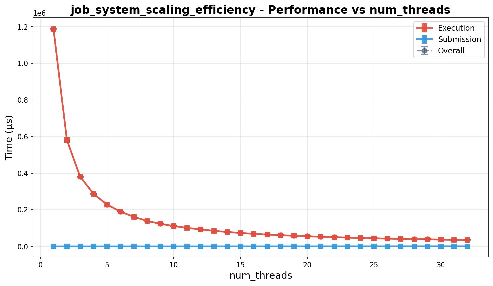

| Parameters | Median (μs) | MAD (μs) | CI Width% | Samples | Execution (μs) | Submission (μs) |
|------------|-------------|----------|-----------|---------|-----------------|-----------------|
| num_threads=1 | 1187709.82 | 2048.62 | 2.96 | 2 | 1187276.25 | 430.63 |
| num_threads=2 | 578788.51 | 10800.22 | 9.66 | 3 | 580740.88 | 581.59 |
| num_threads=3 | 379517.02 | 1931.45 | 8.72 | 2 | 379015.21 | 498.64 |
| num_threads=4 | 285717.47 | 1226.20 | 7.36 | 2 | 285248.91 | 466.05 |
| num_threads=5 | 228324.70 | 275.98 | 2.07 | 2 | 227840.49 | 481.69 |
| num_threads=6 | 190048.72 | 710.87 | 6.41 | 2 | 189530.82 | 515.03 |
| num_threads=7 | 160988.97 | 716.33 | 3.67 | 3 | 160846.93 | 571.32 |
| num_threads=8 | 139481.62 | 186.24 | 2.29 | 2 | 138959.86 | 519.19 |
| num_threads=9 | 123938.70 | 80.71 | 1.12 | 2 | 123433.64 | 502.55 |
| num_threads=10 | 111739.73 | 598.11 | 9.17 | 2 | 111202.48 | 534.54 |
| num_threads=11 | 101729.43 | 216.89 | 3.65 | 2 | 101195.56 | 531.31 |
| num_threads=12 | 93509.46 | 313.81 | 5.75 | 2 | 92943.50 | 563.64 |
| num_threads=13 | 85614.61 | 100.71 | 2.02 | 2 | 85040.03 | 571.92 |
| num_threads=14 | 79398.08 | 29.93 | 0.65 | 2 | 78822.49 | 573.28 |
| num_threads=15 | 73877.17 | 28.35 | 0.66 | 2 | 73270.60 | 604.10 |
| num_threads=16 | 69346.84 | 41.39 | 1.02 | 2 | 68734.58 | 609.72 |
| num_threads=17 | 65373.96 | 11.04 | 0.29 | 2 | 64769.18 | 602.35 |
| num_threads=18 | 62097.66 | 118.81 | 3.28 | 2 | 61415.66 | 679.44 |
| num_threads=19 | 58860.55 | 256.95 | 7.48 | 2 | 58222.90 | 635.13 |
| num_threads=20 | 56224.70 | 732.36 | 4.48 | 3 | 55579.85 | 650.92 |
| num_threads=21 | 53504.64 | 245.06 | 7.85 | 2 | 52738.51 | 763.54 |
| num_threads=22 | 51538.02 | 58.85 | 3.78 | 3 | 50585.42 | 744.38 |
| num_threads=23 | 49241.81 | 29.24 | 2.22 | 3 | 48293.01 | 829.12 |
| num_threads=24 | 46866.05 | 418.37 | 3.43 | 3 | 46082.98 | 753.51 |
| num_threads=25 | 45338.39 | 421.20 | 3.85 | 3 | 44483.33 | 808.86 |
| num_threads=26 | 43504.00 | 316.35 | 2.67 | 3 | 42727.03 | 788.25 |
| num_threads=27 | 42225.39 | 525.59 | 5.71 | 3 | 41194.62 | 944.71 |
| num_threads=28 | 40660.43 | 18.28 | 0.77 | 2 | 39744.97 | 912.81 |
| num_threads=29 | 40089.66 | 160.67 | 4.55 | 3 | 39047.29 | 885.29 |
| num_threads=30 | 38318.43 | 449.69 | 5.96 | 3 | 37238.16 | 979.06 |
| num_threads=31 | 37184.81 | 248.29 | 4.67 | 3 | 36169.64 | 901.16 |
| num_threads=32 | 35833.90 | 562.80 | 7.75 | 3 | 35005.13 | 940.80 |

## Canonicalization Benchmarks

### canonicalization_2d_sweep

2D parameter sweep: edges vs symmetry_groups for surface plots

| Parameters | Median (μs) | MAD (μs) | CI Width% | Samples |
|------------|-------------|----------|-----------|---------|
| edges=2, symmetry_groups=1 | 2.86 | 0.09 | 5.76 | 8 |
| edges=2, symmetry_groups=2 | 10.44 | 0.30 | 6.61 | 18 |
| edges=3, symmetry_groups=1 | 3.72 | 0.01 | 2.93 | 5 |
| edges=3, symmetry_groups=2 | 9.72 | 0.36 | 6.92 | 17 |
| edges=3, symmetry_groups=3 | 36.33 | 1.00 | 7.95 | 6 |
| edges=4, symmetry_groups=1 | 1.99 | 0.06 | 9.78 | 25 |
| edges=4, symmetry_groups=2 | 13.37 | 0.26 | 9.65 | 6 |
| edges=4, symmetry_groups=3 | 33.24 | 0.05 | 0.80 | 5 |
| edges=4, symmetry_groups=4 | 255.01 | 4.72 | 6.27 | 5 |
| edges=5, symmetry_groups=1 | 5.04 | 0.07 | 6.08 | 5 |
| edges=5, symmetry_groups=2 | 12.57 | 0.50 | 6.87 | 7 |
| edges=5, symmetry_groups=3 | 33.06 | 0.52 | 5.00 | 7 |
| edges=5, symmetry_groups=4 | 244.18 | 1.64 | 7.91 | 4 |
| edges=5, symmetry_groups=5 | 2494.15 | 0.94 | 0.65 | 2 |
| edges=6, symmetry_groups=1 | 5.75 | 0.05 | 2.73 | 16 |
| edges=6, symmetry_groups=2 | 16.86 | 0.36 | 5.13 | 9 |
| edges=6, symmetry_groups=3 | 46.47 | 0.24 | 5.22 | 5 |
| edges=6, symmetry_groups=4 | 309.87 | 0.51 | 2.81 | 2 |
| edges=6, symmetry_groups=5 | 2039.14 | 104.91 | 9.14 | 6 |
| edges=6, symmetry_groups=6 | 29244.50 | 594.62 | 6.37 | 4 |

### canonicalization_by_edge_count

Measures canonicalization performance as graph size increases (arity=2)

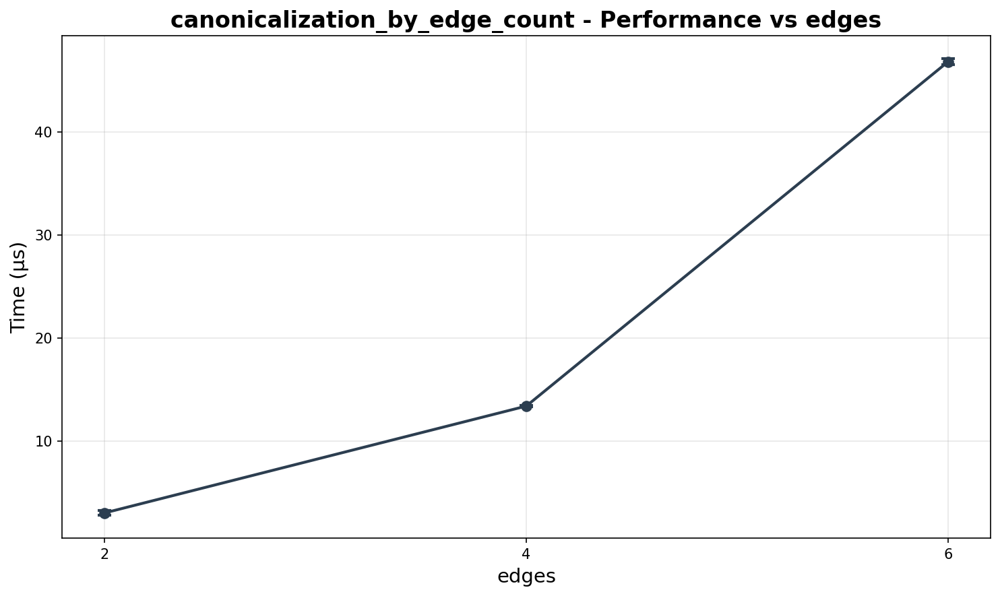

| Parameters | Median (μs) | MAD (μs) | CI Width% | Samples |
|------------|-------------|----------|-----------|---------|
| edges=2 | 3.01 | 0.08 | 6.55 | 32 |
| edges=4 | 13.36 | 0.01 | 2.60 | 5 |
| edges=6 | 46.76 | 0.32 | 1.20 | 9 |

### canonicalization_by_edge_count_arity3

Measures canonicalization performance as graph size increases (arity=3, higher complexity)

| Parameters | Median (μs) | MAD (μs) | CI Width% | Samples |
|------------|-------------|----------|-----------|---------|
| edges=2 | 3.44 | 0.01 | 9.82 | 5 |
| edges=4 | 16.72 | 0.71 | 9.97 | 8 |
| edges=6 | 60.76 | 0.60 | 3.02 | 9 |

### canonicalization_by_symmetry

Shows how graph symmetry affects canonicalization time

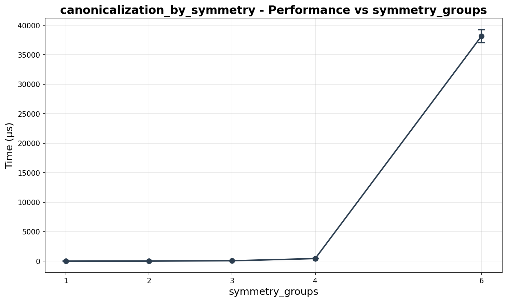

| Parameters | Median (μs) | MAD (μs) | CI Width% | Samples |
|------------|-------------|----------|-----------|---------|
| symmetry_groups=1 | 8.95 | 0.27 | 3.84 | 16 |
| symmetry_groups=2 | 23.97 | 0.71 | 6.74 | 7 |
| symmetry_groups=3 | 68.76 | 0.92 | 5.32 | 5 |
| symmetry_groups=4 | 436.26 | 6.39 | 9.89 | 4 |
| symmetry_groups=6 | 37953.96 | 901.13 | 9.24 | 4 |

## WXF Serialization Benchmarks

### wxf_deserialize_flat_list

Measures WXF deserialization time for flat integer lists of varying sizes

| Parameters | Median (μs) | MAD (μs) | CI Width% | Samples |
|------------|-------------|----------|-----------|---------|
| size=10 | 0.29 | 0.01 | 9.99 | 87 |
| size=50 | 0.65 | 0.01 | 9.56 | 4 |
| size=100 | 1.05 | 0.05 | 8.57 | 6 |
| size=500 | 4.48 | 0.00 | 1.85 | 4 |
| size=1000 | 8.56 | 0.16 | 8.81 | 3 |
| size=5000 | 40.97 | 0.26 | 4.36 | 3 |

### wxf_deserialize_nested_list

Measures WXF deserialization time for nested lists (outer_size x inner_size)

| Parameters | Median (μs) | MAD (μs) | CI Width% | Samples |
|------------|-------------|----------|-----------|---------|
| inner_size=10, outer_size=10 | 1.40 | 0.03 | 6.58 | 10 |
| inner_size=10, outer_size=20 | 3.60 | 0.04 | 2.77 | 8 |
| inner_size=10, outer_size=50 | 8.16 | 0.13 | 9.02 | 5 |
| inner_size=10, outer_size=100 | 15.36 | 0.55 | 7.36 | 5 |
| inner_size=50, outer_size=10 | 4.71 | 0.05 | 3.39 | 5 |
| inner_size=50, outer_size=20 | 10.41 | 0.10 | 3.84 | 5 |
| inner_size=50, outer_size=50 | 24.57 | 0.25 | 5.90 | 4 |
| inner_size=50, outer_size=100 | 47.67 | 0.57 | 6.15 | 3 |
| inner_size=100, outer_size=10 | 8.65 | 0.06 | 2.57 | 5 |
| inner_size=100, outer_size=20 | 18.91 | 0.19 | 5.44 | 4 |
| inner_size=100, outer_size=50 | 44.68 | 0.95 | 9.93 | 3 |
| inner_size=100, outer_size=100 | 89.54 | 0.26 | 1.26 | 4 |

### wxf_roundtrip

Measures WXF round-trip (serialize + deserialize) time for various data sizes

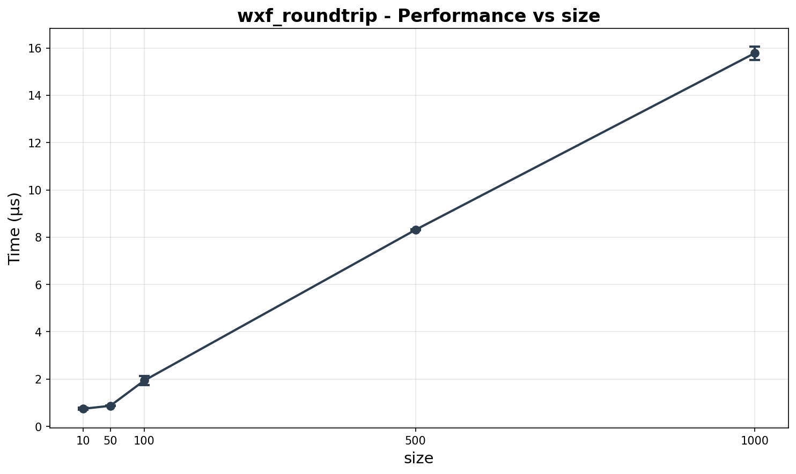

| Parameters | Median (μs) | MAD (μs) | CI Width% | Samples |
|------------|-------------|----------|-----------|---------|
| size=10 | 0.76 | 0.01 | 4.56 | 36 |
| size=50 | 0.88 | 0.01 | 2.93 | 9 |
| size=100 | 2.08 | 0.04 | 9.99 | 19 |
| size=500 | 8.31 | 0.03 | 1.44 | 4 |
| size=1000 | 15.83 | 0.29 | 8.85 | 3 |

### wxf_serialize_flat_list

Measures WXF serialization time for flat integer lists of varying sizes

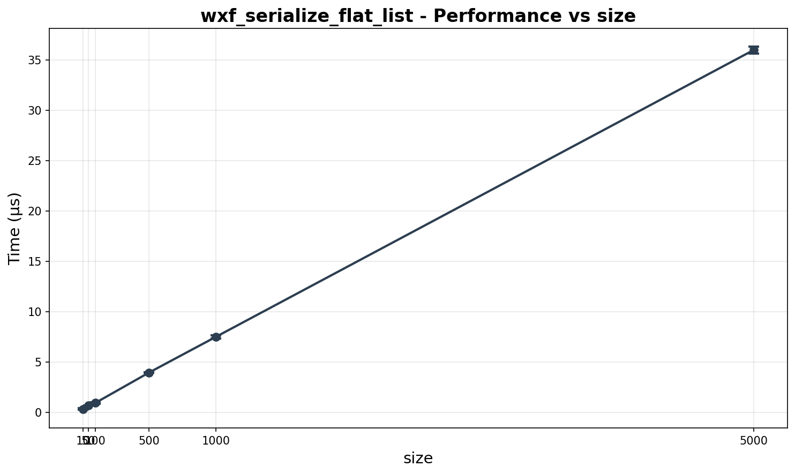

| Parameters | Median (μs) | MAD (μs) | CI Width% | Samples |
|------------|-------------|----------|-----------|---------|
| size=10 | 0.38 | 0.03 | 9.99 | 92 |
| size=50 | 0.70 | 0.01 | 4.99 | 4 |
| size=100 | 0.98 | 0.04 | 9.90 | 20 |
| size=500 | 3.93 | 0.00 | 3.42 | 4 |
| size=1000 | 7.58 | 0.05 | 9.84 | 3 |
| size=5000 | 35.88 | 0.25 | 4.70 | 3 |

### wxf_serialize_nested_list

Measures WXF serialization time for nested lists (outer_size x inner_size)

| Parameters | Median (μs) | MAD (μs) | CI Width% | Samples |
|------------|-------------|----------|-----------|---------|
| inner_size=10, outer_size=10 | 1.29 | 0.09 | 9.70 | 20 |
| inner_size=10, outer_size=20 | 2.16 | 0.03 | 6.15 | 5 |
| inner_size=10, outer_size=50 | 4.54 | 0.09 | 5.11 | 5 |
| inner_size=10, outer_size=100 | 8.45 | 0.20 | 9.61 | 5 |
| inner_size=50, outer_size=10 | 3.45 | 0.00 | 1.79 | 5 |
| inner_size=50, outer_size=20 | 6.29 | 0.03 | 2.78 | 5 |
| inner_size=50, outer_size=50 | 14.23 | 0.31 | 7.96 | 3 |
| inner_size=50, outer_size=100 | 28.06 | 0.01 | 0.50 | 5 |
| inner_size=100, outer_size=10 | 5.99 | 0.01 | 0.90 | 4 |
| inner_size=100, outer_size=20 | 11.23 | 0.03 | 1.22 | 4 |
| inner_size=100, outer_size=50 | 26.68 | 0.04 | 0.56 | 5 |
| inner_size=100, outer_size=100 | 52.20 | 0.21 | 2.65 | 3 |

## State Management Benchmarks

### full_capture_overhead

Compares evolution performance with and without full state capture enabled

| Parameters | Median (μs) | MAD (μs) | CI Width% | Samples |
|------------|-------------|----------|-----------|---------|
| full_capture=false | 215.33 | 11.15 | 9.78 | 20 |
| full_capture=true | 211.98 | 33.49 | 9.97 | 44 |

### state_storage_by_steps

Measures state storage and retrieval overhead as evolution progresses from 1 to 3 steps

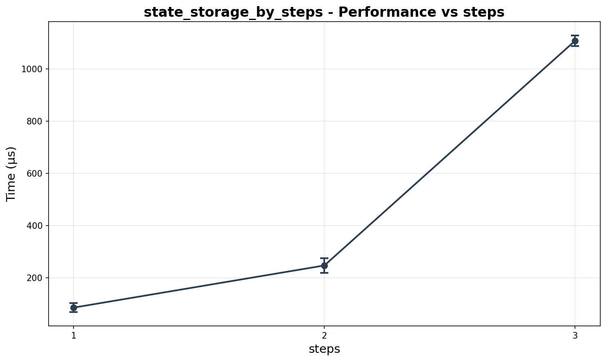

| Parameters | Median (μs) | MAD (μs) | CI Width% | Samples |
|------------|-------------|----------|-----------|---------|
| steps=1 | 83.83 | 15.66 | 9.93 | 68 |
| steps=2 | 238.68 | 22.73 | 9.84 | 23 |
| steps=3 | 1103.81 | 16.82 | 5.81 | 4 |

## Other Benchmarks

### comparative_2d_edges_steps

| Parameters | Median (μs) | MAD (μs) | CI Width% | Samples |
|------------|-------------|----------|-----------|---------|
| graph_edges=2, steps=1 | 4870.90 | 261.60 | 9.08 | 8 |
| graph_edges=2, steps=2 | 5045.60 | 254.56 | 9.73 | 6 |
| graph_edges=2, steps=3 | 5270.45 | 90.59 | 5.82 | 4 |
| graph_edges=2, steps=4 | 6232.60 | 355.23 | 9.20 | 11 |
| graph_edges=2, steps=5 | 10696.50 | 630.92 | 7.97 | 7 |
| graph_edges=3, steps=1 | 4967.00 | 196.07 | 9.18 | 9 |
| graph_edges=3, steps=2 | 5596.70 | 229.36 | 9.61 | 8 |
| graph_edges=3, steps=3 | 8286.40 | 186.66 | 5.85 | 8 |
| graph_edges=3, steps=4 | 17236.25 | 416.24 | 6.22 | 5 |
| graph_edges=3, steps=5 | 83444.30 | 4674.79 | 9.89 | 8 |
| graph_edges=4, steps=1 | 5532.00 | 444.34 | 9.90 | 13 |
| graph_edges=4, steps=2 | 7995.70 | 501.86 | 9.90 | 5 |
| graph_edges=4, steps=3 | 13970.50 | 540.56 | 9.84 | 12 |
| graph_edges=4, steps=4 | 69220.40 | 2144.28 | 9.13 | 4 |
| graph_edges=4, steps=5 | 538782.55 | 21524.61 | 9.92 | 4 |
| graph_edges=5, steps=1 | 5869.30 | 194.52 | 7.74 | 6 |
| graph_edges=5, steps=2 | 11338.55 | 337.22 | 7.81 | 5 |
| graph_edges=5, steps=3 | 34768.40 | 81.99 | 4.04 | 2 |
| graph_edges=5, steps=4 | 283855.90 | 6722.63 | 5.50 | 7 |
| graph_edges=5, steps=5 | 2955607.20 | 383.70 | 4.44 | 3 |
| graph_edges=6, steps=1 | 7868.40 | 129.06 | 9.29 | 4 |
| graph_edges=6, steps=2 | 22788.10 | 326.02 | 4.89 | 5 |
| graph_edges=6, steps=3 | 198278.30 | 1299.50 | 5.50 | 4 |
| graph_edges=6, steps=4 | 1045819.90 | 37885.77 | 6.92 | 5 |
| graph_edges=6, steps=5 | 13788012.60 | 180554.14 | 8.79 | 3 |

### comparative_2d_edges_steps_speedup

| Parameters | Median (x) |
|------------|-------------|
| graph_edges=2, steps=1 | 3.45 |
| graph_edges=2, steps=2 | 6.31 |
| graph_edges=2, steps=3 | 8.74 |
| graph_edges=2, steps=4 | 9.57 |
| graph_edges=2, steps=5 | 7.71 |
| graph_edges=3, steps=1 | 3.77 |
| graph_edges=3, steps=2 | 7.89 |
| graph_edges=3, steps=3 | 23.05 |
| graph_edges=3, steps=4 | 40.38 |
| graph_edges=3, steps=5 | 45.30 |
| graph_edges=4, steps=1 | 3.89 |
| graph_edges=4, steps=2 | 16.34 |
| graph_edges=4, steps=3 | 37.63 |
| graph_edges=4, steps=4 | 47.69 |
| graph_edges=4, steps=5 | 45.96 |
| graph_edges=5, steps=1 | 4.54 |
| graph_edges=5, steps=2 | 21.89 |
| graph_edges=5, steps=3 | 43.94 |
| graph_edges=5, steps=4 | 42.73 |
| graph_edges=5, steps=5 | 41.65 |
| graph_edges=6, steps=1 | 4.06 |
| graph_edges=6, steps=2 | 21.63 |
| graph_edges=6, steps=3 | 23.31 |
| graph_edges=6, steps=4 | 42.23 |
| graph_edges=6, steps=5 | 38.74 |

### comparative_config1

| Parameters | Median (μs) | MAD (μs) | CI Width% | Samples |
|------------|-------------|----------|-----------|---------|
| steps=1 | 5019.70 | 307.19 | 8.83 | 7 |
| steps=2 | 7010.10 | 37.81 | 7.28 | 5 |
| steps=3 | 20246.35 | 1510.18 | 9.16 | 10 |
| steps=4 | 274113.20 | 5383.47 | 6.83 | 5 |

### comparative_config1_speedup

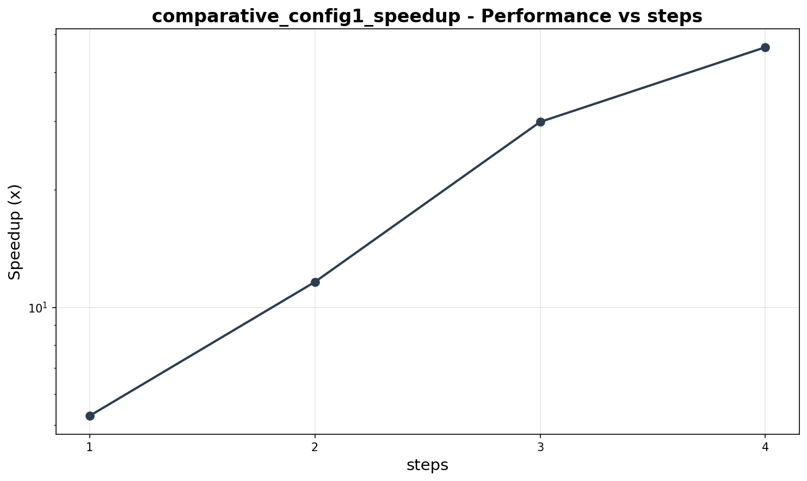

| Parameters | Median (x) |
|------------|-------------|
| steps=1 | 5.28 |
| steps=2 | 11.61 |
| steps=3 | 29.83 |
| steps=4 | 46.32 |

### comparative_config2

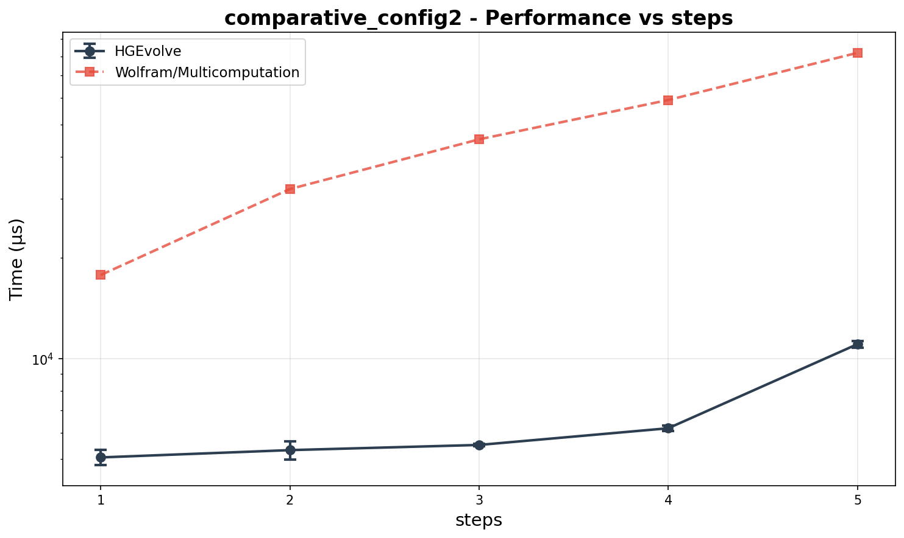

| Parameters | Median (μs) | MAD (μs) | CI Width% | Samples |
|------------|-------------|----------|-----------|---------|
| steps=1 | 5129.90 | 240.92 | 7.81 | 11 |
| steps=2 | 5187.25 | 256.42 | 9.92 | 8 |
| steps=3 | 5506.90 | 36.32 | 3.66 | 5 |
| steps=4 | 6197.65 | 96.37 | 5.57 | 5 |
| steps=5 | 11106.70 | 117.20 | 7.44 | 6 |

### comparative_config2_speedup

| Parameters | Median (x) |
|------------|-------------|
| steps=1 | 3.51 |
| steps=2 | 6.03 |
| steps=3 | 8.19 |
| steps=4 | 9.57 |
| steps=5 | 7.42 |

### comparative_config3

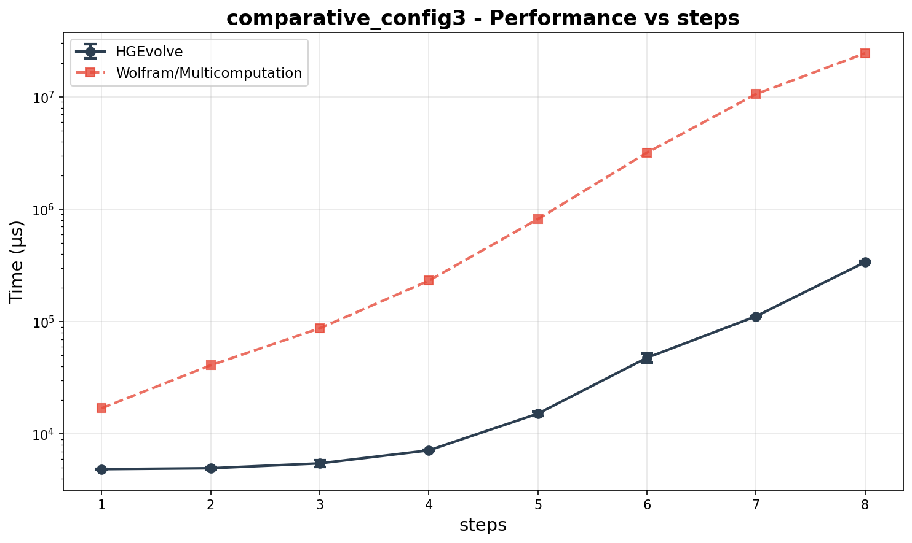

| Parameters | Median (μs) | MAD (μs) | CI Width% | Samples |
|------------|-------------|----------|-----------|---------|
| steps=1 | 4868.70 | 51.45 | 3.57 | 5 |
| steps=2 | 4980.35 | 86.21 | 6.59 | 5 |
| steps=3 | 5463.00 | 458.57 | 8.64 | 11 |
| steps=4 | 7126.20 | 30.84 | 4.62 | 4 |
| steps=5 | 14936.25 | 527.81 | 8.16 | 6 |
| steps=6 | 46599.20 | 4823.19 | 9.51 | 15 |
| steps=7 | 111497.00 | 266.42 | 4.10 | 2 |
| steps=8 | 338558.75 | 7811.37 | 7.42 | 4 |

### comparative_config3_speedup

| Parameters | Median (x) |
|------------|-------------|
| steps=1 | 3.48 |
| steps=2 | 8.24 |
| steps=3 | 15.89 |
| steps=4 | 32.33 |
| steps=5 | 53.86 |
| steps=6 | 66.85 |
| steps=7 | 94.90 |
| steps=8 | 72.22 |
