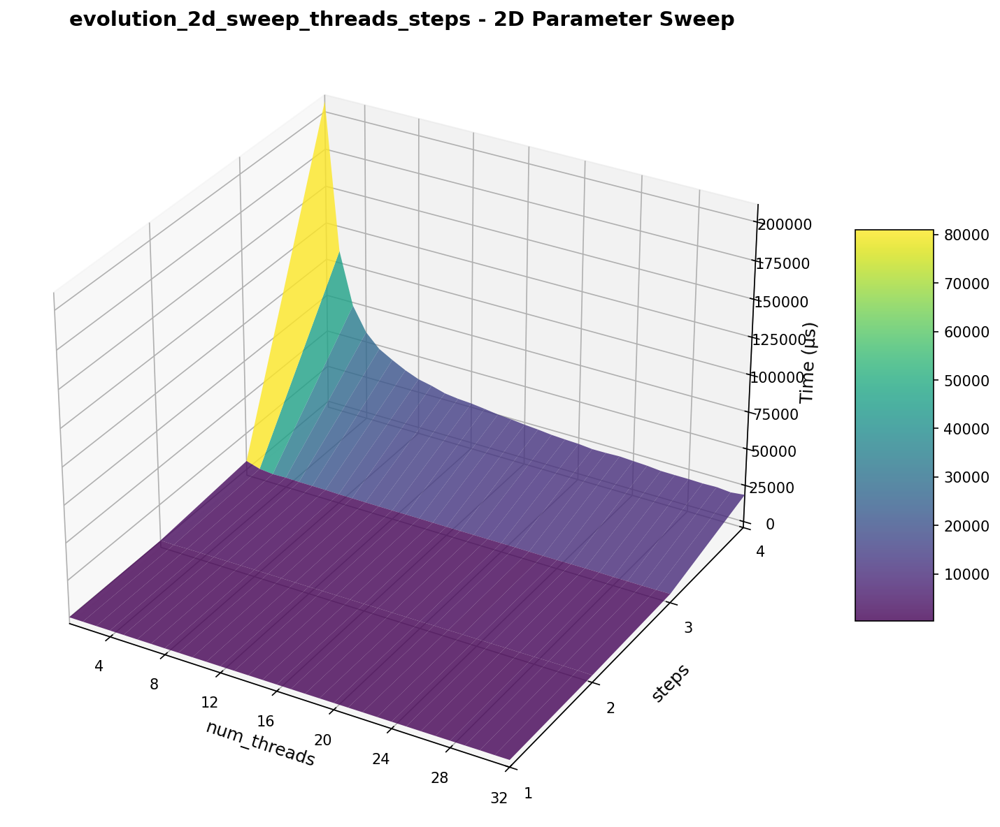
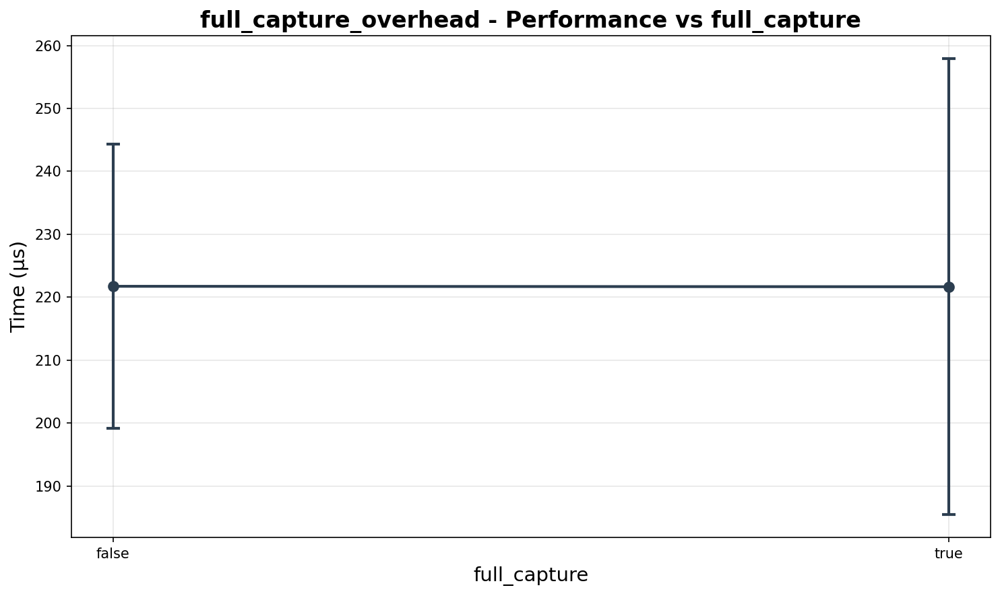

# Hypergraph Engine Benchmarks - Plots Only

## System Information

- **CPU**: Intel(R) Core(TM) i9-14900K
- **Cores**: 32
- **Architecture**: x86_64
- **OS**: Linux 5.15.167.4-microsoft-standard-WSL2
- **Memory**: 23 GB
- **Compiler**: GNU 13.3.0
- **Hash Type**: commit
- **Hash**: b6c7372ea3355015e3ab9cb39a71a5629f21a958
- **Date**: 2025-10-30 01:01:23
- **Timestamp**: 2025-11-01T03:21:27

## Pattern Matching Benchmarks

### pattern_matching_2d_sweep_threads_size

2D parameter sweep of pattern matching across thread count (1-32) and graph size (5-100 edges) for parallel scalability analysis

### pattern_matching_by_graph_size

Evaluates pattern matching scalability as target graph size increases from 5 to 15 edges

### pattern_matching_by_pattern_size

2D parameter sweep: pattern matching time vs pattern complexity (1-5 edges) and graph size (5-15 edges)

## Event Relationships Benchmarks

### causal_edges_overhead

Measures the overhead of computing causal edges during evolution (1-3 steps)

### transitive_reduction_overhead

Isolates transitive reduction overhead by comparing evolution with it enabled vs disabled

## Uniqueness Trees Benchmarks

### uniqueness_tree_2d_sweep

2D parameter sweep: edges vs symmetry_groups for surface plots

### uniqueness_tree_by_arity

Tests impact of hyperedge arity on performance

### uniqueness_tree_by_edge_count

Measures uniqueness tree performance as graph size increases (arity=2)

### uniqueness_tree_by_edge_count_arity3

Measures uniqueness tree performance as graph size increases (arity=3, higher complexity)

### uniqueness_tree_by_symmetry

Shows how graph symmetry affects uniqueness tree time

### uniqueness_tree_by_vertex_count

Measures performance as vertex count increases

## Evolution Benchmarks

### evolution_2d_sweep_threads_steps

2D sweep: evolution with rule {{1,2},{2,3}} -> {{3,2},{2,1},{1,4}} on init {{1,1},{1,1}} across thread count and steps

### evolution_multi_rule_by_rule_count

Tests evolution performance with increasing rule complexity (1-3 rules with mixed arities)

### evolution_thread_scaling

Evaluates parallel speedup from 1 thread up to full hardware concurrency (3-step evolution)

### evolution_with_self_loops

Tests evolution performance on hypergraphs containing self-loop edges

## Job System Benchmarks

### job_system_2d_sweep

2D parameter sweep of job system across thread count and batch size for parallel scalability analysis

### job_system_overhead

Measures job system overhead with minimal workload across varying batch sizes

### job_system_scaling_efficiency

Evaluates parallel efficiency with fixed total work across different thread counts

## Canonicalization Benchmarks

### canonicalization_2d_sweep

2D parameter sweep: edges vs symmetry_groups for surface plots

### canonicalization_by_edge_count

Measures canonicalization performance as graph size increases (arity=2)

### canonicalization_by_edge_count_arity3

Measures canonicalization performance as graph size increases (arity=3, higher complexity)

### canonicalization_by_symmetry

Shows how graph symmetry affects canonicalization time

## WXF Serialization Benchmarks

### wxf_deserialize_flat_list

Measures WXF deserialization time for flat integer lists of varying sizes

### wxf_deserialize_nested_list

Measures WXF deserialization time for nested lists (outer_size x inner_size)

### wxf_roundtrip

Measures WXF round-trip (serialize + deserialize) time for various data sizes

### wxf_serialize_flat_list

Measures WXF serialization time for flat integer lists of varying sizes

### wxf_serialize_nested_list

Measures WXF serialization time for nested lists (outer_size x inner_size)

## State Management Benchmarks

### full_capture_overhead

Compares evolution performance with and without full state capture enabled

### state_storage_by_steps

Measures state storage and retrieval overhead as evolution progresses from 1 to 3 steps

## Other Benchmarks

### comparative_2d_edges_steps

### comparative_2d_edges_steps_speedup

### comparative_config1

### comparative_config1_speedup

### comparative_config2

### comparative_config2_speedup

### comparative_config3

### comparative_config3_speedup

