# Hypergraph Engine Benchmarks

## Contents

- **[Pattern Matching Benchmarks](#pattern-matching-benchmarks)**
  - [pattern_matching_2d_sweep_threads_size](#pattern_matching_2d_sweep_threads_size)
  - [pattern_matching_by_graph_size](#pattern_matching_by_graph_size)
  - [pattern_matching_by_pattern_size](#pattern_matching_by_pattern_size)
- **[Event Relationships Benchmarks](#event-relationships-benchmarks)**
  - [causal_edges_overhead](#causal_edges_overhead)
  - [transitive_reduction_overhead](#transitive_reduction_overhead)
- **[Evolution Benchmarks](#evolution-benchmarks)**
  - [evolution_2d_sweep_threads_steps](#evolution_2d_sweep_threads_steps)
  - [evolution_multi_rule_by_rule_count](#evolution_multi_rule_by_rule_count)
  - [evolution_thread_scaling](#evolution_thread_scaling)
  - [evolution_with_self_loops](#evolution_with_self_loops)
- **[Job System Benchmarks](#job-system-benchmarks)**
  - [job_system_2d_sweep](#job_system_2d_sweep)
  - [job_system_overhead](#job_system_overhead)
  - [job_system_scaling_efficiency](#job_system_scaling_efficiency)
- **[WXF Serialization Benchmarks](#wxf-serialization-benchmarks)**
  - [wxf_deserialize_flat_list](#wxf_deserialize_flat_list)
  - [wxf_deserialize_nested_list](#wxf_deserialize_nested_list)
  - [wxf_roundtrip](#wxf_roundtrip)
  - [wxf_serialize_flat_list](#wxf_serialize_flat_list)
  - [wxf_serialize_nested_list](#wxf_serialize_nested_list)
- **[Canonicalization Benchmarks](#canonicalization-benchmarks)**
  - [canonicalization_2d_sweep](#canonicalization_2d_sweep)
  - [canonicalization_by_edge_count](#canonicalization_by_edge_count)
  - [canonicalization_by_symmetry](#canonicalization_by_symmetry)
- **[State Management Benchmarks](#state-management-benchmarks)**
  - [full_capture_overhead](#full_capture_overhead)
  - [state_storage_by_steps](#state_storage_by_steps)
- **[Other Benchmarks](#other-benchmarks)**
  - [wolfram_evolution_by_steps](#wolfram_evolution_by_steps)

## System Information

- **CPU**: Intel(R) Core(TM) i9-14900K
- **Cores**: 32
- **Architecture**: x86_64
- **OS**: Linux 5.15.167.4-microsoft-standard-WSL2
- **Memory**: 23 GB
- **Compiler**: GNU 13.3.0
- **Hash Type**: tree
- **Hash**: 7031705f88fc24daa0f6f723ec8f56f72443a700
- **Date**: 2025-10-01
- **Timestamp**: 2025-10-04T03:31:35

## Pattern Matching Benchmarks

### pattern_matching_2d_sweep_threads_size

2D parameter sweep of pattern matching across thread count (1-32) and graph size (5-100 edges) for parallel scalability analysis

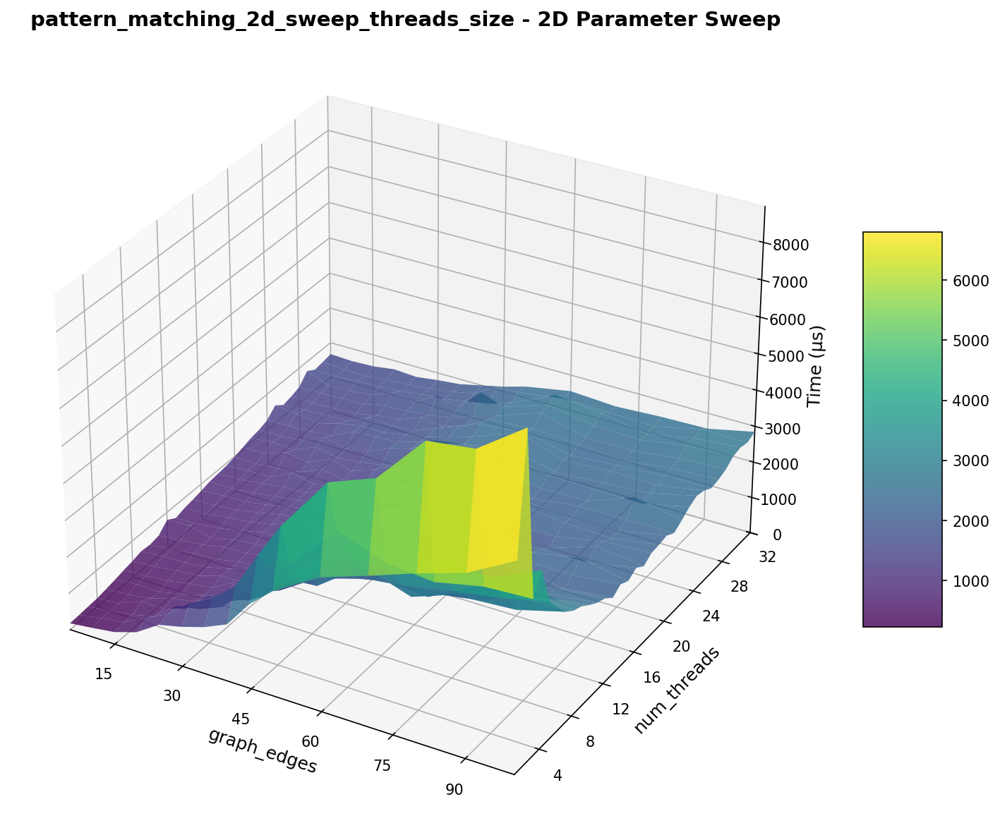

| Parameters | Avg (μs) | Stddev (μs) | CV% | Samples |
|------------|----------|-------------|-----|---------|
| graph_edges=15, num_threads=9 | 583.28 | 116.96 | 20.05 | 50 |
| graph_edges=50, num_threads=17 | 1775.40 | 324.88 | 18.30 | 50 |
| graph_edges=10, num_threads=27 | 1368.34 | 115.19 | 8.42 | 50 |
| graph_edges=5, num_threads=11 | 546.89 | 86.06 | 15.74 | 50 |
| graph_edges=45, num_threads=32 | 2139.73 | 191.64 | 8.96 | 50 |
| graph_edges=10, num_threads=19 | 980.93 | 265.70 | 27.09 | 50 |
| graph_edges=50, num_threads=32 | 2319.62 | 248.36 | 10.71 | 50 |
| graph_edges=45, num_threads=16 | 1899.29 | 1314.41 | 69.21 | 50 |
| graph_edges=30, num_threads=8 | 831.90 | 219.12 | 26.34 | 50 |
| graph_edges=60, num_threads=14 | 2040.89 | 533.33 | 26.13 | 50 |
| graph_edges=20, num_threads=29 | 1574.36 | 118.15 | 7.50 | 50 |
| graph_edges=35, num_threads=19 | 1403.43 | 303.81 | 21.65 | 50 |
| graph_edges=40, num_threads=32 | 1996.82 | 175.76 | 8.80 | 50 |
| graph_edges=35, num_threads=10 | 996.92 | 181.33 | 18.19 | 50 |
| graph_edges=45, num_threads=20 | 1717.47 | 250.87 | 14.61 | 50 |
| graph_edges=30, num_threads=9 | 1020.00 | 1368.82 | 134.20 | 50 |
| graph_edges=15, num_threads=21 | 1288.59 | 1366.70 | 106.06 | 50 |
| graph_edges=15, num_threads=28 | 1489.79 | 139.12 | 9.34 | 50 |
| graph_edges=100, num_threads=30 | 2800.50 | 248.37 | 8.87 | 50 |
| graph_edges=5, num_threads=7 | 395.35 | 97.16 | 24.58 | 50 |
| graph_edges=35, num_threads=4 | 1358.60 | 1353.75 | 99.64 | 50 |
| graph_edges=30, num_threads=2 | 1523.58 | 1385.39 | 90.93 | 50 |
| graph_edges=35, num_threads=32 | 1855.74 | 166.74 | 8.99 | 50 |
| graph_edges=25, num_threads=22 | 1304.44 | 103.72 | 7.95 | 50 |
| graph_edges=60, num_threads=16 | 2016.76 | 458.60 | 22.74 | 50 |
| graph_edges=15, num_threads=6 | 392.85 | 59.00 | 15.02 | 50 |
| graph_edges=60, num_threads=6 | 2863.45 | 1476.33 | 51.56 | 50 |
| graph_edges=25, num_threads=10 | 797.26 | 157.68 | 19.78 | 50 |
| graph_edges=30, num_threads=16 | 1210.19 | 285.02 | 23.55 | 50 |
| graph_edges=90, num_threads=24 | 2345.42 | 243.99 | 10.40 | 50 |
| graph_edges=30, num_threads=30 | 1767.45 | 137.44 | 7.78 | 50 |
| graph_edges=90, num_threads=5 | 3429.10 | 1286.66 | 37.52 | 50 |
| graph_edges=10, num_threads=17 | 869.39 | 89.24 | 10.26 | 50 |
| graph_edges=70, num_threads=25 | 2316.54 | 363.56 | 15.69 | 50 |
| graph_edges=10, num_threads=25 | 1437.75 | 207.73 | 14.45 | 50 |
| graph_edges=25, num_threads=28 | 1635.75 | 162.97 | 9.96 | 50 |
| graph_edges=45, num_threads=5 | 2247.65 | 1315.85 | 58.54 | 50 |
| graph_edges=40, num_threads=21 | 1870.80 | 1407.74 | 75.25 | 50 |
| graph_edges=80, num_threads=1 | 4512.38 | 1318.30 | 29.22 | 50 |
| graph_edges=25, num_threads=32 | 1709.99 | 115.88 | 6.78 | 50 |
| graph_edges=35, num_threads=6 | 945.46 | 214.97 | 22.74 | 50 |
| graph_edges=30, num_threads=13 | 968.15 | 161.62 | 16.69 | 50 |
| graph_edges=90, num_threads=9 | 2725.09 | 1317.31 | 48.34 | 50 |
| graph_edges=50, num_threads=31 | 2358.47 | 256.35 | 10.87 | 50 |
| graph_edges=35, num_threads=22 | 1470.80 | 162.17 | 11.03 | 50 |
| graph_edges=45, num_threads=28 | 2060.20 | 233.49 | 11.33 | 50 |
| graph_edges=20, num_threads=25 | 1519.61 | 229.75 | 15.12 | 50 |
| graph_edges=10, num_threads=29 | 1489.86 | 91.79 | 6.16 | 50 |
| graph_edges=70, num_threads=28 | 2361.73 | 331.10 | 14.02 | 50 |
| graph_edges=25, num_threads=5 | 724.71 | 179.71 | 24.80 | 50 |
| graph_edges=70, num_threads=20 | 2168.40 | 1317.67 | 60.77 | 50 |
| graph_edges=35, num_threads=7 | 1287.46 | 1352.60 | 105.06 | 50 |
| graph_edges=5, num_threads=24 | 1266.02 | 99.98 | 7.90 | 50 |
| graph_edges=60, num_threads=1 | 3620.59 | 1201.71 | 33.19 | 50 |
| graph_edges=25, num_threads=19 | 1157.40 | 132.10 | 11.41 | 50 |
| graph_edges=10, num_threads=22 | 1203.59 | 211.10 | 17.54 | 50 |
| graph_edges=60, num_threads=27 | 2432.61 | 450.05 | 18.50 | 50 |
| graph_edges=60, num_threads=31 | 2522.40 | 452.19 | 17.93 | 50 |
| graph_edges=80, num_threads=20 | 2084.07 | 333.66 | 16.01 | 50 |
| graph_edges=70, num_threads=4 | 3531.03 | 1767.74 | 50.06 | 50 |
| graph_edges=90, num_threads=17 | 2307.22 | 1283.11 | 55.61 | 50 |
| graph_edges=35, num_threads=2 | 1860.74 | 633.22 | 34.03 | 50 |
| graph_edges=100, num_threads=13 | 2128.84 | 295.26 | 13.87 | 50 |
| graph_edges=60, num_threads=17 | 2017.29 | 402.62 | 19.96 | 50 |
| graph_edges=50, num_threads=18 | 1778.72 | 295.90 | 16.64 | 50 |
| graph_edges=70, num_threads=11 | 1851.44 | 457.60 | 24.72 | 50 |
| graph_edges=80, num_threads=14 | 2134.81 | 1311.98 | 61.46 | 50 |
| graph_edges=80, num_threads=13 | 2206.84 | 1316.80 | 59.67 | 50 |
| graph_edges=30, num_threads=4 | 1281.27 | 1910.68 | 149.12 | 50 |
| graph_edges=60, num_threads=22 | 2274.37 | 444.51 | 19.54 | 50 |
| graph_edges=80, num_threads=25 | 2393.60 | 407.21 | 17.01 | 50 |
| graph_edges=35, num_threads=21 | 1525.28 | 219.01 | 14.36 | 50 |
| graph_edges=80, num_threads=2 | 7711.13 | 3100.89 | 40.21 | 50 |
| graph_edges=10, num_threads=31 | 1580.48 | 108.39 | 6.86 | 50 |
| graph_edges=100, num_threads=14 | 2288.03 | 324.57 | 14.19 | 50 |
| graph_edges=10, num_threads=6 | 398.84 | 75.58 | 18.95 | 50 |
| graph_edges=5, num_threads=8 | 445.39 | 106.10 | 23.82 | 50 |
| graph_edges=90, num_threads=23 | 2270.46 | 251.04 | 11.06 | 50 |
| graph_edges=80, num_threads=21 | 2203.55 | 1291.05 | 58.59 | 50 |
| graph_edges=10, num_threads=5 | 327.23 | 43.49 | 13.29 | 50 |
| graph_edges=30, num_threads=21 | 1319.55 | 144.71 | 10.97 | 50 |
| graph_edges=10, num_threads=30 | 1556.11 | 120.56 | 7.75 | 50 |
| graph_edges=30, num_threads=29 | 1731.28 | 152.30 | 8.80 | 50 |
| graph_edges=90, num_threads=4 | 4171.52 | 1528.39 | 36.64 | 50 |
| graph_edges=100, num_threads=27 | 2501.19 | 198.18 | 7.92 | 50 |
| graph_edges=35, num_threads=11 | 1063.11 | 240.60 | 22.63 | 50 |
| graph_edges=30, num_threads=25 | 1629.32 | 158.71 | 9.74 | 50 |
| graph_edges=5, num_threads=26 | 1321.95 | 119.37 | 9.03 | 50 |
| graph_edges=70, num_threads=24 | 2181.83 | 292.28 | 13.40 | 50 |
| graph_edges=15, num_threads=29 | 1513.99 | 120.20 | 7.94 | 50 |
| graph_edges=35, num_threads=13 | 1105.23 | 187.96 | 17.01 | 50 |
| graph_edges=100, num_threads=21 | 2233.08 | 157.83 | 7.07 | 50 |
| graph_edges=45, num_threads=13 | 1638.17 | 1326.30 | 80.96 | 50 |
| graph_edges=90, num_threads=15 | 2379.73 | 1291.68 | 54.28 | 50 |
| graph_edges=100, num_threads=16 | 2316.30 | 315.99 | 13.64 | 50 |
| graph_edges=20, num_threads=1 | 531.98 | 184.07 | 34.60 | 50 |
| graph_edges=50, num_threads=26 | 2402.10 | 553.31 | 23.03 | 50 |
| graph_edges=50, num_threads=21 | 2194.45 | 1294.73 | 59.00 | 50 |
| graph_edges=20, num_threads=11 | 798.51 | 213.88 | 26.79 | 50 |
| graph_edges=60, num_threads=15 | 2238.32 | 648.06 | 28.95 | 50 |
| graph_edges=70, num_threads=2 | 6385.48 | 3178.06 | 49.77 | 50 |
| graph_edges=20, num_threads=3 | 543.79 | 157.76 | 29.01 | 50 |
| graph_edges=5, num_threads=9 | 517.03 | 116.08 | 22.45 | 50 |
| graph_edges=60, num_threads=7 | 2292.02 | 730.72 | 31.88 | 50 |
| graph_edges=45, num_threads=26 | 2159.83 | 1358.05 | 62.88 | 50 |
| graph_edges=45, num_threads=7 | 1617.85 | 394.60 | 24.39 | 50 |
| graph_edges=35, num_threads=28 | 1720.05 | 164.31 | 9.55 | 50 |
| graph_edges=40, num_threads=7 | 1215.14 | 379.65 | 31.24 | 50 |
| graph_edges=15, num_threads=25 | 1347.54 | 114.46 | 8.49 | 50 |
| graph_edges=10, num_threads=18 | 927.61 | 110.12 | 11.87 | 50 |
| graph_edges=100, num_threads=22 | 2377.13 | 252.59 | 10.63 | 50 |
| graph_edges=90, num_threads=12 | 2211.12 | 490.04 | 22.16 | 50 |
| graph_edges=10, num_threads=26 | 1361.75 | 137.78 | 10.12 | 50 |
| graph_edges=45, num_threads=12 | 1362.25 | 207.82 | 15.26 | 50 |
| graph_edges=20, num_threads=21 | 1185.65 | 75.56 | 6.37 | 50 |
| graph_edges=60, num_threads=11 | 1918.18 | 609.68 | 31.78 | 50 |
| graph_edges=70, num_threads=19 | 2305.97 | 1811.83 | 78.57 | 50 |
| graph_edges=35, num_threads=16 | 1337.44 | 232.48 | 17.38 | 50 |
| graph_edges=40, num_threads=11 | 1178.12 | 308.97 | 26.23 | 50 |
| graph_edges=80, num_threads=22 | 2151.14 | 313.47 | 14.57 | 50 |
| graph_edges=70, num_threads=1 | 4054.33 | 1485.54 | 36.64 | 50 |
| graph_edges=80, num_threads=6 | 2907.98 | 971.71 | 33.42 | 50 |
| graph_edges=10, num_threads=3 | 297.40 | 64.28 | 21.61 | 50 |
| graph_edges=100, num_threads=29 | 2748.82 | 195.87 | 7.13 | 50 |
| graph_edges=45, num_threads=27 | 1994.89 | 271.97 | 13.63 | 50 |
| graph_edges=25, num_threads=8 | 818.67 | 217.75 | 26.60 | 50 |
| graph_edges=50, num_threads=8 | 1729.29 | 437.16 | 25.28 | 50 |
| graph_edges=15, num_threads=12 | 664.13 | 88.50 | 13.33 | 50 |
| graph_edges=90, num_threads=22 | 2634.07 | 1271.91 | 48.29 | 50 |
| graph_edges=50, num_threads=12 | 1580.56 | 377.62 | 23.89 | 50 |
| graph_edges=15, num_threads=3 | 387.80 | 113.74 | 29.33 | 50 |
| graph_edges=100, num_threads=6 | 3350.19 | 879.90 | 26.26 | 50 |
| graph_edges=80, num_threads=32 | 2539.83 | 287.07 | 11.30 | 50 |
| graph_edges=35, num_threads=26 | 1658.25 | 140.36 | 8.46 | 50 |
| graph_edges=50, num_threads=28 | 2245.84 | 356.52 | 15.87 | 50 |
| graph_edges=90, num_threads=19 | 2118.24 | 268.17 | 12.66 | 50 |
| graph_edges=5, num_threads=30 | 1588.63 | 125.90 | 7.93 | 50 |
| graph_edges=5, num_threads=5 | 281.71 | 47.43 | 16.84 | 50 |
| graph_edges=90, num_threads=31 | 2755.39 | 1293.66 | 46.95 | 50 |
| graph_edges=50, num_threads=11 | 1527.23 | 322.99 | 21.15 | 50 |
| graph_edges=40, num_threads=29 | 1956.97 | 185.84 | 9.50 | 50 |
| graph_edges=10, num_threads=28 | 1460.58 | 124.80 | 8.54 | 50 |
| graph_edges=20, num_threads=28 | 1505.72 | 116.67 | 7.75 | 50 |
| graph_edges=70, num_threads=26 | 2266.91 | 313.13 | 13.81 | 50 |
| graph_edges=100, num_threads=10 | 2572.69 | 461.61 | 17.94 | 50 |
| graph_edges=25, num_threads=20 | 1367.58 | 1350.73 | 98.77 | 50 |
| graph_edges=10, num_threads=32 | 1639.43 | 186.96 | 11.40 | 50 |
| graph_edges=20, num_threads=23 | 1515.82 | 1374.94 | 90.71 | 50 |
| graph_edges=30, num_threads=12 | 957.82 | 147.91 | 15.44 | 50 |
| graph_edges=50, num_threads=29 | 2317.24 | 352.61 | 15.22 | 50 |
| graph_edges=20, num_threads=2 | 711.56 | 222.87 | 31.32 | 50 |
| graph_edges=50, num_threads=14 | 1735.31 | 358.09 | 20.64 | 50 |
| graph_edges=100, num_threads=24 | 2652.58 | 281.16 | 10.60 | 50 |
| graph_edges=45, num_threads=15 | 1630.36 | 272.93 | 16.74 | 50 |
| graph_edges=20, num_threads=6 | 528.64 | 133.96 | 25.34 | 50 |
| graph_edges=15, num_threads=8 | 566.03 | 140.18 | 24.77 | 50 |
| graph_edges=15, num_threads=26 | 1390.92 | 167.21 | 12.02 | 50 |
| graph_edges=70, num_threads=27 | 2378.31 | 354.12 | 14.89 | 50 |
| graph_edges=60, num_threads=5 | 3052.82 | 1159.94 | 38.00 | 50 |
| graph_edges=20, num_threads=8 | 619.66 | 129.12 | 20.84 | 50 |
| graph_edges=50, num_threads=16 | 2198.89 | 1816.92 | 82.63 | 50 |
| graph_edges=80, num_threads=16 | 2045.25 | 390.53 | 19.09 | 50 |
| graph_edges=10, num_threads=11 | 601.15 | 98.73 | 16.42 | 50 |
| graph_edges=80, num_threads=31 | 2465.95 | 285.18 | 11.56 | 50 |
| graph_edges=60, num_threads=13 | 1836.09 | 519.16 | 28.28 | 50 |
| graph_edges=90, num_threads=10 | 2391.14 | 579.05 | 24.22 | 50 |
| graph_edges=35, num_threads=18 | 1483.26 | 406.50 | 27.41 | 50 |
| graph_edges=35, num_threads=15 | 1317.64 | 252.61 | 19.17 | 50 |
| graph_edges=35, num_threads=12 | 1089.91 | 185.39 | 17.01 | 50 |
| graph_edges=10, num_threads=16 | 863.03 | 122.96 | 14.25 | 50 |
| graph_edges=10, num_threads=7 | 430.62 | 66.83 | 15.52 | 50 |
| graph_edges=30, num_threads=7 | 1051.90 | 1386.30 | 131.79 | 50 |
| graph_edges=25, num_threads=25 | 1640.77 | 328.52 | 20.02 | 50 |
| graph_edges=25, num_threads=14 | 1016.92 | 211.04 | 20.75 | 50 |
| graph_edges=90, num_threads=32 | 2570.32 | 237.51 | 9.24 | 50 |
| graph_edges=45, num_threads=21 | 1856.64 | 272.37 | 14.67 | 50 |
| graph_edges=5, num_threads=13 | 638.53 | 79.52 | 12.45 | 50 |
| graph_edges=70, num_threads=12 | 1684.60 | 368.88 | 21.90 | 50 |
| graph_edges=5, num_threads=16 | 808.34 | 60.27 | 7.46 | 50 |
| graph_edges=70, num_threads=23 | 2297.02 | 330.46 | 14.39 | 50 |
| graph_edges=100, num_threads=26 | 2462.56 | 202.56 | 8.23 | 50 |
| graph_edges=15, num_threads=30 | 1610.85 | 144.76 | 8.99 | 50 |
| graph_edges=50, num_threads=27 | 2342.21 | 544.37 | 23.24 | 50 |
| graph_edges=25, num_threads=17 | 1099.86 | 152.73 | 13.89 | 50 |
| graph_edges=10, num_threads=15 | 789.17 | 94.35 | 11.96 | 50 |
| graph_edges=5, num_threads=25 | 1497.76 | 1420.38 | 94.83 | 50 |
| graph_edges=25, num_threads=29 | 1824.36 | 1357.43 | 74.41 | 50 |
| graph_edges=45, num_threads=25 | 2065.52 | 391.74 | 18.97 | 50 |
| graph_edges=30, num_threads=27 | 1617.11 | 246.74 | 15.26 | 50 |
| graph_edges=60, num_threads=12 | 2015.17 | 695.50 | 34.51 | 50 |
| graph_edges=50, num_threads=6 | 1946.09 | 569.86 | 29.28 | 50 |
| graph_edges=15, num_threads=20 | 1021.22 | 78.76 | 7.71 | 50 |
| graph_edges=20, num_threads=4 | 544.44 | 133.53 | 24.53 | 50 |
| graph_edges=100, num_threads=15 | 2168.21 | 275.82 | 12.72 | 50 |
| graph_edges=50, num_threads=10 | 1786.12 | 1317.73 | 73.78 | 50 |
| graph_edges=15, num_threads=19 | 977.14 | 82.37 | 8.43 | 50 |
| graph_edges=20, num_threads=22 | 1433.23 | 1389.07 | 96.92 | 50 |
| graph_edges=100, num_threads=7 | 3030.88 | 611.81 | 20.19 | 50 |
| graph_edges=15, num_threads=11 | 679.82 | 89.44 | 13.16 | 50 |
| graph_edges=30, num_threads=23 | 1473.69 | 138.23 | 9.38 | 50 |
| graph_edges=15, num_threads=18 | 997.16 | 133.93 | 13.43 | 50 |
| graph_edges=80, num_threads=9 | 2099.87 | 556.78 | 26.52 | 50 |
| graph_edges=15, num_threads=2 | 388.97 | 125.10 | 32.16 | 50 |
| graph_edges=70, num_threads=31 | 2499.26 | 368.07 | 14.73 | 50 |
| graph_edges=100, num_threads=20 | 2369.60 | 243.74 | 10.29 | 50 |
| graph_edges=90, num_threads=26 | 2441.25 | 278.10 | 11.39 | 50 |
| graph_edges=25, num_threads=16 | 1102.82 | 171.81 | 15.58 | 50 |
| graph_edges=60, num_threads=8 | 2110.69 | 683.05 | 32.36 | 50 |
| graph_edges=25, num_threads=30 | 1675.28 | 131.45 | 7.85 | 50 |
| graph_edges=25, num_threads=18 | 1104.95 | 129.15 | 11.69 | 50 |
| graph_edges=70, num_threads=7 | 2447.20 | 854.38 | 34.91 | 50 |
| graph_edges=100, num_threads=19 | 2326.29 | 246.91 | 10.61 | 50 |
| graph_edges=5, num_threads=14 | 714.50 | 87.29 | 12.22 | 50 |
| graph_edges=60, num_threads=3 | 4434.13 | 1853.94 | 41.81 | 50 |
| graph_edges=60, num_threads=20 | 2243.75 | 479.67 | 21.38 | 50 |
| graph_edges=60, num_threads=28 | 2699.48 | 1314.89 | 48.71 | 50 |
| graph_edges=45, num_threads=6 | 1888.62 | 1294.62 | 68.55 | 50 |
| graph_edges=25, num_threads=24 | 1659.51 | 1362.95 | 82.13 | 50 |
| graph_edges=15, num_threads=14 | 826.64 | 98.90 | 11.96 | 50 |
| graph_edges=15, num_threads=10 | 635.70 | 99.95 | 15.72 | 50 |
| graph_edges=35, num_threads=25 | 1751.07 | 227.14 | 12.97 | 50 |
| graph_edges=5, num_threads=10 | 496.73 | 59.63 | 12.00 | 50 |
| graph_edges=50, num_threads=20 | 2143.61 | 1340.93 | 62.55 | 50 |
| graph_edges=70, num_threads=3 | 3984.49 | 2051.55 | 51.49 | 50 |
| graph_edges=25, num_threads=3 | 1035.62 | 1379.55 | 133.21 | 50 |
| graph_edges=40, num_threads=26 | 1917.77 | 1345.86 | 70.18 | 50 |
| graph_edges=40, num_threads=22 | 1647.32 | 434.96 | 26.40 | 50 |
| graph_edges=45, num_threads=3 | 2928.52 | 963.67 | 32.91 | 50 |
| graph_edges=40, num_threads=20 | 1540.41 | 296.39 | 19.24 | 50 |
| graph_edges=40, num_threads=13 | 1235.94 | 288.71 | 23.36 | 50 |
| graph_edges=70, num_threads=14 | 1939.71 | 396.04 | 20.42 | 50 |
| graph_edges=90, num_threads=30 | 2692.84 | 262.70 | 9.76 | 50 |
| graph_edges=20, num_threads=14 | 901.69 | 110.88 | 12.30 | 50 |
| graph_edges=20, num_threads=10 | 669.93 | 107.91 | 16.11 | 50 |
| graph_edges=15, num_threads=7 | 486.66 | 88.00 | 18.08 | 50 |
| graph_edges=15, num_threads=24 | 1303.44 | 152.35 | 11.69 | 50 |
| graph_edges=70, num_threads=29 | 2511.90 | 332.28 | 13.23 | 50 |
| graph_edges=70, num_threads=30 | 2663.78 | 1296.10 | 48.66 | 50 |
| graph_edges=50, num_threads=2 | 4373.33 | 1567.23 | 35.84 | 50 |
| graph_edges=70, num_threads=16 | 1884.23 | 370.64 | 19.67 | 50 |
| graph_edges=15, num_threads=27 | 1387.10 | 121.67 | 8.77 | 50 |
| graph_edges=15, num_threads=15 | 845.99 | 83.79 | 9.90 | 50 |
| graph_edges=5, num_threads=3 | 215.07 | 35.10 | 16.32 | 50 |
| graph_edges=35, num_threads=5 | 1347.41 | 1333.30 | 98.95 | 50 |
| graph_edges=60, num_threads=24 | 2436.51 | 435.48 | 17.87 | 50 |
| graph_edges=10, num_threads=4 | 295.06 | 51.73 | 17.53 | 50 |
| graph_edges=50, num_threads=30 | 2231.35 | 289.14 | 12.96 | 50 |
| graph_edges=40, num_threads=3 | 2044.97 | 1480.69 | 72.41 | 50 |
| graph_edges=80, num_threads=26 | 2349.65 | 299.13 | 12.73 | 50 |
| graph_edges=80, num_threads=28 | 2364.31 | 258.07 | 10.92 | 50 |
| graph_edges=25, num_threads=31 | 1671.89 | 118.43 | 7.08 | 50 |
| graph_edges=90, num_threads=18 | 2233.39 | 349.52 | 15.65 | 50 |
| graph_edges=50, num_threads=22 | 2076.86 | 377.23 | 18.16 | 50 |
| graph_edges=35, num_threads=14 | 1220.95 | 190.74 | 15.62 | 50 |
| graph_edges=35, num_threads=24 | 1730.52 | 236.46 | 13.66 | 50 |
| graph_edges=80, num_threads=17 | 1866.88 | 278.31 | 14.91 | 50 |
| graph_edges=100, num_threads=4 | 4749.64 | 1352.59 | 28.48 | 50 |
| graph_edges=5, num_threads=17 | 873.38 | 83.32 | 9.54 | 50 |
| graph_edges=50, num_threads=25 | 2235.90 | 289.45 | 12.95 | 50 |
| graph_edges=45, num_threads=24 | 2064.25 | 438.50 | 21.24 | 50 |
| graph_edges=100, num_threads=28 | 2585.72 | 206.19 | 7.97 | 50 |
| graph_edges=5, num_threads=22 | 1138.52 | 105.42 | 9.26 | 50 |
| graph_edges=60, num_threads=30 | 2814.28 | 1289.02 | 45.80 | 50 |
| graph_edges=70, num_threads=9 | 1882.31 | 566.27 | 30.08 | 50 |
| graph_edges=40, num_threads=18 | 1434.01 | 264.08 | 18.42 | 50 |
| graph_edges=10, num_threads=14 | 739.15 | 67.79 | 9.17 | 50 |
| graph_edges=5, num_threads=23 | 1181.25 | 126.40 | 10.70 | 50 |
| graph_edges=45, num_threads=17 | 1634.60 | 258.86 | 15.84 | 50 |
| graph_edges=100, num_threads=12 | 2328.23 | 343.73 | 14.76 | 50 |
| graph_edges=30, num_threads=19 | 1223.33 | 157.83 | 12.90 | 50 |
| graph_edges=45, num_threads=10 | 1357.04 | 278.74 | 20.54 | 50 |
| graph_edges=50, num_threads=23 | 2449.97 | 1317.10 | 53.76 | 50 |
| graph_edges=90, num_threads=25 | 2371.99 | 249.86 | 10.53 | 50 |
| graph_edges=35, num_threads=1 | 1281.02 | 415.62 | 32.44 | 50 |
| graph_edges=60, num_threads=29 | 2718.66 | 428.46 | 15.76 | 50 |
| graph_edges=70, num_threads=32 | 2471.81 | 295.76 | 11.97 | 50 |
| graph_edges=100, num_threads=9 | 2752.23 | 604.85 | 21.98 | 50 |
| graph_edges=40, num_threads=9 | 1325.99 | 1364.73 | 102.92 | 50 |
| graph_edges=60, num_threads=21 | 2193.49 | 457.36 | 20.85 | 50 |
| graph_edges=45, num_threads=2 | 3404.97 | 944.37 | 27.74 | 50 |
| graph_edges=40, num_threads=12 | 1223.33 | 300.95 | 24.60 | 50 |
| graph_edges=25, num_threads=4 | 748.19 | 241.92 | 32.33 | 50 |
| graph_edges=15, num_threads=22 | 1162.01 | 77.69 | 6.69 | 50 |
| graph_edges=10, num_threads=23 | 1183.66 | 130.90 | 11.06 | 50 |
| graph_edges=45, num_threads=8 | 1657.73 | 1334.07 | 80.48 | 50 |
| graph_edges=80, num_threads=5 | 3213.69 | 1195.73 | 37.21 | 50 |
| graph_edges=15, num_threads=13 | 730.75 | 90.75 | 12.42 | 50 |
| graph_edges=30, num_threads=28 | 1663.30 | 162.32 | 9.76 | 50 |
| graph_edges=25, num_threads=7 | 693.97 | 145.06 | 20.90 | 50 |
| graph_edges=80, num_threads=27 | 2272.50 | 263.38 | 11.59 | 50 |
| graph_edges=90, num_threads=29 | 2686.14 | 549.67 | 20.46 | 50 |
| graph_edges=50, num_threads=15 | 1787.68 | 372.05 | 20.81 | 50 |
| graph_edges=5, num_threads=20 | 986.30 | 86.48 | 8.77 | 50 |
| graph_edges=70, num_threads=5 | 2960.77 | 1204.65 | 40.69 | 50 |
| graph_edges=60, num_threads=23 | 2546.28 | 1315.40 | 51.66 | 50 |
| graph_edges=5, num_threads=31 | 1624.47 | 127.69 | 7.86 | 50 |
| graph_edges=45, num_threads=31 | 2306.40 | 1326.52 | 57.52 | 50 |
| graph_edges=20, num_threads=26 | 1401.41 | 115.03 | 8.21 | 50 |
| graph_edges=20, num_threads=7 | 606.67 | 150.20 | 24.76 | 50 |
| graph_edges=10, num_threads=2 | 306.00 | 74.40 | 24.31 | 50 |
| graph_edges=15, num_threads=31 | 1561.95 | 126.07 | 8.07 | 50 |
| graph_edges=60, num_threads=10 | 2192.34 | 1360.59 | 62.06 | 50 |
| graph_edges=45, num_threads=29 | 2546.66 | 1850.00 | 72.64 | 50 |
| graph_edges=40, num_threads=5 | 1468.37 | 581.58 | 39.61 | 50 |
| graph_edges=25, num_threads=13 | 1000.95 | 324.28 | 32.40 | 50 |
| graph_edges=45, num_threads=9 | 1563.32 | 362.74 | 23.20 | 50 |
| graph_edges=20, num_threads=17 | 1021.05 | 121.57 | 11.91 | 50 |
| graph_edges=15, num_threads=5 | 419.50 | 96.86 | 23.09 | 50 |
| graph_edges=90, num_threads=28 | 2523.17 | 280.22 | 11.11 | 50 |
| graph_edges=25, num_threads=6 | 700.14 | 183.69 | 26.24 | 50 |
| graph_edges=25, num_threads=23 | 1373.07 | 114.27 | 8.32 | 50 |
| graph_edges=80, num_threads=23 | 2266.99 | 294.90 | 13.01 | 50 |
| graph_edges=45, num_threads=4 | 2248.38 | 662.61 | 29.47 | 50 |
| graph_edges=10, num_threads=8 | 487.39 | 79.75 | 16.36 | 50 |
| graph_edges=35, num_threads=23 | 1755.12 | 1376.55 | 78.43 | 50 |
| graph_edges=40, num_threads=2 | 2375.24 | 1063.60 | 44.78 | 50 |
| graph_edges=25, num_threads=15 | 1099.06 | 231.06 | 21.02 | 50 |
| graph_edges=50, num_threads=4 | 2502.30 | 763.16 | 30.50 | 50 |
| graph_edges=15, num_threads=32 | 1664.32 | 141.41 | 8.50 | 50 |
| graph_edges=30, num_threads=26 | 1640.21 | 240.26 | 14.65 | 50 |
| graph_edges=20, num_threads=15 | 958.37 | 149.20 | 15.57 | 50 |
| graph_edges=90, num_threads=13 | 1977.12 | 378.93 | 19.17 | 50 |
| graph_edges=80, num_threads=7 | 2592.77 | 810.32 | 31.25 | 50 |
| graph_edges=30, num_threads=20 | 1273.03 | 149.63 | 11.75 | 50 |
| graph_edges=10, num_threads=12 | 827.50 | 1392.91 | 168.33 | 50 |
| graph_edges=10, num_threads=9 | 563.87 | 106.13 | 18.82 | 50 |
| graph_edges=5, num_threads=1 | 173.86 | 24.85 | 14.29 | 50 |
| graph_edges=25, num_threads=21 | 1472.38 | 1363.51 | 92.61 | 50 |
| graph_edges=20, num_threads=12 | 799.18 | 212.78 | 26.62 | 50 |
| graph_edges=30, num_threads=18 | 1388.02 | 1357.63 | 97.81 | 50 |
| graph_edges=100, num_threads=5 | 3723.27 | 1295.17 | 34.79 | 50 |
| graph_edges=90, num_threads=6 | 3299.03 | 1442.67 | 43.73 | 50 |
| graph_edges=30, num_threads=24 | 1712.48 | 1377.97 | 80.47 | 50 |
| graph_edges=90, num_threads=16 | 2067.92 | 280.58 | 13.57 | 50 |
| graph_edges=30, num_threads=32 | 1793.21 | 149.27 | 8.32 | 50 |
| graph_edges=50, num_threads=5 | 2458.84 | 1352.25 | 55.00 | 50 |
| graph_edges=80, num_threads=24 | 2250.93 | 288.12 | 12.80 | 50 |
| graph_edges=40, num_threads=8 | 1285.34 | 462.75 | 36.00 | 50 |
| graph_edges=70, num_threads=21 | 2049.49 | 338.25 | 16.50 | 50 |
| graph_edges=90, num_threads=8 | 2969.65 | 1033.37 | 34.80 | 50 |
| graph_edges=30, num_threads=14 | 1262.10 | 1354.84 | 107.35 | 50 |
| graph_edges=70, num_threads=8 | 2017.55 | 630.81 | 31.27 | 50 |
| graph_edges=40, num_threads=31 | 1958.55 | 311.68 | 15.91 | 50 |
| graph_edges=5, num_threads=6 | 335.30 | 56.22 | 16.77 | 50 |
| graph_edges=45, num_threads=14 | 1565.02 | 313.09 | 20.01 | 50 |
| graph_edges=70, num_threads=13 | 1779.79 | 405.56 | 22.79 | 50 |
| graph_edges=80, num_threads=30 | 2439.01 | 317.40 | 13.01 | 50 |
| graph_edges=40, num_threads=10 | 1229.23 | 391.06 | 31.81 | 50 |
| graph_edges=80, num_threads=12 | 1872.52 | 417.23 | 22.28 | 50 |
| graph_edges=35, num_threads=27 | 1860.22 | 1352.74 | 72.72 | 50 |
| graph_edges=40, num_threads=14 | 1312.32 | 267.92 | 20.42 | 50 |
| graph_edges=5, num_threads=21 | 1063.33 | 85.29 | 8.02 | 50 |
| graph_edges=15, num_threads=16 | 873.23 | 80.62 | 9.23 | 50 |
| graph_edges=35, num_threads=29 | 2087.82 | 1357.25 | 65.01 | 50 |
| graph_edges=20, num_threads=31 | 1641.65 | 157.87 | 9.62 | 50 |
| graph_edges=50, num_threads=1 | 2851.20 | 1382.53 | 48.49 | 50 |
| graph_edges=40, num_threads=27 | 1768.92 | 205.06 | 11.59 | 50 |
| graph_edges=45, num_threads=1 | 2312.27 | 1294.70 | 55.99 | 50 |
| graph_edges=80, num_threads=18 | 1979.22 | 278.37 | 14.06 | 50 |
| graph_edges=5, num_threads=4 | 233.90 | 41.34 | 17.68 | 50 |
| graph_edges=100, num_threads=2 | 8769.32 | 2917.19 | 33.27 | 50 |
| graph_edges=100, num_threads=32 | 2847.55 | 236.75 | 8.31 | 50 |
| graph_edges=90, num_threads=7 | 2683.20 | 778.76 | 29.02 | 50 |
| graph_edges=80, num_threads=8 | 2701.57 | 981.16 | 36.32 | 50 |
| graph_edges=100, num_threads=25 | 2596.25 | 203.95 | 7.86 | 50 |
| graph_edges=30, num_threads=5 | 1096.17 | 1369.68 | 124.95 | 50 |
| graph_edges=90, num_threads=14 | 2143.65 | 368.49 | 17.19 | 50 |
| graph_edges=40, num_threads=25 | 1864.91 | 290.40 | 15.57 | 50 |
| graph_edges=80, num_threads=11 | 2076.15 | 530.19 | 25.54 | 50 |
| graph_edges=70, num_threads=6 | 2443.13 | 914.14 | 37.42 | 50 |
| graph_edges=100, num_threads=3 | 4216.92 | 1363.99 | 32.35 | 50 |
| graph_edges=70, num_threads=17 | 1904.98 | 354.08 | 18.59 | 50 |
| graph_edges=35, num_threads=9 | 1132.08 | 1366.09 | 120.67 | 50 |
| graph_edges=5, num_threads=15 | 757.81 | 62.34 | 8.23 | 50 |
| graph_edges=35, num_threads=31 | 1830.19 | 182.50 | 9.97 | 50 |
| graph_edges=40, num_threads=16 | 1596.54 | 1371.90 | 85.93 | 50 |
| graph_edges=25, num_threads=26 | 1694.26 | 1382.15 | 81.58 | 50 |
| graph_edges=30, num_threads=6 | 860.57 | 255.69 | 29.71 | 50 |
| graph_edges=100, num_threads=8 | 2847.55 | 628.81 | 22.08 | 50 |
| graph_edges=5, num_threads=12 | 786.12 | 1403.49 | 178.53 | 50 |
| graph_edges=40, num_threads=4 | 1615.44 | 694.43 | 42.99 | 50 |
| graph_edges=35, num_threads=20 | 1386.10 | 259.61 | 18.73 | 50 |
| graph_edges=80, num_threads=10 | 2219.93 | 614.68 | 27.69 | 50 |
| graph_edges=100, num_threads=18 | 2306.81 | 309.65 | 13.42 | 50 |
| graph_edges=20, num_threads=16 | 979.69 | 90.34 | 9.22 | 50 |
| graph_edges=70, num_threads=10 | 2009.65 | 581.16 | 28.92 | 50 |
| graph_edges=90, num_threads=20 | 2122.29 | 260.96 | 12.30 | 50 |
| graph_edges=45, num_threads=18 | 1675.94 | 283.49 | 16.92 | 50 |
| graph_edges=30, num_threads=1 | 1085.78 | 1402.53 | 129.17 | 50 |
| graph_edges=10, num_threads=21 | 1071.71 | 80.49 | 7.51 | 50 |
| graph_edges=30, num_threads=11 | 930.17 | 182.18 | 19.59 | 50 |
| graph_edges=40, num_threads=6 | 1407.12 | 1368.71 | 97.27 | 50 |
| graph_edges=15, num_threads=1 | 333.17 | 114.28 | 34.30 | 50 |
| graph_edges=35, num_threads=8 | 983.38 | 205.18 | 20.86 | 50 |
| graph_edges=25, num_threads=12 | 874.60 | 155.11 | 17.74 | 50 |
| graph_edges=80, num_threads=3 | 3866.48 | 1619.71 | 41.89 | 50 |
| graph_edges=45, num_threads=22 | 2053.22 | 1307.67 | 63.69 | 50 |
| graph_edges=80, num_threads=19 | 2161.71 | 332.86 | 15.40 | 50 |
| graph_edges=40, num_threads=19 | 1517.26 | 276.83 | 18.25 | 50 |
| graph_edges=100, num_threads=17 | 2151.05 | 243.77 | 11.33 | 50 |
| graph_edges=10, num_threads=10 | 553.93 | 85.09 | 15.36 | 50 |
| graph_edges=35, num_threads=17 | 1398.62 | 339.15 | 24.25 | 50 |
| graph_edges=100, num_threads=23 | 2542.96 | 255.14 | 10.03 | 50 |
| graph_edges=5, num_threads=2 | 189.86 | 33.49 | 17.64 | 50 |
| graph_edges=15, num_threads=17 | 925.20 | 109.29 | 11.81 | 50 |
| graph_edges=60, num_threads=4 | 3498.35 | 1343.00 | 38.39 | 50 |
| graph_edges=15, num_threads=23 | 1242.85 | 121.46 | 9.77 | 50 |
| graph_edges=50, num_threads=3 | 3134.22 | 1467.96 | 46.84 | 50 |
| graph_edges=20, num_threads=9 | 651.67 | 145.50 | 22.33 | 50 |
| graph_edges=50, num_threads=13 | 1669.63 | 439.17 | 26.30 | 50 |
| graph_edges=20, num_threads=30 | 1632.11 | 116.47 | 7.14 | 50 |
| graph_edges=80, num_threads=15 | 2166.72 | 1305.39 | 60.25 | 50 |
| graph_edges=40, num_threads=30 | 1925.31 | 221.17 | 11.49 | 50 |
| graph_edges=90, num_threads=2 | 7876.03 | 3240.96 | 41.15 | 50 |
| graph_edges=30, num_threads=22 | 1369.98 | 155.07 | 11.32 | 50 |
| graph_edges=10, num_threads=24 | 1282.51 | 152.98 | 11.93 | 50 |
| graph_edges=20, num_threads=24 | 1364.49 | 117.41 | 8.60 | 50 |
| graph_edges=60, num_threads=25 | 2737.14 | 1338.46 | 48.90 | 50 |
| graph_edges=70, num_threads=18 | 1915.90 | 408.54 | 21.32 | 50 |
| graph_edges=45, num_threads=19 | 2123.78 | 1340.32 | 63.11 | 50 |
| graph_edges=40, num_threads=1 | 1557.65 | 631.14 | 40.52 | 50 |
| graph_edges=60, num_threads=18 | 2024.10 | 428.46 | 21.17 | 50 |
| graph_edges=30, num_threads=17 | 1205.45 | 211.98 | 17.59 | 50 |
| graph_edges=90, num_threads=21 | 2227.50 | 280.60 | 12.60 | 50 |
| graph_edges=60, num_threads=19 | 2261.48 | 498.25 | 22.03 | 50 |
| graph_edges=90, num_threads=27 | 2451.37 | 306.11 | 12.49 | 50 |
| graph_edges=25, num_threads=1 | 940.37 | 1383.61 | 147.13 | 50 |
| graph_edges=20, num_threads=20 | 1113.34 | 121.07 | 10.87 | 50 |
| graph_edges=15, num_threads=4 | 547.81 | 1401.48 | 255.83 | 50 |
| graph_edges=90, num_threads=1 | 4918.54 | 1636.87 | 33.28 | 50 |
| graph_edges=30, num_threads=3 | 1149.64 | 439.72 | 38.25 | 50 |
| graph_edges=40, num_threads=17 | 1383.95 | 251.77 | 18.19 | 50 |
| graph_edges=50, num_threads=19 | 2179.44 | 1297.27 | 59.52 | 50 |
| graph_edges=35, num_threads=30 | 1808.67 | 163.08 | 9.02 | 50 |
| graph_edges=5, num_threads=28 | 1458.13 | 86.00 | 5.90 | 50 |
| graph_edges=70, num_threads=15 | 1848.95 | 393.62 | 21.29 | 50 |
| graph_edges=60, num_threads=2 | 5902.80 | 2279.88 | 38.62 | 50 |
| graph_edges=20, num_threads=18 | 1087.97 | 155.42 | 14.28 | 50 |
| graph_edges=60, num_threads=9 | 2007.47 | 668.97 | 33.32 | 50 |
| graph_edges=50, num_threads=9 | 1532.49 | 351.94 | 22.96 | 50 |
| graph_edges=40, num_threads=15 | 1351.86 | 280.46 | 20.75 | 50 |
| graph_edges=5, num_threads=19 | 929.76 | 71.24 | 7.66 | 50 |
| graph_edges=5, num_threads=18 | 899.53 | 80.01 | 8.89 | 50 |
| graph_edges=45, num_threads=30 | 2032.82 | 167.61 | 8.25 | 50 |
| graph_edges=45, num_threads=11 | 1446.19 | 315.08 | 21.79 | 50 |
| graph_edges=25, num_threads=9 | 803.08 | 165.39 | 20.59 | 50 |
| graph_edges=60, num_threads=26 | 2530.30 | 449.79 | 17.78 | 50 |
| graph_edges=25, num_threads=27 | 1546.60 | 235.16 | 15.20 | 50 |
| graph_edges=30, num_threads=10 | 855.82 | 171.50 | 20.04 | 50 |
| graph_edges=100, num_threads=31 | 2742.46 | 202.59 | 7.39 | 50 |
| graph_edges=50, num_threads=7 | 2013.24 | 1306.81 | 64.91 | 50 |
| graph_edges=35, num_threads=3 | 1405.30 | 451.64 | 32.14 | 50 |
| graph_edges=50, num_threads=24 | 2235.95 | 346.93 | 15.52 | 50 |
| graph_edges=30, num_threads=31 | 1741.70 | 132.29 | 7.60 | 50 |
| graph_edges=5, num_threads=27 | 1376.60 | 131.81 | 9.58 | 50 |
| graph_edges=25, num_threads=11 | 828.07 | 154.82 | 18.70 | 50 |
| graph_edges=40, num_threads=23 | 1921.12 | 1359.96 | 70.79 | 50 |
| graph_edges=100, num_threads=1 | 5627.96 | 1209.80 | 21.50 | 50 |
| graph_edges=90, num_threads=11 | 2271.02 | 460.39 | 20.27 | 50 |
| graph_edges=5, num_threads=29 | 1733.98 | 1354.71 | 78.13 | 50 |
| graph_edges=20, num_threads=5 | 625.28 | 144.41 | 23.10 | 50 |
| graph_edges=10, num_threads=20 | 976.68 | 92.72 | 9.49 | 50 |
| graph_edges=80, num_threads=4 | 4229.32 | 1729.62 | 40.90 | 50 |
| graph_edges=20, num_threads=19 | 1279.51 | 1364.69 | 106.66 | 50 |
| graph_edges=20, num_threads=13 | 851.62 | 157.74 | 18.52 | 50 |
| graph_edges=90, num_threads=3 | 4146.10 | 1822.76 | 43.96 | 50 |
| graph_edges=40, num_threads=28 | 1836.90 | 195.65 | 10.65 | 50 |
| graph_edges=5, num_threads=32 | 1668.20 | 136.68 | 8.19 | 50 |
| graph_edges=100, num_threads=11 | 2421.72 | 388.43 | 16.04 | 50 |
| graph_edges=80, num_threads=29 | 2474.35 | 306.16 | 12.37 | 50 |
| graph_edges=60, num_threads=32 | 2547.87 | 411.65 | 16.16 | 50 |
| graph_edges=10, num_threads=1 | 248.57 | 59.81 | 24.06 | 50 |
| graph_edges=30, num_threads=15 | 1132.05 | 154.26 | 13.63 | 50 |
| graph_edges=20, num_threads=32 | 1750.72 | 140.15 | 8.01 | 50 |
| graph_edges=40, num_threads=24 | 1927.71 | 409.96 | 21.27 | 50 |
| graph_edges=25, num_threads=2 | 1018.28 | 354.74 | 34.84 | 50 |
| graph_edges=10, num_threads=13 | 662.72 | 103.63 | 15.64 | 50 |
| graph_edges=20, num_threads=27 | 1421.82 | 122.70 | 8.63 | 50 |
| graph_edges=45, num_threads=23 | 2347.34 | 1881.84 | 80.17 | 50 |
| graph_edges=70, num_threads=22 | 2132.36 | 324.67 | 15.23 | 50 |

### pattern_matching_by_graph_size

Evaluates pattern matching scalability as target graph size increases from 5 to 15 edges

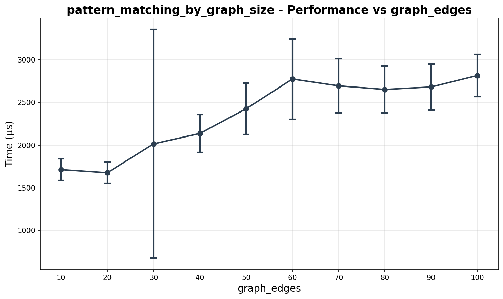

| Parameters | Avg (μs) | Stddev (μs) | CV% | Samples |
|------------|----------|-------------|-----|---------|
| graph_edges=20 | 1676.52 | 125.43 | 7.48 | 50 |
| graph_edges=80 | 2652.08 | 275.36 | 10.38 | 50 |
| graph_edges=30 | 2014.81 | 1340.33 | 66.52 | 50 |
| graph_edges=100 | 2815.91 | 248.48 | 8.82 | 50 |
| graph_edges=60 | 2774.54 | 471.53 | 17.00 | 50 |
| graph_edges=90 | 2682.02 | 271.00 | 10.10 | 50 |
| graph_edges=50 | 2426.17 | 302.28 | 12.46 | 50 |
| graph_edges=10 | 1712.81 | 127.96 | 7.47 | 50 |
| graph_edges=40 | 2136.81 | 220.67 | 10.33 | 50 |
| graph_edges=70 | 2695.13 | 315.27 | 11.70 | 50 |

### pattern_matching_by_pattern_size

2D parameter sweep: pattern matching time vs pattern complexity (1-5 edges) and graph size (5-15 edges)

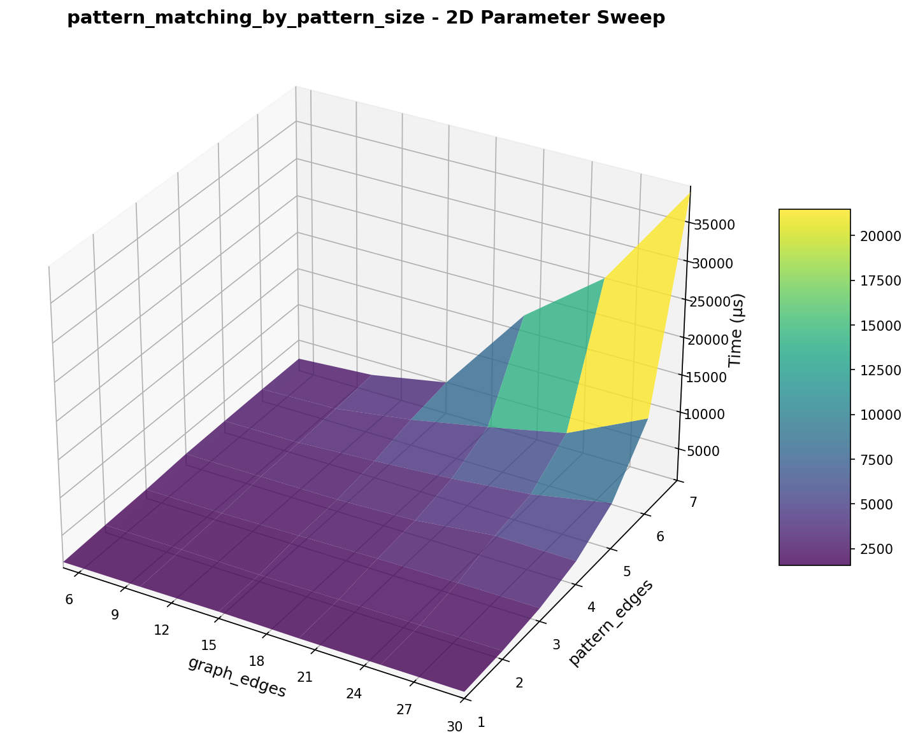

| Parameters | Avg (μs) | Stddev (μs) | CV% | Samples |
|------------|----------|-------------|-----|---------|
| graph_edges=20, pattern_edges=4 | 2687.34 | 1073.87 | 39.96 | 50 |
| graph_edges=15, pattern_edges=4 | 2284.12 | 394.43 | 17.27 | 50 |
| graph_edges=30, pattern_edges=1 | 1533.83 | 112.31 | 7.32 | 50 |
| graph_edges=25, pattern_edges=1 | 1514.27 | 115.43 | 7.62 | 50 |
| graph_edges=5, pattern_edges=6 | 2367.00 | 135.69 | 5.73 | 50 |
| graph_edges=30, pattern_edges=3 | 2421.37 | 440.00 | 18.17 | 50 |
| graph_edges=10, pattern_edges=5 | 2373.52 | 422.16 | 17.79 | 50 |
| graph_edges=5, pattern_edges=1 | 1439.12 | 105.73 | 7.35 | 50 |
| graph_edges=30, pattern_edges=2 | 1784.97 | 134.77 | 7.55 | 50 |
| graph_edges=20, pattern_edges=2 | 1679.94 | 141.43 | 8.42 | 50 |
| graph_edges=5, pattern_edges=5 | 2302.37 | 120.02 | 5.21 | 50 |
| graph_edges=25, pattern_edges=2 | 1699.72 | 116.89 | 6.88 | 50 |
| graph_edges=10, pattern_edges=6 | 2658.05 | 437.24 | 16.45 | 50 |
| graph_edges=10, pattern_edges=1 | 1489.40 | 432.73 | 29.05 | 50 |
| graph_edges=5, pattern_edges=4 | 2210.30 | 108.29 | 4.90 | 50 |
| graph_edges=30, pattern_edges=5 | 6809.35 | 7069.14 | 103.82 | 50 |
| graph_edges=20, pattern_edges=1 | 1486.21 | 93.17 | 6.27 | 50 |
| graph_edges=15, pattern_edges=1 | 1571.06 | 214.14 | 13.63 | 50 |
| graph_edges=25, pattern_edges=7 | 24970.51 | 29071.68 | 116.42 | 50 |
| graph_edges=25, pattern_edges=5 | 4795.00 | 3487.37 | 72.73 | 50 |
| graph_edges=20, pattern_edges=7 | 17140.88 | 29528.96 | 172.27 | 50 |
| graph_edges=5, pattern_edges=7 | 2366.70 | 141.61 | 5.98 | 50 |
| graph_edges=15, pattern_edges=3 | 2074.76 | 298.37 | 14.38 | 50 |
| graph_edges=20, pattern_edges=5 | 3731.23 | 2160.40 | 57.90 | 50 |
| graph_edges=30, pattern_edges=7 | 38816.33 | 66386.90 | 171.03 | 50 |
| graph_edges=10, pattern_edges=7 | 3046.39 | 1851.43 | 60.77 | 50 |
| graph_edges=30, pattern_edges=6 | 13576.49 | 30318.26 | 223.31 | 50 |
| graph_edges=25, pattern_edges=3 | 2395.43 | 379.79 | 15.85 | 50 |
| graph_edges=10, pattern_edges=3 | 1854.00 | 187.40 | 10.11 | 50 |
| graph_edges=20, pattern_edges=3 | 2291.54 | 443.57 | 19.36 | 50 |
| graph_edges=25, pattern_edges=6 | 8526.72 | 6505.07 | 76.29 | 50 |
| graph_edges=10, pattern_edges=2 | 1651.93 | 115.07 | 6.97 | 50 |
| graph_edges=15, pattern_edges=2 | 1592.08 | 144.95 | 9.10 | 50 |
| graph_edges=25, pattern_edges=4 | 3906.42 | 2266.00 | 58.01 | 50 |
| graph_edges=20, pattern_edges=6 | 6255.02 | 6019.90 | 96.24 | 50 |
| graph_edges=15, pattern_edges=6 | 4199.44 | 3828.20 | 91.16 | 50 |
| graph_edges=15, pattern_edges=7 | 4980.87 | 3731.93 | 74.93 | 50 |
| graph_edges=15, pattern_edges=5 | 2978.76 | 1120.88 | 37.63 | 50 |
| graph_edges=5, pattern_edges=3 | 1873.33 | 203.23 | 10.85 | 50 |
| graph_edges=10, pattern_edges=4 | 2224.95 | 588.37 | 26.44 | 50 |
| graph_edges=30, pattern_edges=4 | 3808.36 | 2577.67 | 67.68 | 50 |
| graph_edges=5, pattern_edges=2 | 1683.23 | 149.13 | 8.86 | 50 |

## Event Relationships Benchmarks

### causal_edges_overhead

Measures the overhead of computing causal edges during evolution (1-3 steps)

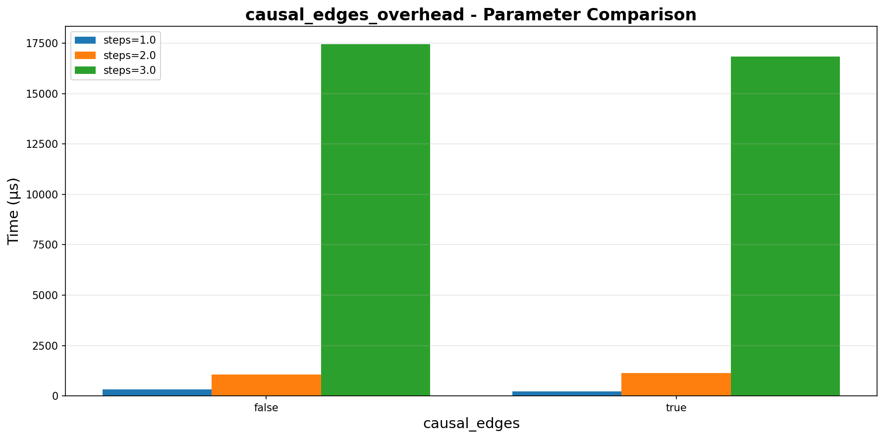

| Parameters | Avg (μs) | Stddev (μs) | CV% | Samples |
|------------|----------|-------------|-----|---------|
| causal_edges=false, steps=1 | 327.95 | 85.48 | 26.06 | 3 |
| causal_edges=true, steps=3 | 16846.03 | 142.02 | 0.84 | 3 |
| causal_edges=true, steps=2 | 1130.04 | 29.32 | 2.59 | 3 |
| causal_edges=true, steps=1 | 223.83 | 13.97 | 6.24 | 3 |
| causal_edges=false, steps=3 | 17453.76 | 509.16 | 2.92 | 3 |
| causal_edges=false, steps=2 | 1060.25 | 26.32 | 2.48 | 3 |

### transitive_reduction_overhead

Isolates transitive reduction overhead by comparing evolution with it enabled vs disabled

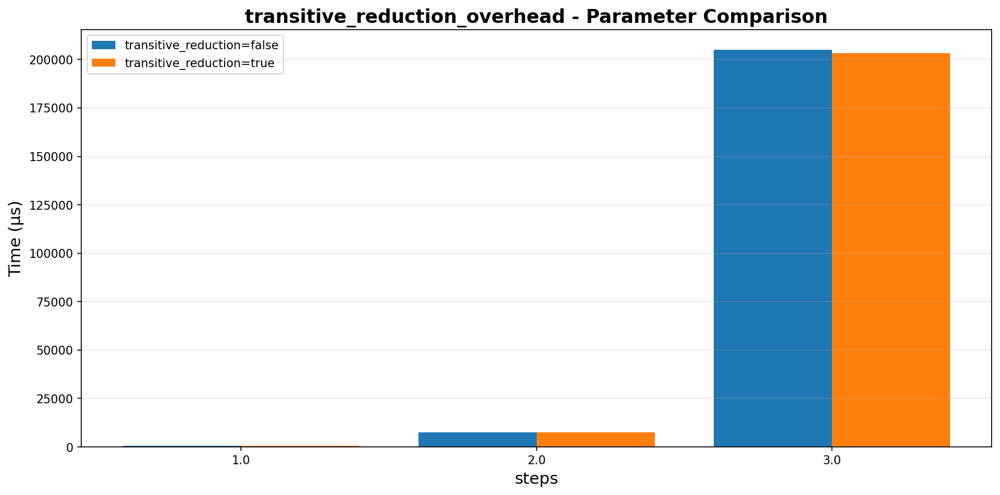

| Parameters | Avg (μs) | Stddev (μs) | CV% | Samples |
|------------|----------|-------------|-----|---------|
| steps=1, transitive_reduction=false | 566.78 | 31.06 | 5.48 | 3 |
| steps=3, transitive_reduction=true | 203319.16 | 1206.19 | 0.59 | 3 |
| steps=2, transitive_reduction=true | 7461.78 | 71.27 | 0.96 | 3 |
| steps=1, transitive_reduction=true | 528.95 | 3.93 | 0.74 | 3 |
| steps=3, transitive_reduction=false | 205144.69 | 646.76 | 0.32 | 3 |
| steps=2, transitive_reduction=false | 7516.03 | 150.21 | 2.00 | 3 |

## Evolution Benchmarks

### evolution_2d_sweep_threads_steps

2D sweep: evolution with rule {{1,2},{2,3}} -> {{3,2},{2,1},{1,4}} on init {{1,1},{1,1}} across thread count and steps

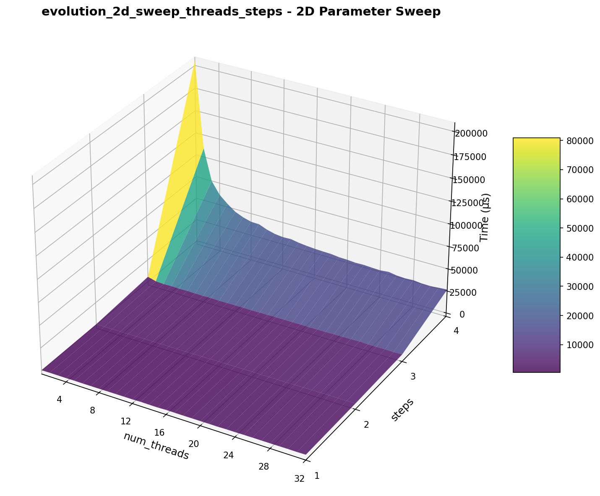

| Parameters | Avg (μs) | Stddev (μs) | CV% | Samples |
|------------|----------|-------------|-----|---------|
| num_threads=22, steps=3 | 3416.03 | 111.21 | 3.26 | 3 |
| num_threads=23, steps=2 | 1884.85 | 60.54 | 3.21 | 3 |
| num_threads=28, steps=3 | 3818.26 | 286.80 | 7.51 | 3 |
| num_threads=20, steps=1 | 1134.77 | 130.51 | 11.50 | 3 |
| num_threads=22, steps=2 | 1901.62 | 366.11 | 19.25 | 3 |
| num_threads=2, steps=3 | 3132.87 | 110.84 | 3.54 | 3 |
| num_threads=10, steps=1 | 635.28 | 79.79 | 12.56 | 3 |
| num_threads=25, steps=1 | 1541.04 | 139.57 | 9.06 | 3 |
| num_threads=27, steps=2 | 2304.20 | 113.70 | 4.93 | 3 |
| num_threads=19, steps=1 | 1149.06 | 204.30 | 17.78 | 3 |
| num_threads=4, steps=2 | 712.40 | 10.84 | 1.52 | 3 |
| num_threads=29, steps=2 | 2411.55 | 117.34 | 4.87 | 3 |
| num_threads=24, steps=3 | 3687.74 | 17.80 | 0.48 | 3 |
| num_threads=9, steps=4 | 40232.62 | 1233.91 | 3.07 | 3 |
| num_threads=29, steps=3 | 3830.73 | 341.16 | 8.91 | 3 |
| num_threads=25, steps=3 | 3755.11 | 321.14 | 8.55 | 3 |
| num_threads=5, steps=2 | 781.72 | 19.53 | 2.50 | 3 |
| num_threads=1, steps=2 | 657.28 | 16.38 | 2.49 | 3 |
| num_threads=31, steps=2 | 2319.51 | 221.61 | 9.55 | 3 |
| num_threads=3, steps=3 | 2632.26 | 149.75 | 5.69 | 3 |
| num_threads=15, steps=2 | 1423.18 | 75.41 | 5.30 | 3 |
| num_threads=30, steps=2 | 2361.95 | 47.76 | 2.02 | 3 |
| num_threads=32, steps=3 | 4017.83 | 302.07 | 7.52 | 3 |
| num_threads=17, steps=2 | 1506.15 | 147.02 | 9.76 | 3 |
| num_threads=3, steps=1 | 390.73 | 27.16 | 6.95 | 3 |
| num_threads=18, steps=3 | 3292.31 | 165.38 | 5.02 | 3 |
| num_threads=12, steps=4 | 33187.33 | 494.28 | 1.49 | 3 |
| num_threads=27, steps=1 | 1601.90 | 198.21 | 12.37 | 3 |
| num_threads=31, steps=3 | 3763.04 | 64.45 | 1.71 | 3 |
| num_threads=13, steps=3 | 2836.93 | 135.48 | 4.78 | 3 |
| num_threads=22, steps=4 | 27737.79 | 201.26 | 0.73 | 3 |
| num_threads=26, steps=3 | 3964.83 | 171.75 | 4.33 | 3 |
| num_threads=19, steps=4 | 28454.85 | 554.18 | 1.95 | 3 |
| num_threads=12, steps=2 | 1121.34 | 159.43 | 14.22 | 3 |
| num_threads=10, steps=2 | 1131.79 | 120.26 | 10.63 | 3 |
| num_threads=11, steps=1 | 697.81 | 56.83 | 8.14 | 3 |
| num_threads=16, steps=1 | 1188.67 | 114.25 | 9.61 | 3 |
| num_threads=5, steps=3 | 2625.66 | 92.78 | 3.53 | 3 |
| num_threads=1, steps=1 | 264.95 | 24.99 | 9.43 | 3 |
| num_threads=16, steps=4 | 30191.50 | 684.97 | 2.27 | 3 |
| num_threads=24, steps=1 | 1413.73 | 141.89 | 10.04 | 3 |
| num_threads=21, steps=3 | 3239.50 | 163.92 | 5.06 | 3 |
| num_threads=14, steps=2 | 1360.22 | 76.10 | 5.59 | 3 |
| num_threads=23, steps=4 | 27200.50 | 801.24 | 2.95 | 3 |
| num_threads=9, steps=2 | 1055.98 | 101.89 | 9.65 | 3 |
| num_threads=18, steps=2 | 1698.58 | 75.38 | 4.44 | 3 |
| num_threads=30, steps=3 | 4058.24 | 462.57 | 11.40 | 3 |
| num_threads=17, steps=3 | 3203.02 | 204.38 | 6.38 | 3 |
| num_threads=14, steps=1 | 850.56 | 135.09 | 15.88 | 3 |
| num_threads=22, steps=1 | 1156.80 | 71.75 | 6.20 | 3 |
| num_threads=32, steps=2 | 2478.21 | 139.88 | 5.64 | 3 |
| num_threads=28, steps=2 | 2235.41 | 23.40 | 1.05 | 3 |
| num_threads=16, steps=2 | 1676.14 | 193.31 | 11.53 | 3 |
| num_threads=12, steps=3 | 2821.51 | 78.06 | 2.77 | 3 |
| num_threads=8, steps=1 | 480.55 | 85.92 | 17.88 | 3 |
| num_threads=10, steps=4 | 36651.26 | 951.39 | 2.60 | 3 |
| num_threads=14, steps=3 | 2769.21 | 105.30 | 3.80 | 3 |
| num_threads=30, steps=4 | 25061.97 | 1636.62 | 6.53 | 3 |
| num_threads=15, steps=3 | 2990.80 | 135.45 | 4.53 | 3 |
| num_threads=8, steps=4 | 40537.53 | 964.50 | 2.38 | 3 |
| num_threads=18, steps=4 | 29560.78 | 362.48 | 1.23 | 3 |
| num_threads=7, steps=1 | 454.67 | 88.51 | 19.47 | 3 |
| num_threads=5, steps=4 | 53527.83 | 1113.33 | 2.08 | 3 |
| num_threads=1, steps=4 | 205143.82 | 585.43 | 0.29 | 3 |
| num_threads=7, steps=2 | 964.37 | 62.67 | 6.50 | 3 |
| num_threads=14, steps=4 | 31914.49 | 471.92 | 1.48 | 3 |
| num_threads=26, steps=4 | 26336.98 | 764.51 | 2.90 | 3 |
| num_threads=32, steps=4 | 26673.74 | 1679.13 | 6.30 | 3 |
| num_threads=28, steps=1 | 1613.90 | 154.28 | 9.56 | 3 |
| num_threads=23, steps=3 | 3434.45 | 54.62 | 1.59 | 3 |
| num_threads=19, steps=2 | 1677.20 | 90.27 | 5.38 | 3 |
| num_threads=13, steps=2 | 1327.23 | 106.20 | 8.00 | 3 |
| num_threads=29, steps=1 | 1683.76 | 8.31 | 0.49 | 3 |
| num_threads=26, steps=2 | 2064.59 | 213.21 | 10.33 | 3 |
| num_threads=28, steps=4 | 26396.23 | 699.82 | 2.65 | 3 |
| num_threads=29, steps=4 | 25343.78 | 823.27 | 3.25 | 3 |
| num_threads=9, steps=1 | 596.01 | 110.04 | 18.46 | 3 |
| num_threads=10, steps=3 | 2650.05 | 60.14 | 2.27 | 3 |
| num_threads=4, steps=1 | 355.39 | 51.72 | 14.55 | 3 |
| num_threads=6, steps=1 | 428.44 | 47.68 | 11.13 | 3 |
| num_threads=7, steps=3 | 2673.12 | 30.13 | 1.13 | 3 |
| num_threads=4, steps=4 | 61506.62 | 402.75 | 0.65 | 3 |
| num_threads=3, steps=2 | 753.15 | 17.47 | 2.32 | 3 |
| num_threads=2, steps=2 | 571.11 | 53.64 | 9.39 | 3 |
| num_threads=5, steps=1 | 506.00 | 174.94 | 34.57 | 3 |
| num_threads=9, steps=3 | 2847.06 | 154.13 | 5.41 | 3 |
| num_threads=21, steps=4 | 27481.95 | 880.61 | 3.20 | 3 |
| num_threads=3, steps=4 | 74775.79 | 1011.19 | 1.35 | 3 |
| num_threads=13, steps=1 | 966.00 | 188.05 | 19.47 | 3 |
| num_threads=11, steps=4 | 34239.39 | 632.53 | 1.85 | 3 |
| num_threads=2, steps=4 | 109818.36 | 2533.84 | 2.31 | 3 |
| num_threads=15, steps=4 | 30906.03 | 1021.77 | 3.31 | 3 |
| num_threads=8, steps=2 | 911.31 | 73.60 | 8.08 | 3 |
| num_threads=25, steps=2 | 2049.94 | 84.36 | 4.12 | 3 |
| num_threads=20, steps=2 | 1908.50 | 142.51 | 7.47 | 3 |
| num_threads=20, steps=4 | 28196.18 | 1001.65 | 3.55 | 3 |
| num_threads=21, steps=1 | 1209.03 | 52.95 | 4.38 | 3 |
| num_threads=20, steps=3 | 3410.51 | 167.83 | 4.92 | 3 |
| num_threads=6, steps=3 | 2956.09 | 119.18 | 4.03 | 3 |
| num_threads=8, steps=3 | 2667.64 | 115.25 | 4.32 | 3 |
| num_threads=4, steps=3 | 2919.15 | 148.62 | 5.09 | 3 |
| num_threads=7, steps=4 | 43064.63 | 317.65 | 0.74 | 3 |
| num_threads=26, steps=1 | 1611.70 | 210.43 | 13.06 | 3 |
| num_threads=12, steps=1 | 682.50 | 122.03 | 17.88 | 3 |
| num_threads=18, steps=1 | 1070.96 | 52.65 | 4.92 | 3 |
| num_threads=23, steps=1 | 1401.63 | 91.98 | 6.56 | 3 |
| num_threads=19, steps=3 | 3233.53 | 142.29 | 4.40 | 3 |
| num_threads=6, steps=4 | 46875.90 | 1674.10 | 3.57 | 3 |
| num_threads=24, steps=2 | 1827.47 | 80.19 | 4.39 | 3 |
| num_threads=27, steps=4 | 25841.75 | 406.54 | 1.57 | 3 |
| num_threads=25, steps=4 | 27837.17 | 2306.53 | 8.29 | 3 |
| num_threads=13, steps=4 | 33537.79 | 323.27 | 0.96 | 3 |
| num_threads=17, steps=1 | 1117.87 | 107.84 | 9.65 | 3 |
| num_threads=11, steps=3 | 2781.63 | 93.26 | 3.35 | 3 |
| num_threads=6, steps=2 | 861.83 | 18.75 | 2.18 | 3 |
| num_threads=2, steps=1 | 404.78 | 110.01 | 27.18 | 3 |
| num_threads=11, steps=2 | 1117.56 | 15.84 | 1.42 | 3 |
| num_threads=31, steps=1 | 1697.36 | 102.18 | 6.02 | 3 |
| num_threads=32, steps=1 | 1881.74 | 135.47 | 7.20 | 3 |
| num_threads=31, steps=4 | 26056.65 | 2396.39 | 9.20 | 3 |
| num_threads=1, steps=3 | 5548.19 | 71.43 | 1.29 | 3 |
| num_threads=30, steps=1 | 1765.62 | 227.45 | 12.88 | 3 |
| num_threads=16, steps=3 | 3065.22 | 100.07 | 3.26 | 3 |
| num_threads=21, steps=2 | 1732.35 | 68.63 | 3.96 | 3 |
| num_threads=15, steps=1 | 803.77 | 61.28 | 7.62 | 3 |
| num_threads=24, steps=4 | 26850.08 | 1682.57 | 6.27 | 3 |
| num_threads=17, steps=4 | 29806.21 | 988.09 | 3.32 | 3 |
| num_threads=27, steps=3 | 4162.77 | 135.03 | 3.24 | 3 |

### evolution_multi_rule_by_rule_count

Tests evolution performance with increasing rule complexity (1-3 rules with mixed arities)

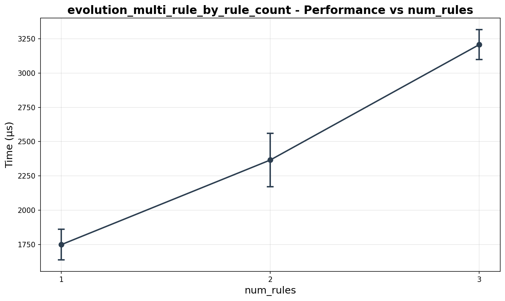

| Parameters | Avg (μs) | Stddev (μs) | CV% | Samples |
|------------|----------|-------------|-----|---------|
| num_rules=3 | 3208.36 | 108.75 | 3.39 | 3 |
| num_rules=2 | 2366.05 | 194.06 | 8.20 | 3 |
| num_rules=1 | 1748.38 | 111.73 | 6.39 | 3 |

### evolution_thread_scaling

Evaluates parallel speedup from 1 thread up to full hardware concurrency (3-step evolution)

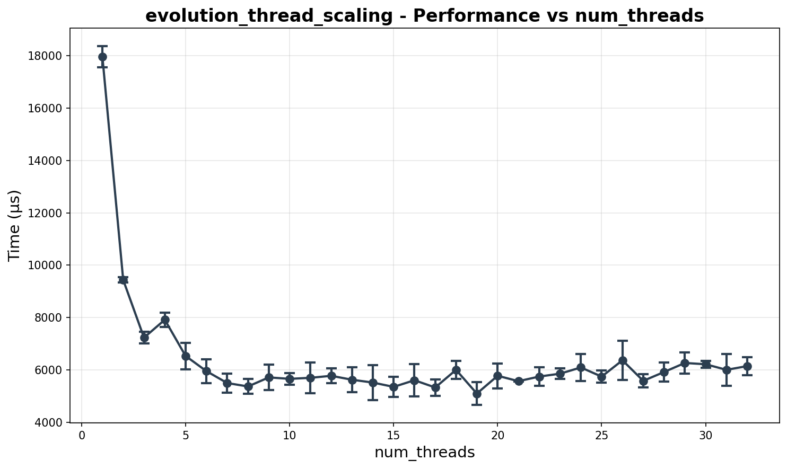

| Parameters | Avg (μs) | Stddev (μs) | CV% | Samples |
|------------|----------|-------------|-----|---------|
| num_threads=32 | 6147.99 | 345.50 | 5.62 | 3 |
| num_threads=1 | 17956.31 | 400.17 | 2.23 | 3 |
| num_threads=25 | 5746.78 | 230.10 | 4.00 | 3 |
| num_threads=24 | 6095.97 | 521.16 | 8.55 | 3 |
| num_threads=28 | 5922.56 | 357.63 | 6.04 | 3 |
| num_threads=13 | 5627.10 | 469.37 | 8.34 | 3 |
| num_threads=7 | 5500.88 | 369.44 | 6.72 | 3 |
| num_threads=16 | 5608.39 | 609.59 | 10.87 | 3 |
| num_threads=12 | 5777.37 | 289.64 | 5.01 | 3 |
| num_threads=30 | 6218.32 | 134.06 | 2.16 | 3 |
| num_threads=14 | 5520.11 | 664.06 | 12.03 | 3 |
| num_threads=9 | 5717.08 | 490.17 | 8.57 | 3 |
| num_threads=21 | 5572.06 | 24.06 | 0.43 | 3 |
| num_threads=8 | 5371.04 | 283.31 | 5.27 | 3 |
| num_threads=5 | 6534.46 | 502.05 | 7.68 | 3 |
| num_threads=18 | 6005.34 | 349.68 | 5.82 | 3 |
| num_threads=20 | 5778.96 | 476.24 | 8.24 | 3 |
| num_threads=19 | 5098.98 | 436.04 | 8.55 | 3 |
| num_threads=2 | 9437.92 | 106.96 | 1.13 | 3 |
| num_threads=6 | 5956.13 | 452.51 | 7.60 | 3 |
| num_threads=23 | 5858.63 | 199.15 | 3.40 | 3 |
| num_threads=4 | 7917.37 | 269.44 | 3.40 | 3 |
| num_threads=26 | 6370.07 | 749.00 | 11.76 | 3 |
| num_threads=29 | 6267.76 | 400.06 | 6.38 | 3 |
| num_threads=22 | 5748.96 | 355.73 | 6.19 | 3 |
| num_threads=17 | 5331.58 | 310.43 | 5.82 | 3 |
| num_threads=15 | 5354.71 | 382.21 | 7.14 | 3 |
| num_threads=31 | 6005.59 | 608.07 | 10.13 | 3 |
| num_threads=11 | 5701.11 | 586.49 | 10.29 | 3 |
| num_threads=3 | 7234.07 | 223.13 | 3.08 | 3 |
| num_threads=27 | 5584.75 | 250.27 | 4.48 | 3 |
| num_threads=10 | 5661.20 | 229.77 | 4.06 | 3 |

### evolution_with_self_loops

Tests evolution performance on hypergraphs containing self-loop edges

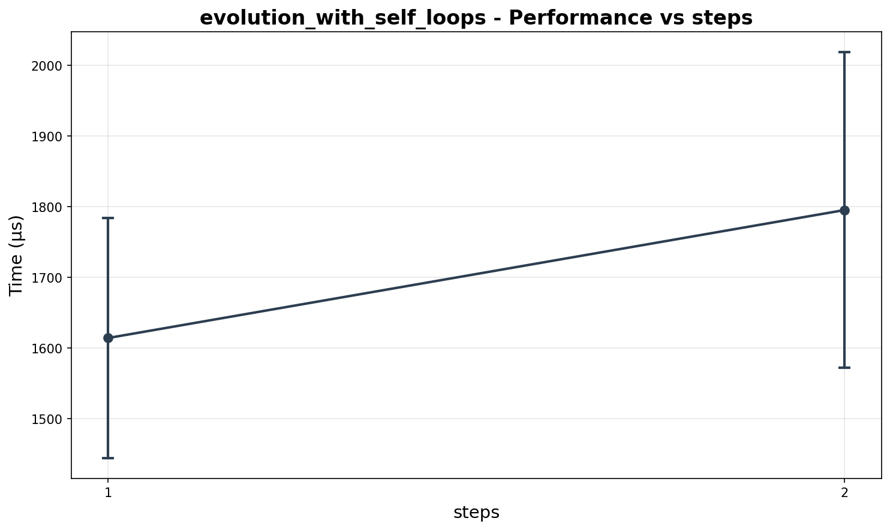

| Parameters | Avg (μs) | Stddev (μs) | CV% | Samples |
|------------|----------|-------------|-----|---------|
| steps=1 | 1614.10 | 170.18 | 10.54 | 3 |
| steps=2 | 1795.19 | 223.56 | 12.45 | 3 |

## Job System Benchmarks

### job_system_2d_sweep

2D parameter sweep of job system across thread count and batch size for parallel scalability analysis

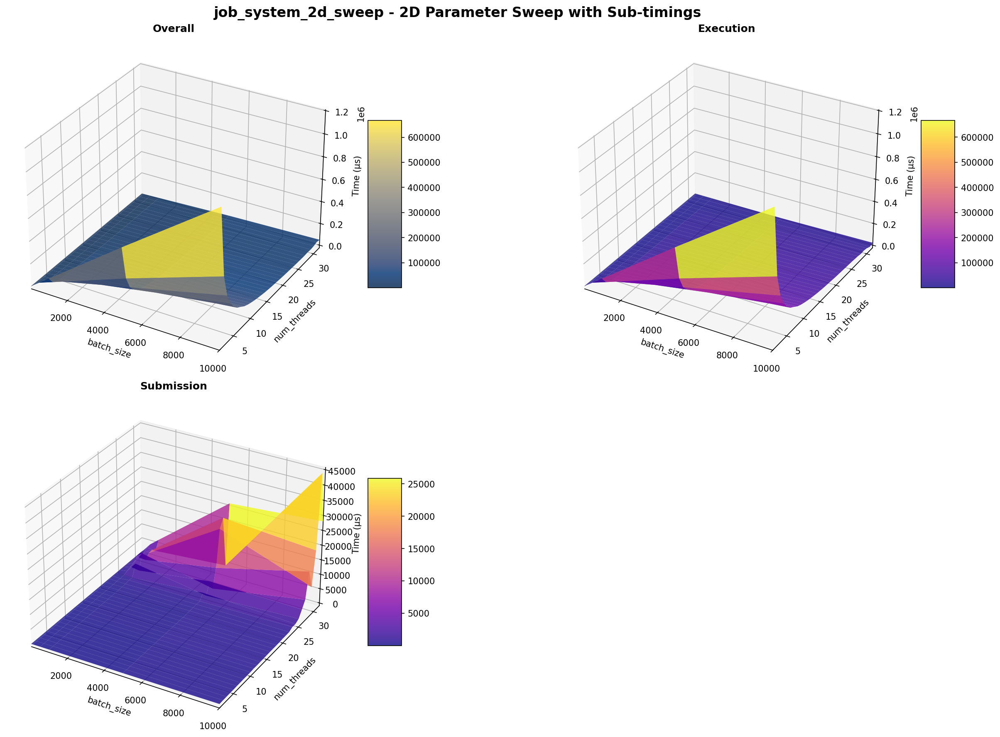

| Parameters | Overall (μs) | Stddev (μs) | CV% | Samples | Execution (μs) | Submission (μs) |
|------------|--------------|-------------|-----|---------|-----------------|-----------------|
| batch_size=10, num_threads=18 | 196.51 | 8.64 | 4.40 | 3 | 123.65 | 71.62 |
| batch_size=5000, num_threads=18 | 32522.21 | 239.25 | 0.74 | 3 | 32158.80 | 360.92 |
| batch_size=100, num_threads=25 | 750.00 | 45.72 | 6.10 | 3 | 193.37 | 555.22 |
| batch_size=100, num_threads=9 | 1399.86 | 45.85 | 3.28 | 3 | 1330.95 | 67.83 |
| batch_size=10, num_threads=29 | 213.46 | 19.58 | 9.17 | 3 | 143.63 | 68.77 |
| batch_size=1000, num_threads=18 | 6886.62 | 147.43 | 2.14 | 3 | 6703.89 | 180.08 |
| batch_size=1000, num_threads=14 | 8531.32 | 115.47 | 1.35 | 3 | 8385.40 | 143.77 |
| batch_size=500, num_threads=13 | 4634.16 | 22.16 | 0.48 | 3 | 4516.53 | 115.40 |
| batch_size=10, num_threads=16 | 268.82 | 54.99 | 20.46 | 3 | 196.17 | 71.51 |
| batch_size=1000, num_threads=20 | 6119.20 | 160.39 | 2.62 | 3 | 5872.79 | 244.36 |
| batch_size=5000, num_threads=11 | 52732.37 | 44.61 | 0.08 | 3 | 52425.82 | 303.98 |
| batch_size=10000, num_threads=15 | 77193.83 | 412.32 | 0.53 | 3 | 76594.58 | 596.98 |
| batch_size=1000, num_threads=12 | 9848.44 | 95.23 | 0.97 | 3 | 9716.11 | 130.23 |
| batch_size=100, num_threads=23 | 796.29 | 103.77 | 13.03 | 3 | 446.19 | 348.88 |
| batch_size=1000, num_threads=25 | 6266.33 | 787.24 | 12.56 | 3 | 1815.02 | 4448.65 |
| batch_size=500, num_threads=15 | 3992.59 | 17.15 | 0.43 | 3 | 3858.65 | 132.42 |
| batch_size=1000, num_threads=22 | 5540.92 | 78.70 | 1.42 | 3 | 5222.92 | 316.13 |
| batch_size=100, num_threads=15 | 898.99 | 23.79 | 2.65 | 3 | 787.96 | 110.00 |
| batch_size=5000, num_threads=10 | 57945.44 | 243.75 | 0.42 | 3 | 57663.06 | 279.91 |
| batch_size=1000, num_threads=8 | 14698.89 | 26.68 | 0.18 | 3 | 14590.97 | 105.06 |
| batch_size=10, num_threads=20 | 199.35 | 6.61 | 3.32 | 3 | 129.09 | 69.01 |
| batch_size=500, num_threads=10 | 5910.06 | 50.23 | 0.85 | 3 | 5817.09 | 91.23 |
| batch_size=10000, num_threads=11 | 105514.48 | 397.99 | 0.38 | 3 | 104922.62 | 589.48 |
| batch_size=10000, num_threads=22 | 53240.69 | 335.75 | 0.63 | 3 | 52570.00 | 668.38 |
| batch_size=10, num_threads=17 | 198.06 | 3.08 | 1.56 | 3 | 128.61 | 68.21 |
| batch_size=500, num_threads=21 | 2978.92 | 11.80 | 0.40 | 3 | 2747.60 | 229.93 |
| batch_size=1000, num_threads=28 | 5557.58 | 601.74 | 10.83 | 3 | 2782.85 | 2772.54 |
| batch_size=50, num_threads=23 | 462.98 | 22.36 | 4.83 | 3 | 133.37 | 328.57 |
| batch_size=500, num_threads=29 | 3481.40 | 97.64 | 2.80 | 3 | 128.42 | 3351.24 |
| batch_size=10000, num_threads=30 | 48000.48 | 2788.90 | 5.81 | 3 | 27777.73 | 20219.32 |
| batch_size=100, num_threads=13 | 1034.59 | 54.82 | 5.30 | 3 | 937.16 | 96.13 |
| batch_size=1000, num_threads=13 | 9085.02 | 6.40 | 0.07 | 3 | 8945.40 | 137.23 |
| batch_size=5000, num_threads=19 | 31046.32 | 140.40 | 0.45 | 3 | 30667.15 | 376.77 |
| batch_size=10000, num_threads=4 | 291498.14 | 593.66 | 0.20 | 3 | 291012.33 | 482.95 |
| batch_size=10, num_threads=24 | 202.22 | 7.00 | 3.46 | 3 | 130.72 | 70.27 |
| batch_size=100, num_threads=6 | 2084.04 | 73.14 | 3.51 | 3 | 2035.63 | 46.87 |
| batch_size=50, num_threads=27 | 475.60 | 21.91 | 4.61 | 3 | 140.88 | 333.84 |
| batch_size=500, num_threads=23 | 2833.30 | 60.87 | 2.15 | 3 | 2542.41 | 289.23 |
| batch_size=10000, num_threads=28 | 47485.94 | 4900.48 | 10.32 | 3 | 32462.49 | 15020.64 |
| batch_size=1000, num_threads=23 | 5400.08 | 49.01 | 0.91 | 3 | 4786.05 | 612.43 |
| batch_size=10000, num_threads=3 | 388855.68 | 996.10 | 0.26 | 3 | 388384.08 | 468.60 |
| batch_size=50, num_threads=4 | 1512.12 | 5.22 | 0.35 | 3 | 1480.83 | 30.32 |
| batch_size=1000, num_threads=6 | 19772.37 | 124.03 | 0.63 | 3 | 19681.51 | 88.25 |
| batch_size=10, num_threads=21 | 203.34 | 6.10 | 3.00 | 3 | 135.31 | 66.87 |
| batch_size=50, num_threads=7 | 935.34 | 5.47 | 0.58 | 3 | 883.96 | 48.87 |
| batch_size=1000, num_threads=9 | 13189.77 | 108.96 | 0.83 | 3 | 13076.18 | 111.01 |
| batch_size=5000, num_threads=31 | 22305.56 | 2968.46 | 13.31 | 3 | 17278.53 | 5024.09 |
| batch_size=10000, num_threads=27 | 45562.75 | 1645.19 | 3.61 | 3 | 39114.07 | 6445.90 |
| batch_size=50, num_threads=8 | 875.81 | 22.62 | 2.58 | 3 | 816.73 | 57.78 |
| batch_size=5000, num_threads=32 | 30236.96 | 5441.74 | 18.00 | 3 | 4613.58 | 25620.44 |
| batch_size=10, num_threads=14 | 190.64 | 12.86 | 6.75 | 3 | 121.60 | 67.95 |
| batch_size=50, num_threads=2 | 2974.51 | 37.79 | 1.27 | 3 | 2955.55 | 17.78 |
| batch_size=500, num_threads=25 | 2858.96 | 134.88 | 4.72 | 3 | 1971.47 | 885.61 |
| batch_size=10000, num_threads=12 | 97008.09 | 270.00 | 0.28 | 3 | 96471.41 | 533.97 |
| batch_size=10, num_threads=1 | 1219.41 | 37.56 | 3.08 | 3 | 1210.24 | 8.31 |
| batch_size=500, num_threads=2 | 29903.88 | 342.37 | 1.14 | 3 | 29859.42 | 41.62 |
| batch_size=500, num_threads=32 | 3616.91 | 171.31 | 4.74 | 3 | 137.82 | 3476.78 |
| batch_size=10, num_threads=8 | 271.89 | 2.69 | 0.99 | 3 | 215.62 | 55.06 |
| batch_size=50, num_threads=15 | 516.88 | 5.25 | 1.02 | 3 | 411.81 | 104.23 |
| batch_size=500, num_threads=17 | 3660.72 | 135.04 | 3.69 | 3 | 3514.66 | 144.57 |
| batch_size=1000, num_threads=3 | 39045.49 | 86.13 | 0.22 | 3 | 38974.44 | 68.44 |
| batch_size=10000, num_threads=16 | 72219.38 | 146.85 | 0.20 | 3 | 71606.14 | 610.61 |
| batch_size=100, num_threads=20 | 765.13 | 4.22 | 0.55 | 3 | 619.12 | 144.74 |
| batch_size=1000, num_threads=31 | 5568.24 | 979.84 | 17.60 | 3 | 2527.15 | 3038.64 |
| batch_size=10, num_threads=11 | 194.44 | 4.56 | 2.35 | 3 | 125.36 | 67.98 |
| batch_size=50, num_threads=32 | 458.77 | 12.61 | 2.75 | 3 | 126.74 | 331.30 |
| batch_size=500, num_threads=22 | 2958.16 | 114.32 | 3.86 | 3 | 2626.08 | 330.43 |
| batch_size=10, num_threads=9 | 255.33 | 6.15 | 2.41 | 3 | 193.20 | 61.03 |
| batch_size=10000, num_threads=29 | 43929.16 | 1482.04 | 3.37 | 3 | 35213.39 | 8712.98 |
| batch_size=5000, num_threads=27 | 22527.49 | 54.35 | 0.24 | 3 | 21593.38 | 931.73 |
| batch_size=5000, num_threads=30 | 29473.69 | 5861.66 | 19.89 | 3 | 6904.02 | 22566.81 |
| batch_size=5000, num_threads=23 | 26137.38 | 229.38 | 0.88 | 3 | 25466.44 | 668.46 |
| batch_size=1000, num_threads=30 | 5945.05 | 1174.87 | 19.76 | 3 | 1583.12 | 4359.89 |
| batch_size=1000, num_threads=1 | 120188.79 | 503.38 | 0.42 | 3 | 120117.88 | 68.03 |
| batch_size=50, num_threads=26 | 463.04 | 11.91 | 2.57 | 3 | 140.48 | 321.29 |
| batch_size=10000, num_threads=19 | 61307.96 | 563.58 | 0.92 | 3 | 60709.90 | 595.79 |
| batch_size=50, num_threads=21 | 454.86 | 28.82 | 6.34 | 3 | 195.69 | 258.00 |
| batch_size=1000, num_threads=5 | 23423.00 | 137.34 | 0.59 | 3 | 23322.22 | 97.85 |
| batch_size=5000, num_threads=6 | 97276.45 | 83.47 | 0.09 | 3 | 96997.75 | 275.81 |
| batch_size=100, num_threads=22 | 761.86 | 39.03 | 5.12 | 3 | 320.21 | 440.51 |
| batch_size=5000, num_threads=15 | 38536.81 | 131.41 | 0.34 | 3 | 38203.47 | 330.98 |
| batch_size=10, num_threads=25 | 194.79 | 13.37 | 6.86 | 3 | 124.05 | 69.47 |
| batch_size=100, num_threads=14 | 941.40 | 6.31 | 0.67 | 3 | 838.50 | 101.79 |
| batch_size=500, num_threads=8 | 7481.51 | 109.01 | 1.46 | 3 | 7400.43 | 78.76 |
| batch_size=100, num_threads=11 | 1183.84 | 35.04 | 2.96 | 3 | 1101.51 | 81.38 |
| batch_size=1000, num_threads=2 | 59546.58 | 133.73 | 0.22 | 3 | 59451.67 | 89.78 |
| batch_size=50, num_threads=9 | 748.67 | 14.25 | 1.90 | 3 | 683.45 | 63.93 |
| batch_size=10000, num_threads=31 | 57402.86 | 13084.25 | 22.79 | 3 | 12571.64 | 44828.42 |
| batch_size=500, num_threads=16 | 3849.36 | 86.94 | 2.26 | 3 | 3671.88 | 175.92 |
| batch_size=10000, num_threads=14 | 82375.19 | 248.08 | 0.30 | 3 | 81814.06 | 558.56 |
| batch_size=1000, num_threads=10 | 11755.73 | 131.45 | 1.12 | 3 | 11631.80 | 121.50 |
| batch_size=100, num_threads=5 | 2513.13 | 45.02 | 1.79 | 3 | 2452.47 | 58.97 |
| batch_size=500, num_threads=18 | 3521.77 | 31.03 | 0.88 | 3 | 3372.97 | 146.64 |
| batch_size=10000, num_threads=6 | 194049.82 | 618.62 | 0.32 | 3 | 193541.10 | 505.82 |
| batch_size=5000, num_threads=22 | 26713.67 | 83.35 | 0.31 | 3 | 26076.37 | 634.96 |
| batch_size=10000, num_threads=13 | 89460.56 | 123.31 | 0.14 | 3 | 88890.39 | 567.65 |
| batch_size=50, num_threads=12 | 661.90 | 83.80 | 12.66 | 3 | 570.14 | 90.66 |
| batch_size=1000, num_threads=16 | 7412.11 | 20.30 | 0.27 | 3 | 7254.43 | 155.89 |
| batch_size=5000, num_threads=12 | 48660.50 | 65.26 | 0.13 | 3 | 48339.26 | 318.60 |
| batch_size=10000, num_threads=20 | 58145.41 | 192.32 | 0.33 | 3 | 57480.27 | 662.66 |
| batch_size=100, num_threads=29 | 805.23 | 14.53 | 1.80 | 3 | 150.06 | 653.89 |
| batch_size=5000, num_threads=3 | 195575.67 | 210.06 | 0.11 | 3 | 195323.79 | 249.21 |
| batch_size=10000, num_threads=24 | 48951.10 | 88.43 | 0.18 | 3 | 47666.77 | 1281.95 |
| batch_size=10, num_threads=27 | 199.36 | 10.28 | 5.16 | 3 | 128.42 | 69.66 |
| batch_size=10, num_threads=3 | 481.07 | 12.89 | 2.68 | 3 | 457.34 | 22.51 |
| batch_size=10000, num_threads=17 | 68495.67 | 369.37 | 0.54 | 3 | 67900.71 | 592.31 |
| batch_size=1000, num_threads=29 | 5898.36 | 845.42 | 14.33 | 3 | 1651.51 | 4244.73 |
| batch_size=500, num_threads=19 | 3282.09 | 38.48 | 1.17 | 3 | 3103.31 | 177.01 |
| batch_size=10000, num_threads=7 | 171003.07 | 6007.73 | 3.51 | 3 | 170505.59 | 494.66 |
| batch_size=10, num_threads=15 | 198.49 | 5.13 | 2.59 | 3 | 128.44 | 68.92 |
| batch_size=100, num_threads=4 | 3084.96 | 95.63 | 3.10 | 3 | 3050.04 | 33.53 |
| batch_size=50, num_threads=31 | 455.32 | 15.39 | 3.38 | 3 | 122.17 | 332.08 |
| batch_size=1000, num_threads=11 | 10692.98 | 29.32 | 0.27 | 3 | 10566.72 | 124.14 |
| batch_size=100, num_threads=32 | 852.05 | 46.48 | 5.46 | 3 | 211.74 | 639.12 |
| batch_size=5000, num_threads=7 | 83024.41 | 340.30 | 0.41 | 3 | 82756.37 | 265.76 |
| batch_size=10, num_threads=6 | 291.00 | 27.46 | 9.44 | 3 | 247.22 | 42.54 |
| batch_size=100, num_threads=24 | 783.97 | 28.50 | 3.64 | 3 | 236.81 | 546.27 |
| batch_size=5000, num_threads=5 | 117606.48 | 605.74 | 0.52 | 3 | 117347.12 | 255.99 |
| batch_size=50, num_threads=19 | 448.80 | 18.53 | 4.13 | 3 | 297.50 | 150.34 |
| batch_size=10, num_threads=13 | 195.53 | 5.14 | 2.63 | 3 | 124.78 | 69.54 |
| batch_size=50, num_threads=22 | 450.20 | 19.10 | 4.24 | 3 | 228.03 | 221.32 |
| batch_size=50, num_threads=24 | 473.62 | 23.14 | 4.89 | 3 | 174.73 | 297.86 |
| batch_size=50, num_threads=10 | 672.62 | 8.98 | 1.33 | 3 | 599.06 | 72.49 |
| batch_size=500, num_threads=7 | 8617.11 | 231.60 | 2.69 | 3 | 8542.94 | 71.59 |
| batch_size=100, num_threads=30 | 788.31 | 17.31 | 2.20 | 3 | 140.68 | 646.63 |
| batch_size=10, num_threads=4 | 367.54 | 14.55 | 3.96 | 3 | 339.09 | 27.30 |
| batch_size=10, num_threads=22 | 198.62 | 4.95 | 2.49 | 3 | 128.29 | 69.02 |
| batch_size=10, num_threads=26 | 195.38 | 8.05 | 4.12 | 3 | 124.83 | 69.66 |
| batch_size=1000, num_threads=7 | 16803.07 | 87.90 | 0.52 | 3 | 16704.70 | 95.85 |
| batch_size=100, num_threads=26 | 773.51 | 15.21 | 1.97 | 3 | 246.32 | 526.00 |
| batch_size=10, num_threads=19 | 196.32 | 4.08 | 2.08 | 3 | 124.89 | 70.17 |
| batch_size=10000, num_threads=26 | 46078.00 | 899.73 | 1.95 | 3 | 41933.29 | 4141.89 |
| batch_size=10, num_threads=2 | 630.99 | 15.58 | 2.47 | 3 | 614.37 | 15.46 |
| batch_size=10000, num_threads=23 | 51466.79 | 598.19 | 1.16 | 3 | 50138.71 | 1325.53 |
| batch_size=1000, num_threads=17 | 7232.07 | 172.42 | 2.38 | 3 | 7062.91 | 166.72 |
| batch_size=100, num_threads=19 | 800.35 | 11.25 | 1.41 | 3 | 602.18 | 196.98 |
| batch_size=1000, num_threads=15 | 7885.94 | 10.50 | 0.13 | 3 | 7714.21 | 169.66 |
| batch_size=5000, num_threads=24 | 25156.59 | 491.68 | 1.95 | 3 | 22608.41 | 2545.72 |
| batch_size=5000, num_threads=1 | 600283.88 | 1669.91 | 0.28 | 3 | 600054.95 | 225.64 |
| batch_size=5000, num_threads=9 | 64279.79 | 91.33 | 0.14 | 3 | 63997.57 | 279.65 |
| batch_size=500, num_threads=28 | 3560.06 | 432.15 | 12.14 | 3 | 550.95 | 3007.33 |
| batch_size=10000, num_threads=8 | 145194.42 | 139.52 | 0.10 | 3 | 144661.93 | 529.99 |
| batch_size=500, num_threads=9 | 6581.44 | 46.28 | 0.70 | 3 | 6492.76 | 86.36 |
| batch_size=5000, num_threads=26 | 24201.74 | 242.56 | 1.00 | 3 | 19706.54 | 4492.28 |
| batch_size=10, num_threads=28 | 240.51 | 51.90 | 21.58 | 3 | 168.67 | 70.52 |
| batch_size=50, num_threads=6 | 1139.53 | 106.68 | 9.36 | 3 | 1093.88 | 44.42 |
| batch_size=10000, num_threads=2 | 581763.41 | 3058.57 | 0.53 | 3 | 581293.97 | 466.34 |
| batch_size=500, num_threads=4 | 14710.77 | 104.59 | 0.71 | 3 | 14654.20 | 53.80 |
| batch_size=10000, num_threads=21 | 55644.87 | 598.65 | 1.08 | 3 | 54988.01 | 654.05 |
| batch_size=5000, num_threads=17 | 35013.34 | 294.28 | 0.84 | 3 | 34654.00 | 356.62 |
| batch_size=500, num_threads=11 | 5457.19 | 48.83 | 0.89 | 3 | 5359.64 | 95.53 |
| batch_size=1000, num_threads=26 | 5099.23 | 343.01 | 6.73 | 3 | 4081.18 | 1015.34 |
| batch_size=100, num_threads=12 | 1259.63 | 62.88 | 4.99 | 3 | 1170.73 | 87.71 |
| batch_size=10, num_threads=30 | 201.31 | 10.89 | 5.41 | 3 | 130.42 | 69.75 |
| batch_size=50, num_threads=30 | 486.02 | 18.06 | 3.72 | 3 | 151.90 | 333.15 |
| batch_size=50, num_threads=17 | 483.35 | 3.94 | 0.82 | 3 | 364.58 | 117.87 |
| batch_size=500, num_threads=20 | 3210.87 | 143.11 | 4.46 | 3 | 2999.45 | 209.66 |
| batch_size=10, num_threads=32 | 220.57 | 37.10 | 16.82 | 3 | 150.84 | 68.55 |
| batch_size=10, num_threads=7 | 289.18 | 18.15 | 6.28 | 3 | 244.85 | 43.08 |
| batch_size=100, num_threads=17 | 819.09 | 20.04 | 2.45 | 3 | 697.76 | 120.08 |
| batch_size=1000, num_threads=27 | 6747.02 | 441.07 | 6.54 | 3 | 697.09 | 6047.67 |
| batch_size=500, num_threads=31 | 3423.21 | 101.36 | 2.96 | 3 | 126.67 | 3294.23 |
| batch_size=100, num_threads=16 | 880.17 | 40.36 | 4.59 | 3 | 762.96 | 116.24 |
| batch_size=500, num_threads=30 | 3077.17 | 549.64 | 17.86 | 3 | 636.67 | 2438.67 |
| batch_size=10000, num_threads=25 | 47743.73 | 502.79 | 1.05 | 3 | 45784.41 | 1956.40 |
| batch_size=100, num_threads=28 | 755.91 | 80.34 | 10.63 | 3 | 202.26 | 552.23 |
| batch_size=500, num_threads=12 | 5046.86 | 43.77 | 0.87 | 3 | 4938.48 | 106.52 |
| batch_size=10000, num_threads=18 | 65053.00 | 360.22 | 0.55 | 3 | 64468.39 | 582.04 |
| batch_size=1000, num_threads=21 | 5819.45 | 77.74 | 1.34 | 3 | 5535.47 | 281.93 |
| batch_size=1000, num_threads=24 | 5340.93 | 79.75 | 1.49 | 3 | 4882.10 | 456.59 |
| batch_size=5000, num_threads=16 | 36279.10 | 142.71 | 0.39 | 3 | 35947.60 | 328.79 |
| batch_size=100, num_threads=2 | 5919.28 | 20.90 | 0.35 | 3 | 5894.87 | 22.26 |
| batch_size=1000, num_threads=32 | 6767.95 | 396.76 | 5.86 | 3 | 789.37 | 5975.52 |
| batch_size=5000, num_threads=29 | 28913.82 | 4269.07 | 14.76 | 3 | 9181.72 | 19729.33 |
| batch_size=10, num_threads=5 | 276.81 | 3.96 | 1.43 | 3 | 240.84 | 34.78 |
| batch_size=500, num_threads=6 | 9983.61 | 29.14 | 0.29 | 3 | 9913.56 | 67.34 |
| batch_size=50, num_threads=5 | 1291.87 | 30.00 | 2.32 | 3 | 1253.04 | 37.77 |
| batch_size=50, num_threads=16 | 527.70 | 55.30 | 10.48 | 3 | 413.09 | 113.73 |
| batch_size=1000, num_threads=4 | 29408.94 | 57.87 | 0.20 | 3 | 29324.92 | 81.31 |
| batch_size=10000, num_threads=32 | 49842.32 | 12267.93 | 24.61 | 3 | 21818.93 | 28020.31 |
| batch_size=500, num_threads=14 | 4480.17 | 158.27 | 3.53 | 3 | 4355.54 | 122.63 |
| batch_size=500, num_threads=1 | 59992.40 | 247.43 | 0.41 | 3 | 59950.80 | 38.92 |
| batch_size=5000, num_threads=20 | 29335.58 | 163.90 | 0.56 | 3 | 28860.69 | 472.21 |
| batch_size=5000, num_threads=4 | 146224.64 | 332.97 | 0.23 | 3 | 145975.86 | 246.17 |
| batch_size=5000, num_threads=2 | 302065.79 | 10534.57 | 3.49 | 3 | 301827.72 | 234.98 |
| batch_size=500, num_threads=26 | 2878.08 | 211.78 | 7.36 | 3 | 1428.50 | 1447.75 |
| batch_size=50, num_threads=1 | 6167.41 | 57.78 | 0.94 | 3 | 6152.50 | 12.63 |
| batch_size=500, num_threads=27 | 3009.95 | 412.33 | 13.70 | 3 | 1197.36 | 1810.68 |
| batch_size=5000, num_threads=28 | 24070.21 | 2125.16 | 8.83 | 3 | 16863.04 | 7204.25 |
| batch_size=100, num_threads=8 | 1599.52 | 49.87 | 3.12 | 3 | 1534.76 | 62.98 |
| batch_size=10, num_threads=23 | 190.73 | 19.18 | 10.05 | 3 | 120.29 | 69.12 |
| batch_size=500, num_threads=24 | 2892.62 | 65.73 | 2.27 | 3 | 2535.11 | 355.43 |
| batch_size=10, num_threads=12 | 196.45 | 3.44 | 1.75 | 3 | 123.13 | 72.07 |
| batch_size=50, num_threads=25 | 499.00 | 26.48 | 5.31 | 3 | 165.56 | 332.40 |
| batch_size=50, num_threads=3 | 2104.26 | 110.10 | 5.23 | 3 | 2079.59 | 22.69 |
| batch_size=100, num_threads=18 | 865.10 | 95.63 | 11.05 | 3 | 732.08 | 131.62 |
| batch_size=50, num_threads=29 | 467.41 | 6.98 | 1.49 | 3 | 130.32 | 335.88 |
| batch_size=500, num_threads=5 | 12137.36 | 166.40 | 1.37 | 3 | 12058.72 | 76.03 |
| batch_size=50, num_threads=18 | 467.41 | 11.52 | 2.46 | 3 | 332.44 | 133.92 |
| batch_size=5000, num_threads=25 | 23636.19 | 52.14 | 0.22 | 3 | 23097.61 | 536.20 |
| batch_size=50, num_threads=14 | 522.92 | 6.97 | 1.33 | 3 | 421.80 | 100.04 |
| batch_size=10000, num_threads=10 | 116009.73 | 647.85 | 0.56 | 3 | 115511.33 | 495.80 |
| batch_size=50, num_threads=11 | 641.56 | 6.09 | 0.95 | 3 | 565.00 | 75.53 |
| batch_size=5000, num_threads=13 | 44706.64 | 374.17 | 0.84 | 3 | 44382.73 | 321.31 |
| batch_size=50, num_threads=28 | 470.37 | 29.96 | 6.37 | 3 | 145.06 | 324.21 |
| batch_size=10, num_threads=10 | 195.05 | 3.42 | 1.76 | 3 | 126.97 | 67.08 |
| batch_size=100, num_threads=21 | 719.82 | 21.67 | 3.01 | 3 | 491.33 | 227.52 |
| batch_size=5000, num_threads=21 | 27676.98 | 148.18 | 0.54 | 3 | 27160.69 | 513.59 |
| batch_size=10000, num_threads=9 | 128488.96 | 449.15 | 0.35 | 3 | 127986.23 | 499.97 |
| batch_size=100, num_threads=3 | 4171.25 | 157.51 | 3.78 | 3 | 4143.05 | 26.40 |
| batch_size=10000, num_threads=1 | 1183979.76 | 4749.14 | 0.40 | 3 | 1183548.97 | 418.71 |
| batch_size=50, num_threads=13 | 554.22 | 21.80 | 3.93 | 3 | 461.63 | 91.50 |
| batch_size=5000, num_threads=14 | 41861.99 | 451.42 | 1.08 | 3 | 41528.36 | 331.14 |
| batch_size=5000, num_threads=8 | 72999.39 | 347.88 | 0.48 | 3 | 72680.43 | 316.22 |
| batch_size=100, num_threads=7 | 1856.88 | 80.24 | 4.32 | 3 | 1804.74 | 50.82 |
| batch_size=100, num_threads=10 | 1262.13 | 33.93 | 2.69 | 3 | 1188.78 | 72.21 |
| batch_size=100, num_threads=31 | 824.48 | 31.03 | 3.76 | 3 | 137.59 | 685.67 |
| batch_size=500, num_threads=3 | 20014.38 | 340.85 | 1.70 | 3 | 19956.69 | 54.83 |
| batch_size=10000, num_threads=5 | 233506.37 | 393.46 | 0.17 | 3 | 233044.09 | 459.31 |
| batch_size=100, num_threads=1 | 12086.25 | 82.99 | 0.69 | 3 | 12060.25 | 23.17 |
| batch_size=50, num_threads=20 | 462.92 | 13.81 | 2.98 | 3 | 300.27 | 161.23 |
| batch_size=100, num_threads=27 | 732.44 | 72.50 | 9.90 | 3 | 226.69 | 504.65 |
| batch_size=10, num_threads=31 | 200.19 | 8.33 | 4.16 | 3 | 131.38 | 67.61 |
| batch_size=1000, num_threads=19 | 6368.36 | 78.28 | 1.23 | 3 | 6164.00 | 202.32 |

### job_system_overhead

Measures job system overhead with minimal workload across varying batch sizes

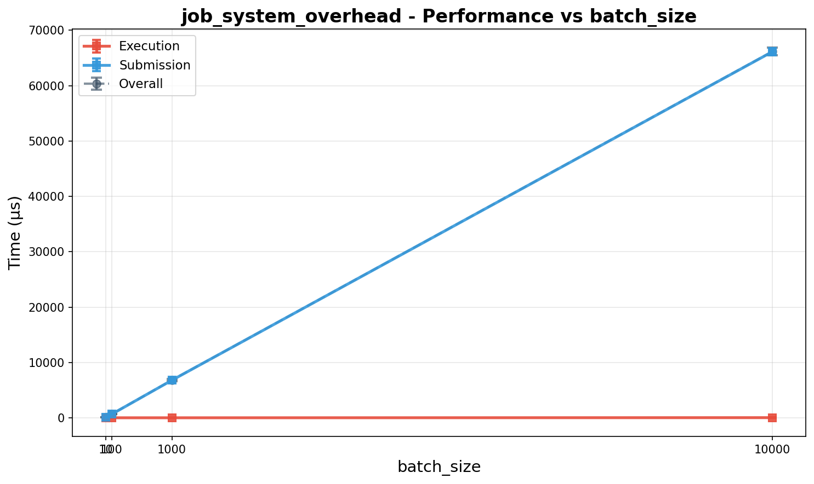

| Parameters | Overall (μs) | Stddev (μs) | CV% | Samples | Execution (μs) | Submission (μs) |
|------------|--------------|-------------|-----|---------|-----------------|-----------------|
| batch_size=1000 | 6816.77 | 189.24 | 2.78 | 5 | 15.93 | 6798.51 |
| batch_size=10 | 84.66 | 2.88 | 3.41 | 5 | 16.57 | 67.26 |
| batch_size=10000 | 66188.09 | 657.71 | 0.99 | 5 | 39.98 | 66145.53 |
| batch_size=100 | 694.86 | 17.00 | 2.45 | 5 | 18.00 | 676.13 |

### job_system_scaling_efficiency

Evaluates parallel efficiency with fixed total work across different thread counts

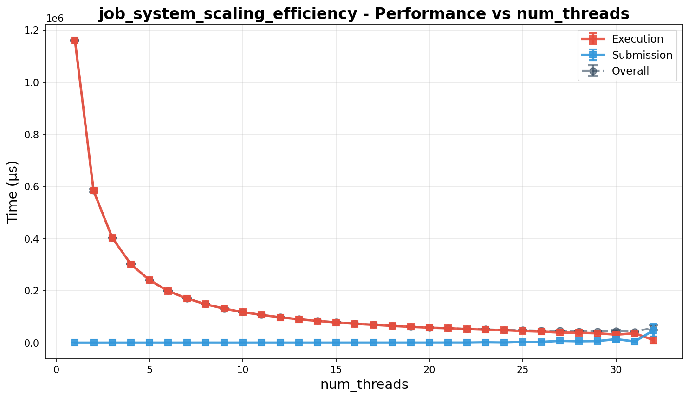

| Parameters | Overall (μs) | Stddev (μs) | CV% | Samples | Execution (μs) | Submission (μs) |
|------------|--------------|-------------|-----|---------|-----------------|-----------------|
| num_threads=7 | 170450.76 | 1144.13 | 0.67 | 3 | 169911.74 | 535.02 |
| num_threads=12 | 98187.75 | 423.70 | 0.43 | 3 | 97614.96 | 570.42 |
| num_threads=31 | 42007.71 | 1235.70 | 2.94 | 3 | 36828.68 | 5176.11 |
| num_threads=8 | 148332.14 | 559.84 | 0.38 | 3 | 147741.75 | 587.90 |
| num_threads=17 | 69613.42 | 215.40 | 0.31 | 3 | 68987.68 | 623.53 |
| num_threads=5 | 240747.67 | 892.16 | 0.37 | 3 | 240194.56 | 550.25 |
| num_threads=18 | 65455.69 | 33.32 | 0.05 | 3 | 64829.97 | 623.50 |
| num_threads=15 | 78779.86 | 305.77 | 0.39 | 3 | 78182.10 | 595.33 |
| num_threads=29 | 43415.23 | 589.99 | 1.36 | 3 | 36756.19 | 6656.26 |
| num_threads=3 | 403102.17 | 1866.08 | 0.46 | 3 | 402572.86 | 526.61 |
| num_threads=10 | 118248.05 | 265.59 | 0.22 | 3 | 117687.80 | 557.83 |
| num_threads=28 | 44284.21 | 700.69 | 1.58 | 3 | 38387.04 | 5894.68 |
| num_threads=23 | 51741.73 | 321.22 | 0.62 | 3 | 50000.81 | 1738.42 |
| num_threads=6 | 199183.93 | 497.39 | 0.25 | 3 | 198661.03 | 520.46 |
| num_threads=24 | 49322.68 | 42.30 | 0.09 | 3 | 48404.44 | 916.03 |
| num_threads=4 | 301995.98 | 404.99 | 0.13 | 3 | 301476.61 | 516.69 |
| num_threads=16 | 73530.54 | 19.32 | 0.03 | 3 | 72905.37 | 622.93 |
| num_threads=21 | 56502.85 | 477.67 | 0.85 | 3 | 55746.42 | 753.85 |
| num_threads=26 | 46468.86 | 779.60 | 1.68 | 3 | 42910.25 | 3555.88 |
| num_threads=30 | 45623.57 | 3968.40 | 8.70 | 3 | 31503.37 | 14117.22 |
| num_threads=9 | 131526.10 | 185.30 | 0.14 | 3 | 130980.76 | 542.71 |
| num_threads=13 | 90896.17 | 194.94 | 0.21 | 3 | 90308.97 | 584.78 |
| num_threads=20 | 58652.15 | 490.19 | 0.84 | 3 | 57987.17 | 662.66 |
| num_threads=19 | 61854.98 | 239.47 | 0.39 | 3 | 61214.55 | 638.12 |
| num_threads=32 | 58630.28 | 10412.46 | 17.76 | 3 | 10748.37 | 47879.16 |
| num_threads=11 | 107642.72 | 256.39 | 0.24 | 3 | 107066.27 | 573.96 |
| num_threads=22 | 53365.18 | 113.57 | 0.21 | 3 | 52669.24 | 693.50 |
| num_threads=1 | 1161160.07 | 1793.75 | 0.15 | 3 | 1160668.97 | 488.31 |
| num_threads=2 | 583403.66 | 5433.17 | 0.93 | 3 | 582943.24 | 457.48 |
| num_threads=14 | 84168.66 | 151.17 | 0.18 | 3 | 83581.34 | 584.96 |
| num_threads=27 | 46622.90 | 645.08 | 1.38 | 3 | 39251.49 | 7368.68 |
| num_threads=25 | 48257.65 | 725.92 | 1.50 | 3 | 45215.37 | 3040.06 |

## WXF Serialization Benchmarks

### wxf_deserialize_flat_list

Measures WXF deserialization time for flat integer lists of varying sizes

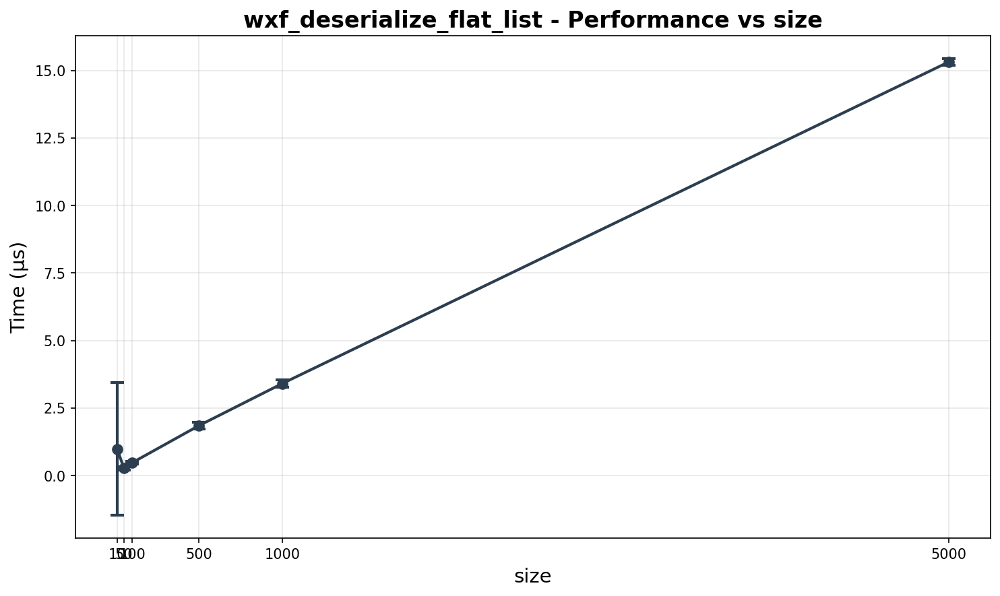

| Parameters | Avg (μs) | Stddev (μs) | CV% | Samples |
|------------|----------|-------------|-----|---------|
| size=100 | 0.48 | 0.06 | 12.19 | 10 |
| size=50 | 0.27 | 0.06 | 20.99 | 10 |
| size=10 | 0.98 | 2.45 | 249.48 | 10 |
| size=1000 | 3.41 | 0.13 | 3.86 | 10 |
| size=5000 | 15.31 | 0.12 | 0.82 | 10 |
| size=500 | 1.85 | 0.11 | 6.20 | 10 |

### wxf_deserialize_nested_list

Measures WXF deserialization time for nested lists (outer_size x inner_size)

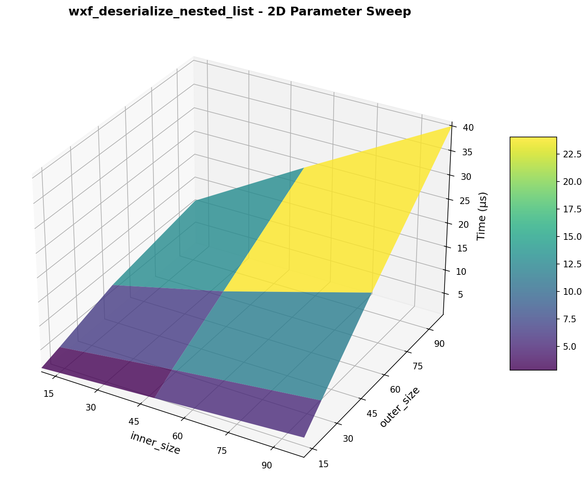

| Parameters | Avg (μs) | Stddev (μs) | CV% | Samples |
|------------|----------|-------------|-----|---------|
| inner_size=10, outer_size=10 | 1.16 | 0.26 | 22.65 | 10 |
| inner_size=50, outer_size=50 | 11.99 | 0.40 | 3.31 | 10 |
| inner_size=10, outer_size=100 | 9.79 | 0.43 | 4.38 | 10 |
| inner_size=100, outer_size=100 | 39.98 | 1.41 | 3.53 | 10 |
| inner_size=100, outer_size=10 | 4.42 | 0.30 | 6.70 | 10 |
| inner_size=50, outer_size=10 | 2.58 | 0.22 | 8.45 | 10 |
| inner_size=50, outer_size=100 | 23.48 | 0.73 | 3.11 | 10 |
| inner_size=10, outer_size=20 | 2.35 | 0.36 | 15.35 | 10 |
| inner_size=10, outer_size=50 | 6.17 | 2.14 | 34.71 | 10 |
| inner_size=50, outer_size=20 | 5.21 | 0.07 | 1.33 | 10 |
| inner_size=100, outer_size=20 | 8.55 | 0.28 | 3.28 | 10 |
| inner_size=100, outer_size=50 | 20.73 | 1.00 | 4.82 | 10 |

### wxf_roundtrip

Measures WXF round-trip (serialize + deserialize) time for various data sizes

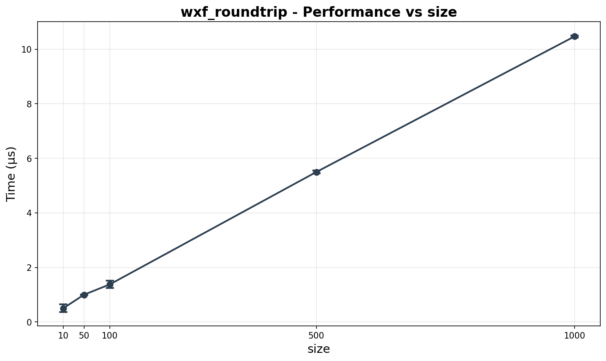

| Parameters | Avg (μs) | Stddev (μs) | CV% | Samples |
|------------|----------|-------------|-----|---------|
| size=10 | 0.50 | 0.14 | 28.17 | 10 |
| size=500 | 5.50 | 0.05 | 0.86 | 10 |
| size=1000 | 10.47 | 0.04 | 0.34 | 10 |
| size=100 | 1.38 | 0.13 | 9.59 | 10 |
| size=50 | 1.00 | 0.01 | 1.26 | 10 |

### wxf_serialize_flat_list

Measures WXF serialization time for flat integer lists of varying sizes

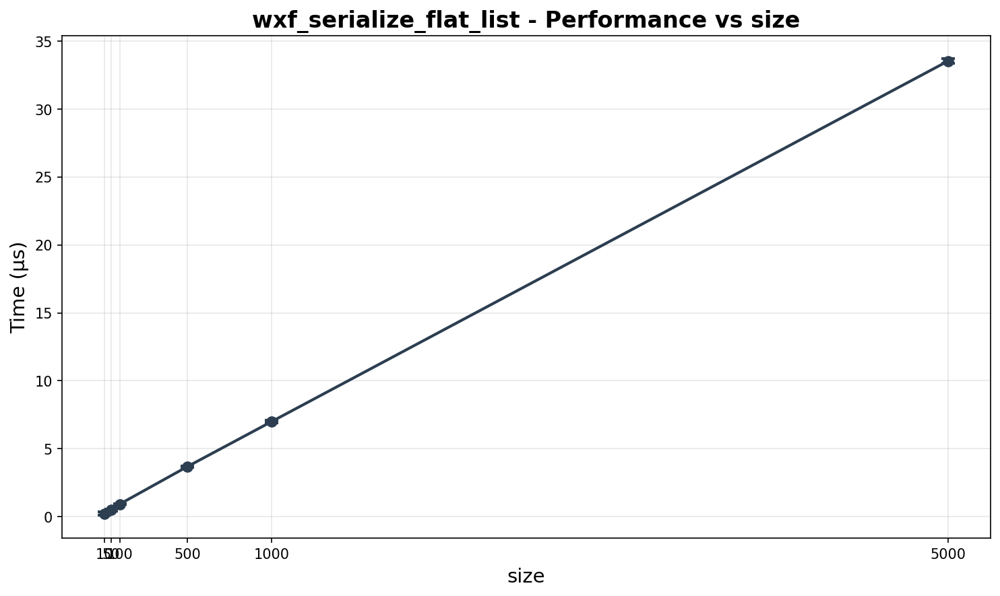

| Parameters | Avg (μs) | Stddev (μs) | CV% | Samples |
|------------|----------|-------------|-----|---------|
| size=5000 | 33.55 | 0.18 | 0.54 | 10 |
| size=10 | 0.21 | 0.12 | 54.89 | 10 |
| size=100 | 0.92 | 0.02 | 2.03 | 10 |
| size=50 | 0.48 | 0.09 | 17.63 | 10 |
| size=500 | 3.68 | 0.05 | 1.27 | 10 |
| size=1000 | 7.01 | 0.11 | 1.58 | 10 |

### wxf_serialize_nested_list

Measures WXF serialization time for nested lists (outer_size x inner_size)

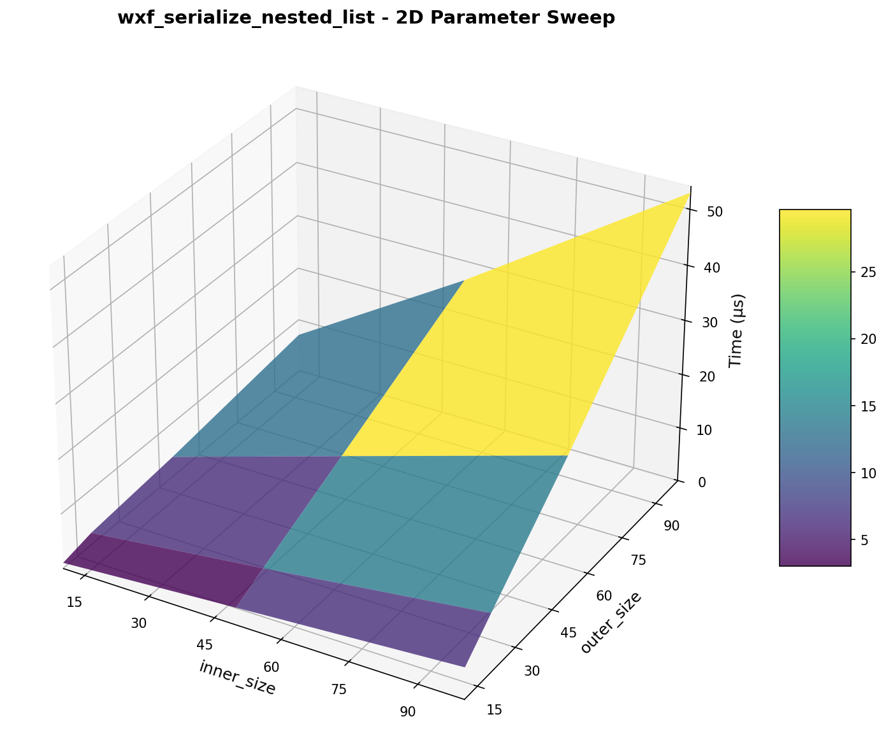

| Parameters | Avg (μs) | Stddev (μs) | CV% | Samples |
|------------|----------|-------------|-----|---------|
| inner_size=50, outer_size=10 | 3.10 | 0.14 | 4.53 | 10 |
| inner_size=100, outer_size=20 | 10.76 | 0.12 | 1.08 | 10 |
| inner_size=10, outer_size=20 | 2.16 | 1.25 | 58.06 | 10 |
| inner_size=10, outer_size=100 | 7.04 | 0.06 | 0.91 | 10 |
| inner_size=10, outer_size=50 | 3.68 | 0.14 | 3.92 | 10 |
| inner_size=50, outer_size=50 | 13.52 | 0.11 | 0.79 | 10 |
| inner_size=50, outer_size=20 | 5.83 | 0.13 | 2.25 | 10 |
| inner_size=100, outer_size=10 | 5.69 | 0.09 | 1.63 | 10 |
| inner_size=100, outer_size=50 | 25.75 | 0.11 | 0.42 | 10 |
| inner_size=100, outer_size=100 | 52.95 | 5.06 | 9.56 | 10 |
| inner_size=50, outer_size=100 | 26.41 | 0.08 | 0.31 | 10 |
| inner_size=10, outer_size=10 | 0.97 | 0.14 | 14.81 | 10 |

## Canonicalization Benchmarks

### canonicalization_2d_sweep

2D parameter sweep: edges vs symmetry_groups for surface plots

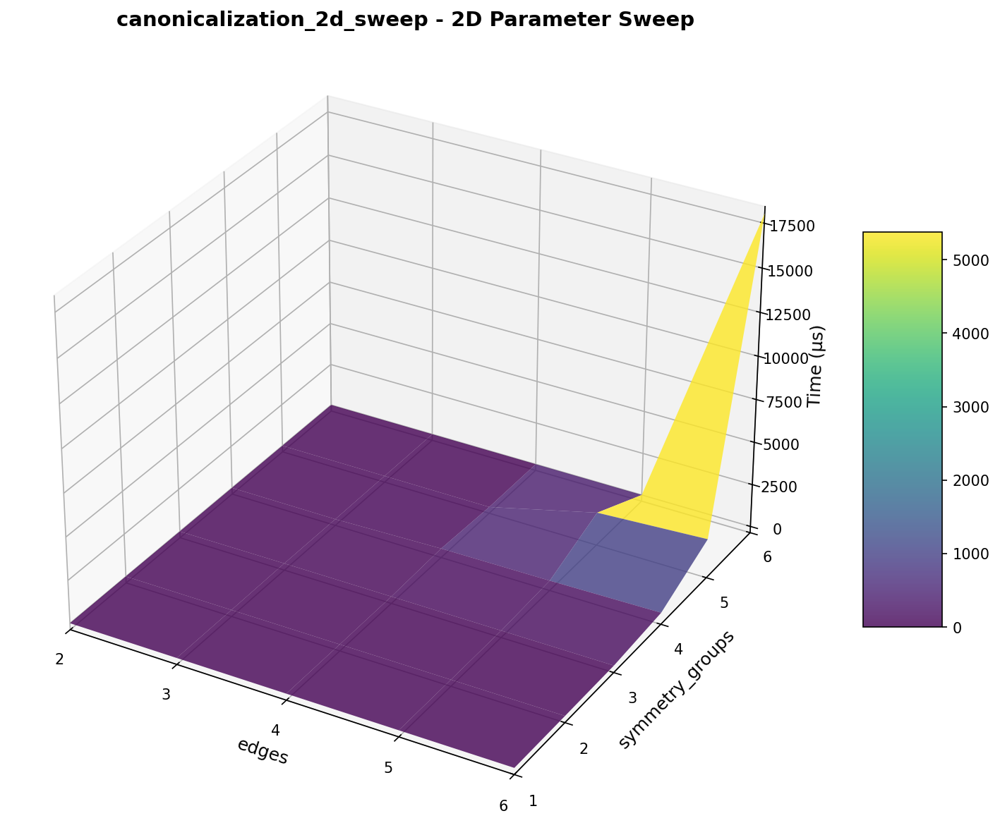

| Parameters | Avg (μs) | Stddev (μs) | CV% | Samples |
|------------|----------|-------------|-----|---------|
| edges=5, symmetry_groups=3 | 31.46 | 4.95 | 15.73 | 10 |
| edges=5, symmetry_groups=1 | 3.24 | 0.96 | 29.60 | 10 |
| edges=4, symmetry_groups=1 | 2.54 | 0.94 | 36.90 | 10 |
| edges=2, symmetry_groups=1 | 2.68 | 4.12 | 153.82 | 10 |
| edges=3, symmetry_groups=1 | 2.47 | 0.75 | 30.37 | 10 |
| edges=4, symmetry_groups=4 | 161.36 | 11.69 | 7.24 | 10 |
| edges=5, symmetry_groups=4 | 206.55 | 9.94 | 4.81 | 10 |
| edges=6, symmetry_groups=3 | 31.12 | 3.26 | 10.48 | 10 |
| edges=6, symmetry_groups=4 | 303.34 | 50.33 | 16.59 | 10 |
| edges=4, symmetry_groups=3 | 30.30 | 1.79 | 5.90 | 10 |
| edges=3, symmetry_groups=2 | 7.87 | 0.44 | 5.64 | 10 |
| edges=6, symmetry_groups=6 | 18049.73 | 560.78 | 3.11 | 10 |
| edges=3, symmetry_groups=3 | 24.83 | 1.44 | 5.82 | 10 |
| edges=4, symmetry_groups=2 | 8.33 | 0.16 | 1.89 | 10 |
| edges=2, symmetry_groups=2 | 6.83 | 1.97 | 28.79 | 10 |
| edges=5, symmetry_groups=2 | 9.35 | 1.13 | 12.05 | 10 |
| edges=6, symmetry_groups=1 | 3.89 | 0.99 | 25.47 | 10 |
| edges=6, symmetry_groups=2 | 10.57 | 0.22 | 2.08 | 10 |
| edges=6, symmetry_groups=5 | 1902.82 | 58.22 | 3.06 | 10 |
| edges=5, symmetry_groups=5 | 1558.03 | 52.20 | 3.35 | 10 |

### canonicalization_by_edge_count

Measures canonicalization performance as graph size increases

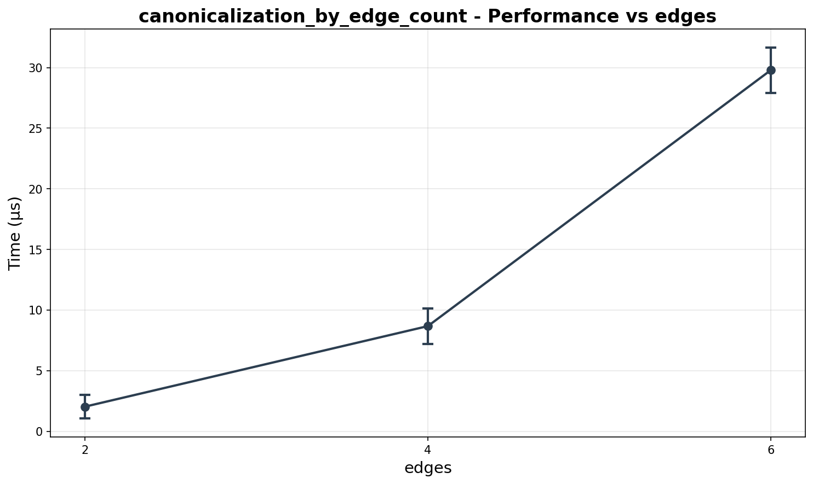

| Parameters | Avg (μs) | Stddev (μs) | CV% | Samples |
|------------|----------|-------------|-----|---------|
| edges=2 | 2.03 | 0.97 | 47.95 | 10 |
| edges=4 | 8.68 | 1.46 | 16.85 | 10 |
| edges=6 | 29.79 | 1.87 | 6.26 | 10 |

### canonicalization_by_symmetry

Shows how graph symmetry affects canonicalization time

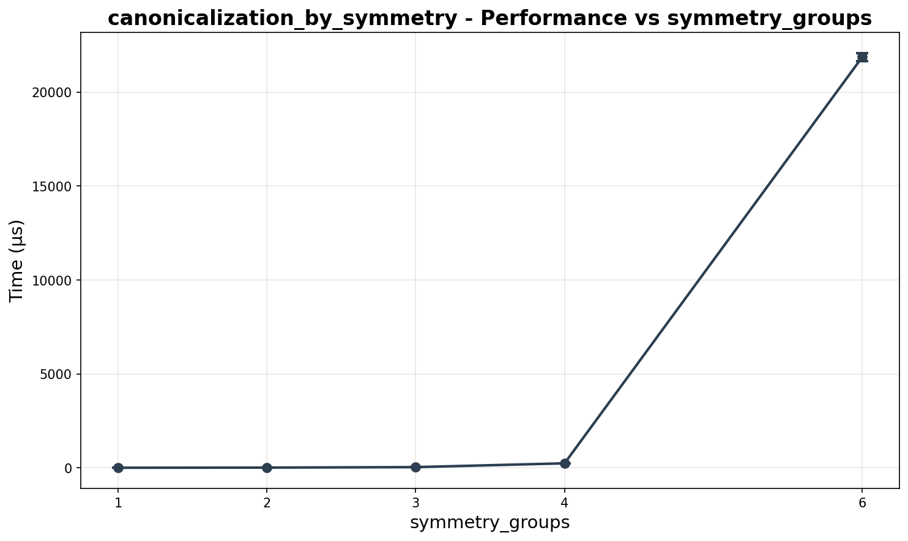

| Parameters | Avg (μs) | Stddev (μs) | CV% | Samples |
|------------|----------|-------------|-----|---------|
| symmetry_groups=3 | 39.16 | 2.79 | 7.13 | 10 |
| symmetry_groups=2 | 14.27 | 1.43 | 10.03 | 10 |
| symmetry_groups=6 | 21860.88 | 212.93 | 0.97 | 10 |
| symmetry_groups=1 | 6.18 | 0.11 | 1.84 | 10 |
| symmetry_groups=4 | 241.29 | 10.17 | 4.22 | 10 |

## State Management Benchmarks

### full_capture_overhead

Compares evolution performance with and without full state capture enabled

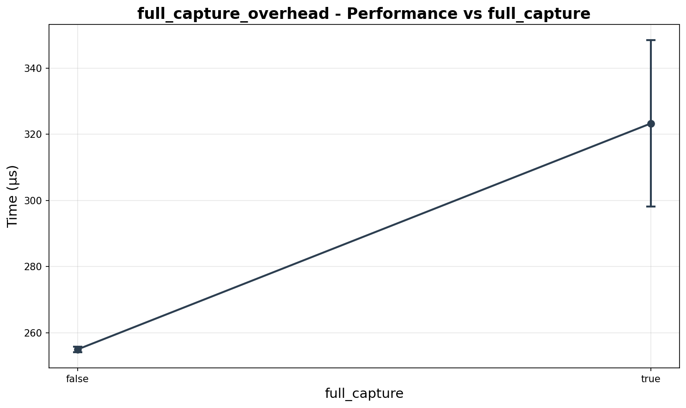

| Parameters | Avg (μs) | Stddev (μs) | CV% | Samples |
|------------|----------|-------------|-----|---------|
| full_capture=true | 323.25 | 25.14 | 7.78 | 3 |
| full_capture=false | 254.98 | 0.88 | 0.34 | 3 |

### state_storage_by_steps

Measures state storage and retrieval overhead as evolution progresses from 1 to 3 steps

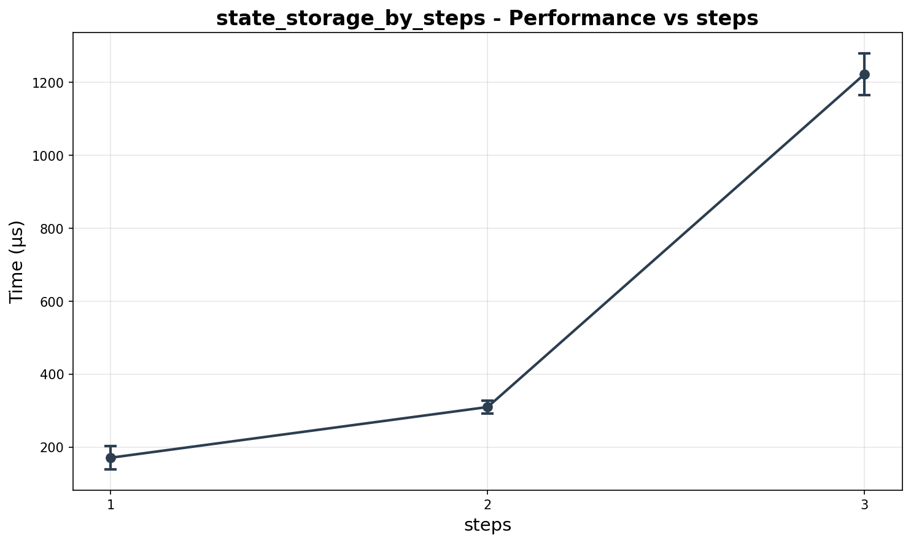

| Parameters | Avg (μs) | Stddev (μs) | CV% | Samples |
|------------|----------|-------------|-----|---------|
| steps=3 | 1223.11 | 56.90 | 4.65 | 3 |
| steps=2 | 310.19 | 17.87 | 5.76 | 3 |
| steps=1 | 171.16 | 32.24 | 18.84 | 3 |

## Other Benchmarks

### wolfram_evolution_by_steps

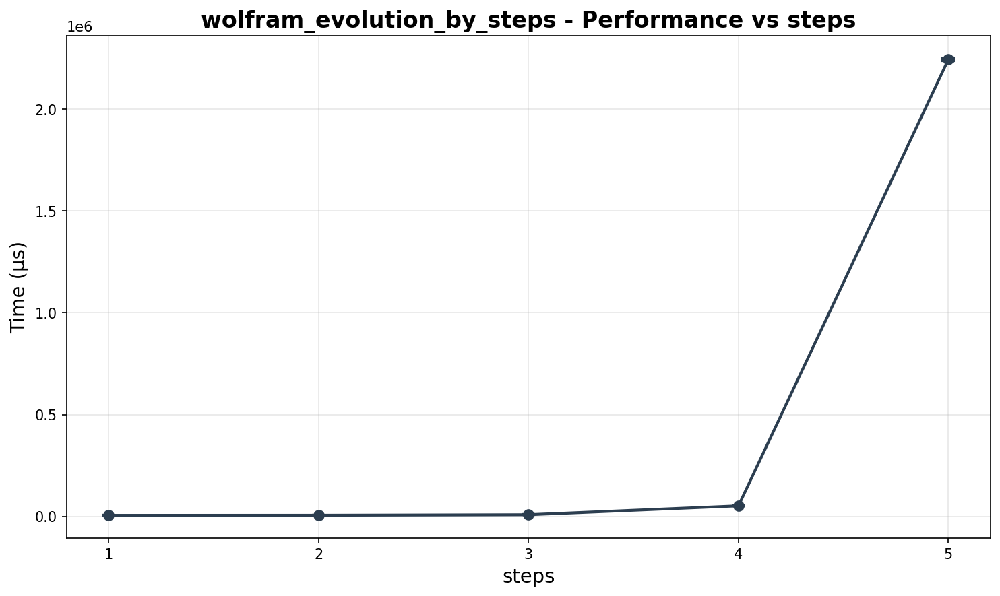

| Parameters | Avg (μs) | Stddev (μs) | CV% | Samples |
|------------|----------|-------------|-----|---------|
| steps=3 | 8109.85 | 57.65 | 0.71 | 2 |
| steps=5 | 2243650.10 | 5132.10 | 0.23 | 2 |
| steps=4 | 51528.15 | 57.15 | 0.11 | 2 |
| steps=2 | 5737.80 | 174.30 | 3.04 | 2 |
| steps=1 | 5401.05 | 171.15 | 3.17 | 2 |
