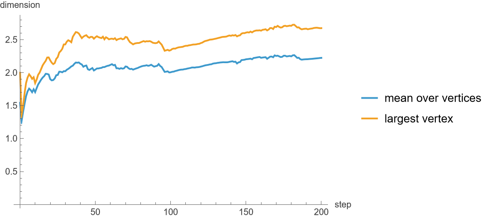
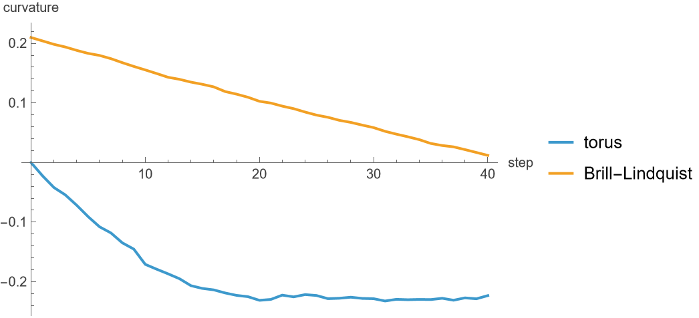
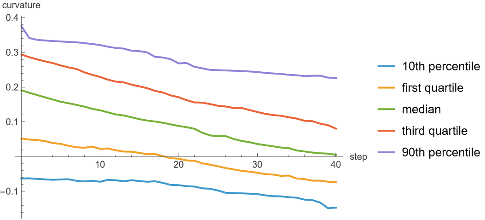

`"StepStatistics"` gives one association per step of an evolution, with counts of states and classes, summaries of per-state invariants, distributions over vertices and, on request, measures of the branchial graph and of the overlap between states. The [HGEvolve]() reference page defines every key. This tutorial uses them to answer six questions about rules of the Wolfram Physics Project. Every number plotted comes from the engine.

Each plot reads one key of every step with this function:

```wl
perStep[stats_, keys__] := Table[{s["Step"], s[keys]}, {s, stats}]
```

## States and classes per step

How many of the states of the multiway system are distinct up to isomorphism? The rule is a rule of the Wolfram Physics Project, from two self-loops on one vertex:

```wl
wolfram = {{x, y}, {x, z}} -> {{x, y}, {x, w}, {y, w}, {z, w}};
classes = HGEvolve[wolfram, {{0, 0}, {0, 0}}, 5, "StepStatistics", "CanonicalizeStates" -> Full, "ExploreFromCanonicalStatesOnly" -> True];
Lookup[classes, {"Step", "RawStates", "Classes"}]
```

<!-- => {{0, 1, 1}, {1, 2, 1}, {2, 24, 3}, {3, 408, 18}, {4, 9504, 156}, {5, 280080, 1776}} -->

With `"ExploreFromCanonicalStatesOnly" -> True`, the engine expands one state per class and counts the states of each class, so `"RawStates"` is the number of states of the full multiway system. The number of classes grows more slowly:

```wl
ListLogPlot[{perStep[classes, "RawStates"], perStep[classes, "Classes"]}, Joined -> True, PlotMarkers -> Automatic, AxesLabel -> {"step", "count"}, PlotLegends -> {"states", "classes"}, ImageSize -> 400]
```


## Dimension of a growth history

Does a growth rule settle at a fixed dimension? `"UniformRandom" -> True` with `"MatchesPerStep" -> 20` keeps 20 states at each step:

```wl
growth = {{x, y}, {x, z}} -> {{x, z}, {x, w}, {y, w}, {z, w}};
history = HGEvolve[growth, {{1, 2}, {2, 3}, {3, 4}, {2, 4}}, 200, "StepStatistics", "UniformRandom" -> True, "MatchesPerStep" -> 20, "RandomSeed" -> 1];
```

The mean over the step's states of the Wolfram-Hausdorff dimension, and of the largest local dimension of a vertex in each state:

```wl
ListLinePlot[{perStep[history, "Invariants", "WolframHausdorffDimension", "Mean"], perStep[history, "Invariants", "LocalDimensionMax", "Mean"]}, AxesLabel -> {"step", "dimension"}, PlotLegends -> {"mean over vertices", "largest vertex"}, ImageSize -> 400]
```



The vertex count grows by one per step:

```wl
ListLinePlot[perStep[history, "Invariants", "VertexCount", "Mean"], AxesLabel -> {"step", "vertices"}, ImageSize -> 400]
```


## Free space and a gravitational field

Does the same rule give a different dimension and curvature in free space and near two black holes? The rule replaces a path of four edges with four edges through a new vertex. One run starts from a torus of 81 vertices, the other from a Brill-Lindquist point cloud of 80 points around two black holes, both described in [Generated Initial Conditions](paclet:WolframInstitute/HypergraphRewriteEngine/tutorial/InitialConditions):

```wl
ruleA = {{x, y}, {y, z}, {z, w}, {w, v}} -> {{y, u}, {u, v}, {w, x}, {x, u}};
torus = HGEvolve[ruleA, <|"Type" -> "Torus", "Resolution" -> 9, "Seed" -> 1|>, 40, "StepStatistics", "UniformRandom" -> True, "MatchesPerStep" -> 10, "RandomSeed" -> 1];
blackHoles = HGEvolve[ruleA, <|"Type" -> "BrillLindquist", "Density" -> 80, "Separation" -> 6., "BoxX" -> {-10., 10.}, "BoxY" -> {-10., 10.}, "EdgeThreshold" -> 3.5, "Seed" -> 1|>, 40, "StepStatistics", "UniformRandom" -> True, "MatchesPerStep" -> 10, "RandomSeed" -> 1];
```

The Brill-Lindquist state has two components, and `"WolframHausdorffDimension"` is undefined for a disconnected state:

```wl
{First[torus]["Invariants", "Components", "Mean"], First[blackHoles]["Invariants", "Components", "Mean"]}
```

<!-- => {1., 2.} -->

`"LargestComponentDimension"` is the dimension of the largest component, so it is defined for both:

```wl
ListLinePlot[{perStep[torus, "Invariants", "LargestComponentDimension", "Mean"], perStep[blackHoles, "Invariants", "LargestComponentDimension", "Mean"]}, AxesLabel -> {"step", "dimension"}, PlotLegends -> {"torus", "Brill-Lindquist"}, ImageSize -> 400]
```


The mean Ollivier-Ricci curvature of the edges:

```wl
ListLinePlot[{perStep[torus, "Invariants", "OllivierRicciCurvature", "Mean"], perStep[blackHoles, "Invariants", "OllivierRicciCurvature", "Mean"]}, AxesLabel -> {"step", "curvature"}, PlotLegends -> {"torus", "Brill-Lindquist"}, ImageSize -> 400]
```



## The distribution of curvature

How is curvature spread over the vertices of all branches at a step? `"VertexInvariants"` pools the vertices of every state at the step. The quantiles of the vertex curvature of the Brill-Lindquist run:

```wl
ListLinePlot[Table[perStep[blackHoles, "VertexInvariants", "OllivierRicciCurvature", q], {q, {"P10", "Q1", "Median", "Q3", "P90"}}], AxesLabel -> {"step", "curvature"}, PlotLegends -> {"10th percentile", "first quartile", "median", "third quartile", "90th percentile"}, ImageSize -> 400]
```



The skewness of the same distribution in both runs:

```wl
ListLinePlot[{perStep[torus, "VertexInvariants", "OllivierRicciCurvature", "Skewness"], perStep[blackHoles, "VertexInvariants", "OllivierRicciCurvature", "Skewness"]}, AxesLabel -> {"step", "skewness"}, PlotRange -> All, PlotLegends -> {"torus", "Brill-Lindquist"}, ImageSize -> 400]
```


## Is curvature local?

Do vertices of high curvature sit next to each other, or does curvature follow the degree? `"OllivierMoranI"` is Moran's I of the vertex curvature over the edges of a state, positive when neighbours have similar curvature. It is undefined when every vertex has the same curvature, as on the torus at step 0:

```wl
ListLinePlot[{perStep[torus, "Invariants", "OllivierMoranI", "Mean"], perStep[blackHoles, "Invariants", "OllivierMoranI", "Mean"]}, AxesLabel -> {"step", "Moran's I"}, PlotLegends -> {"torus", "Brill-Lindquist"}, ImageSize -> 400]
```


`"OllivierDegreeCorrelation"` is the correlation of the vertex curvature with the vertex degree:

```wl
ListLinePlot[{perStep[torus, "Invariants", "OllivierDegreeCorrelation", "Mean"], perStep[blackHoles, "Invariants", "OllivierDegreeCorrelation", "Mean"]}, AxesLabel -> {"step", "correlation"}, PlotLegends -> {"torus", "Brill-Lindquist"}, ImageSize -> 400]
```


## Branches and the initial state

How similar are the states at a step, and how much of the initial state do they keep? `"StepStatisticsBranchial" -> All` adds the branchial graph measures and the overlap of the states' vertex sets. `"MaxStatesPerStep" -> 400` keeps 400 states at each step:

```wl
branches = HGEvolve[ruleA, <|"Type" -> "Grid", "Width" -> 8, "Height" -> 8, "Seed" -> 1|>, 10, "StepStatistics", "MaxStatesPerStep" -> 400, "StepStatisticsBranchial" -> All];
```

The mean over every two states of their cosine similarity and their mutual information, and the mean over the states of their mutual information with the initial state, in bits. At step 0 the only state is the initial state, so every vertex is in both sets and the mutual information is 0:

```wl
ListLinePlot[{perStep[branches, "StateCosineSimilarity", "Mean"], perStep[branches, "StateMutualInformation", "Mean"], perStep[branches, "InitialStateMutualInformation", "Mean"]}, AxesLabel -> {"step", None}, PlotLegends -> {"cosine similarity", "mutual information", "mutual information with the initial state"}, ImageSize -> 400]
```


The mean branch entropy of a vertex and of an edge, log2 k for an item held by k states:

```wl
ListLinePlot[{perStep[branches, "BranchEntropy", "Mean"], perStep[branches, "EdgeBranchEntropy", "Mean"]}, AxesLabel -> {"step", "bits"}, PlotLegends -> {"vertex", "edge"}, ImageSize -> 400]
```


`"OverlapByBranchialDistance"` gives, for each branchial distance d, the summary of the Jaccard index of the vertex sets of the pairs of states at distance d. At steps 1 and 2:

```wl
ListLinePlot[Table[KeyValueMap[{#1, #2["Mean"]} &, branches[[s + 1]]["OverlapByBranchialDistance"]], {s, {1, 2}}], PlotMarkers -> Automatic, AxesLabel -> {"branchial distance", "Jaccard index"}, PlotLegends -> {"step 1", "step 2"}, ImageSize -> 400]
```


